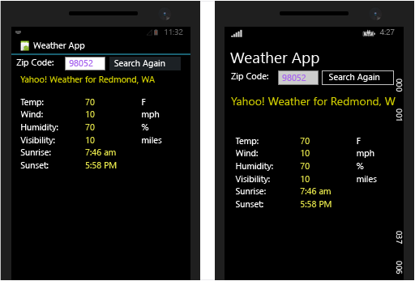
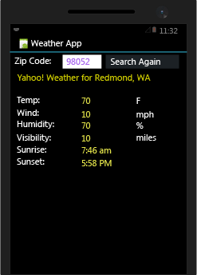
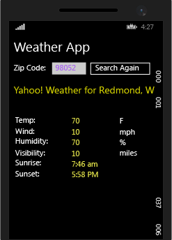

# <a name="build-apps-with-native-ui-using-xamarin-in-visual-studio"></a>Creare app con interfaccia utente nativa con Xamarin in Visual Studio
Dopo aver eseguito le operazioni descritte in [Configurazione e installazione](../cross-platform/setup-and-install.md) e [Verificare l'ambiente Xamarin](../cross-platform/verify-your-xamarin-environment.md), questa procedura dettagliata illustra come compilare un'app Xamarin di base (vedere sotto) con i livelli dell'interfaccia utente nativa. Con l'interfaccia utente nativa il codice condiviso si trova in una libreria di classi portabile (PCL) e i singoli progetti di piattaforma contengono le definizioni dell'interfaccia utente.  
  
   
  
 Verranno eseguite queste operazioni per la creazione dell'app:  
  
-   [Configurare la soluzione](#solution)  
  
-   [Scrivere un codice di servizio dati condiviso](#dataservice)  
  
-   [Progettare l'interfaccia utente per Android](#Android)  
  
-   [Progettare l'interfaccia utente per Windows Phone](#Windows)  
  
-   [Passaggi successivi](#next)  
  
> [!TIP]
>  È possibile trovare il codice sorgente completo per questo progetto nell'[archivio mobile-samples in GitHub](https://github.com/xamarin/mobile-samples/tree/master/Weather).
>
>   Se si riscontrano difficoltà o errori, porre le domande su [forums.xamarin.com](http://forums.xamarin.com). Molti errori possono essere risolti con l'aggiornamento agli SDK più recenti richiesti da Xamarin, riportati nelle [note sulla versione di Xamarin](https://developer.xamarin.com/releases/) per ogni piattaforma.    
  
> [!NOTE]
>  La documentazione per gli sviluppatori di Xamarin offre inoltre diverse procedure dettagliate con sezioni introduttive e di approfondimento, come indicato di seguito. In tutte queste pagine, assicurarsi che sia selezionato "Visual Studio" in alto a destra della pagina per vedere le procedure dettagliate specifiche di Visual Studio.  
>   
>  -   App Xamarin con interfaccia utente nativa:  
>   
>      -   [Hello, Android](https://developer.xamarin.com/guides/android/getting_started/hello,android/) (app semplice con una sola schermata)  
>     -   [Hello, Android Multiscreen](https://developer.xamarin.com/guides/android/getting_started/hello,android_multiscreen/) (app con spostamento tra le schermate)  
>     -   [Android Fragments Walkthrough](http://developer.xamarin.com/guides/android/platform_features/fragments/fragments_walkthrough/) (usata tra l'altro per le schermate master/dettagli)  
>     -   [Hello, iOS](https://developer.xamarin.com/guides/ios/getting_started/hello,_iOS/)  
>     -   [Hello, iOS Multiscreen](https://developer.xamarin.com/guides/ios/getting_started/hello,_iOS_multiscreen/)  
> -   App Xamarin con Xamarin.Forms (interfaccia utente condivisa)  
>   
>      -   [Hello, Xamarin.Forms](https://developer.xamarin.com/guides/cross-platform/xamarin-forms/getting-started/hello-xamarin-forms/quickstart/)  
>     -   [Hello, Xamarin.Forms Multiscreen](https://developer.xamarin.com/guides/cross-platform/xamarin-forms/getting-started/hello-xamarin-forms-multiscreen/)  
  
##  <a name="a-namesolutiona-set-up-your-solution"></a><a name="solution"></a> Configurare la soluzione  
 Questi passaggi consentono di creare una soluzione Xamarin con interfaccia utente nativa che contiene una libreria di classi portabile (PCL) per il codice condiviso e due pacchetti NuGet aggiunti.  
  
1.  In Visual Studio creare una nuova soluzione **App vuota (nativa portatile)** e denominarla **WeatherApp**. Il modello può essere individuato più facilmente immettendo **nativa portatile** nel campo di ricerca.  
  
     Se non è presente, potrebbe essere necessario installare Xamarin o abilitare la funzionalità di Visual Studio 2015. Vedere [Configurazione e installazione](../cross-platform/setup-and-install.md).  
  
2.  Dopo aver fatto clic su OK per creare la soluzione vengono visualizzati diversi progetti singoli:  
  
    -   **WeatherApp (portabile)**: la libreria di classi portabile (PCL) in cui verrà scritto il codice condiviso tra le piattaforme, inclusa la logica di business comune e il codice dell'interfaccia utente in uso con Xamarin.Forms.  
  
    -   **WeatherApp.Droid**: il progetto che contiene il codice Android nativo. Viene impostato come progetto di avvio predefinito.  
  
    -   **WeatherApp.iOS**: il progetto che contiene il codice iOS nativo.  
  
    -   **WeatherApp.WinPhone (Windows Phone 8.1)**: progetto che contiene il codice nativo di Windows Phone.  
  
     In ogni progetto nativo si ha accesso alla finestra di progettazione nativa per la piattaforma corrispondente e si possono implementare schermate specifiche della piattaforma.  
  
3.  Aggiungere il pacchetto NuGet e **Newtonsoft.Json** al progetto PCL, che verranno usati per elaborare le informazioni recuperate da un servizio di dati meteo:  
  
    -   Fare clic con il pulsante destro del mouse sulla **soluzione WeatherApp** in Esplora soluzioni e selezionare **Gestisci pacchetti NuGet per la soluzione**.  
  
         Nella finestra di NuGet selezionare la scheda **Sfoglia** e cercare **Newtonsoft**.  
  
    -   Selezionare **Newtonsoft.Json**.  
  
    -   Nella parte destra della finestra selezionare il progetto **WeatherApp**, che è l'unico progetto in cui è necessario installare il pacchetto.  
  
    -   Verificare che il campo **Versione** sia impostato su **Ultima versione stabile** .  
  
    -   Fare clic su **Installa**.  
  
    -     
  
4.  Ripetere il passaggio 3 per trovare e installare il pacchetto **Microsoft.Net.Http**.  
  
5.  Compilare la soluzione e verificare che non ci siano errori di compilazione.  
  
##  <a name="a-namedataservicea-write-shared-data-service-code"></a><a name="dataservice"></a> Scrivere un codice di servizio dati condiviso  
 **WeatherApp (Portable)** è il progetto di destinazione del codice per la libreria di classi portabile (PCL) condiviso tra le piattaforme. La libreria di classi portabile (PCL) viene inclusa automaticamente nei pacchetti di app compilati dai progetti iOS, Android e Windows Phone.  
  
 Nei passaggi seguenti viene aggiunto codice alla libreria di classi portabile (PCL) per accedere e archiviare i dati dal servizio meteo:  
  
1.  Per eseguire questo esempio è innanzitutto necessario iscriversi per una chiave API gratuita in [http://openweathermap.org/appid](http://openweathermap.org/appid).  
  
2.  Fare clic con il pulsante destro del mouse sul progetto **WeatherApp** e selezionare **Aggiungi > Classe**. Nella finestra di dialogo **Aggiungi nuovo elemento** denominare il file **Weather.cs**. Questa classe verrà usata per archiviare i dati dal servizio di dati meteo.  
  
3.  Sostituire tutto il contenuto di **Weather.cs** con:  
  
    ```c#  
    namespace WeatherApp  
    {  
        public class Weather  
        {  
            public string Title { get; set; }  
            public string Temperature { get; set; }  
            public string Wind { get; set; }  
            public string Humidity { get; set; }  
            public string Visibility { get; set; }  
            public string Sunrise { get; set; }  
            public string Sunset { get; set; }  
  
            public Weather()  
            {  
                //Because labels bind to these values, set them to an empty string to  
                //ensure that the label appears on all platforms by default.  
                this.Title = " ";  
                this.Temperature = " ";  
                this.Wind = " ";  
                this.Humidity = " ";  
                this.Visibility = " ";  
                this.Sunrise = " ";  
                this.Sunset = " ";  
            }  
        }  
    }  
    ```  
  
4.  Aggiungere un'altra classe al progetto PCL denominato **DataService.cs** usato per elaborare i dati JSON dal servizio di dati meteo.  
  
5.  Sostituire tutto il contenuto di **DataService.cs** con il codice seguente:  
  
    ```c#  
    using System.Threading.Tasks;  
    using Newtonsoft.Json;  
    using System.Net.Http;  
  
    namespace WeatherApp  
    {  
        public class DataService  
        {  
            public static async Task<dynamic> getDataFromService(string queryString)  
            {  
                HttpClient client = new HttpClient();  
                var response = await client.GetAsync(queryString);  
  
                dynamic data = null;  
                if (response != null)  
                {  
                    string json = response.Content.ReadAsStringAsync().Result;  
                    data = JsonConvert.DeserializeObject(json);  
                }  
  
                return data;  
            }  
        }  
    }  
    ```  
  
6.  Aggiungere una terza classe alla libreria di classi portabile (PCL) denominata **Core** in cui inserire la logica di business condivisa, ad esempio una logica che forma una stringa di query usando un codice postale, chiama il servizio di dati meteo, quindi popola un'istanza della classe **Weather** .  
  
7.  Sostituire il contenuto di **Core.cs** con:  
  
    ```c#  
    using System;  
    using System.Threading.Tasks;  
  
    namespace WeatherApp  
    {  
        public class Core  
        {  
            public static async Task<Weather> GetWeather(string zipCode)  
            {  
                //Sign up for a free API key at http://openweathermap.org/appid  
                string key = "YOUR KEY HERE";  
                string queryString = "http://api.openweathermap.org/data/2.5/weather?zip="  
                    + zipCode + ",us&appid=" + key + "&units=imperial";  

                //Make sure developers running this sample replaced the API key
                if (key == "YOUR API KEY HERE")
                {
                    throw new ArgumentException("You must obtain an API key from openweathermap.org/appid and save it in the 'key' variable.");
                }
  
                dynamic results = await DataService.getDataFromService(queryString).ConfigureAwait(false);  
  
                if (results["weather"] != null)  
                {  
                    Weather weather = new Weather();  
                    weather.Title = (string)results["name"];                  
                    weather.Temperature = (string)results["main"]["temp"] + " F";  
                    weather.Wind = (string)results["wind"]["speed"] + " mph";                  
                    weather.Humidity = (string)results["main"]["humidity"] + " %";  
                    weather.Visibility = (string)results["weather"][0]["main"];  
  
                    DateTime time = new System.DateTime(1970, 1, 1, 0, 0, 0, 0);  
                    DateTime sunrise = time.AddSeconds((double)results["sys"]["sunrise"]);  
                    DateTime sunset = time.AddSeconds((double)results["sys"]["sunset"]);  
                    weather.Sunrise = sunrise.ToString() + " UTC";  
                    weather.Sunset = sunset.ToString() + " UTC";  
                    return weather;  
                }  
                else  
                {  
                    return null;  
                }  
            }  
        }  
    }  
    ```  
  
8.  Sostituire *YOUR KEY HERE* nel codice con la chiave API ottenuta nel passaggio 1 (inclusa tra virgolette).  
  
9. Eliminare MyClass.cs nel PCL perché non verrà usato.  
  
10. Compilare il progetto PCL **WeatherApp** per verificare che il codice sia corretto.  
  
##  <a name="a-nameandroida-design-ui-for-android"></a><a name="Android"></a> Progettare l'interfaccia utente per Android  
 Verrà ora progettata l'interfaccia utente, che verrà connessa al codice condiviso, e quindi verrà eseguita l'app.  
  
### <a name="design-the-look-and-feel-of-your-app"></a>Progettare l'aspetto dell'app  
  
1.  In **Esplora soluzioni** espandere la cartella **WeatherApp.Droid**>**Risorse**>**layout** e aprire **Main.axml**. Il file verrà aperto nella finestra di progettazione visiva. Se viene visualizzato un errore relativo a Java, vedere questo [post di blog](http://forums.xamarin.com/discussion/32365/connection-to-the-layout-renderer-failed-in-xs-5-7-and-xamarinvs-3-9).  
  
    > [!TIP]
    >  Il progetto include molti altri file che però non verranno esaminati in questo argomento. Per informazioni più dettagliate sulla struttura di un progetto Android, vedere la [parte 2 di approfondimento](http://developer.xamarin.com/guides/android/getting_started/hello,android/hello,android_deepdive/) dell'argomento Hello Android su xamarin.com.  
  
2.  Selezionare ed eliminare il pulsante predefinito visualizzato nella finestra di progettazione.  
  
3.  Aprire la casella degli strumenti con **Visualizza > Altre finestre > Casella degli strumenti**.  
  
4.  Trascinare un controllo **RelativeLayout**nella finestra di progettazione dalla **Casella degli strumenti** . Usare questo controllo come contenitore padre per altri controlli.  
  
    > [!TIP]
    >  Se in qualsiasi momento sembra che il layout non sia visualizzato correttamente, salvare il file e passare dalla scheda **Progettazione** alla scheda **Origine** e viceversa per aggiornare.  
  
5.  Nella finestra **Proprietà** impostare la proprietà **background** (gruppo Stile) su `#545454`.  
  
6.  Dalla **Casella degli strumenti**trascinare un controllo **TextView** sul controllo **RelativeLayout** .  
  
7.  Nella finestra **Proprietà** impostare le proprietà riportate di seguito (nota: per elencare le voci in ordine alfabetico usare il pulsante di ordinamento della barra degli strumenti della finestra Proprietà):  
  
    |Proprietà|Valore|  
    |--------------|-----------|  
    |**text**|**Search by Zip Code**|  
    |**id**|`@+id/ZipCodeSearchLabel`|  
    |**layout_marginLeft**|`10dp`|  
    |**textColor**|`@android:color/white`|  
    |**textStyle**|`bold`|  
  
    > [!TIP]
    >  Notare che molte proprietà non includono un elenco a discesa di valori selezionabili.  Può quindi risultare difficile individuare il valore di stringa da usare per una data proprietà. Per suggerimenti provare a cercare il nome di una proprietà nella pagina della classe [R.attr](http://developer.android.com/reference/android/R.attr.html) .  
    >   
    >  Cercando in Internet viene spesso visualizzata una pagina del sito Web [http://stackoverflow.com/](http://stackoverflow.com/) in cui altri utenti hanno usato la stessa proprietà.  
  
     Per riferimento, se si passa alla visualizzazione **Origine**, dovrebbe apparire il seguente codice per questo elemento:  
  
    ```xml  
    <TextView  
        android:text="Search by Zip Code"  
        android:layout_width="wrap_content"  
        android:layout_height="wrap_content"  
        android:id="@+id/ZipCodeSearchLabel"  
        android:layout_centerVertical="true"  
        android:layout_marginLeft="10dp"  
        android:textColor="@android:color/white"  
        android:textStyle="bold" />  
  
    ```  
  
8.  Dalla **Casella degli strumenti** trascinare un controllo **TextView** sul controllo **RelativeLayout** e posizionarlo sotto il controllo ZipCodeSearchLabel. Rilasciare il nuovo controllo sul bordo appropriato del controllo esistente, per consentire un certo ingrandimento della finestra di progettazione.  
  
9. Nella finestra **Proprietà** impostare queste proprietà:  
  
    |Proprietà|Valore|  
    |--------------|-----------|  
    |**text**|**Zip Code**|  
    |**id**|`@+id/ZipCodeLabel`|  
    |**layout_marginLeft**|`10dp`|  
    |**layout_marginTop**|`5dp`|  
  
     Il codice nella visualizzazione **Origine** deve essere simile a questo:  
  
    ```xml  
    <TextView  
        android:text="Zip Code"  
        android:layout_width="wrap_content"  
        android:layout_height="wrap_content"  
        android:layout_below="@id/ZipCodeSearchLabel"  
        android:id="@+id/ZipCodeLabel"  
        android:layout_marginTop="5dp"  
        android:layout_marginLeft="10dp" />  
    ```  
  
10. Dalla **Casella degli strumenti** trascinare un controllo **Number** su **RelativeLayout** e posizionarlo sotto l'etichetta **Zip Code**. Quindi impostare le proprietà seguenti:  
  
    |Proprietà|Valore|  
    |--------------|-----------|  
    |**id**|`@+id/zipCodeEntry`|  
    |**layout_marginLeft**|`10dp`|  
    |**layout_marginBottom**|`10dp`|  
    |**width**|`165dp`|  
  
     Anche in questo caso il codice:  
  
    ```xml  
    <EditText  
        android:inputType="number"  
        android:layout_width="wrap_content"  
        android:layout_height="wrap_content"  
        android:layout_below="@id/ZipCodeLabel"  
        android:id="@+id/zipCodeEntry"  
        android:layout_marginLeft="10dp"  
        android:layout_marginBottom="10dp"  
        android:width="165dp" />  
    ```  
  
11. Dalla **Casella degli strumenti** trascinare un **pulsante** sul controllo **RelativeLayout** e posizionarlo a destra del controllo zipCodeEntry. Impostare quindi queste proprietà:  
  
    |Proprietà|Valore|  
    |--------------|-----------|  
    |**id**|`@+id/weatherBtn`|  
    |**text**|**Get Weather**|  
    |**layout_marginLeft**|`20dp`|  
    |**layout_alignBottom**|`@id/zipCodeEntry`|  
    |**width**|`165dp`|  
  
    ```xml  
    <Button    android:text="Get Weather"  
        android:layout_width="wrap_content"  
        android:layout_height="wrap_content"  
        android:layout_toRightOf="@id/zipCodeEntry"  
        android:id="@+id/weatherBtn"  
        android:layout_marginLeft="20dp"  
        android:layout_alignBottom="@id/zipCodeEntry"  
        android:width="165dp" />  
    ```  
  
12. È ora possibile creare un'interfaccia utente di base usando la finestra di progettazione di Android, È anche possibile creare un'interfaccia utente aggiungendo markup direttamente al file con estensione ASXML della pagina. Per compilare il resto dell'interfaccia utente nello stesso modo, passare alla visualizzazione Origine nella finestra di progettazione, quindi incollare il markup seguente *sotto* il tag `</RelativeLayout>` (questi elementi non sono inclusi in RelativeLayout).  
  
    ```xml  
    <TextView  
            android:text="Location"  
            android:textAppearance="?android:attr/textAppearanceSmall"  
            android:layout_width="match_parent"  
            android:layout_height="wrap_content"  
            android:id="@+id/locationLabel"  
            android:layout_marginLeft="10dp"  
            android:layout_marginTop="10dp" />  
        <TextView  
            android:textAppearance="?android:attr/textAppearanceMedium"  
            android:layout_width="match_parent"  
            android:layout_height="wrap_content"  
            android:id="@+id/locationText"  
            android:layout_marginLeft="20dp"  
            android:layout_marginBottom="10dp" />  
        <TextView  
            android:text="Temperature"  
            android:textAppearance="?android:attr/textAppearanceSmall"  
            android:layout_width="match_parent"  
            android:layout_height="wrap_content"  
            android:id="@+id/tempLabel"  
            android:layout_marginLeft="10dp" />  
        <TextView  
            android:textAppearance="?android:attr/textAppearanceMedium"  
            android:layout_width="match_parent"  
            android:layout_height="wrap_content"  
            android:id="@+id/tempText"  
            android:layout_marginBottom="10dp"  
            android:layout_marginLeft="20dp" />  
        <TextView  
            android:text="Wind Speed"  
            android:textAppearance="?android:attr/textAppearanceSmall"  
            android:layout_width="match_parent"  
            android:layout_height="wrap_content"  
            android:id="@+id/windLabel"  
            android:layout_marginLeft="10dp" />  
        <TextView  
            android:textAppearance="?android:attr/textAppearanceMedium"  
            android:layout_width="match_parent"  
            android:layout_height="wrap_content"  
            android:id="@+id/windText"  
            android:layout_marginBottom="10dp"  
            android:layout_marginLeft="20dp" />  
        <TextView  
            android:text="Humidity"  
            android:textAppearance="?android:attr/textAppearanceSmall"  
            android:layout_width="match_parent"  
            android:layout_height="wrap_content"  
            android:id="@+id/humidtyLabel"  
            android:layout_marginLeft="10dp" />  
        <TextView  
            android:textAppearance="?android:attr/textAppearanceMedium"  
            android:layout_width="match_parent"  
            android:layout_height="wrap_content"  
            android:id="@+id/humidityText"  
            android:layout_marginBottom="10dp"  
            android:layout_marginLeft="20dp" />  
        <TextView  
            android:text="Visibility"  
            android:textAppearance="?android:attr/textAppearanceSmall"  
            android:layout_width="match_parent"  
            android:layout_height="wrap_content"  
            android:id="@+id/visibilityLabel"  
            android:layout_marginLeft="10dp" />  
        <TextView  
            android:textAppearance="?android:attr/textAppearanceMedium"  
            android:layout_width="match_parent"  
            android:layout_height="wrap_content"  
            android:id="@+id/visibilityText"  
            android:layout_marginBottom="10dp"  
            android:layout_marginLeft="20dp" />  
        <TextView  
            android:text="Time of Sunrise"  
            android:textAppearance="?android:attr/textAppearanceSmall"  
            android:layout_width="match_parent"  
            android:layout_height="wrap_content"  
            android:id="@+id/sunriseLabel"  
            android:layout_marginLeft="10dp" />  
        <TextView  
            android:textAppearance="?android:attr/textAppearanceMedium"  
            android:layout_width="match_parent"  
            android:layout_height="wrap_content"  
            android:id="@+id/sunriseText"  
            android:layout_marginBottom="10dp"  
            android:layout_marginLeft="20dp" />  
        <TextView  
            android:text="Time of Sunset"  
            android:textAppearance="?android:attr/textAppearanceSmall"  
            android:layout_width="match_parent"  
            android:layout_height="wrap_content"  
            android:id="@+id/sunsetLabel"  
            android:layout_marginLeft="10dp" />  
        <TextView  
            android:textAppearance="?android:attr/textAppearanceMedium"  
            android:layout_width="match_parent"  
            android:layout_height="wrap_content"  
            android:id="@+id/sunsetText"  
            android:layout_marginBottom="10dp"  
            android:layout_marginLeft="20dp" />  
  
    ```  
  
13. Salvare il file e passare alla visualizzazione **Progettazione**. L'interfaccia utente dovrebbe essere simile a quella seguente:  
  
       
  
14. Aprire **MainActivity.cs** ed eliminare le righe nel metodo *OnCreate* che fanno riferimento al pulsante predefinito rimosso in precedenza. Al termine il codice deve essere simile a questo:  
  
    ```  
    protected override void OnCreate (Bundle bundle)  
    {  
        base.OnCreate (bundle);  
  
        // Set our view from the "main" layout resource  
        SetContentView (Resource.Layout.Main);  
    }  
    ```  
  
15. Compilare il progetto Android per verificare il lavoro. Si noti che la compilazione aggiunge gli ID dei controlli al file **Resource.Designer.cs** in modo che sia possibile fare riferimento ai controlli nel codice in base al nome.  
  
### <a name="consume-your-shared-code"></a>Usare il codice condiviso  
  
1.  Aprire il file **MainActivity.cs** del progetto **WeatherApp** nell'editor di codice e sostituire il contenuto con il codice riportato di seguito. Questo codice chiama il metodo `GetWeather` definito nel codice condiviso, quindi visualizza nell'interfaccia utente dell'app i dati recuperati da tale metodo.  
  
    ```c#  
    using System;  
    using Android.App;  
    using Android.Widget;  
    using Android.OS;  
  
    namespace WeatherApp.Droid  
    {  
        [Activity(Label = "Sample Weather App", MainLauncher = true, Icon = "@drawable/icon")]  
        public class MainActivity : Activity  
        {  
            protected override void OnCreate(Bundle bundle)  
            {  
                base.OnCreate(bundle);  
  
                SetContentView(Resource.Layout.Main);  
  
                Button button = FindViewById<Button>(Resource.Id.weatherBtn);  
  
                button.Click += Button_Click;  
            }  
  
            private async void Button_Click(object sender, EventArgs e)  
            {  
                EditText zipCodeEntry = FindViewById<EditText>(Resource.Id.zipCodeEntry);  
  
                if (!String.IsNullOrEmpty(zipCodeEntry.Text))  
                {  
                    Weather weather = await Core.GetWeather(zipCodeEntry.Text);  
                    FindViewById<TextView>(Resource.Id.locationText).Text = weather.Title;  
                    FindViewById<TextView>(Resource.Id.tempText).Text = weather.Temperature;  
                    FindViewById<TextView>(Resource.Id.windText).Text = weather.Wind;  
                    FindViewById<TextView>(Resource.Id.visibilityText).Text = weather.Visibility;  
                    FindViewById<TextView>(Resource.Id.humidityText).Text = weather.Humidity;  
                    FindViewById<TextView>(Resource.Id.sunriseText).Text = weather.Sunrise;  
                    FindViewById<TextView>(Resource.Id.sunsetText).Text = weather.Sunset;  
                }  
            }  
        }  
    }  
    ```  
  
### <a name="run-the-app-and-see-how-it-looks"></a>Eseguire l'app e verificarne l'aspetto  
  
1.  In **Esplora soluzioni** verificare che il progetto **WeatherApp** sia impostato come progetto di avvio.  
  
2.  Selezionare come destinazione un dispositivo o emulatore appropriato, quindi avviare l'app premendo il tasto F5.  
  
3.  Nel dispositivo o emulatore digitare un codice postale valido negli Stati Uniti, ad esempio 60601, nella casella di modifica e fare clic su **Get Weather**. Nei controlli verranno visualizzati i dati relativi al meteo in tale area.  
  
       
  
> [!TIP]
>  Il codice sorgente completo per questo progetto si trova nell'[archivio mobile-samples in GitHub](https://github.com/xamarin/mobile-samples/tree/master/Weather).  
  
##  <a name="a-namewindowsa-design-ui-for-windows-phone"></a><a name="Windows"></a> Progettare l'interfaccia utente per Windows Phone  
 Verrà ora progettata l'interfaccia utente per Windows Phone, che verrà connessa al codice condiviso, e quindi verrà eseguita l'app.  
  
### <a name="design-the-look-and-feel-of-your-app"></a>Progettare l'aspetto dell'app  
 Il processo di progettazione dell'interfaccia utente nativa di Windows Phone in un'app Xamarin non è diverso rispetto a qualsiasi app nativa per Windows Phone. Per questo motivo non verrà esaminata in dettaglio la modalità di utilizzo della finestra di progettazione. Vedere [Creazione di un'interfaccia utente tramite la finestra di progettazione XAML](../designers/creating-a-ui-by-using-xaml-designer-in-visual-studio.md).  
  
 È sufficiente aprire MainPage.xaml e sostituire tutto il codice XAML con il codice seguente:  
  
```xaml  
<Page  
    x:Class="WeatherApp.WinPhone.MainPage"  
    xmlns="http://schemas.microsoft.com/winfx/2006/xaml/presentation"  
    xmlns:x="http://schemas.microsoft.com/winfx/2006/xaml"  
    xmlns:local="using:WeatherApp.WinPhone"  
    xmlns:d="http://schemas.microsoft.com/expression/blend/2008"  
    xmlns:mc="http://schemas.openxmlformats.org/markup-compatibility/2006"  
    mc:Ignorable="d"  
    Background="{ThemeResource ApplicationPageBackgroundThemeBrush}">  
  
    <Grid>  
        <StackPanel HorizontalAlignment="Left" Height="40" Margin="10,0,0,0" VerticalAlignment="Top" Width="400">  
            <TextBlock x:Name="pageTitle" Text="Weather App" FontSize="30" />  
        </StackPanel>  
        <StackPanel HorizontalAlignment="Left" Height="120" Margin="10,40,0,0" VerticalAlignment="Top" Width="400" Background="#FF545454">  
  
            <TextBlock x:Name="zipCodeSearchLabel" TextWrapping="Wrap" Text="Search by Zip Code" FontSize="18" FontWeight="Bold" HorizontalAlignment="Left" Margin="10,10,0,0"/>  
            <TextBlock x:Name="zipCodeLabel" TextWrapping="Wrap" Text="Zip Code" Margin="10,5,0,0" FontSize="14" Foreground="#FFA8A8A8"/>  
            <StackPanel Orientation="Horizontal">  
                <TextBox x:Name="zipCodeEntry" Margin="10,10,0,0" Text="" VerticalAlignment="Top" InputScope="Number" Width="165" />  
                <Button x:Name="weatherBtn" Content="Get Weather" Width="165" Margin="20,0,0,0" Height="60" Click="GetWeatherButton_Click"/>  
            </StackPanel>  
        </StackPanel>  
        <StackPanel Margin="10,175,0,0">  
            <TextBlock x:Name="locationLabel" HorizontalAlignment="Left" FontSize="14" Foreground="#FFA8A8A8" TextWrapping="Wrap" Text="Location" VerticalAlignment="Top"/>  
            <TextBlock x:Name="locationText" Margin="10,0,0,10" HorizontalAlignment="Left" FontSize="18" TextWrapping="Wrap" VerticalAlignment="Top"/>  
            <TextBlock x:Name="tempLabel" HorizontalAlignment="Left" FontSize="14" Foreground="#FFA8A8A8" TextWrapping="Wrap" Text="Temperature" VerticalAlignment="Top"/>  
            <TextBlock x:Name="tempText" Margin="10,0,0,10" HorizontalAlignment="Left" FontSize="18" TextWrapping="Wrap" VerticalAlignment="Top"/>  
            <TextBlock x:Name="windLabel" HorizontalAlignment="Left" FontSize="14" Foreground="#FFA8A8A8" TextWrapping="Wrap" Text="Wind Speed" VerticalAlignment="Top"/>  
            <TextBlock x:Name="windText" Margin="10,0,0,10" HorizontalAlignment="Left" FontSize="18" TextWrapping="Wrap" VerticalAlignment="Top"/>  
            <TextBlock x:Name="humidityLabel" HorizontalAlignment="Left" FontSize="14" Foreground="#FFA8A8A8" TextWrapping="Wrap" Text="Humidity" VerticalAlignment="Top"/>  
            <TextBlock x:Name="humidityText" Margin="10,0,0,10" HorizontalAlignment="Left" FontSize="18" TextWrapping="Wrap" VerticalAlignment="Top"/>  
            <TextBlock x:Name="visibilityLabel" HorizontalAlignment="Left" FontSize="14" Foreground="#FFA8A8A8" TextWrapping="Wrap" Text="Temperature" VerticalAlignment="Top"/>  
            <TextBlock x:Name="visibilityText" Margin="10,0,0,10" HorizontalAlignment="Left" FontSize="18" TextWrapping="Wrap" VerticalAlignment="Top"/>  
            <TextBlock x:Name="sunriseLabel" HorizontalAlignment="Left" FontSize="14" Foreground="#FFA8A8A8" TextWrapping="Wrap" Text="Time of Sunriweatherse" VerticalAlignment="Top"/>  
            <TextBlock x:Name="sunriseText" Margin="10,0,0,10" HorizontalAlignment="Left" FontSize="18" TextWrapping="Wrap" VerticalAlignment="Top"/>  
            <TextBlock x:Name="sunsetLabel" HorizontalAlignment="Left" FontSize="14" Foreground="#FFA8A8A8" TextWrapping="Wrap" Text="Time of Sunset" VerticalAlignment="Top"/>  
            <TextBlock x:Name="sunsetText" Margin="10,0,0,10" HorizontalAlignment="Left" FontSize="18" TextWrapping="Wrap" VerticalAlignment="Top"/>  
        </StackPanel>  
    </Grid>  
</Page>  
```  
  
 Nella visualizzazione Progettazione l'interfaccia utente dovrebbe essere simile a quella seguente:  
  
   
  
### <a name="consume-your-shared-code"></a>Usare il codice condiviso  
  
1.  Nella finestra di progettazione selezionare il pulsante **Get Weather** .  
  
2.  Nella finestra **Proprietà** scegliere il pulsante del gestore eventi ().  
  
     Questa icona verrà visualizzata nell'angolo in alto della finestra **Proprietà** .  
  
3.  Accanto all'evento **Click** digitare **GetWeatherButton_Click**, quindi premere INVIO.  
  
     Verrà generato un gestore eventi denominato `GetWeatherButton_Click`. L'editor di codice si apre e posiziona il cursore all'interno del blocco di codice del gestore eventi.  Nota: se l'editor non si apre quando si preme INVIO, fare doppio clic sul nome dell'evento.  
  
4.  Sostituire il gestore eventi con il codice seguente.  
  
    ```c#  
    private async void GetWeatherButton_Click(object sender, RoutedEventArgs e)  
    {  
        if (!String.IsNullOrEmpty(zipCodeEntry.Text))  
        {  
            Weather weather = await Core.GetWeather(zipCodeEntry.Text);  
            locationText.Text = weather.Title;  
            tempText.Text = weather.Temperature;  
            windText.Text = weather.Wind;  
            visibilityText.Text = weather.Visibility;  
            humidityText.Text = weather.Humidity;  
            sunriseText.Text = weather.Sunrise;  
            sunsetText.Text = weather.Sunset;  
  
            weatherBtn.Content = "Search Again";  
        }  
    }  
    ```  
  
     Questo codice chiama il metodo `GetWeather` definito nel codice condiviso, Si tratta dello stesso metodo chiamato nell'app per Android. Questo codice consente inoltre di visualizzare i dati recuperati dal metodo nei controlli dell'interfaccia utente dell'app.  
  
5.  In MainPage.xaml.cs, che è aperto, eliminare tutto il codice nel metodo **OnNavigatedTo**. Questo codice si limitava a gestire il pulsante predefinito che è stato rimosso sostituendo il contenuto di MainPage.xaml.  
  
### <a name="run-the-app-and-see-how-it-looks"></a>Eseguire l'app e verificarne l'aspetto  
  
1.  In **Esplora soluzioni** impostare il progetto **WeatherApp.WinPhone** come progetto di avvio.  
  
2.  Premere F5 per avviare l'app.  
  
3.  Nell'emulatore Windows Phone digitare nella casella di modifica un codice postale valido negli Stati Uniti, ad esempio 60601, quindi fare clic su **Get Weather**. Nei controlli verranno visualizzati i dati relativi al meteo in tale area.  
  
       
  
> [!TIP]
>  Il codice sorgente completo per questo progetto si trova nell'[archivio mobile-samples in GitHub](https://github.com/xamarin/mobile-samples/tree/master/Weather).  
  
##  <a name="a-namenexta-next-steps"></a><a name="next"></a> Passaggi successivi  
 **Aggiungere l'interfaccia utente per iOS alla soluzione**  
  
 È possibile estendere questo esempio aggiungendo l'interfaccia utente nativa per iOS. Per eseguire questa operazione, è necessario connettersi a un computer Mac nella rete locale in cui siano installati Xcode e Xamarin. Al termine dell'operazione, è possibile usare la finestra di progettazione iOS direttamente in Visual Studio. Per l'app completa, vedere l'[archivio mobile-samples in GitHub](https://github.com/xamarin/mobile-samples/tree/master/Weather).  
  
 Vedere anche la procedura dettagliata [Hello, iOS](http://developer.xamarin.com/guides/ios/getting_started/hello,_iOS/hello,iOS_quickstart/) (xamarin.com). Verificare in questa pagina che "Visual Studio" sia selezionato nell'angolo superiore destro delle pagine del sito xamarin.com in modo da visualizzare il set corretto di istruzioni.  
  
 **Aggiungere codice specifico della piattaforma in un progetto condiviso**  
  
 Il codice condiviso una libreria di classi portabile è indipendente dalla piattaforma, poiché la libreria viene compilata una sola volta e inclusa in ogni pacchetto di app specifico della piattaforma. Per scrivere codice condiviso che usa la compilazione condizionale per isolare il codice specifico della piattaforma, è possibile usare un progetto *condiviso*. Per altre informazioni, vedere le [opzioni di condivisione del codice ](http://developer.xamarin.com/guides/cross-platform/application_fundamentals/building_cross_platform_applications/sharing_code_options/) (xamarin.com).  
  
## <a name="see-also"></a>Vedere anche  
 [Sito per gli sviluppatori di Xamarin](http://developer.xamarin.com/)   
 [Centro sviluppatori Windows](https://dev.windows.com/en-us)   
 [Poster di riferimento rapido Swift e C#](http://aka.ms/scposter)


<!--HONumber=Feb17_HO4-->


