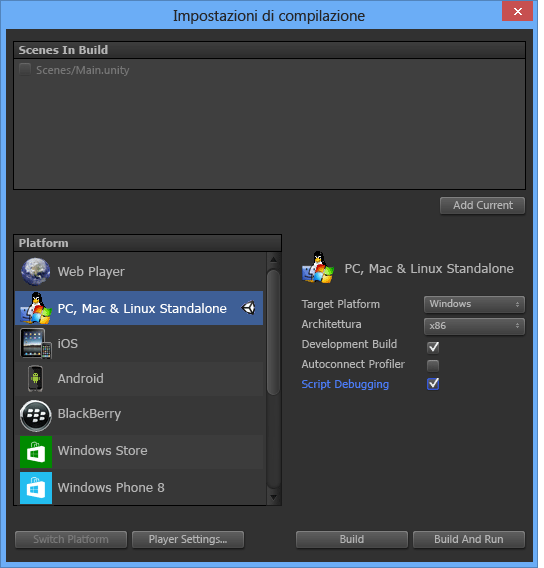
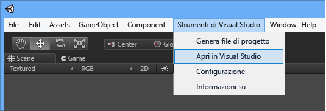

# Introduzione a Visual Studio Tools per Unity
Questa sezione descrive come installare Visual Studio Tools per Unity e configurare un progetto Unity per l'uso con Visual Studio.  
  
> [!IMPORTANT]
>  Unity 5.2 aggiunge il supporto incorporato per Visual Studio Tools per Unity 2.1, che semplifica la configurazione dei progetti. Per usufruirne, è necessario disporre di Unity 5.2.0 o versioni successive in Windows e Visual Studio Tools per Unity 2.1 o versioni successive.  
  
## Prerequisiti  
 Per usare Visual Studio Tools per Unity, è necessario quanto segue:  
  
-   Una versione di **Visual Studio** che supporti le estensioni, come Visual Studio Community, Professional, Premium o Enterprise. È possibile scaricare gratuitamente Visual Studio Community  
  
     [Scaricare Visual Studio Community](http://www.visualstudio.com/downloads/download-visual-studio-vs)  
  
-   **Unity** 4.0.0 o versioni successive; **Unity** 5.2.0 o versioni successive per sfruttare il supporto incorporato per Visual Studio Tools per Unity 2.1 o versioni successive.  
  
     [Scaricare Unity](https://unity3d.com/get-unity/download)  
  
## Installare Visual Studio Tools per Unity  
 Scaricare e installare Visual Studio Tools per Unity da Visual Studio Gallery. È necessario installare il pacchetto corretto per la versione di Visual Studio usata. Installare Visual Studio Tools per Unity 2.1 o versioni successive per poter sfruttare il supporto incorporato per VSTU in Unity 5.2 o versioni successive.  
  
-   Per Visual Studio 2015 Community, Visual Studio 2015 Professional o Enterprise di Visual Studio 2015:  
  
     [Scaricare Visual Studio 2015 Tools per Unity](https://visualstudiogallery.msdn.microsoft.com/8d26236e-4a64-4d64-8486-7df95156aba9)  
  
-   Per Visual Studio 2013 Community, Visual Studio 2013 Professional o Visual Studio 2013 Premium:  
  
     [Scaricare Visual Studio 2013 Tools per Unity](https://visualstudiogallery.msdn.microsoft.com/20b80b8c-659b-45ef-96c1-437828fe7cf2)  
  
-   Per Visual Studio 2012 Professional o Visual Studio 2012 Premium:  
  
     [Scaricare Visual Studio 2012 Tools per Unity](https://visualstudiogallery.msdn.microsoft.com/7ab11d2a-f413-4ed6-b3de-ff1d05157714)  
  
-   Per Visual Studio 2010 Professional o Visual Studio 2010 Premium:  
  
     [Scaricare Visual Studio 2010 Tools per Unity](https://visualstudiogallery.msdn.microsoft.com/6e536faa-ce73-494a-a746-6a14753015f1)  
  
> [!NOTE]
>  Le versioni Express di Visual Studio non supportano le estensioni come Visual Studio Tools per Unity. Visual Studio Community è una versione gratuita di Visual Studio che supporta Visual Studio Tools per Unity e altre estensioni. Visual Studio Community costituisce una soluzione migliore rispetto alla versione Express per la maggior parte degli utenti.  

> [!NOTE]
>  Per Visual Studio 2017, VSTU 3 include il carico di lavoro di Unity, che è possibile scegliere dal programma di installazione.  
  
## Creazione del primo progetto Unity con Visual Studio Tools per Unity  
 Una volta installati i prerequisiti, è possibile creare il primo progetto Unity con Visual Studio La configurazione di un progetto Unity varia a seconda delle versioni di Unity e Visual Studio Tools per Unity installate. Seguire la procedura corrispondente alla versione di Unity e Visual Studio Tools per Unity installata.  
  
### Unity 5.2 e versioni successive (richiede VSTU 2.1 o versioni successive)  
 A partire da Unity 5.2 non è più necessario importare il file unitypackage di Visual Studio Tools nei progetti. Se il progetto importa questo unitypackage, Unity 5.2 lo ignora e carica direttamente Visual Studio Tools per Unity dal relativo percorso di installazione.  
  
#### 1 - Creare un progetto Unity  
 Se si è già esperti di Unity, è possibile creare un nuovo progetto o caricarne uno esistente. Se si carica un progetto che ha importato il file unitypackage di Visual Studio Tools per usare Visual Studio Tools per Unity con una versione precedente di Unity, è consigliabile rimuoverlo eliminando la directory di UnityVS.  
  
 Se invece non si conosce ancora Unity, è consigliabile iniziare con un'esercitazione di base. Visitare la pagina Unity Learn per trovare esercitazioni su progetti di esempio con cui iniziare e lezioni utili per creare giochi con Unity. La pagina Unity Learn contiene esercitazioni di immediata comprensione relative a numerosi giochi di diverso tipo.  
  
 [Esercitazioni - Pagina Unity Learn](http://unity3d.com/learn/tutorials/modules)  
  
#### 2 - Configurare l'editor di Unity per l'uso di Visual Studio Tools per Unity  
 Per abilitare il progetto per usare Visual Studio Tools per Unity, è sufficiente impostare Visual Studio come editor di script esterni. Nel menu principale dell'editor di Unity scegliere **Edit, Preferences** e quindi nella finestra di dialogo **Unity Preferences** scegliere **External Tools**. Impostare quindi la proprietà **External Script Editor** sulla versione di Visual Studio che si vuole usare (per questa versione di Visual Studio è necessario che sia installato Visual Studio Tools per Unity) e assicurarsi che sia impostata la proprietà **Editor Attaching**.  
  
 Per assicurarsi che il supporto incorporato per Visual Studio Tools per Unity sia abilitato, visualizzare la finestra di dialogo **About Unity**. In the Unity editor, on the main menu, choose **Help, About Unity** . Se Visual Studio Tools per Unity è installato e configurato correttamente, verrà visualizzato un messaggio nell'angolo inferiore sinistro della finestra di dialogo **About Unity**.  
  
 Infine, assicurarsi di aver impostato una destinazione di compilazione nella pagina **Build Settings** e verificare che l'opzione **Script Debugging** sia abilitata.  
  
   
  
#### 3 - Avviare Visual Studio dall'editor di Unity  
 A partire da Unity 5.2, il menu dell'estensione **Visual Studio Tools** non è più necessario per avviare Visual Studio o per configurare Visual Studio Tools per Unity. Al contrario, quando Visual Studio è configurato come editor di script esterno, è sufficiente scegliere il file di script dall'editor di Unity e il codice verrà aperto in Visual Studio.  
  
### Versioni precedenti di Unity (precedenti alla versione 5.2)  
 Prima di Unity 5.2 non era disponibile il supporto incorporato per Visual Studio Tools per Unity. Per ogni progetto, invece, era necessario importare il file unitypackage di Visual Studio Tools e configurare altre impostazioni di progetto per poter usare Visual Studio Tools per Unity.  
  
#### 1 - Creare un progetto Unity  
 Se si è già esperti di Unity, è possibile creare un nuovo progetto o caricarne uno esistente. Se si crea un nuovo progetto, importare il file unitypackage di Visual Studio Tools durante la creazione.  
  
 Se invece non si conosce ancora Unity, è consigliabile iniziare con un'esercitazione di base. Visitare la pagina Unity Learn per trovare esercitazioni su progetti di esempio con cui iniziare e lezioni utili per creare giochi con Unity. La pagina Unity Learn contiene esercitazioni di immediata comprensione relative a numerosi giochi di diverso tipo.  
  
 [Esercitazioni - Pagina Unity Learn](http://unity3d.com/learn/tutorials/modules)  
  
#### 2 - Configurare l'editor di Unity per l'uso di Visual Studio Tools per Unity  
 Se inizia da con un progetto Unity esistente o se durante la creazione del progetto non è stato importato il file unitypackage di Visual Studio Tools per Unity, è necessario importarlo ora. Nel menu principale dell'editor di Unity scegliere **Assets, Import Package, Visual Studio 2015 Tools** (l'opzione visualizzata si riferisce alla versione di Visual Studio installata).  
  
   
  
 Infine, assicurarsi di aver impostato una destinazione di compilazione nella pagina **Build Settings** e verificare che l'opzione **Script Debugging** sia abilitata.  
  
   
  
#### 3 - Avviare Visual Studio dall'editor di Unity  
 Il passaggio finale consiste nell'avviare Visual Studio da Unity. Verrà quindi creata una soluzione Visual Studio per il progetto che verrà aperta in Visual Studio.  
  
 Nel menu principale dell'editor di Unity scegliere **Visual Studio Tools, Open in Visual Studio**.  
  
   
  
## Passaggi successivi  
 Per informazioni sull'uso e sul debug di un progetto Unity in Visual Studio, vedere [Uso di Visual Studio Tools per Unity](../cross-platform/getting-started-with-visual-studio-tools-for-unity.md).  
  
## Vedere anche  
 [Home page di Unity](http://unity3d.com)

