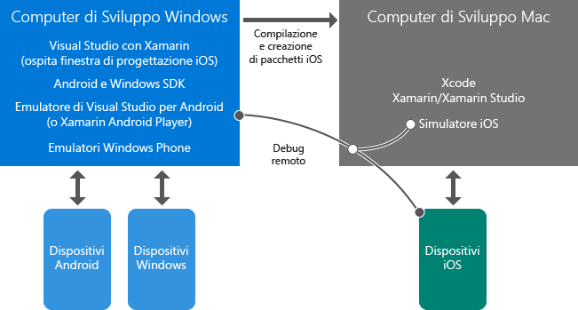

# Altre informazioni sullo sviluppo per dispositivi mobili con Xamarin
In questo argomento viene fatto riferimento a materiale introduttivo che fornisce informazioni sullo sviluppo di app per dispositivi mobili multipiattaforma con Xamarin. Se Visual Studio e Xamarin non sono ancora stati installati, avviare innanzitutto il processo [Setup and install](../cross-platform/setup-and-install.md) , quindi tornare qui per consultare queste risorse mentre i programmi di installazione sono in esecuzione.  
  
> [!NOTE]
>  Se non diversamente specificato, inizialmente è consigliabile leggere solo le pagine collegate direttamente a questo argomento e non le pagine secondarie. Se il processo di installazione è ancora in esecuzione dopo aver completato questo elenco, è possibile tornare indietro ed esplorare argomenti aggiuntivi.  
>   
>  È anche possibile leggere gli argomenti contrassegnati come "Concetti di base" e tornare agli argomenti "Approfondimento" più avanti.  
  
## Concetti di base: Introduzione a Xamarin  
 *10-20 minuti*  
  
1.  [App per dispositivi mobili in Visual Studio con Xamarin](https://www.visualstudio.com/explore/xamarin-vs) (visualstudio.com) fornisce un resoconto molto breve delle caratteristiche principali di Xamarin.  
  
2.  [Creazione di app per dispositivi mobili multipiattaforma con C# e Visual Studio](https://channel9.msdn.com/Events/Visual-Studio/Visual-Studio-2015-Final-Release-Event/Building-cross-platform-mobile-apps-using-C-and-Visual-Studio-2015) (Channel 9, 15 minuti e 16 secondi) con l'esperto di Xamarin James Montemagno. I primi tre minuti offrono una panoramica di Xamarin, seguita da dimostrazioni di codice.  
  
## Concetti di base: Panoramica dell'ambiente Visual Studio e Xamarin  
 *5-15 minuti*  
  
-   Il computer Windows con Visual Studio e Xamarin è il sistema in cui verrà eseguita la maggior parte del lavoro. In questo computer verranno direttamente create le app Windows e Android, che saranno quindi eseguite e di cui sarà effettuato il debug in un dispositivo o un emulatore. È anche possibile compilare, eseguire ed effettuare il debug di app iOS in modalità remota tramite il Mac. Visual Studio nel computer Windows può anche connettersi alla finestra di progettazione dello storyboard e al simulatore iOS.  
  
-   Il Mac con Xcode e Xamarin opera come host di compilazione/firma e ambiente di runtime per le app iOS. Le compilazioni per iOS da Visual Studio nel computer Windows sono delegate a questo Mac. Durante il debug di un'app iOS da Visual Studio, questa viene eseguita nel simulatore iOS nel Mac o direttamente in un dispositivo con tethering connesso al Mac. In questo caso si interagirà con l'app nel Mac o in prossimità di tale sistema e l'esperienza di debug avrà luogo in Visual Studio.  
  
 Queste relazioni sono illustrate di seguito. Altre informazioni sull'uso delle app iOS sono inoltre disponibili nell' [introduzione a Xamarin.iOS per Visual Studio](http://developer.xamarin.com/guides/ios/getting_started/installation/windows/introduction_to_xamarin_ios_for_visual_studio/) (xamarin.com).  
  
   
  
## Informazioni di base: Come sono strutturati i progetti  
 *10-30 minuti*  
  
1.  [Opzioni di condivisione del codice](http://developer.xamarin.com/guides/cross-platform/application_fundamentals/building_cross_platform_applications/sharing_code_options/) (xamarin.com). È consigliabile usare l'opzione relativa alle librerie di classi portabili, poiché offre il migliore supporto per l'uso delle sole API .NET che sono supportate in tutte le piattaforme di destinazione. La maggior parte del codice relativo alla logica di business si troverà nella libreria di classi portabile, incluso l'accesso ai database, le chiamate alle API REST e le chiamate ai componenti di Xamarin portatili (vedere [Deeper Dive: Xamarin Components](#components) alle fine di questo argomento). Anche il codice dell'interfaccia utente comune scritto con Xamarin.Forms può risiedere in una PCL.  
  
2.  (Facoltativo) Nel [case study relativo a Tasky](http://developer.xamarin.com/guides/cross-platform/application_fundamentals/building_cross_platform_applications/case_study-tasky/) (xamarin.com) vengono descritte alcune procedure consigliate per la progettazione e la struttura di un'app completa, ad esempio come strutturare il progetto con una libreria di classi portabile per il codice condiviso che separa il livello dati, il livello di accesso ai dati e il livello business.  
  
## Concetti di base: Livelli dell'interfaccia utente Xamarin Native e Xamarin.Forms  
 *10-40 minuti*  
  
 Xamarin offre due metodi per creare app native di alto livello: Xamarin Native e Xamarin.Forms.  
  
 Con Xamarin Native occorre scrivere codice separato per l'interfaccia utente per ogni piattaforma di destinazione: iOS, Android e Windows.  Con questo approccio è possibile accedere direttamente alle API specifiche della piattaforma e realizzare così un'esperienza dell'interfaccia utente personalizzata per ogni piattaforma.  È anche disponibile l'accesso completo alle finestre di progettazione e ai controlli nativi per ogni piattaforma, per facilitare la creazione dell'interfaccia utente corrispondente.  
  
 Xamarin.Forms offre un set di API generalizzato che consente di scrivere un livello di interfaccia utente condiviso per tutte le piattaforme in una libreria di classi portabile.  Xamarin.Forms prevede il rendering in controlli nativi in ciascuna piattaforma di destinazione per ottenere un aspetto originale.  Anziché usare una finestra di progettazione, con Xamarin.Forms l'interfaccia utente viene creata mediante C# e XAML.  
  
 Non è necessario decidere in anticipo quale approccio adottare. Le app possono essere implementate usando una combinazione di Xamarin Native e Xamarin.Forms:  
  
-   Usare Xamarin.Forms per creare schermate per uso generico che offrono un'interfaccia utente e funzionalità simili in tutte le piattaforme, come le schermate di accesso, i moduli di contatto e i risultati di ricerca.  
  
-   Xamarin.Forms consente anche di usare un'ampia gamma di funzionalità di personalizzazione per adattare l'interfaccia utente a ogni piattaforma. È ad esempio possibile usare l'API OnPlatform, sia dal codice che da XAML, per creare una visualizzazione personalizzata, estendere un renderer esistente e creare un renderer personalizzato.  
  
-   Se necessario, usare Xamarin Native per creare schermate che usano funzionalità dell'interfaccia utente univoche di ogni piattaforma, ad esempio una schermata che usa funzionalità native per l'acquisizione da fotocamera e la manipolazione delle immagini.  
  
 È consigliabile iniziare sempre con una soluzione Xamarin.Forms per impostare il codice dell'interfaccia utente condiviso tra le piattaforme e poi usare le funzionalità di personalizzazione per gli adeguamenti specifici della piattaforma. Se e quando è necessario creare schermate interamente specifiche della piattaforma, è possibile aggiungerle singolarmente tramite Xamarin Native.  
  
 Per altre informazioni:  
  
1.  [Xamarin.Forms](http://developer.xamarin.com/guides/cross-platform/xamarin-forms/) (xamarin.com) fornisce una breve panoramica e informazioni sui vantaggi e gli svantaggi di Xamarin.Forms rispetto ai livelli dell'interfaccia utente nativa (ovvero, Xamarin.iOS e Xamarin.Android).  
  
2.  I primi tre minuti del video di James Montemagno su [Xamarin.Forms: app native iOS, Android e Windows con C# e XAML](https://channel9.msdn.com/events/Visual-Studio/Connect-event-2015/704) (Channel9, 13 minuti e 3 secondi) offrono un'altra panoramica e alcune demo.  
  
3.  (Facoltativo) [Introduzione a Xamarin.Forms](http://developer.xamarin.com/guides/cross-platform/xamarin-forms/getting-started/introduction-to-xamarin-forms/) (xamarin.com)  
  
4.  (Facoltativo) Vedere alcuni esempi di come usare OnPlatform per la personalizzazione nella documentazione relativa alla [classe Device](http://developer.xamarin.com/guides/xamarin-forms/platform-features/device/) (xamarin.com)  
  
5.  (Facoltativo) L'articolo dedicato alla [condivisione del codice dell'interfaccia utente tra piattaforme per dispositivi mobili diverse con Xamarin.Forms](https://msdn.microsoft.com/magazine/dn904669.aspx) di Jason Smith (MSDN Magazine) presenta le varie opzioni di personalizzazione disponibili in Xamarin.Forms. Altri dettagli sono disponibili nell'articolo relativo alla [personalizzazione dei controlli per ogni piattaforma](http://developer.xamarin.com/guides/xamarin-forms/custom-renderer/) (xamarin.com).  
  
## Approfondimento: Debug con gli emulatori  
 *10-15 minuti*  
  
 Per eseguire il debug di app multipiattaforma senza dover usare un dispositivo fisico, saranno necessari gli strumenti seguenti:  
  
1.  **Emulatore Android.** A seconda della versione di Windows in uso, è consigliabile usare Visual Studio Emulator for Android di Microsoft o Xamarin Player, che offrono entrambi prestazioni elevate e supportano un'ampia gamma di funzionalità dei dispositivi:  
  
    -   **Computer con Windows 8+:** è consigliabile usare [Visual Studio Emulator for Android](https://www.visualstudio.com/en-us/features/msft-android-emulator-vs.aspx) di Microsoft, installato con Visual Studio.  Il video dedicato a [Visual Studio Emulator for Android](https://channel9.msdn.com/events/Visual-Studio/Connect-event-2015/711) (Channel 9, 5 minuti e 55 secondi) offre una panoramica e una dimostrazione.  
  
    -   **Windows 7 o versioni precedenti e Windows in esecuzione su Mac OS X**: usare [Xamarin Android Player](http://developer.xamarin.com/guides/android/getting_started/installation/android-player) (xamarin.com).  
  
2.  **Simulatore iOS di Apple.** Per altre informazioni, leggere l' [introduzione al simulatore iOS](https://developer.apple.com/library/prerelease/content/documentation/IDEs/Conceptual/iOS_Simulator_Guide/GettingStartedwithiOSSimulator/GettingStartedwithiOSSimulator.html#//apple_ref/doc/uid/TP40012848-CH5-SW1) (apple.com).  
  
3.  **Emulatore Windows Phone di Microsoft.** Per altre informazioni, leggere l' [Emulatore Windows Phone per Windows Phone 8](https://msdn.microsoft.com/library/dn632391.aspx).  
  
##   Deeper Dive: Xamarin Components  
 *10 minuti*  
  
 Numerose funzionalità estese sono disponibili per le app Xamarin mediante i componenti di Xamarin. All'indirizzo [http://components.xamarin.com/](http://components.xamarin.com/)è disponibile per il download il catalogo completo, che include i componenti per ulteriori controlli dell'interfaccia utente, l'autenticazione, un'ampia gamma di servizi cloud come Microsoft Azure e molto altro ancora.