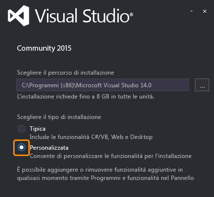

# Configurazione e installazione
Per creare app native per iOS, Android e Windows da una codebase C#/.NET comune con Xamarin, è necessario quanto segue:  
  
-   Per l'uso con app Windows e Android: un computer di sviluppo Windows con Visual Studio 2015 e Xamarin 4 installati (vedere la nota seguente). È anche possibile usare Visual Studio 2013 seguendo le istruzioni per l'[installazione diretta di Xamarin](https://developer.xamarin.com/guides/cross-platform/getting_started/requirements/#install) (xamarin.com).   
  
-   Per l'uso con app iOS: un Mac con OS X Yosemite (10.10.5) o versione successiva, con XCode e Xamarin installati.  
  
 È possibile impostare contemporaneamente i computer Windows e Mac. Durante l'esecuzione dei relativi programmi di installazione, è possibile consultare la pagina [Informazioni sullo sviluppo per dispositivi mobili con Xamarin](../cross-platform/learn-about-mobile-development-with-xamarin.md) per leggere e guardare il materiale di riferimento necessario.  
 
In caso di problemi con Xamarin dopo l'esecuzione della procedura di configurazione e installazione, inserire una domanda in [forums.xamarin.com](http://forums.xamarin.com/).
  
> [!NOTE]
>  A partire dal 31 marzo 2016, Xamarin è completamente incluso in tutte le edizioni di Visual Studio senza costi aggiuntivi e non richiede una licenza distinta. Anche Xamarin Studio Community per Mac è disponibile gratuitamente per studenti, sviluppatori di sistemi operativi e team di piccole dimensioni. Tenere presente che per le installazioni esistenti di Visual Studio che sono configurate con licenze Xamarin precedenti, è necessario aggiornare Xamarin alla versione 4.0.3.214 o successiva. A tale scopo, passare a **Strumenti > Opzioni > Xamarin > Altro**, fare clic sul collegamento **Verifica ora** e scaricare l'aggiornamento 4.0.3.214. Quando si riavvia Visual Studio, passare a **Strumenti > Account Xamarin**. Dovrebbe essere visualizzato lo stato aggiornato.  
  
 **Contenuto dell'argomento:**  
  
-   [Prerequisiti](#prereq)  
  
-   [Installazione di Windows (Visual Studio e Xamarin)](#windows)  
  
-   [Installazione in ambiente Mac (ID Apple, Xcode e Xamarin)](#mac)  
  
##   Prerequisiti  
  
1.  Account Xamarin: visitare l'indirizzo [https://www.xamarin.com/](https://www.xamarin.com/), fare clic su **Sign In** nell'angolo superiore destro della pagina, quindi fare clic su **Create a new account** nella pagina visualizzata. Selezionare un indirizzo di posta elettronica e una password per l'account Xamarin. Queste credenziali verranno usate in un secondo momento.  
  
2.  Per lo sviluppo per Windows e Android:  
  
    1.  Consigliato: un computer Windows fisico (non una macchina virtuale) con Windows 8 o versione successiva, che consente l'uso di Visual Studio Emulator for Android, una soluzione veloce e basata su Hyper-V, nel caso non si disponga di un dispositivo Android. È importante tenere presente che è necessario un computer fisico e non una macchina virtuale.  
  
    2.  È possibile usare un computer con Windows 7 o versione precedente, nel qual caso si userà Xamarin Player per Android come emulatore. 
    
    3. Per entrambe le configurazioni, è sempre possibile eseguire le app direttamente nei dispositivi fisici connessi.  
  
3.  Per lo sviluppo per iOS:  
  
    1.  Un Mac o Mac mini connesso in rete con OS X Yosemite 10.10.5 o versione successiva (obbligatorio per Xcode 7.1).  
  
    2.  Quando si usa Visual Studio in un computer Windows (7 o versione successiva) come ambiente di sviluppo principale, è necessario un Mac in rete solo per compilare ed eseguire il debug di app iOS, collegarsi al simulatore iOS o a dispositivi con tethering e usare la finestra di progettazione dello storyboard in Visual Studio per progettare l'interfaccia utente. Anche i modelli Mac meno recenti sono sufficienti per questo ruolo secondario.  
  
##   Installazione di Windows (Visual Studio e Xamarin)  
  
> [!TIP]
>  Queste istruzioni si applicano a Visual Studio 2015. Per usare Xamarin con Visual Studio 2013 (con Update 2), seguire le istruzioni per l'[installazione diretta di Xamarin](https://developer.xamarin.com/guides/cross-platform/getting_started/requirements/#install) (xamarin.com).  
  
1.  [Scaricare e avviare il programma di installazione di qualsiasi edizione di Visual Studio 2015](https://www.visualstudio.com/en-us/downloads/download-visual-studio-vs.aspx) (Community, Professional o Enterprise). Visual Studio Community 2015 è l'edizione gratuita. Le edizioni Professional ed Enterprise possono essere usate per un periodo di valutazione di 30 giorni, al termine del quale sarà necessario acquistare una licenza.  
  
    1.  Se Visual Studio è già installato, aprire **Pannello di controllo > Programmi e funzionalità**, scegliere **Visual Studio 2015**, quindi fare clic su **Cambia**. Quando viene aperto il programma di installazione, fare clic su **Modifica** e andare al passaggio 3 riportato di seguito.  
  
2.  (Solo per le nuove installazioni) Nel programma di installazione selezionare l'installazione **Personalizzata**:  
  
       
  
3.  Selezionare le caselle seguenti:  
  
    1.  **Sviluppo di app per dispositivi mobili multipiattaforma > C#/.NET (Xamarin)**. In questo modo verranno selezionati automaticamente anche vari strumenti Android in Strumenti comuni e Software Development Kit. Questa opzione eseguirà inoltre l'aggiornamento di eventuali installazioni esistenti di Xamarin.  
  
           
  
    2.  Per Windows 8 e versione successiva: **Sviluppo di app per dispositivi mobili multipiattaforma > Microsoft Visual Studio Emulator for Android**. Nota: se si sta usando un computer con Windows 7 o un sistema operativo precedente o si esegue Windows su un Mac, assicurarsi che questa opzione sia *deselezionata*. Vedere "Nota sugli emulatori nei computer Windows" dopo il passaggio 5. È anche possibile mantenere deselezionata questa opzione se si prevede di eseguire il debug solo su dispositivi Android fisici.  
  
    3.  (Facoltativo) Se si prevede di effettuare attività di sviluppo destinate a dispositivi Windows, selezionare anche **Sviluppo per Windows e Web > Strumenti per lo sviluppo di app di Windows universale** e/o **Strumenti per Windows 8.1 e Windows Phone 8.0/8.1**. Sono incluse opzioni per l'installazione di immagini di emulatori che richiederanno più tempo per il download. È sempre possibile tornare al programma di installazione di Visual Studio per aggiungerle in un secondo momento.  
  
4.  Fare clic sul pulsante Installa e attendere l'esecuzione del processo. Anche in questo caso, l'operazione richiederà un certo tempo. Nel frattempo è possibile procedere con le istruzioni di installazione del Mac e passare a [Informazioni sullo sviluppo per dispositivi mobili con Xamarin](../cross-platform/learn-about-mobile-development-with-xamarin.md).  
  
5.  Al termine dell'installazione, avviare Visual Studio e accedere con l'account Microsoft se viene richiesto (si tratta dello stesso account che viene usato per Windows). Verificare quindi la disponibilità di aggiornamenti per Xamarin tramite **Strumenti > Opzioni > Xamarin** o **Strumenti > Opzioni > Xamarin > Altro**, in cui è disponibile un collegamento **Verifica ora**:  
  
       
  
    > [!NOTE]
    >  Come indicato in precedenza, assicurarsi di aggiornare Xamarin alla versione 4.0.3.214 o successiva per evitare problemi con le licenze precedenti di Xamarin.  

    Se non viene visualizzata un'opzione per Xamarin in **Strumenti > Opzioni**, controllare l'installazione o provare a riavviare Visual Studio. È inoltre possibile cercare Xamarin nella finestra di dialogo Opzioni.
      
6.  Per Windows 7 e versioni precedenti o per l'esecuzione di Windows su un Mac, usare l'[emulatore di Android SDK](https://developer.xamarin.com/guides/android/deployment,_testing,_and_metrics/debug-on-emulator/android-sdk-emulator/) se non si dispone di dispositivi fisici. Vedere la nota seguente.  
  
 **Nota sugli emulatori nei computer Windows:** poiché le CPU supportano una sola tecnologia di virtualizzazione alla volta, è consigliabile averne solo una in uso in un computer di sviluppo. Esistono tre tecnologie di virtualizzazione principali: Hyper-V (usato da Visual Studio Emulator for Android e dall'emulatore di Windows Phone), Virtual Box (usato da Genymotion) e Intel HAXM (usato dall'emulatore di Android SDK). A causa di diversi problemi tra Hyper-V e Virtual Box, è preferibile usare emulatori di un solo tipo in un determinato computer. Questo è il motivo alla base delle raccomandazioni precedenti di usare Hyper-V nei computer Windows 8 e versioni successive e gli emulatori Intel HAXM in Windows 7 e versioni precedenti e per l'esecuzione di Windows su un Mac.  
  
##   Installazione in ambiente Mac (ID Apple, Xcode e Xamarin)  
  
1.  Creare un ID Apple gratuito visitando la pagina [https://appleid.apple.com](https://appleid.apple.com/) , se non ne è già disponibile uno. Questo è necessario per l'installazione e la firma in Xcode.  
  
2.  Scaricare e installare Xcode dalla pagina [https://developer.apple.com/xcode/](https://developer.apple.com/xcode/) e aggiungere l'ID Apple come descritto nell'articolo relativo all' [aggiunta di un account a XCode](https://developer.apple.com/library/content/documentation/IDEs/Conceptual/AppStoreDistributionTutorial/AddingYourAccounttoXcode/AddingYourAccounttoXcode.html#//apple_ref/doc/uid/TP40013839-CH40-SW1) (apple.com).  
  
3.  Scaricare e installare Xamarin seguendo le istruzioni nella pagina relativa a [installazione e configurazione di Xamarin.iOS](http://developer.xamarin.com/guides/ios/getting_started/installation/mac/) (xamarin.com).  
  
4.  Dopo aver completato l'installazione di Xamarin nei computer Windows e Mac, seguire le istruzioni nella pagina relativa alla [connessione al Mac](http://developer.xamarin.com/guides/ios/getting_started/installation/windows/xamarin-mac-agent/) (xamarin.com) in modo da usare iOS e il Mac da Visual Studio nel computer Windows.  
  
     Si noti che entrambi i computer devono trovarsi nella stessa rete locale.
