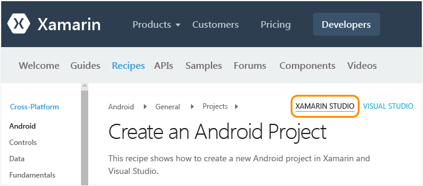

# Configurazione, installazione e verifiche per gli utenti Mac
Questo argomento è destinato agli sviluppatori che lavorano principalmente su un Mac e che useranno facoltativamente Visual Studio in una macchina virtuale Windows sul Mac. Gli sviluppatori che lavorano principalmente su un computer Windows e devono impostare un Mac secondario per attività di sviluppo destinate a iOS possono vedere l'argomento [Configurazione e installazione](../cross-platform/setup-and-install.md) principale.

 Per usare Xamarin su un Mac, è necessario quanto segue:

-   Un Mac con macOS Sierra 10.12 o versione successiva, con Xcode e Xamarin installati.

-   Una delle configurazioni seguenti:

    -   **Per l'esecuzione di Xamarin Studio direttamente nel Mac:** Xamarin Studio è l'ambiente di sviluppo di Xamarin che supporta la creazione di app Android, iOS e Windows tramite C#.  Per una rapida panoramica di Xamarin Studio, vedere i [cenni preliminari su Xamarin Studio](https://xamarin.com/studio) (xamarin.com).

    -   **Se nel Mac è già configurato Parallels o VMWare:** eseguire Windows con Visual Studio 2017 e Xamarin in Parallels o VMWare.  Con questa configurazione, Xamarin è un'estensione installata con Visual Studio che offre la possibilità di usare Visual Studio come ambiente di sviluppo per la creazione di app Android, iOS e Windows tramite C#.  Si noti che è possibile ottenere una sottoscrizione gratuita di Parallels per 3 mesi nell'ambito del programma Visual Studio Developer Essentials. Vedere la pagina relativa al fatto che [Microsoft Visual Studio Developer Essentials includerà Parallels Desktop Pro e l'accesso a Parallels](http://blog.parallels.com/blog/2015/11/18/visual-studio-dev-essentials/) (blog di Parallels).

 In questo argomento vengono fornite istruzioni per tali requisiti.  Mentre il processo di installazione è in esecuzione, è possibile esaminare l'argomento [Informazioni sullo sviluppo per dispositivi mobili con Xamarin](../cross-platform/learn-about-mobile-development-with-xamarin.md) per leggere e guardare il materiale di riferimento necessario.

##   Installazione di Mac (ID Apple, Xcode e Xamarin)

1.  Creare un ID Apple gratuito in [ID Apple](https://appleid.apple.com/) , se non ne è già disponibile uno. Questo è necessario per l'installazione e la firma in Xcode.

2.  Scaricare e installare Xcode da [https://developer.apple.com/xcode/](https://developer.apple.com/xcode/).

3.  Scaricare e installare Xamarin seguendo le istruzioni nella pagina relativa a [installazione e configurazione di Xamarin.iOS](http://developer.xamarin.com/guides/ios/getting_started/installation/mac/) (xamarin.com).

4.  Dopo aver completato l'installazione di Xamarin nei computer Windows e Mac, seguire le istruzioni nella pagina relativa alla [connessione al Mac tramite XMA](http://developer.xamarin.com/guides/ios/getting_started/installation/windows/#Connecting_to_the_Mac_Using_XMA) (xamarin.com) in modo da usare iOS e il Mac da Visual Studio nel computer Windows.

##   Installazione di Windows in Parallels (Visual Studio e Xamarin)

1.  Usando il desktop Windows che è stato configurato in Parallels/VMWare, [scaricare e avviare il programma di installazione di qualsiasi edizione di Visual Studio 2017](https://www.visualstudio.com/downloads/) (Community, Professional o Enterprise). Visual Studio Community 2017 è l'edizione gratuita. Le edizioni Professional ed Enterprise possono essere usate per un periodo di valutazione di 30 giorni.

2.  All'interno del programma di installazione fare clic sul pulsante **Altre opzioni** (icona con tre barrette) _accanto ad_ **Avvio** e quindi scegliere **Modifica**:  
  
       
  
3.  Selezionare le caselle seguenti:

    1.  **Dispositivi mobili e giochi > Sviluppo di applicazioni per dispositivi mobili con .NET**. In questo modo verranno selezionati automaticamente anche vari strumenti Android in Strumenti comuni e Software Development Kit. Questa opzione eseguirà inoltre l'aggiornamento di eventuali installazioni esistenti di Xamarin.  
  
           
  
    2. (Facoltativo) **Windows > Sviluppo di app per la piattaforma UWP (Universal Windows Platform)**. Sono incluse opzioni per l'installazione di immagini di emulatori che richiederanno più tempo per il download. È sempre possibile tornare al programma di installazione di Visual Studio per aggiungerle in un secondo momento.  

4.  Fare clic sul pulsante **Modifica** e attendere l'esecuzione del processo. Anche in questo caso, l'operazione richiederà un certo tempo. Nel frattempo è possibile procedere con le istruzioni di installazione del Mac e passare a [Informazioni sullo sviluppo per dispositivi mobili con Xamarin](../cross-platform/learn-about-mobile-development-with-xamarin.md).

5.  Al termine dell'installazione, avviare Visual Studio e accedere con l'account Microsoft se viene richiesto (si tratta dello stesso account che viene usato per Windows).

6.  Dopo aver completato l'installazione di Xamarin nei computer Windows e Mac, seguire le istruzioni nella pagina relativa alla [connessione al Mac tramite XMA](http://developer.xamarin.com/guides/ios/getting_started/installation/windows/#Connecting_to_the_Mac_Using_XMA) (xamarin.com) in modo da usare iOS da Visual Studio.

##   Verificare l'ambiente
 Al termine dei programmi di installazione, dedicare alcuni minuti per verificare che tutto sia pronto per le attività di sviluppo con Xamarin.

### Xamarin Studio
 In primo luogo, verificare che, quando si visitano i collegamenti disponibili, sia selezionato **Xamarin Studio** nell'angolo superiore destro, in modo da visualizzare la versione corretta della documentazione di Xamarin:

 

**Android**

1.  Convalidare la creazione di un progetto Android seguendo le istruzioni nella pagina relativa alla [creazione di un progetto Android](http://developer.xamarin.com/recipes/android/general/projects/create_an_android_project/) (xamarin.com).

2.  Convalidare il debug nell'emulatore Android tramite la pagina relativa all'[integrazione con la documentazione di Xamarin Studio in Android Player](https://developer.xamarin.com/guides/android/getting_started/installation/android-player/#Integration_with_Xamarin_Studio) (xamarin.com).

**iOS**

1.  Convalidare la creazione di un progetto iOS seguendo le istruzioni nella pagina relativa alla [creazione di un progetto iOS](http://developer.xamarin.com/recipes/ios/general/projects/create_an_ios_project/) (xamarin.com).

2.  Convalidare il debug nel simulatore iOS tramite la [documentazione relativa al debug nel simulatore](https://developer.xamarin.com/guides/ios/deployment,_testing,_and_metrics/debugging_in_xamarin_ios/#Debugging_on_the_Simulator) (xamarin.com).

### Visual Studio
 In primo luogo, verificare che, quando si visitano i collegamenti disponibili, sia selezionato **Visual Studio** nell'angolo superiore destro, in modo da visualizzare la versione corretta della documentazione di Xamarin:

 

**Android**

1.  Convalidare la creazione di un progetto Android seguendo le istruzioni nella pagina relativa alla [creazione di un progetto Android](http://developer.xamarin.com/recipes/android/general/projects/create_an_android_project/) (xamarin.com).

2.  Convalidare la finestra di progettazione Android: nel progetto Android in Esplora soluzioni aprire il file **Risorse > Layout > Main.axml**.

    -   Se viene visualizzato un errore che indica che Android SDK installato è troppo vecchio, fare clic su **Open Android SDK** nel messaggio e selezionare la versione dell'SDK più recente disponibile. Si noti che è necessario eseguire Visual Studio come amministratore per aggiornare l'SDK.

3.  Verificare che sia possibile connettersi da Visual Studio all'emulatore installato nel Mac.  Come risultato, Xamarin Player sarà visualizzato nell'elenco degli emulatori che è possibile selezionare in Visual Studio per il debug.  A tale scopo, seguire le istruzioni nella pagina relativa alla [connessione di Visual Studio a Xamarin Android Player](http://developer.xamarin.com/guides/android/deployment,_testing,_and_metrics/android-player-with-visual-studio-in-vm/) (xamarin.com).

**iOS**

1.  Assicurarsi che il Mac sia disponibile in rete e associato a Visual Studio, come descritto nella pagina relativa alla [connessione al Mac](https://developer.xamarin.com/guides/ios/getting_started/installation/windows/#Connecting_to_the_Mac) (xamarin.com).

2.  Convalidare la creazione di un progetto iOS seguendo le istruzioni nella pagina relativa alla [creazione di un progetto iOS](http://developer.xamarin.com/recipes/ios/general/projects/create_an_ios_project/) (xamarin.com).

3.  Convalidare la finestra di progettazione dello storyboard: nel progetto iOS in Esplora soluzioni aprire il file **MainStoryboard.storyboard** . In questo caso, Visual Studio ospita la finestra di progettazione, che è in esecuzione in remoto sul Mac.

4.  Convalidare la compilazione e il debug:

    1.  Fare clic con il pulsante destro del mouse sul progetto iOS in Esplora soluzioni e scegliere **Imposta come progetto di avvio**.

    2.  Selezionare la destinazione **iPhoneSimulator** dall'elenco a discesa di compilazione di Visual Studio, come illustrato di seguito. Se non è elencato alcun simulatore, avviare Xcode nel Mac, selezionare **Xcode->Preferences** e fare clic su **Download**. In **Components** dovrebbero essere visualizzate le versioni del simulatore disponibili per il download. Ulteriori istruzioni per il debug sono disponibili nella pagina relativa al [debug](https://developer.xamarin.com/guides/ios/deployment,_testing,_and_metrics/debugging_in_xamarin_ios/#Debugging_on_the_Simulator) di Xamarin (xamarin.com).

         

    3.  Selezionare una destinazione iPhone dall'elenco a discesa di debug di Visual Studio, come illustrato di seguito, e avviare il debugger premendo F5. Verrà avviato il simulatore nel Mac, in cui è possibile interagire con l'app, mentre viene eseguito il debug in Visual Studio.

         
