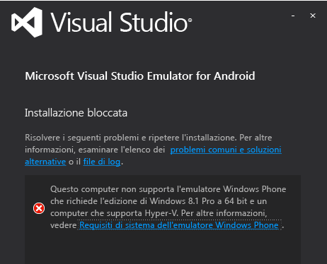
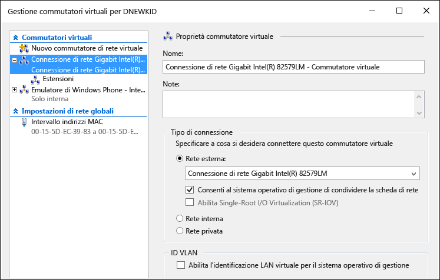

# Troubleshooting the Visual Studio Emulator for Android
In questo argomento contiene informazioni che consentono di risolvere i problemi che possono verificarsi quando si utilizza Visual Studio emulatore Android.  
  
> [!WARNING]
>  Quando l'emulatore è installato, il programma di installazione verifica i prerequisiti per l'esecuzione del software. Se i prerequisiti non sono presenti, visualizza degli avvisi ma non richiede i prerequisiti per l’installazione.  
  
 Di seguito sono elencate le diverse sezioni di questo argomento:  
  
-   [Prima di iniziare](#BeforeYouStart)  
  
-   [Non è possibile installare l'emulatore](#NoInstall)  
  
-   [Non è possibile connettersi alle destinazioni di rete in un dominio o di una rete aziendale](#DomainNetwork)  
  
-   [Non è possibile connettersi alle destinazioni di rete quando le impostazioni di rete richiedono la configurazione manuale](#ManualNetworkConfig)  
  
-   [L'emulatore viene avviato lentamente, non viene avviato a causa di un timeout o si verifica un errore di distribuzione dell'app](#SlowStart)  
  
-   [Non è possibile avviare l'emulatore](#NoStart2)  
  
-   [Non è possibile avviare l'emulatore (primo utilizzo)](#NoStart)  
  
-   [Non è possibile avviare il computer dopo l'installazione dell'emulatore](#NoBoot)  
  
-   [Visual Studio si blocca durante il tentativo di distribuzione dell'app all'emulatore oppure l'emulatore non è visualizzato come destinazione di debug in altri IDE](#ADB)  
  
-   [L'emulatore si blocca perché non è stato in grado di configurare la porta UDP](#XamarinPlayer)  
  
-   [Non è possibile collegare un debugger a un progetto Xamarin](#Skylake)  
  
-   [Non è possibile eseguire nell'emulatore un'app che usa Google Play Services](#GooglePlay)  
  
-   [Il trascinamento di un file, un APK o un file ZIP che supporta il flashing non funziona](#DragAndDrop)  
  
-   [La risoluzione dello screenshot non è corretta](#Resolution)  
  
-   [L'emulatore non riesce a eseguire il rendering di contenuto OpenGL](#OpenGL)  
  
-   [L'emulatore non risponde ai movimenti multitocco](#Multitouch)  
  
-   [Risorse di supporto](#Support)  
  
##   Prima di iniziare  
 Prima di iniziare la risoluzione dei problemi, potrebbe essere utile consultare gli argomenti seguenti:  
  
-   [Requisiti di sistema per Visual Studio Emulator for Android](../cross-platform/system-requirements-for-the-visual-studio-emulator-for-android.md)  
  
##   Non è possibile installare l'emulatore  
 Se Hyper-V non è installato, quando si prova a installare l'emulatore verrà visualizzato un messaggio analogo al seguente. È necessario avere un computer che supporta HyperV e che HyperV sia abilitato.  
  
   
  
> [!NOTE]
>  Questo messaggio è applicabile a Visual Studio Emulator for Android e all'emulatore Windows Phone. Windows 8.1 e Windows 10 supportano l'emulatore.  
  
 Se viene visualizzato questo messaggio, vedere i [requisiti di sistema per Visual Studio Emulator for Android](../cross-platform/system-requirements-for-the-visual-studio-emulator-for-android.md) per verificare se è possibile eseguire l'emulatore.  
  
##   Non è possibile connettersi alle destinazioni di rete in un dominio o di una rete aziendale  
 L'emulatore Visual Studio viene visualizzato sulla rete come un dispositivo distinto con il proprio indirizzo IP. Non è stato aggiunto a un dominio Windows e non condivide le credenziali di dominio o gruppo di lavoro con il computer host.  
  
 Se la rete richiede l'autorizzazione di dominio o gruppo di lavoro per la rete di base e la connettività Internet, contattare l'amministratore IT per un'eccezione. Questa eccezione consente al computer di sviluppo per fungere da una macchina di limiti e accettare connessioni dai dispositivi di rete non aggiunto al dominio come l'emulatore.  
  
 Emulatore di Visual Studio per Android utilizza inoltre un proprio set di indirizzi MAC. Se non è possibile accedere all'emulatore di rete o alle risorse Internet, rivolgersi all'amministratore IT per assicurarsi che sono stati autorizzati indirizzi MAC dell'emulatore di rete.  
  
#### Per visualizzare MAC dell'emulatore indirizzi  
  
1.  Avviare l'emulatore  
  
2.  Nella barra degli strumenti dell'emulatore, fare clic sul pulsante freccia di espansione (>>) per aprire la finestra di strumenti aggiuntivi.  
  
3.  Nella finestra Strumenti aggiuntivi, fare clic sulla scheda di rete.  
  
4.  Nella pagina rete individuare le voci di indirizzo fisico.  
  
##   Non è possibile connettersi alle destinazioni di rete quando le impostazioni di rete richiedono la configurazione manuale  
 Per connettersi alle destinazioni di rete dall'emulatore, la rete deve soddisfare i requisiti seguenti:  
  
-   DHCP L'emulatore richiede DHCP perché viene configurato automaticamente come un dispositivo separato sulla rete con il relativo indirizzo IP.  
  
-   Impostazioni di DNS e gateway configurate automaticamente Non è possibile configurare le impostazioni di DNS e gateway manualmente per l'emulatore.  
  
 Se la rete richiede impostazioni configurate manualmente, rivolgersi all'amministratore IT di determinare come è possibile abilitare la connettività di rete per l'emulatore.  
  
##   L'emulatore viene avviato lentamente, non viene avviato a causa di un timeout o si verifica un errore di distribuzione dell'app  
 In determinate condizioni, l'emulatore richiede alcuni minuti per avviare o non viene avviato a causa di un timeout. Se l'emulatore non viene avviato, viene visualizzato il seguente messaggio: Distribuzione dell’applicazione non riuscita:`App deployment failed. Please try again` Le condizioni seguenti possono causare questo errore.  
  
-   Attivare l’emulatore di Visual Studio per Android da un VHD bootable. Questa configurazione non è supportata.  
  
-   Un disco rigido difettoso. Si consiglia di eseguire il programma chkdsk.  
  
-   Un disco rigido che deve essere deframmentato. Eseguire la deframmentazione dell'unità.  
  
-   Un disco rigido è quasi completo. Controllare lo spazio disponibile sul disco.  
  
-   Memoria insufficiente è disponibile a causa di altre applicazioni in esecuzione. Ridurre il numero di applicazioni che utilizzano la memoria o aumentare la quantità di memoria.  
  
-   In generale, qualsiasi fattore che contribuisce a ridurre le prestazioni di sistema. Iniziare la risoluzione dei problemi con il componente con il punteggio secondario più basso nell'indice prestazioni Windows, disponibile nella pagina strumenti e informazioni sulle prestazioni del Pannello di controllo.  
  
##   Non è possibile avviare l'emulatore  
 Se l'emulatore funzionava in precedenza ma non funziona più, eseguire le attività seguenti. Se si usa l'emulatore per la prima volta, vedere [Emulator fails to start (first use)](#NoStart) prima di seguire questa procedura.  
  
-   Rimuovere eventuali altre istanze Hyper-V dell'emulatore.  
  
    1.  Chiudere Visual Studio.  
  
    2.  Aprire la Console di gestione di Hyper-V e arrestare eventuali istanze di Hyper-V dell'emulatore (macchine virtuali) già in esecuzione e che potrebbero avere uno stato danneggiato.  
  
    3.  Nella Console di gestione di Hyper-V eliminare eventuali altre VM dell'emulatore.  
  
    4.  Riavviare il computer.  
  
-   Verificare che siano disponibili almeno 4 GB di memoria di sistema e che la memoria non venga usata da altri programmi e processi che richiedono molte risorse (ad esempio, provare a chiudere le finestre del browser).  
  
-   Nella Console di gestione di Hyper-V aprire Gestione commutatori virtuali e verificare la disponibilità di due commutatore di rete. Assicurarsi che il primo sia il commutatore interno e che il secondo sia esterno.  
  
       
  
     Se l'installazione non è corretta e si usa Windows 10, è possibile vedere [Reinstalla i dispositivi di rete con il comando netcfg –d](http://windows.microsoft.com/en-us/windows-10/fix-network-connection-issues) (sezione 6).  
  
-   Se questa procedura non consente di risolvere il problema, vedere [Emulator fails to start (first use)](#NoStart) per informazioni su software di terze parti che potrebbe interferire con l'emulatore.  
  
##   Non è possibile avviare l'emulatore (primo utilizzo)  
 Se non viene avviato l'emulatore, eseguire le attività seguenti per identificare e risolvere il problema.  
  
-   Assicurarsi che vengano soddisfatti i requisiti hardware minimi e che le impostazioni del BIOS siano corrette.  
  
     L'emulatore e Windows 8 Hyper-V richiede un processore a 64 bit con secondo livello SLAT (Address Translation). Per Intel è necessario essenzialmente un processore Core i3, i5 o i7 (o uno dei molti processori Xeon). Un elenco dei chip AMD è disponibile [qui](http://support.amd.com/en-us).  
  
    1.  Assicurarsi che il computer in uso soddisfi i [requisiti di sistema](../cross-platform/system-requirements-for-the-visual-studio-emulator-for-android.md).  
  
    2.  Verificare che lo [strumento SLAT](https://slatstatuscheck.codeplex.com/) indichi che il computer supporta SLAT.  
  
    3.  All'interno delle impostazioni del BIOS del computer, assicurarsi che tutte le tecnologie di virtualizzazione sono abilitata. Le descrizioni del BIOS esatte possono variare per ogni produttore di hardware. In generale, abilitare le funzionalità correlate a:  
  
        -   SLAT (Conversione indirizzi di secondo livello)  
  
        -   Accetta (Extended Page Tables) (Intel)  
  
        -   TNP (pagina nidificata tabelle) (AMD)  
  
        -   RVI (Rapid Virtualization Indexing) (AMD)  
  
        -   VMX (Intel acronimo che indica il supporto per la virtualizzazione hardware assistita)  
  
        -   SVM (un acronimo AMD che indica il supporto per la virtualizzazione hardware assistita)  
  
        -   XD (Execute Disable) (Intel); questo deve essere abilitato  
  
        -   NX (nessuna Execute)(AMD); deve essere abilitato.  
  
    4.  Se le opzioni seguenti sono presenti nel BIOS, disabilitarli.  
  
        -   Disabilitare la tecnologia Intel VT-d  
  
        -   Disabilitare esecuzione Trusted  
  
         Per ulteriori informazioni, vedere l'articolo: Technet: come Hyper-v: per correggere BIOS errori abilitazione di Hyper-V  
  
    5.  Assicurarsi di che disporre di almeno 4 GB di memoria di sistema e che non viene utilizzato da altri programmi che richiedono molte risorse e processi.  
  
    6.  Assicurarsi che si esegue Windows 8 Professional o migliori (Windows Server 2008 non è supportato). Windows Server 2012 è supportato, ma è necessario abilitare esperienza Desktop.  
  
     È possibile controllare il Visualizzatore eventi per vedere se sono presenti errori di Hypervisor. A tale scopo, aprire il Visualizzatore eventi (chiave di avvio + R, quindi digitare `eventvwr`) e quindi selezionare **registri di Windows**, **sistema**. Quindi filtrare il registro eventi dall'origine evento, impostando l'origine su **Hypervisor Hyper-V**. Controllare gli errori identificare la causa principale.  
  
     Se il soddisfa processore i requisiti minimi ma hypervisor ancora esito negativo, provare a scoprire se è un aggiornamento del BIOS per il computer. Se è presente, e si sceglie di eseguire l'aggiornamento, accertarsi di rispettare tutte le precauzioni dal produttore durante l'aggiornamento del BIOS (ad esempio, per garantire l'aggiornamento del firmware BIOS non è stato interrotto da un'interruzione dell'alimentazione, che può essere danneggiata definitivamente il BIOS).  
  
-   Assicurarsi di che disporre di almeno 4 GB di memoria di sistema e che non viene utilizzato da altri programmi che richiedono molte risorse e processi.  
  
-   Rimuovere o disabilitare i driver di terze parti o software che potrebbe interferire con la rete virtuale.  
  
     Esistono alcuni problemi noti con alcuni prodotti di terzi installati in Windows 8, ad esempio driver/protocolli di rete che non sono completamente compatibili con lo stack di rete Hyper-V.  
  
     In generale, è compito degli sviluppatori di tali prodotti per l'aggiornamento del software per essere compatibile con Windows 8 e Hyper-V.  
  
     I seguenti prodotti potrebbero richiedere l'aggiornamento per la conformità di Windows 8: VirtualBox, Virtual PC 7, VMWare, alcuni client VPN, i firewall software, alcune versioni di client VPN Cisco e altri sistemi di virtualizzazione. Collaborare con lo sviluppatore del software di virtualizzazione incerta incoraggiarli per aggiornare il software per renderlo compatibile con Windows 8 e Hyper-V.  
  
     Come un **soluzione**, è possibile disabilitare tutti i driver di terze parti e applicazioni che potrebbero interferire con la rete virtuale utilizzata dall'emulatore di comunicare con Visual Studio. Queste applicazioni possono comprendere:  
  
    -   Antivirus applicazioni (hook lo stack di rete)  
  
    -   Strumenti di monitoraggio di rete  
  
    -   Strumenti di registrazione di rete  
  
    -   Altro software di monitoraggio di sistema  
  
     Un'altra possibile soluzione alternativa, se non si disinstallazione dei prodotti nella domanda e che richiede lo sviluppatore di prodotto per rilasciare una versione aggiornata, è necessario eseguire le operazioni seguenti.  
  
    1.  Avviare Gestione connessioni di rete (dalla schermata Start digitare `View Network Connections` e selezionare questa opzione per visualizzare le connessioni di rete.)  
  
    2.  Per la scheda vEthernet (interno porta Windows Phone emulatore interna Switch Ethernet), scegliere **proprietà** dal menu di scelta rapida.  
  
           
  
         Qui vengono visualizzate le proprietà dell'adapter.  
  
           
  
    3.  Per questo adapter, gli unici elementi che devono essere selezionati in **la connessione utilizza i seguenti elementi** riportato di seguito:  
  
        -   Client per reti Microsoft  
  
        -   Utilità di pianificazione pacchetti QoS  
  
        -   Condivisione file e stampanti per reti Microsoft  
  
        -   Driver di protocollo LLDP Microsoft  
  
        -   Driver dei / o mapping individuazione topologia livelli di collegamento  
  
        -   Risponditore individuazione topologia livelli di collegamento  
  
        -   Protocollo Internet versione 6 (TCP/IPv6)  
  
        -   Protocollo Internet versione 4 (TCP/IPv4)  
  
    4.  Deselezionare tutti gli altri elementi.  
  
     Lo svantaggio di questa tecnica è che ogni volta che un nuovo prodotto di terze parti installa i driver non supportati o ogni volta che viene installato l'emulatore, questi passaggi dovrà essere ripetuta.  
  
     Dopo la disinstallazione di prodotti di terze parti potrebbe essere necessario ripristinare lo Switch interno di Windows Phone emulatore. Operazione da eseguire:  
  
    -   Aprire Hyper V e andare in Gestione commutatori virtuali. Creare un commutatore virtuale denominato "Windows Phone emulatore interna Switch" e impostarne il tipo di connessione **rete interna**.  
  
           
  
     Ora avviare l'emulatore Dovrebbe funzionare.  
  
##   Non è possibile avviare il computer dopo l'installazione dell'emulatore  
 Il problema può verificarsi quando vengono soddisfatte le condizioni seguenti:  
  
-   Il computer dispone di una scheda madre Gigabyte.  
  
-   USB3 è attivato sulla scheda madre.  
  
 Per risolvere questo problema, disabilitare USB3 nelle impostazioni del BIOS della scheda madre e riavviare il computer. Controllare quindi se Gigabyte ha rilasciato un aggiornamento del BIOS della scheda madre.  
  
 Per altre informazioni, vedere l'articolo della Knowledge Base relativo all' [errore di avvio dopo l'installazione del ruolo Hyper-V in sistemi Gigabyte](https://support.microsoft.com/en-us/kb/2693144).  
  
##   Visual Studio si blocca durante il tentativo di distribuzione dell'app all'emulatore oppure l'emulatore non è visualizzato come destinazione di debug in altri IDE  
 Se l'emulatore è in esecuzione, ma non sembra essere connesso ad ADB (Bridge Debug Android) o non è visualizzato negli strumenti di Android che usano ADB, ad esempio Studio Android o Eclipse, potrebbe essere necessario modificare le posizioni in cui l'emulatore cerca ADB. L'emulatore utilizza una chiave del Registro di sistema per identificare il percorso di base dell'Android SDK e cerca il file \platform-tools\adb.exe in tale directory. Per modificare il percorso di Android SDK utilizzato dall'emulatore:  
  
-   Aprire l'Editor del Registro di sistema selezionando **eseguire** dall'inizio pulsanti menu di scelta rapida, digitare `regedit` nella finestra di dialogo e scegliendo **OK**.  
  
-   Passare a strumenti SDK HKEY_LOCAL_MACHINE\SOFTWARE\Wow6432Node\Android nell'albero delle cartelle a sinistra.  
  
-   Modificare il **percorso** variabile del Registro di sistema in base al percorso per il Android SDK.  
  
 Riavviare l'emulatore e a questo punto dovrebbe essere in grado di visualizzare l'emulatore connesso a ADB e relativi strumenti Android.  
  
##   L'emulatore si blocca perché non è stato in grado di configurare la porta UDP  
 Questo problema può essere dovuto a un'incompatibilità con Xamarin Player. Se l'emulatore appare bloccato o se viene visualizzato un messaggio di errore che indica che l'emulatore non riesce a connettersi al sistema operativo del dispositivo e non è stato possibile configurare la posta UDP,  quindi alcune funzionalità potrebbero essere disabilitate, è possibile che si stia verificando questo problema. Seguire questa procedura.  
  
1.  Disinstallare Xamarin Player.  
  
2.  Verificare che la VirtualBox sia stata rimossa. Xamarin Player viene eseguito su una VirtualBox.  
  
3.  Passare a Gestione dispositivi, selezionare l'opzione per la visualizzazione dei dispositivi nascosti e quindi eliminare tutti i dispositivi, ad eccezione delle schede di rete fisiche.  
  
4.  È possibile provare a disinstallare/reinstallare Hyper-V dopo avere rimosso eventuali schede di rete non fisiche.  
  
##   Non è possibile collegare un debugger a un progetto Xamarin  
 Se si esegue Windows 10 con processori Intel Skylake, potrebbe essere impossibile eseguire le app Xamarin nell'emulatore o connettere il debugger di Visual Studio a tali app. Questo è dovuto a un problema relativo a Hyper-V e ai processori Skylake. Come soluzione alternativa, eseguire le operazioni seguenti.  
  
1.  Aprire la console di gestione di Hyper-V e selezionare la macchina virtuale per il profilo dell'emulatore in uso.  
  
2.  Selezionare **Elimina stato salvato** (in basso a destra).  
  
3.  Scegliere **Impostazioni**.  
  
4.  Espandere il nodo del processore e scegliere **Compatibilità**.  
  
5.  Abilitare **Esegui migrazione a un computer fisico con una versione diversa del processore**.  
  
6.  Riavviare il servizio (in **Azioni**) e riprovare.  
  
##   Non è possibile eseguire nell'emulatore un'app che usa Google Play Services  
 L'emulatore non viene fornito con le librerie per Google Play Services. Tuttavia, l'emulatore supporta l'installazione per trascinamento di file ZIP che supportano il flashing.  
  
##   Il trascinamento di un file, un APK o un file ZIP che supporta il flashing non funziona  
 L'emulatore utilizza ADB.exe per facilitare il trasferimento di file quando si trascina un file sullo schermo. Se si verifica un errore durante il tentativo di trascinamento della selezione di un file, ciò probabilmente indica che l'emulatore non è connesso a ADB.exe. Per risolverlo, seguire la procedura descritta in [Visual Studio si blocca durante il tentativo di distribuzione dell'app all'emulatore oppure l'emulatore non è visualizzato come destinazione di debug in altri IDE](#ADB).  
  
##   La risoluzione dello screenshot non è corretta  
 Se acquisire una schermata utilizzando la scheda della schermata nel **Strumenti aggiuntivi** finestra e l'immagine risultante è di dimensioni impreviste, potrebbe essere necessario regolare il livello di zoom della schermata prima di scegliere **acquisire**. L'emulatore viene schermate alla risoluzione dello schermo sul monitor del PC host.  
  
##   L'emulatore non riesce a eseguire il rendering di contenuto OpenGL  
 L'emulatore viene eseguito il rendering di contenuto OpenGL utilizzando GPU del computer host e utilizza il progetto angolo per convertire queste chiamate da e verso DirectX. Se l'applicazione esegue correttamente il rendering in un dispositivo, ma in modo non corretto nell'emulatore, è probabile che il dispositivo è ridurre una chiamata di OpenGL errata (ad esempio l'utilizzo di variabili di shader che non corrispondono).  
  
##   L'emulatore non risponde ai movimenti multitocco  
 In alcuni casi, l'emulatore verrà avviare e non rispondere a Multi-touch entrambi l'interazione diretta tramita da schermo abilitato per il tocco o utilizzando lo strumento multi-Touch della barra degli strumenti dell'emulatore. Se questo è il caso, scegliere il **Ruota** pulsante della barra degli strumenti dell'emulatore e tenta di utilizzare nuovamente Multi-touch. Se il problema persiste, leggere il problema [Emulatore non riesce a eseguire il rendering OpenGL contenuto](#OpenGL) .  
  
##   Risorse di supporto  
 Se il computer host soddisfa i requisiti di sistema e si verifica un problema non incluso in questa guida alla risoluzione dei problemi:  
  
-   Porre una domanda su StackOverflow usando i tag [android-emulator](http://stackoverflow.com/questions/tagged/android-emulator) e visual-studio.  
  
-   Segnalare un problema usando lo strumento Invia smile in Visual Studio o in Gestione emulatori.
