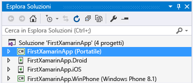
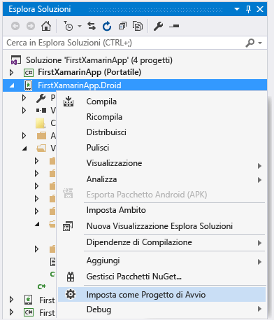
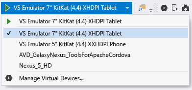
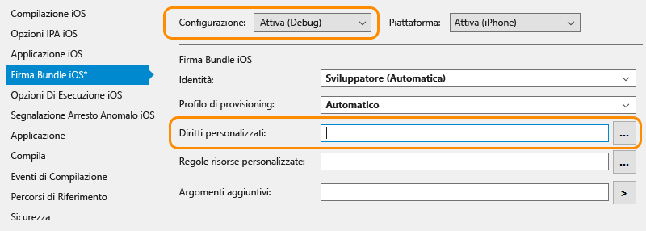

# Verificare l'ambiente Xamarin
Al termine dei programmi di installazione (vedere [Configurazione e installazione](../cross-platform/setup-and-install.md)), dedicare alcuni minuti per verificare che tutto sia pronto per le attività di sviluppo con Xamarin.  
  
 Dopo aver completato queste verifiche, è possibile eseguire una o entrambe le procedure dettagliate seguenti:  
  
-   [Nozioni di base sulla compilazione di app con Xamarin.Forms in Visual Studio](../cross-platform/learn-app-building-basics-with-xamarin-forms-in-visual-studio.md)  
  
-   [Creare app con interfaccia utente nativa con Xamarin in Visual Studio](../cross-platform/build-apps-with-native-ui-using-xamarin-in-visual-studio.md)  
  
## Tutte le piattaforme  
 Selezionare **Strumenti > Opzioni**, espandere **Xamarin > Altro**, quindi fare clic sul collegamento **Verifica ora** per gli aggiornamenti. Per evitare problemi relativi alle licenze precedenti, è necessario usare Xamarin 4.0.3.214 o versioni successive.  
  
 Creare quindi una nuova soluzione Xamarin in Visual Studio usando **File > Nuovo progetto**, quindi nella finestra di dialogo espandere **Modelli > Altri linguaggi > Visual C# > Multipiattaforma**, selezionare **App vuota (nativa portatile)** e fare clic su OK. Verrà creata una soluzione con un progetto di libreria di classi portabile condiviso e singoli progetti per Android, iOS e Windows:  
  
   
  
> [!NOTE]
>  Se i modelli non sono disponibili, vedere [Come trovare i modelli di progetto Xamarin mancanti](#missing) in fondo alla pagina.  
  
## Android  
  
1. Verificare di avere installato gli strumenti Android SDK più recenti, passando a **Strumenti > Android > Android SDK Manager** e installando la versione più recente dei componenti Android SDK Tools, Android SDK Platform Tools e Android SDK Build Tools. Tenere presente che non è sempre necessario installare il livello dell'API Android più recente. L'API richiesta dipende dal livello della piattaforma di destinazione. In generale, installando Xamarin verrà installato il livello della piattaforma richiesto.  

2.  Convalidare la finestra di progettazione Android: nel progetto Android in Esplora soluzioni aprire il file **Risorse > Layout > Main.axml**. Se non è possibile visualizzare direttamente questo file, cercarlo in Esplora soluzioni. È presente solo nel progetto Android e non nel progetto iOS.  
  
    - Se viene visualizzato un errore che indica che la versione installata di Android SDK non è aggiornata, fare clic su **Open Android SDK** nel messaggio per selezionare e installare la versione più recente disponibile degli strumenti SDK, come descritto in precedenza nel passaggio 1. 
  
3.  Convalidare la compilazione e il debug nell'emulatore (o nel dispositivo):  
  
    -   Fare clic con il pulsante destro del mouse sul progetto Android in Esplora soluzioni e scegliere **Imposta come progetto di avvio**.  
  
           
  
    -   Selezionare l'emulatore appropriato in base al sistema Android di destinazione. Se è disponibile un dispositivo di sviluppo Android collegato al computer, sarà incluso nell'elenco insieme agli emulatori:  
  
        -   Windows 8 e versioni successive: selezionare una destinazione **VS Emulator** dall'elenco a discesa di debug di Visual Studio come illustrato di seguito e avviare il debugger premendo **F5**. Per altri dettagli, vedere l'[introduzione a Visual Studio Emulator for Android](http://blogs.msdn.com/b/visualstudioalm/archive/2014/11/12/introducing-visual-studio-s-emulator-for-android.aspx) (blog di Visual Studio ALM). In caso di problemi di funzionamento dell'emulatore, vedere [Troubleshooting the Visual Studio Emulator for Android](../cross-platform/troubleshooting-the-visual-studio-emulator-for-android.md). È anche possibile creare nuovi profili di dispositivo per l'emulatore selezionando **Strumenti > Visual Studio Emulator for Android**.  
  
               
  
             Nota: se non viene visualizzata l'opzione di menu **Strumenti > Visual Studio Emulator for Android**, è possibile che l'emulatore stesso non sia installato. Passare a **Pannello di controllo > Programmi e funzionalità**, selezionare **Microsoft Visual Studio**, quindi fare clic su **Cambia** per eseguire nuovamente il programma di installazione. Fare clic su **Modifica** nel programma di installazione, selezionare la casella **Sviluppo di app per dispositivi mobili multipiattaforma > Microsoft Visual Studio Emulator for Android**, quindi fare clic su **Aggiorna**.  
  
        -   Per Windows 7 e versioni precedenti: selezionare invece Xamarin Player per Android nell'elenco a discesa e premere F5 per eseguire. Per informazioni dettagliate sul Xamarin Player, il relativo gestore dei dispositivi e suggerimenti per la risoluzione dei problemi, leggere [Xamarin Android Player](http://developer.xamarin.com/guides/android/getting_started/installation/android-player/) (xamarin.com).  
  
> [!NOTE]
>  In Visual Studio è possibile che sia presente il pulsante Android Emulator Manager (AVD) sulla barra degli strumenti (illustrato di seguito), che consente di aprire il gestore dei dispositivi usato specificatamente per la configurazione dell'emulatore Android di Google.  Ciò non ha alcun impatto su Visual Studio Emulator for Android o Xamarin Player, perché per ognuno esiste un gestore dei dispositivi specifico per la configurazione dei profili.  Per altri dettagli, vedere l'[introduzione a Visual Studio Emulator for Android](http://blogs.msdn.com/b/visualstudioalm/archive/2014/11/12/introducing-visual-studio-s-emulator-for-android.aspx) (blog di Visual Studio ALM) e [Xamarin Android Player](http://developer.xamarin.com/guides/android/getting_started/installation/android-player/) (xamarin.com).  
>   
  
## Windows Phone  
  
1.  Convalidare la finestra di progettazione di Windows Phone: nel progetto Windows Phone in Esplora soluzioni aprire il file **MainPage.XAML** .  
  
2.  Convalidare la compilazione e il debug nell'emulatore o in un dispositivo (nota: per questo passaggio è necessario avere a disposizione l'emulatore di Windows Phone installato tramite l'installazione di Visual Studio oppure un dispositivo con tethering):  
  
    -   Fare clic con il pulsante destro del mouse sul progetto Windows Phone in Esplora soluzioni e scegliere **Imposta come progetto di avvio**.  
  
    -   Selezionare una destinazione **Emulator 8.1** o un dispositivo collegato nell'elenco a discesa di debug di Visual Studio come illustrato di seguito e avviare il debugger premendo F5.  
  
           
  
    -   In caso di problemi di funzionamento dell'emulatore, vedere [Risoluzione dei problemi relativi all'emulatore Windows Phone 8](https://msdn.microsoft.com/library/windows/apps/jj681694.aspx).  
  
## iOS  
  
1.  Assicurarsi che il Mac sia disponibile in rete e associato a Visual Studio, come descritto nella pagina relativa alla [connessione al Mac](http://developer.xamarin.com/guides/ios/getting_started/installation/windows/xamarin-mac-agent/) (xamarin.com).  
  
2.  Convalidare la finestra di progettazione dello storyboard: nel progetto iOS in Esplora soluzioni aprire il file **Main.storyboard** . In questo caso, Visual Studio ospita la finestra di progettazione, che è in esecuzione in remoto sul Mac.  
  
3.  Convalidare la compilazione e il debug:  
  
    1.  Fare clic con il pulsante destro del mouse sul progetto iOS in Esplora soluzioni e scegliere **Imposta come progetto di avvio**.  
  
    2.  Selezionare la destinazione **iPhoneSimulator** nell'elenco a discesa di compilazione di Visual Studio come illustrato di seguito oppure la destinazione **iPhone** per un dispositivo con tethering. Se non è elencato alcun simulatore, avviare Xcode nel Mac, selezionare **Xcode->Preferences** e fare clic su **Download**. In **Components** dovrebbero essere visualizzate le versioni del simulatore disponibili per il download. Altre istruzioni per il debug sono disponibili nella pagina relativa al [debug](https://developer.xamarin.com/guides/ios/deployment,_testing,_and_metrics/debugging_in_xamarin_ios/#Debugging_on_the_Simulator) di Xamarin (xamarin.com).  
  
           
  
    3.  Selezionare una destinazione iPhone dall'elenco a discesa di debug di Visual Studio come illustrato di seguito e avviare il debugger premendo F5. Verrà avviato il simulatore nel Mac, in cui è possibile interagire con l'app, mentre viene eseguito il debug in Visual Studio. Se un iPhone o iPad fisico è connesso al Mac, il dispositivo verrà visualizzato qui e potrà essere selezionato. Se non è elencato alcun dispositivo o simulatore, verificare la connessione al Mac facendo riferimento all'argomento indicato nel passaggio 1 sopra o passando a **Strumenti** >**iOS** >**Xamarin Mac Agent**  
  
           
  
    4.  Se si verificano problemi di connessione al Mac, leggere la pagina dedicata alla [risoluzione dei problemi di connessione](http://developer.xamarin.com/guides/ios/getting_started/installation/windows/xamarin-mac-agent/xma-troubleshooting/) (xamarin.com).  
  
    5.  Se viene visualizzato un errore che segnala che non è disponibile alcun profilo di provisioning installato corrispondente alle chiavi di firma iOS installate, eseguire queste operazioni:  
  
        -   Verificare che l'account Id Apple sia aggiunto in Xcode nel Mac come descritto nell'articolo relativo all' [aggiunta dell'account personale a Xcode](https://developer.apple.com/library/content/documentation/IDEs/Conceptual/AppStoreDistributionTutorial/AddingYourAccounttoXcode/AddingYourAccounttoXcode.html#//apple_ref/doc/uid/TP40013839-CH40-SW1) (apple.com).  Dopo aver aggiunto l'account, assicurarsi di riavviare sia Visual Studio che Xcode.  
  
               
  
        -   Nella scheda relativa alla firma del bundle iOS nelle proprietà del progetto iOS verificare che il campo Custom Entitlement sia vuoto per la configurazione di debug attiva.  Nota: è consigliabile provare a rimuovere questa impostazione solo se viene segnalato l'errore precedente.  
  
##   Come trovare i modelli di progetto Xamarin mancanti  
 I modelli possono risultare mancanti se si installa Xamarin direttamente dal sito Web e si dispone di Visual Studio 2013 e Visual Studio 2015 installati side-by-side. Per risolvere il problema, è sufficiente installare la funzionalità **Xamarin per Visual Studio 2015** nel programma di installazione di Xamarin.  
  
1.  Nel Pannello di controllo aprire **Programmi e funzionalità**, scegliere l'elemento **Xamarin** e quindi fare clic su **Cambia**.  
  
2.  Nell'Installazione guidata di Xamarin visualizzata fare clic su **Avanti** e quindi su **Modifica**.  
  
3.  Nell'elenco di funzionalità facoltative da installare espandere **Xamarin per Visual Studio 2015**, scegliere **Installazione su disco rigido locale**e quindi fare clic su **Avanti** per procedere con l'aggiunta della funzionalità.
