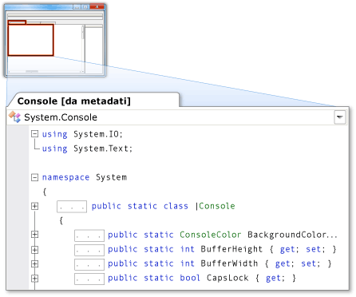

# Metadati come origine
[!INCLUDE[vs2017banner](../code-quality/includes/vs2017banner.md)]

L'opzione Metadati come origine consente di visualizzare i metadati visualizzati come codice sorgente C\# in un buffer di sola lettura. Viene abilitata una visualizzazione delle dichiarazioni di tipi e membri \(senza alcuna implementazione\). È possibile visualizzare i metadati come origine eseguendo il comando **Vai a definizione** per i tipi o i membri il cui codice sorgente non è disponibile nel progetto o nella soluzione.  
  
> [!NOTE]
>  Quando si prova a eseguire il comando **Vai a definizione** per i tipi o i membri contrassegnati come interni, l'ambiente di sviluppo integrato \(IDE\) non visualizza i metadati come origine, indipendentemente dal fatto che l'assembly di riferimento sia o meno un elemento friend.  
  
 È possibile visualizzare i metadati come origine nell'editor del codice o nella finestra **Definizione codice**.  
  
## Visualizzazione dei metadati come origine nell'editor del codice  
 Quando si esegue il comando **Vai a definizione** per un elemento il cui codice sorgente non è disponibile, nell'editor del codice viene visualizzato un documento a schede che contiene una visualizzazione dei metadati dell'elemento visualizzati come origine. Il nome del tipo, seguito da **\[da metadati\]**, viene visualizzato nella scheda del documento.  
  
 Ad esempio, se si esegue il comando **Vai a definizione** per <xref:System.Console>, i metadati per <xref:System.Console> vengono visualizzati nell'editor del codice come codice sorgente C\#, simile alla relativa dichiarazione, ma senza implementazione.  
  
   
  
## Visualizzazione dei metadati come origine nella finestra Definizione codice  
 Quando la finestra **Definizione codice** è attiva o visibile, nell'IDE viene eseguito automaticamente il comando **Vai a definizione** per gli elementi sotto il cursore nell'editor del codice e per gli elementi selezionati in **Visualizzazione classi** o **Visualizzatore oggetti**. Se il codice sorgente non è disponibile per l'elemento, l'IDE visualizza i metadati dell'elemento come origine nella finestra **Definizione codice**.  
  
 Ad esempio, se si posiziona il cursore all'interno della parola <xref:System.Console> nell'editor del codice, i metadati per <xref:System.Console> vengono visualizzati come origine nella finestra **Definizione codice**. L'origine è simile alla dichiarazione <xref:System.Console>, ma senza alcuna implementazione.  
  
 Per visualizzare la dichiarazione di un elemento visualizzato nella finestra **Definizione codice**, fare clic con il pulsante destro del mouse su **Vai a definizione**.