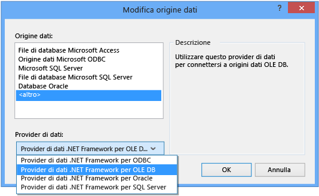
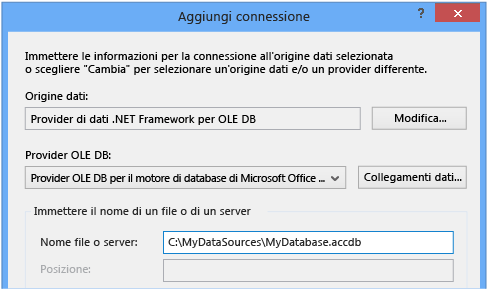
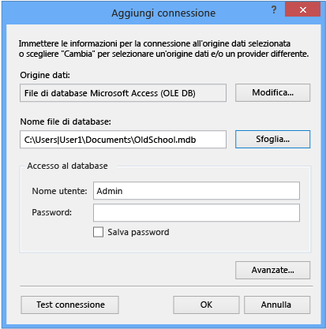

# Procedura dettagliata: connessione ai dati in un database di Access (Windows Form)
È possibile connettersi a un database Access \(file con estensione mdf o accdb\) tramite Visual Studio.  Dopo avere definito la connessione, i dati vengono visualizzati nella finestra **Origine dati** da cui è possibile trascinare tabelle o visualizzazioni nei form.  Se si desidera comprendere il modo in cui il sistema di progetto in Visual Studio gestisce i file di database locali, vedere [Procedura: gestire file di dati locali nel progetto](../data-tools/how-to-manage-local-data-files-in-your-project.md).  
  
## Prerequisiti  
 Per eseguire queste procedure, è necessario un progetto di applicazione Windows Form e un database Access \(file con estensione accdb\) o un database Access 2000\-2003 \(file con estensione mdb\).  Attenersi alla procedura che corrisponde al tipo di file utilizzato.  
  
## Creazione del dataset per un file con estensione accdb  
 È possibile connettersi a database creati in Access 2013, Office 365, Access 2010 o Access 2007 tramite la procedura seguente.  
  
#### Per creare il dataset  
  
1.  Aprire l'applicazione Windows Form a cui si desidera connettere i dati.  
  
2.  Nel menu **Visualizza** scegliere **Altre finestre** \> **Origini dati**.  
  
       
  
3.  Nella finestra **Origini dati** fare clic su **Aggiungi nuova origine dati**.  
  
       
  
4.  Nella pagina **Seleziona un tipo di origine dati** scegliere **Database**, quindi scegliere **Avanti**.  
  
5.  Nella pagina **Scegli modello database** scegliere **Dataset**, quindi scegliere **Avanti**.  
  
6.  Nella pagina **Seleziona connessione dati** selezionare **Nuova connessione** per configurare una nuova connessione dati.  
  
7.  Modificare il valore di **Origine dati** in **Provider di dati .NET Framework per OLE DB**.  
  
       
  
    > [!IMPORTANT]
    >  Anche se un'origine dati di **File di database Microsoft Access \(OLE DB\)** può sembrare la scelta corretta, si utilizza il tipo di origine dati solo per i file di database con estensione mdb.  
  
8.  In **Provider OLE DB** scegliere **Provider OLE DB per il motore di database di Microsoft Office 12.0 Access**.  
  
       
  
9. In **Nome file o server** specificare il percorso e il nome del file con estensione accdb a cui si desidera connettersi, quindi scegliere **OK**.  
  
    > [!NOTE]
    >  Se al file di database sono associati un nome utente e una password, specificarli e quindi scegliere **OK**.  
  
10. Nella pagina **Seleziona connessione dati** scegliere **Avanti**.  
  
11. Nella pagina  **Salva stringa di connessione nel file di configurazione dell'applicazione** scegliere **Avanti**.  
  
12. Espandere il nodo **Tabelle** nella pagina **Seleziona oggetti di database**.  
  
13. Scegliere le tabelle o le visualizzazioni da includere nel dataset, quindi scegliere **Fine**.  
  
     Il dataset viene aggiunto al progetto e le tabelle e le visualizzazioni vengono mostrate nella finestra **Origini dati**.  
  
## Creazione del dataset per un file con estensione mdb  
 Il dataset viene creato mediante l'esecuzione della **Configurazione guidata origine dati**.  
  
#### Per creare il dataset  
  
1.  Aprire l'applicazione Windows Form a cui si desidera connettere i dati.  
  
2.  Nel menu **Visualizza** scegliere **Altre finestre** \> **Origini dati**.  
  
       
  
3.  Nella finestra **Origini dati** fare clic su **Aggiungi nuova origine dati**.  
  
       
  
4.  Nella pagina **Seleziona un tipo di origine dati** scegliere **Database**, quindi scegliere **Avanti**.  
  
5.  Nella pagina **Scegli modello database** scegliere **Dataset**, quindi scegliere **Avanti**.  
  
6.  Nella pagina **Seleziona connessione dati** selezionare **Nuova connessione** per configurare una nuova connessione dati.  
  
7.  Se il valore di **Origine dati** non è **File di database Microsoft Access \(OLE DB\)**, scegliere **Modifica** per aprire la finestra di dialogo **Modifica origine dati**, scegliere **File di database Microsoft Access**, quindi scegliere **OK**.  
  
8.  In **Nome file di database** specificare il percorso e il nome del file con estensione mdb a cui si desidera connettersi, quindi scegliere **OK**.  
  
       
  
9. Nella pagina **Seleziona connessione dati** scegliere **Avanti**.  
  
10. Nella pagina  **Salva stringa di connessione nel file di configurazione dell'applicazione** scegliere **Avanti**.  
  
11. Espandere il nodo **Tabelle** nella pagina **Seleziona oggetti di database**.  
  
12. Scegliere le tabelle o le visualizzazioni da includere nel dataset, quindi scegliere **Fine**.  
  
     Il dataset viene aggiunto al progetto e le tabelle e le visualizzazioni vengono mostrate nella finestra **Origini dati**.  
  
## Sicurezza  
 L'archiviazione di informazioni riservate, ad esempio una password, può avere implicazioni sulla sicurezza dell'applicazione.  L'autenticazione di Windows, detta anche sicurezza integrata, consente di controllare l'accesso a un database in modo più sicuro.  Per ulteriori informazioni, vedere [Protezione delle informazioni di connessione](../Topic/Protecting%20Connection%20Information.md).  
  
## Passaggi successivi  
 Il dataset appena creato sarà ora disponibile nella finestra **Origini dati**.  È possibile a questo punto eseguire una delle attività riportate di seguito.  
  
-   Selezionare elementi nella finestra **Origini dati** e trascinarli nel proprio form \(vedere [Associazione di controlli Windows Form ai dati in Visual Studio](../data-tools/bind-windows-forms-controls-to-data-in-visual-studio.md)\).  
  
-   Aprire l'origine dati in [Progettazione DataSet](../data-tools/creating-and-editing-typed-datasets.md) per aggiungere o modificare gli oggetti che costituiscono il dataset.  
  
-   Aggiungere logica di convalida all'evento <xref:System.Data.DataTable.ColumnChanging> o <xref:System.Data.DataTable.RowChanging> delle tabelle dati nel dataset \(vedere [Convalida dei dati nei dataset](../data-tools/validate-data-in-datasets.md)\).  
  
## Vedere anche  
 [Connessione ai dati in Visual Studio](../data-tools/connecting-to-data-in-visual-studio.md)   
 [Preparazione dell'applicazione al ricevimento di dati](../Topic/Preparing%20Your%20Application%20to%20Receive%20Data.md)   
 [Recupero di dati nell'applicazione](../data-tools/fetching-data-into-your-application.md)   
 [Associazione di controlli ai dati in Visual Studio](../data-tools/bind-controls-to-data-in-visual-studio.md)   
 [Modifica di dati nell'applicazione](../data-tools/editing-data-in-your-application.md)   
 [Convalida dei dati](../Topic/Validating%20Data.md)   
 [Salvataggio di dati](../data-tools/saving-data.md)   
 [Procedure dettagliate relative ai dati](../Topic/Data%20Walkthroughs.md)