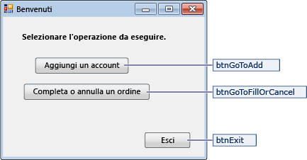
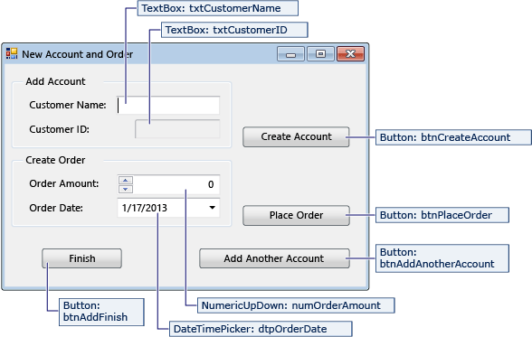
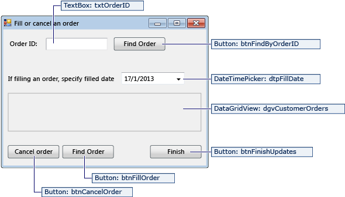

# Procedura dettagliata: creazione di un&#39;applicazione dati semplice tramite ADO.NET
Quando si crea un'applicazione che modifica i dati in un database, è possibile eseguire attività di base, ad esempio la definizione delle stringhe di connessione, l'inserimento di dati e l'esecuzione di stored procedure.  Fare riferimento a questo argomento per scoprire come interagire con un database dall'interno di una semplice applicazione Windows Form usando Visual C\# o Visual Basic e ADO.NET.  
  
> [!IMPORTANT]
>  Per semplificare il codice, non include la gestione delle eccezioni dell'ambiente di produzione.  
  
 **Contenuto dell'argomento**  
  
-   [Impostare il database di esempio](../data-tools/create-a-simple-data-application-by-using-adonet.md#BKMK_setupthesampledatabase)  
  
-   [Creare i form e aggiungere i controlli](../data-tools/create-a-simple-data-application-by-using-adonet.md#BKMK_createtheformsandaddcontrols)  
  
-   [Archiviare la stringa di connessione](../data-tools/create-a-simple-data-application-by-using-adonet.md#BKMK_storetheconnectionstring)  
  
-   [Recuperare la stringa di connessione](../data-tools/create-a-simple-data-application-by-using-adonet.md#BKMK_retrievetheconnectionstring)  
  
-   [Scrivere il codice per i form](../data-tools/create-a-simple-data-application-by-using-adonet.md#BKMK_writethecodefortheforms)  
  
-   [Eseguire il test dell'applicazione](../data-tools/create-a-simple-data-application-by-using-adonet.md#BKMK_testyourapplication)  
  
## Prerequisiti  
 Per creare l'applicazione, è necessario disporre di:  
  
-   Visual Studio 2012 con Update 1 o [!INCLUDE[vs_dev12](../data-tools/includes/vs_dev12_md.md)]  
  
-   SQL Server 2012 Express LocalDB  
  
-   Il database di esempio di piccole dimensioni creato eseguendo i passaggi descritti in [Procedura dettagliata: creazione di un database semplice di piccole dimensioni](../data-tools/create-a-sql-database-by-using-a-script.md).  
  
-   La stringa di connessione per il database dopo averla configurata.  Per trovare questi valori, aprire **Esplora oggetti di SQL Server**, visualizzare il menu di scelta rapida per il database, scegliere **Proprietà** e passare alla proprietà **Stringa di connessione**.  
  
 In questo argomento si presuppone una certa familiarità con la funzionalità di base dell'IDE di Visual Studio e la capacità di creare un'applicazione Windows Form, aggiungere form a tale progetto, inserire i pulsanti e altri controlli presenti in tali form, impostare le proprietà di tali controlli e semplici eventi di codice.  Se non si ha familiarità con queste attività, si consiglia di completare le [Guida introduttiva a Visual C\# e Visual Basic](../ide/getting-started-with-visual-csharp-and-visual-basic.md) prima di iniziare questo argomento.  
  
##  <a name="BKMK_setupthesampledatabase"></a> Impostare il database di esempio  
 Il database di esempio per questa procedura dettagliata è costituito dalle tabelle Customer e Orders.  Le tabelle inizialmente non contengono dati. I dati verranno aggiunti quando si esegue l'applicazione creata.  Il database include inoltre cinque stored procedure semplici.  [Procedura dettagliata: creazione di un database semplice di piccole dimensioni](../data-tools/create-a-sql-database-by-using-a-script.md) contiene uno script Transact\-SQL che crea le tabelle, le chiavi primarie ed esterne, i vincoli e le stored procedure.  
  
##  <a name="BKMK_createtheformsandaddcontrols"></a> Creare i form e aggiungere i controlli  
  
1.  Creare un progetto per un'applicazione Windows Form e denominarlo `SimpleDataApp`.  
  
     Visual Studio crea il progetto e diversi file, tra cui un form Windows vuoto denominato Form1.  
  
2.  Aggiungere due form Windows al progetto in modo da disporre di tre form e assegnare i nomi seguenti.  
  
    -   Navigazione  
  
    -   NewCustomer  
  
    -   FillOrCancel  
  
3.  Per ogni form, aggiungere caselle di testo, pulsanti e altri controlli come illustrato nelle figure seguenti.  Per ciascun controllo, impostare le proprietà descritte nelle tabelle.  
  
    > [!NOTE]
    >  La casella di gruppo e i controlli Label migliorano la leggibilità, ma non vengono usati nel codice.  
  
 **Form Navigazione**  
  
   
  
|Controlli per il form Navigazione|Proprietà|  
|---------------------------------------|---------------|  
|Pulsante|Name \= btnGoToAdd|  
|Pulsante|Name \= btnGoToFillOrCancel|  
|Pulsante|Name \= btnExit|  
  
 **Form NewCustomer**  
  
   
  
|Controlli per il form NewCustomer|Proprietà|  
|---------------------------------------|---------------|  
|TextBox|Name \= txtCustomerName|  
|TextBox|Name \= txtCustomerID<br /><br /> Readonly \= True|  
|Pulsante|Name \= btnCreateAccount|  
|NumericUpdown|DecimalPlaces \= 0<br /><br /> Maximum \= 5000<br /><br /> Name \= numOrderAmount|  
|DateTimePicker|Format \= Short<br /><br /> Nome \= dtpOrderDate|  
|Pulsante|Name \= btnPlaceOrder|  
|Pulsante|Name \= btnAddAnotherAccount|  
|Pulsante|Name \= btnAddFinish|  
  
 **Form FillOrCancel**  
  
   
  
|Controlli del form FillOrCancel|Proprietà|  
|-------------------------------------|---------------|  
|TextBox|Name \= txtOrderID|  
|Pulsante|Name \= btnFindByOrderID|  
|DateTimePicker|Format \= Short<br /><br /> Name \= dtpFillDate|  
|DataGridView|Name \= dgvCustomerOrders<br /><br /> Readonly \= True<br /><br /> RowHeadersVisible \= False|  
|Pulsante|Name \= btnCancelOrder|  
|Pulsante|Name \= btnFillOrder|  
|Pulsante|Name \= btnFinishUpdates|  
  
##  <a name="BKMK_storetheconnectionstring"></a> Archiviare la stringa di connessione  
 Quando l'applicazione tenta di aprire una connessione al database, l'applicazione deve disporre dell'accesso alla stringa di connessione.  Per evitare di immettere manualmente la stringa in ogni form, archiviare la stringa nel file di configurazione dell'applicazione nel progetto e creare un metodo che restituisce la stringa quando viene chiamata da qualsiasi form nell'applicazione.  
  
1.  Aprire il menu di scelta rapida per il progetto, quindi scegliere **Proprietà**.  
  
2.  Nel pannello sinistro della finestra **Proprietà** scegliere la scheda **Impostazioni**.  
  
3.  Nella colonna **Nome** immettere `connString`.  
  
4.  Nell'elenco **Tipo** scegliere **\(Stringa di connessione\)**.  
  
5.  Nell'elenco **Ambito** scegliere **Applicazione**.  
  
6.  Nel colonna **Valore** immettere la stringa di connessione e quindi salvare le modifiche.  
  
##  <a name="BKMK_retrievetheconnectionstring"></a> Recuperare la stringa di connessione  
  
1.  Sulla barra dei menu scegliere **Progetto**, **Aggiungi riferimento** e quindi aggiungere un riferimento a System.Configuration.dll.  
  
2.  Sulla barra dei menu scegliere **Progetto**, **Aggiungi classe** per aggiungere un file di classe al progetto e quindi denominare il file `Utilità`.  
  
     Visual Studio crea il file e lo visualizza in **Esplora soluzioni**.  
  
3.  Nel file Utilità sostituire il codice segnaposto con il codice seguente.  Si noti che i commenti numerati, ovvero quelli preceduti da Util\-, identificano le sezioni del codice.  Nella tabella che segue il codice chiama i punti chiave.  
  
    ```c#  
    using System;  
    using System.Collections.Generic;  
    using System.Linq;  
    using System.Text;  
    using System.Threading.Tasks;  
    //Util-1 More namespaces.  
    using System.Configuration;   
  
    namespace SimpleDataApp  
    {  
        internal class Utility  
        {  
  
            //Get the connection string from App config file.  
            internal static string GetConnectionString()  
            {  
                //Util-2 Assume failure.  
                string returnValue = null;  
  
                //Util-3 Look for the name in the connectionStrings section.  
                ConnectionStringSettings settings =  
                ConfigurationManager.ConnectionStrings["SimpleDataApp.Properties.Settings.connString"];  
  
                //If found, return the connection string.  
                if (settings != null)  
                    returnValue = settings.ConnectionString;  
  
                return returnValue;  
            }  
        }  
    }  
    ```  
  
    ```vb  
    Imports System  
    Imports System.Collections.Generic  
    Imports System.Linq  
    Imports System.Text  
    Imports System.Threading.Tasks  
    ' Util-1 More namespaces.  
    Imports System.Configuration  
  
    Namespace SimpleDataApp  
        Friend Class Utility  
  
            ' Get connection string from App config file.  
            Friend Shared Function GetConnectionString() As String  
  
                ' Util-2 Assume failure.  
                Dim returnValue As String = Nothing  
  
                ' Util-3 Look for the name in the connectionStrings section.  
                Dim settings As ConnectionStringSettings = ConfigurationManager.ConnectionStrings("SimpleDataApp.My.MySettings.connString")  
  
                ' If found, return the connection string.  
                If settings IsNot Nothing Then  
                    returnValue = settings.ConnectionString  
                End If  
  
                Return returnValue  
            End Function  
        End Class  
    End Namespace  
    ```  
  
    |Commento|Descrizione|  
    |--------------|-----------------|  
    |Util\-1|Aggiungere lo spazio dei nomi System. Configuration.|  
    |Util\-2|Definire una variabile `returnValue` e inizializzarla su `null` \(C\#\) o `Nothing` \(Visual Basic\).|  
    |Util\-3|Anche se è stato immesso `connString` come nome della stringa di connessione nella finestra **Proprietà** , è necessario specificare `"SimpleDataApp.Properties.Settings.connString"` \(C\#\) o `"SimpleDataApp.My.MySettings.connString"` \(Visual Basic\) nel codice.|  
  
##  <a name="BKMK_writethecodefortheforms"></a> Scrivere il codice per i form  
 Questa sezione contiene una breve panoramica sulle funzionalità di ciascun form e una descrizione del codice necessario per crearlo.  I commenti numerati identificano le sezioni del codice.  
  
### Form Navigazione  
 Quando si esegue l'applicazione, verrà visualizzato il form Navigazione.  Il pulsante **Aggiungi un account** consente di aprire il form NewCustomer.  Il pulsante **Completare o annullare gli ordini** consente di aprire il form FillOrCancel.  Il pulsante **Esci** consente di chiudere l'applicazione.  
  
#### Impostare il form Navigazione come form di avvio  
 Se si usa C\#, in **Esplora soluzioni**, aprire Program.cs e modificare la riga `Application.Run` nel seguente modo: `Application.Run(new Navigation());`  
  
 Se si usa Visual Basic, in **Esplora soluzioni**, aprire la finestra **Proprietà**, scegliere la scheda **Applicazione** e quindi scegliere SimpleDataApp.Navigation nell'elenco **Form di avvio**.  
  
#### Creare i gestori eventi  
 Creare gestori dell'evento Click vuoti per i tre pulsanti presenti nel form.  Vedere [Procedura: creare gestori eventi predefiniti in Progettazione Windows Form](http://msdn.microsoft.com/it-it/757bcc16-1dc2-4d68-b115-ac0f53f05c8d).  
  
#### Creare codice per il form Navigazione  
 Nel form Navigazione sostituire il codice esistente con il codice seguente.  
  
```c#  
using System;  
using System.Collections.Generic;  
using System.ComponentModel;  
using System.Data;  
using System.Drawing;  
using System.Linq;  
using System.Text;  
using System.Threading.Tasks;  
using System.Windows.Forms;  
  
namespace SimpleDataApp  
{  
    public partial class Navigation : Form  
    {  
        public Navigation()  
        {  
            InitializeComponent();  
        }  
  
        //Open the NewCustomer form as a dialog box, which will return focus to the calling form when it closes.  
        private void btnGoToAdd_Click(object sender, EventArgs e)  
        {  
            Form frm = new NewCustomer();  
            frm.Show();  
        }  
  
        //Open the FillorCancel form as a dialog box.  
        private void btnGoToFillOrCancel_Click(object sender, EventArgs e)  
        {  
            Form frm = new FillOrCancel();  
            frm.ShowDialog();  
        }  
  
        //Close the application, not just the Navigation form.  
        private void btnExit_Click(object sender, EventArgs e)  
        {  
            this.Close();  
        }  
    }  
}  
```  
  
```vb  
Imports System  
Imports System.Collections.Generic  
Imports System.ComponentModel  
Imports System.Data  
Imports System.Drawing  
Imports System.Linq  
Imports System.Text  
Imports System.Threading.Tasks  
Imports System.Windows.Forms  
  
Namespace SimpleDataApp  
    Partial Public Class Navigation  
        Inherits Form  
        Public Sub New()  
            InitializeComponent()  
        End Sub  
  
        ' Open the NewCustomer form as a dialog box, which will return focus to the calling form when it closes.  
        Private Sub btnGoToAdd_Click() Handles btnGoToAdd.Click  
            Dim frm As Form = New NewCustomer()  
            frm.Show()  
        End Sub  
  
        ' Open the FillorCancel form as a dialog box.  
        Private Sub btnGoToFillOrCancel_Click() Handles btnGoToFillOrCancel.Click  
            Dim frm As Form = New FillOrCancel()  
            frm.ShowDialog()  
        End Sub  
  
        ' Close the application, not just the Navigation form.  
        Private Sub btnExit_Click() Handles btnExit.Click  
            Me.Close()  
        End Sub  
    End Class  
End Namespace  
  
```  
  
### Form NewCustomer  
 Quando si immette un nome di cliente e quindi si sceglie il pulsante **Create Account**, il form NewCustomer crea un account cliente e SQL Server restituisce un valore IDENTITY come nuovo numero di account.  È quindi possibile impostare un ordine per il nuovo account specificando una quantità e una data per l'ordine e scegliendo il pulsante **Place Order**.  
  
#### Creare i gestori eventi  
 Creare un gestore dell'evento Click vuoto per ogni pulsante del form.  
  
#### Creare codice per il form NewCustomer  
 Aggiungere il codice seguente al form NewCustomer:  Scorrere ogni blocco di codice usando i commenti numerati e la tabella dopo il codice.  
  
```c#  
using System;  
using System.Collections.Generic;  
using System.ComponentModel;  
using System.Data;  
using System.Drawing;  
using System.Linq;  
using System.Text;  
using System.Threading.Tasks;  
using System.Windows.Forms;  
//NC-1 More namespaces.  
using System.Data.SqlClient;  
using System.Configuration;  
  
namespace SimpleDataApp  
{  
    public partial class NewCustomer : Form  
    {  
        //NC-2 Storage for IDENTITY values returned from database.  
        private int parsedCustomerID;  
        private int orderID;  
  
        //NC-3 Specify a connection string.  
        string connstr = SimpleDataApp.Utility.GetConnectionString();  
  
        public NewCustomer()  
        {  
            InitializeComponent();  
        }  
  
        //NC-4 Create account.  
        private void btnCreateAccount_Click(object sender, EventArgs e)  
        {  
            //NC-5 Set up and run stored procedure only if Customer Name is present.  
            if (isCustomerName())  
            {  
  
                //NC-6 Create the connection.  
                SqlConnection conn = new SqlConnection(connstr);  
  
                //NC-7 Create a SqlCommand, and identify it as a stored procedure.  
                SqlCommand cmdNewCustomer = new SqlCommand("Sales.uspNewCustomer", conn);  
                cmdNewCustomer.CommandType = CommandType.StoredProcedure;  
  
                //NC-8 Add input parameter from the stored procedure and specify what to use as its value.  
                cmdNewCustomer.Parameters.Add(new SqlParameter("@CustomerName", SqlDbType.NVarChar, 40));  
                cmdNewCustomer.Parameters["@CustomerName"].Value = txtCustomerName.Text;  
  
                //NC-9 Add output parameter.  
                cmdNewCustomer.Parameters.Add(new SqlParameter("@CustomerID", SqlDbType.Int));  
                cmdNewCustomer.Parameters["@CustomerID"].Direction = ParameterDirection.Output;  
  
                //NC-10 try-catch-finally  
                try  
                {  
                    //NC-11 Open the connection.  
                    conn.Open();  
  
                    //NC-12 Run the stored procedure.  
                    cmdNewCustomer.ExecuteNonQuery();  
  
                    //NC-13 Customer ID is an IDENTITY value from the database.   
                    this.parsedCustomerID = (int)cmdNewCustomer.Parameters["@CustomerID"].Value;  
                    this.txtCustomerID.Text = Convert.ToString(parsedCustomerID);  
  
                }  
                catch  
                {  
                    //NC-14 A simple catch.  
  
                    MessageBox.Show("Customer ID was not returned. Account could not be created.");  
                }  
                finally  
                {  
                    //NC-15 Close the connection.  
                    conn.Close();  
                }  
            }  
        }  
  
        //NC-16 Verify that Customer Name is present.  
        private bool isCustomerName()  
        {  
            if (txtCustomerName.Text == "")  
            {  
                MessageBox.Show("Please enter a name.");  
                return false;  
            }  
            else  
            {  
                return true;  
            }  
        }  
  
        //NC-17 Place order.  
        private void btnPlaceOrder_Click(object sender, EventArgs e)  
        {  
            //NC-18 Set up and run stored procedure only if required input is present.  
            if (isPlaceOrderReady())  
            {  
                // Create the connection.  
                SqlConnection conn = new SqlConnection(connstr);  
  
                //NC-19 Create SqlCommand and identify it as a stored procedure.  
                SqlCommand cmdNewOrder = new SqlCommand("Sales.uspPlaceNewOrder", conn);  
                cmdNewOrder.CommandType = CommandType.StoredProcedure;  
  
                //NC-20 @CustomerID, which was an output parameter from uspNewCustomer.  
                cmdNewOrder.Parameters.Add(new SqlParameter("@CustomerID", SqlDbType.Int));  
                cmdNewOrder.Parameters["@CustomerID"].Value = this.parsedCustomerID;  
  
                //NC-21 @OrderDate.  
                cmdNewOrder.Parameters.Add(new SqlParameter("@OrderDate", SqlDbType.DateTime, 8));  
                cmdNewOrder.Parameters["@OrderDate"].Value = dtpOrderDate.Value;  
  
                //NC-22 @Amount.  
                cmdNewOrder.Parameters.Add(new SqlParameter("@Amount", SqlDbType.Int));  
                cmdNewOrder.Parameters["@Amount"].Value = numOrderAmount.Value;  
  
                //NC-23 @Status. For a new order, the status is always O (open)  
                cmdNewOrder.Parameters.Add(new SqlParameter("@Status", SqlDbType.Char, 1));  
                cmdNewOrder.Parameters["@Status"].Value = "O";  
  
                //NC-24 Add return value for stored procedure, which is the orderID.  
                cmdNewOrder.Parameters.Add(new SqlParameter("@RC", SqlDbType.Int));  
                cmdNewOrder.Parameters["@RC"].Direction = ParameterDirection.ReturnValue;  
  
                //try – catch - finally  
                try  
                {  
                    //Open connection.  
                    conn.Open();  
  
                    //Run the stored procedure.  
                    cmdNewOrder.ExecuteNonQuery();  
  
                    //NC-25 Display the order number.  
                    this.orderID = (int)cmdNewOrder.Parameters["@RC"].Value;  
                    MessageBox.Show("Order number " + this.orderID + " has been submitted.");  
                }  
                catch  
                {  
                    //A simple catch.  
                    MessageBox.Show("Order could not be placed.");  
                }  
                finally  
                {  
                    //Close connection.  
                    conn.Close();  
                }  
            }  
        }  
  
        //NC-26 Verify that order data is ready.  
        private bool isPlaceOrderReady()  
        {  
            // Verify that CustomerID is present.  
            if (txtCustomerID.Text == "")  
            {  
                MessageBox.Show("Please create customer account before placing order.");  
                return false;  
            }  
  
            // Verify that Amount isn't 0.   
            else if ((numOrderAmount.Value < 1))  
            {  
                MessageBox.Show("Please specify an order amount.");  
                return false;  
            }  
            else  
            {  
                // Order can be submitted.  
                return true;  
            }  
        }  
  
        //NC-27 Reset the form for another new account  
        private void btnAddAnotherAccount_Click(object sender, EventArgs e)  
        {  
            this.ClearForm();  
        }  
  
        //NC-28 Clear values from controls  
        private void ClearForm()  
        {  
            txtCustomerName.Clear();  
            txtCustomerID.Clear();  
            dtpOrderDate.Value = DateTime.Now;  
            numOrderAmount.Value = 0;  
            this.parsedCustomerID = 0;  
        }  
  
        //NC-29 Close the form.  
        private void btnAddFinish_Click(object sender, EventArgs e)  
        {  
            this.Close();  
        }  
  
    }  
}  
  
```  
  
```vb  
Imports System  
Imports System.Collections.Generic  
Imports System.ComponentModel  
Imports System.Data  
Imports System.Drawing  
Imports System.Linq  
Imports System.Text  
Imports System.Threading.Tasks  
Imports System.Windows.Forms  
' NC-1 More namespaces.  
Imports System.Data.SqlClient  
Imports System.Configuration  
  
Namespace SimpleDataApp  
    Partial Public Class NewCustomer  
        Inherits Form  
  
        ' NC-2 Storage for IDENTITY values returned from database.  
        Private parsedCustomerID As Integer  
        Private orderID As Integer  
  
        ' NC-3 Specify a connection string.  
        Private connstr As String = SimpleDataApp.Utility.GetConnectionString()  
  
        Public Sub New()  
            InitializeComponent()  
        End Sub  
  
        ' NC-4 Create account.  
        Private Sub btnCreateAccount_Click() Handles btnCreateAccount.Click  
  
            ' NC-5 Set up and run stored procedure only if Customer Name is present.  
            If isCustomerName() Then  
  
                ' NC-6 Create the connection.  
                Dim conn As New SqlConnection(connstr)  
  
                ' NC-7 Create a SqlCommand, and identify it as a stored procedure.  
                Dim cmdNewCustomer As New SqlCommand("Sales.uspNewCustomer", conn)  
                cmdNewCustomer.CommandType = CommandType.StoredProcedure  
  
                ' NC-8 Add input parameter from the stored procedure and specify what to use as its value.  
                cmdNewCustomer.Parameters.Add(New SqlParameter("@CustomerName", SqlDbType.NVarChar, 40))  
                cmdNewCustomer.Parameters("@CustomerName").Value = txtCustomerName.Text  
  
                ' NC-9 Add output parameter.  
                cmdNewCustomer.Parameters.Add(New SqlParameter("@CustomerID", SqlDbType.Int))  
                cmdNewCustomer.Parameters("@CustomerID").Direction = ParameterDirection.Output  
  
                ' NC-10 try-catch-finally  
                Try  
                    ' NC-11 Open the connection.  
                    conn.Open()  
  
                    ' NC-12 Run the stored procedure.  
                    cmdNewCustomer.ExecuteNonQuery()  
  
                    ' NC-13 Customer ID is an IDENTITY value from the database.   
                    Me.parsedCustomerID = CInt(cmdNewCustomer.Parameters("@CustomerID").Value)  
                    Me.txtCustomerID.Text = Convert.ToString(parsedCustomerID)  
  
                Catch  
                    ' NC-14 A simple catch.  
                    MessageBox.Show("Customer ID was not returned. Account could not be created.")  
                Finally  
                    ' NC-15 Close the connection.  
                    conn.Close()  
                End Try  
            End If  
        End Sub  
  
        ' NC-16 Verify that Customer Name is present.  
        Private Function isCustomerName() As Boolean  
            If txtCustomerName.Text = "" Then  
                MessageBox.Show("Please enter a name.")  
                Return False  
            Else  
                Return True  
            End If  
        End Function  
  
        ' NC-17 Place order.  
        Private Sub btnPlaceOrder_Click() Handles btnPlaceOrder.Click  
  
            ' NC-18 Set up and run stored procedure only if necessary input is present.  
            If isPlaceOrderReady() Then  
  
                ' Create the connection.  
                Dim conn As New SqlConnection(connstr)  
  
                ' NC-19 Create SqlCommand and identify it as a stored procedure.  
                Dim cmdNewOrder As New SqlCommand("Sales.uspPlaceNewOrder", conn)  
                cmdNewOrder.CommandType = CommandType.StoredProcedure  
  
                ' NC-20 @CustomerID, which was an output parameter from uspNewCustomer.  
                cmdNewOrder.Parameters.Add(New SqlParameter("@CustomerID", SqlDbType.Int))  
                cmdNewOrder.Parameters("@CustomerID").Value = Me.parsedCustomerID  
  
                ' NC-21 @OrderDate.  
                cmdNewOrder.Parameters.Add(New SqlParameter("@OrderDate", SqlDbType.DateTime, 8))  
                cmdNewOrder.Parameters("@OrderDate").Value = dtpOrderDate.Value  
  
                ' NC-22 @Amount.  
                cmdNewOrder.Parameters.Add(New SqlParameter("@Amount", SqlDbType.Int))  
                cmdNewOrder.Parameters("@Amount").Value = numOrderAmount.Value  
  
                ' NC-23 @Status. For a new order, the status is always O (open).  
                cmdNewOrder.Parameters.Add(New SqlParameter("@Status", SqlDbType.[Char], 1))  
                cmdNewOrder.Parameters("@Status").Value = "O"  
  
                ' NC-24 add return value for stored procedure, which is the orderID  
                cmdNewOrder.Parameters.Add(New SqlParameter("@RC", SqlDbType.Int))  
                cmdNewOrder.Parameters("@RC").Direction = ParameterDirection.ReturnValue  
  
                ' try – catch - finally  
                Try  
                    ' Open connection.  
                    conn.Open()  
  
                    ' Run the stored procedure.  
                    cmdNewOrder.ExecuteNonQuery()  
  
                    ' NC-25 Display the order number.  
                    Me.orderID = CInt(cmdNewOrder.Parameters("@RC").Value)  
                    MessageBox.Show("Order number " & (Me.orderID).ToString & " has been submitted.")  
  
                Catch  
                    ' A simple catch.  
                    MessageBox.Show("Order could not not be placed.")  
  
                Finally  
                    ' Close connection.  
                    conn.Close()  
                End Try  
            End If  
        End Sub  
  
        ' NC-26 Verify that order data is ready.  
        Private Function isPlaceOrderReady() As Boolean  
  
            ' Verify that CustomerID is present.  
            If txtCustomerID.Text = "" Then  
                MessageBox.Show("Please create customer account before placing order.")  
                Return False  
  
                ' Verify that Amount isn't 0   
            ElseIf (numOrderAmount.Value < 1) Then  
  
                MessageBox.Show("Please specify an order amount.")  
                Return False  
            Else  
                ' Order can be submitted.  
                Return True  
            End If  
        End Function  
  
        ' NC-27 Reset the form for another new account.  
        Private Sub btnAddAnotherAccount_Click() Handles btnAddAnotherAccount.Click  
            Me.ClearForm()  
        End Sub  
  
        ' NC-28 Clear values from controls.  
        Private Sub ClearForm()  
            txtCustomerName.Clear()  
            txtCustomerID.Clear()  
            dtpOrderDate.Value = DateTime.Now  
            numOrderAmount.Value = 0  
            Me.parsedCustomerID = 0  
        End Sub  
  
        ' NC-29 Close the form.  
        Private Sub btnAddFinish_Click() Handles btnAddFinish.Click  
            Me.Close()  
        End Sub  
  
    End Class  
End Namespace  
```  
  
|Commento|Descrizione|  
|--------------|-----------------|  
|NC\-1|Aggiungere System.Data.SqlClient e System.Configuration all'elenco degli spazi dei nomi.|  
|NC\-2|Dichiarare le variabili `parsedCustomerID` e `orderID`, che verranno usate in seguito.|  
|NC\-3|Chiamare il metodo `GetConnectionString` per recuperare la stringa di connessione dal file di configurazione dell'applicazione e archiviare il valore nella variabile di tipo stringa `connstr`.|  
|NC\-4|Aggiungere codice al gestore dell'evento Click per il pulsante `btnCreateAccount`.|  
|NC\-5|Eseguire il wrapping della chiamata a `isCustomerName` per il codice dell'evento Click in modo che `uspNewCustomer` venga eseguita solo se è presente un nome di cliente.|  
|NC\-6|Creare un oggetto `SqlConnection` \(`conn`\) e passare la stringa di connessione in `connstr`.|  
|NC\-7|Creare un oggetto `SqlCommand`, `cmdNewCustomer`.<br /><br /> -   Specificare `Sales.uspNewCustomer` come stored procedure da eseguire.<br />-   Usare la proprietà `CommandType` per specificare che il comando è una stored procedure.|  
|NC\-8|Aggiungere il parametro di input `@CustomerName` dalla stored procedure.<br /><br /> -   Aggiungere il parametro alla raccolta `Parameters`.<br />-   Usare l'enumerazione SqlDbType per specificare il tipo di parametro come nvarchar\(40\).<br />-   Specificare `txtCustomerName.Text` come origine.|  
|NC\-9|Aggiungere il parametro di output dalla stored procedure.<br /><br /> -   Aggiungere il parametro alla raccolta `Parameters`.<br />-   Usare `ParameterDirection.Output` per identificare il parametro come output.|  
|NC\-10|Aggiungere un blocco Try – Catch – Finally per aprire la connessione, eseguire la stored procedure, gestire le eccezioni e quindi chiudere la connessione.|  
|NC\-11|Aprire la connessione \(`conn`\) creata in NC\-6.|  
|NC\-12|Usare il metodo `ExecuteNonQuery` di `cmdNewCustomer` per eseguire la stored procedure `Sales.uspNewCustomer`, che esegue un'istruzione `INSERT` e non una query.|  
|NC\-13|Il valore `@CustomerID` viene restituito come valore IDENTITY dal database.  Poiché si tratta di un numero intero, è necessario convertirlo in una stringa per visualizzarlo nella casella di testo ID cliente.<br /><br /> -   La variabile `parsedCustomerID` è stata dichiarata in NC\-2.<br />-   Archiviare il valore `@CustomerID` in `parsedCustomerID` per un uso successivo.<br />-   Convertire l'ID cliente restituito in una stringa e quindi inserirla in `txtCustomerID.Text`.|  
|NC\-14|Per questo esempio, aggiungere una clausola catch semplice e non con qualità di produzione.|  
|NC\-15|Chiudere sempre una connessione dopo aver terminato di usarla in modo da rilasciarla al pool di connessioni.  Vedere [Pool di connessioni SQL Server \(ADO.NET\)](http://msdn.microsoft.com/library/8xx3tyca\(l=en-us,v=VS.110\).aspx).|  
|NC\-16|Definire un metodo per verificare che sia presente un nome di cliente.<br /><br /> -   Se la casella di testo è vuota, viene visualizzato un messaggio e restituito `false`, perché è necessario un nome per creare l'account.<br />-   Se la casella di testo non è vuota, viene restituito `true`.|  
|NC\-17|Aggiungere codice al gestore dell'evento Click per il pulsante `btnPlaceOrder`.|  
|NC\-18|Eseguire il wrapping della chiamata a `isPlaceOrderReady` per il codice di evento `btnPlaceOrder_Click` in modo che `uspPlaceNewOrder` non venga eseguita se non è presente l'input richiesto.|  
|Da NC\-19 a NC\-25|Queste sezioni di codice sono simili al codice aggiunto per il gestore eventi `btnCreateAccount_Click`.<br /><br /> -   NC\-19  Creare l'oggetto `SqlCommand` , `cmdNewOrder`, e specificare `Sales.uspPlaceOrder` come stored procedure.<br />-   NC\-20 \- NC\-23 sono parametri di input per la stored procedure.<br />-   NC\-24  `@RC` conterrà un valore restituito che è l'ID dell'ordine generato dal database.  La direzione di questo parametro viene specificata come `ReturnValue`.<br />-   NC\-25  Archiviare il valore dell'ID dell'ordine nella variabile `orderID` dichiarata in NC\-2 e visualizzare il valore in una finestra di messaggio.|  
|NC\-26|Definire un metodo per verificare che esista un ID cliente e che sia stato specificato un importo in `numOrderAmount`.|  
|NC\-27|Chiamare il metodo `ClearForm` nel gestore dell'evento Click `btnAddAnotherAccount`.|  
|NC\-28|Creare il metodo `ClearForm` per cancellare i valori del form se si desidera aggiungere un altro cliente.|  
|NC29|Chiudere il form NewCustomer e ripristinare lo stato attivo nel form Navigazione.|  
  
### Form FillOrCancel  
 Il form FillorCancel esegue una query per restituire un ordine quando si immette un ID ordine e si sceglie il pulsante **Find Order**.  La riga restituita viene visualizzata in una griglia di dati di sola lettura.  È possibile contrassegnare l'ordine come annullato \(X\) se si sceglie il pulsante **Cancel Order** o è possibile contrassegnarlo come evaso \(F\) se si sceglie il pulsante **Fill Order**.  Se si sceglie il pulsante **Find Order**, viene visualizzata la riga aggiornata.  
  
#### Creare i gestori eventi  
 Creare gestori dell'evento Click vuoti per i quattro pulsanti presenti nel form.  
  
#### Creare codice per FillOrCancel  
 Aggiungere al form FillOrCancel il codice seguente:  Scorrere ogni blocco di codice usando i commenti numerati e la tabella dopo il codice.  
  
```c#  
using System;  
using System.Collections.Generic;  
using System.ComponentModel;  
using System.Data;  
using System.Drawing;  
using System.Linq;  
using System.Text;  
using System.Threading.Tasks;  
using System.Windows.Forms;  
//FC-1 More namespaces.  
using System.Text.RegularExpressions;  
using System.Data.SqlClient;  
using System.Configuration;  
  
namespace SimpleDataApp  
{  
    public partial class FillOrCancel : Form  
    {  
        //FC-2 Storage for OrderID.  
        private int parsedOrderID;  
  
        //FC-3 Specify a connection string.  
        string connstr = SimpleDataApp.Utility.GetConnectionString();  
  
        public FillOrCancel()  
        {  
            InitializeComponent();  
        }  
  
        //FC-4 Find an order.  
        private void btnFindByOrderID_Click(object sender, EventArgs e)  
        {  
            //FC-5 Prepare the connection and the command  
            if (isOrderID())  
            {  
                //Create the connection.  
                SqlConnection conn = new SqlConnection(connstr);  
  
                //Define a query string that has a parameter for orderID.  
                string sql = "select * from Sales.Orders where orderID = @orderID";  
  
                //Create a SqlCommand object.  
                SqlCommand cmdOrderID = new SqlCommand(sql, conn);  
  
                //Define the @orderID parameter and its value.  
                cmdOrderID.Parameters.Add(new SqlParameter("@orderID", SqlDbType.Int));  
                cmdOrderID.Parameters["@orderID"].Value = parsedOrderID;  
  
                //try – catch - finally  
                try  
                {  
                    //FC-6 Run the command and display the results.  
                    //Open the connection.  
                    conn.Open();  
  
                    //Run the command by using SqlDataReader.  
                    SqlDataReader rdr = cmdOrderID.ExecuteReader();  
  
                    //Create a data table to hold the retrieved data.  
                    DataTable dataTable = new DataTable();  
  
                    //Load the data from SqlDataReader into the data table.  
                    dataTable.Load(rdr);  
  
                    //Display the data from the datatable in the datagridview.  
                    this.dgvCustomerOrders.DataSource = dataTable;  
  
                    //Close the SqlDataReader.  
                    rdr.Close();  
                }  
                catch  
                {  
                    //A simple catch.  
                    MessageBox.Show("The requested order could not be loaded into the form.");  
                }  
                finally  
                {  
                    //Close the connection.  
                    conn.Close();  
                }  
            }  
        }  
  
        //FC-7 Cancel an order.  
        private void btnCancelOrder_Click(object sender, EventArgs e)  
        {  
            //Set up and run stored procedure only if OrderID is ready.  
            if (isOrderID())  
            {  
                //Create the connection.  
                SqlConnection conn = new SqlConnection(connstr);  
  
                // Create command and identify it as a stored procedure.  
                SqlCommand cmdCancelOrder = new SqlCommand("Sales.uspCancelOrder", conn);  
                cmdCancelOrder.CommandType = CommandType.StoredProcedure;  
  
                cmdCancelOrder.Parameters.Add(new SqlParameter("@orderID", SqlDbType.Int));  
                cmdCancelOrder.Parameters["@orderID"].Value = parsedOrderID;  
  
                // try-catch-finally  
                try  
                {  
                    // Open the connection.  
                    conn.Open();  
  
                    // Run the cmdCancelOrder command.  
                    cmdCancelOrder.ExecuteNonQuery();  
                }  
                // A simple catch.  
                catch  
                {  
                    MessageBox.Show("The cancel operation was not completed.");  
                }  
                finally  
                {  
                    //Close connection.  
                    conn.Close();  
                }  
            }  
        }  
  
        //FC-8 Fill an order.  
        private void btnFillOrder_Click(object sender, EventArgs e)  
        {  
            //Set up and run stored procedure only if OrderID is ready.  
            if (isOrderID())  
            {  
                //Create the connection.  
                SqlConnection conn = new SqlConnection(connstr);  
  
                //Create command and identify it as a stored procedure.  
                SqlCommand cmdFillOrder = new SqlCommand("Sales.uspFillOrder", conn);  
                cmdFillOrder.CommandType = CommandType.StoredProcedure;  
  
                // Add input parameter from the stored procedure.  
                cmdFillOrder.Parameters.Add(new SqlParameter("@orderID", SqlDbType.Int));  
                cmdFillOrder.Parameters["@orderID"].Value = parsedOrderID;  
  
                //Add the second input parameter.  
                cmdFillOrder.Parameters.Add(new SqlParameter("@FilledDate", SqlDbType.DateTime, 8));  
                cmdFillOrder.Parameters["@FilledDate"].Value = dtpFillDate.Value;  
  
                //try – catch - finally  
                try  
                {  
                    //Open the connection.  
                    conn.Open();  
  
                    //Run the cmdFillOrder command.  
                    cmdFillOrder.ExecuteNonQuery();  
                }  
                catch  
                {  
                    //A simple catch.  
                    MessageBox.Show("The fill operation was not completed.");  
                }  
                finally  
                {  
                    //Close the connection.  
                    conn.Close();  
                }  
            }  
        }  
  
        //FC-9 Verify that OrderID is ready.  
        private bool isOrderID()  
        {  
  
            //Check for input in the Order ID text box.  
            if (txtOrderID.Text == "")  
            {  
                MessageBox.Show("Please specify the Order ID.");  
                return false;  
            }  
  
            // Check for characters other than integers.  
            else if (Regex.IsMatch(txtOrderID.Text, @"^\D*$"))  
            {  
               //Show message and clear input.  
                MessageBox.Show("Please specify integers only.");  
                txtOrderID.Clear();  
                return false;  
            }  
            else  
            {  
                //Convert the text in the text box to an integer to send to the database.  
                parsedOrderID = Int32.Parse(txtOrderID.Text);  
                return true;  
            }  
        }  
  
        //Close the form.  
        private void btnFinishUpdates_Click(object sender, EventArgs e)  
        {  
            this.Close();  
        }  
    }  
}  
```  
  
```vb  
Imports System  
Imports System.Collections.Generic  
Imports System.ComponentModel  
Imports System.Data  
Imports System.Drawing  
Imports System.Linq  
Imports System.Text  
Imports System.Threading.Tasks  
Imports System.Windows.Forms  
' FC-1 More namespaces.  
Imports System.Text.RegularExpressions  
Imports System.Data.SqlClient  
Imports System.Configuration  
  
Namespace SimpleDataApp  
    Partial Public Class FillOrCancel  
        Inherits Form  
        ' FC-2 Storage for OrderID  
        Private parsedOrderID As Integer  
  
        ' FC-3 Specify a connection string  
        Private connstr As String = SimpleDataApp.Utility.GetConnectionString()  
  
        Public Sub New()  
            InitializeComponent()  
        End Sub  
  
        ' FC-4 Find an order.  
        Private Sub btnFindByOrderID_Click() Handles btnFindByOrderID.Click  
  
            ' FC-5 Prepare the connection and the command.  
  
            If isOrderID() Then  
                ' Create the connection.  
                Dim conn As New SqlConnection(connstr)  
  
                ' Define the query string that has a parameter for orderID.  
                Dim sql As String = "select * from Sales.Orders where orderID = @orderID"  
  
                ' Create a SqlCommand object.  
                Dim cmdOrderID As New SqlCommand(sql, conn)  
  
                ' Define the @orderID parameter and its value.  
                cmdOrderID.Parameters.Add(New SqlParameter("@orderID", SqlDbType.Int))  
                cmdOrderID.Parameters("@orderID").Value = parsedOrderID  
  
                ' try-catch-finally  
                Try  
                    ' FC-6 Run the command and display the results.  
                    ' Open connection.  
                    conn.Open()  
  
                    ' Run the command by using SqlDataReader.  
                    Dim rdr As SqlDataReader = cmdOrderID.ExecuteReader()  
  
                    ' Create a data table to hold the retrieved data.  
                    Dim dataTable As New DataTable()  
  
                    ' Load the data from the SqlDataReader into the data table.  
                    dataTable.Load(rdr)  
  
                    ' Display the data from the data table in the datagridview.  
                    Me.dgvCustomerOrders.DataSource = dataTable  
  
                    ' Close the SqlDataReader.  
                    rdr.Close()  
                Catch  
                    ' A simple catch.  
                    MessageBox.Show("The requested order could not be loaded into the form.")  
                Finally  
                    ' Close the connection.  
                    conn.Close()  
                End Try  
            End If  
        End Sub  
  
        ' FC-7 Cancel an order.  
        Private Sub btnCancelOrder_Click() Handles btnCancelOrder.Click  
  
            ' Set up and run stored procedure only if OrderID is ready.  
            If isOrderID() Then  
  
                ' Create the connection.  
                Dim conn As New SqlConnection(connstr)  
  
                ' Create the command and identify it as a stored procedure.  
                Dim cmdCancelOrder As New SqlCommand("Sales.uspCancelOrder", conn)  
                cmdCancelOrder.CommandType = CommandType.StoredProcedure  
  
                ' Add input parameter from the stored procedure.  
                cmdCancelOrder.Parameters.Add(New SqlParameter("@orderID", SqlDbType.Int))  
                cmdCancelOrder.Parameters("@orderID").Value = parsedOrderID  
  
                ' try-catch-finally  
                Try  
                    ' Open the connection.  
                    conn.Open()  
  
                    ' Run the cmdCancelOrder command.  
                    cmdCancelOrder.ExecuteNonQuery()  
                Catch  
                    ' A simple catch.  
                    MessageBox.Show("The cancel operation was not completed.")  
                Finally  
                    ' Close connection.  
                    conn.Close()  
                End Try  
            End If  
        End Sub  
  
        ' FC-8 Fill an order.  
        Private Sub btnFillOrder_Click() Handles btnFillOrder.Click  
  
            ' Set up and run stored procedure only if OrderID is ready.  
            If isOrderID() Then  
  
                ' Create the connection.  
                Dim conn As New SqlConnection(connstr)  
  
                ' Create command and identify it as a stored procedure.  
                Dim cmdFillOrder As New SqlCommand("Sales.uspFillOrder", conn)  
                cmdFillOrder.CommandType = CommandType.StoredProcedure  
  
                ' Add input parameter from the stored procedure.  
                cmdFillOrder.Parameters.Add(New SqlParameter("@orderID", SqlDbType.Int))  
                cmdFillOrder.Parameters("@orderID").Value = parsedOrderID  
  
                ' Add second input parameter.  
                cmdFillOrder.Parameters.Add(New SqlParameter("@FilledDate", SqlDbType.DateTime, 8))  
                cmdFillOrder.Parameters("@FilledDate").Value = dtpFillDate.Value  
  
                ' try-catch-finally  
                Try  
                    ' Open the connection.  
                    conn.Open()  
  
                    ' Run the cmdFillOrder command.   
                    cmdFillOrder.ExecuteNonQuery()  
                Catch  
                    ' A simple catch.  
                    MessageBox.Show("The fill operation was not completed.")  
                Finally  
                    ' Close the connection.  
                    conn.Close()  
                End Try  
            End If  
        End Sub  
  
        ' FC-9 Verify that OrderID is ready.  
        Private Function isOrderID() As Boolean  
  
            ' Check for input in the Order ID text box.  
            If txtOrderID.Text = "" Then  
                MessageBox.Show("Please specify the Order ID.")  
                Return False  
  
                ' Check for characters other than integers.  
            ElseIf Regex.IsMatch(txtOrderID.Text, "^\D*$") Then  
  
                ' Show message and clear input.  
                MessageBox.Show("Please specify integers only.")  
                txtOrderID.Clear()  
                Return False  
  
            Else  
                ' Convert the text in the text box to an integer to send to the database.  
                parsedOrderID = Int32.Parse(txtOrderID.Text)  
                Return True  
  
            End If  
        End Function  
  
        ' Close the form.  
        Private Sub btnFinishUpdates_Click() Handles btnFinishUpdates.Click  
            Me.Close()  
        End Sub  
    End Class  
End Namespace  
```  
  
|Commento|Descrizione|  
|--------------|-----------------|  
|FC\-1|Aggiungere System.Data.SqlClient, System.Configuration e System.Text.RegularExpressions all'elenco degli spazi dei nomi.|  
|FC\-2|Dichiarare la variabile `parsedOrderID`.|  
|FC\-3|Chiamare il metodo `GetConnectionString` per recuperare la stringa di connessione dal file di configurazione dell'applicazione e archiviare il valore nella variabile di tipo stringa `connstr`.|  
|FC\-4|Aggiungere codice al gestore dell'evento Click per `btnFindOrderByID`.|  
|FC\-5|Un aspetto familiare?  Queste attività sono obbligatorie prima di provare a eseguire un'istruzione SQL o una stored procedure.<br /><br /> -   Creare un oggetto SqlConnection.<br />-   Definire l'istruzione SQL o specificare il nome della stored procedure.  In questo caso, è possibile eseguire un'istruzione `SELECT`.<br />-   Creare un oggetto `SqlCommand`.<br />-   Definire i parametri per l'istruzione SQL o la stored procedure.|  
|FC\-6|Questo codice usa `SqlDataReader` e `DataTable` per recuperare e visualizzare il risultato della query.<br /><br /> -   Aprire la connessione.<br />-   Creare un oggetto SqlDataReader, `rdr`, eseguendo il metodo `ExecuteReader` di `cmdOrderID`.<br />-   Creare un oggetto `DataTable` per contenere i dati recuperati.<br />-   Caricare i dati dall'oggetto `SqlDataReader` nell'oggetto `DataTable`.<br />-   Visualizzare i dati nel controllo datagridview specificando `DataTable` come `DataSource` per il controllo datagridview.<br />-   Chiudere l'oggetto SqlDataReader.|  
|FC\-7|Aggiungere codice al gestore dell'evento Click per `btnCancelOrder`.  Questo codice esegue la stored procedure `Sales.uspCancelOrder`.|  
|FC\-8|Aggiungere codice al gestore dell'evento Click per `btnFillOrder`.  Questo codice esegue la stored procedure `Sales.uspFillOrder`.|  
|FC\-9|Creare un metodo per verificare che l'oggetto `OrderID` sia pronto per l'invio come parametro per l'oggetto `SqlCommand`.<br /><br /> -   Assicurarsi che sia stato immesso un ID in `txtOrderID`.<br />-   Usare `Regex.IsMatch` per definire un semplice controllo per i caratteri non integer.<br />-   La variabile `parsedOrderID` è stata dichiarata in FC\-2.<br />-   Se l'input è valido, convertire il testo in un numero intero e archiviare il valore nella variabile `parsedOrderID`.<br />-   Eseguire il wrapping del metodo `isOrderID` per i gestori dell'evento Click `btnFindByOrderID`, `btnCancelOrder` e `btnFillOrder`.|  
  
##  <a name="BKMK_testyourapplication"></a> Eseguire il test dell'applicazione  
 Premere il tasto F5 per compilare e testare l'applicazione dopo aver inserito il codice in ogni gestore dell'evento Click e quindi dopo aver completato la scrittura del codice.