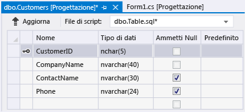
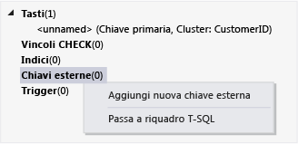

# Procedura dettagliata: creazione di un file di database locale in Visual Studio
È possibile esplorare le attività di base, ad esempio l'aggiunta di tabelle e la definizione di colonne, tramite Visual Studio per creare e aggiornare un file di database locale in LocalDB di SQL Server Express descritto in [Cenni preliminari sui dati locali](../data-tools/local-data-overview.md).  Dopo aver completato questa procedura dettagliata, sarà possibile individuare funzionalità più avanzate utilizzando il database locale come punto iniziale per le altre procedure dettagliate che la richiedono.  
  
 Per informazioni sulla creazione di un database tramite SQL Server Management Studio o Transact\-SQL, vedere [Create a Database](http://msdn.microsoft.com/it-it/4c4beea2-6cbc-4352-9db6-49ea8130bb64).  
  
 Durante questa procedura dettagliata, verranno illustrate le seguenti attività:  
  
-   [Creazione di un progetto e di un file di database locale](../data-tools/create-a-sql-database-by-using-a-designer.md#BKMK_CreateNewSQLDB).  
  
-   [Creazione di tabelle, colonne, chiavi primarie ed esterne](../data-tools/create-a-sql-database-by-using-a-designer.md#BKMK_CreateNewTbls).  
  
-   [Inserimento di dati nelle tabelle](../data-tools/create-a-sql-database-by-using-a-designer.md#BKMK_Populating).  
  
## Prerequisiti  
 Per completare la procedura dettagliata, installare [!INCLUDE[vs_dev12_expwin](../data-tools/includes/vs_dev12_expwin_md.md)], Visual Studio Professional 2013, Visual Studio Premium 2013 o Visual Studio Ultimate 2013.  Queste versioni di Visual Studio includono SQL Server Data Tools.  
  
##  <a name="BKMK_CreateNewSQLDB"></a> Creazione di un progetto e di un file di database locale  
  
#### Per creare un progetto e un file di database  
  
1.  Creare un progetto Windows Form denominato `SampleDatabaseWalkthrough`.  
  
     Vedere [Creazione di soluzioni e progetti](../ide/creating-solutions-and-projects.md).  
  
2.  Sulla barra dei menu scegliere **Progetto**,  **Aggiungi nuovo elemento**.  
  
     Verrà visualizzata la finestra di dialogo **Aggiungi nuovo elemento** per consentire l'aggiunta di elementi appropriati in un progetto Windows Form.  
  
3.  Nell'elenco di modelli di elemento, scorrere fino a visualizzare **Database basato su servizi**, quindi selezionarlo.  
  
       
  
4.  Denominare il database SampleDatabase, quindi selezionare il pulsante **Aggiungi**.  
  
5.  Se la finestra Origini dati non è aperta, scegliere la combinazione di tasti MAIUSC\-ALT\-D oppure sulla barra dei menu scegliere **Visualizza**, **Altre finestre**, **Origini dati** per aprirla.  
  
6.  Nella finestra Origini dati scegliere il collegamento **Aggiungi nuova origine dati**.  
  
7.  In **Configurazione guidata origine dati** scegliere **Avanti** quattro volte per accettare le impostazioni predefinite, quindi scegliere **Fine**.  
  
 Se si apre la finestra delle proprietà per il database, è possibile visualizzare la stringa di connessione relativa e il percorso del file primario con estensione mdf.  
  
-   In Visual Studio Express scegliere **Visualizza**, **Altre finestre**, **Esplora database** se la finestra non è già aperta.  Espandere il nodo **Connessioni dati**, aprire il menu di scelta rapida per il file SampleDatabase.mdf, quindi scegliere **Proprietà** per aprire la finestra delle proprietà.  
  
-   In altre versioni di Visual Studio scegliere **Visualizza**, **Esplora server** se la finestra non è già aperta.  Espandere il nodo **Connessioni dati**, aprire il menu di scelta rapida per il file SampleDatabase.mdf, quindi scegliere **Proprietà** per aprire la finestra delle proprietà.  
  
##  <a name="BKMK_CreateNewTbls"></a> Creazione di tabelle, colonne, chiavi primarie ed esterne  
 In questa sezione verranno create un paio di tabelle, una chiave primaria in ogni tabella e alcune righe di dati di esempio.  Nella procedura dettagliata successiva verrà illustrata la modalità di visualizzazione delle informazioni in un'applicazione.  Verrà creata anche una chiave esterna per specificare quali record di una tabella possono corrispondere ai record dell'altra tabella.  
  
#### Per creare la tabella Customers  
  
1.  In **Esplora server** o **Esplora database** espandere il nodo **Connessioni dati**, quindi il nodo **SampleDatabase.mdf**.  
  
     Se la finestra di esplorazione per la versione di Visual Studio non è aperta, scegliere **Visualizza**, **Esplora server** oppure sulla barra dei menu scegliere **Visualizza**, **Altre finestre**, **Esplora database**.  
  
2.  Aprire il menu di scelta rapida per **Tabelle**, quindi scegliere **Aggiungi nuova tabella**.  
  
     Verrà aperta **Progettazione tabelle** e verrà visualizzata una griglia con una riga predefinita, che rappresenta una singola colonna della tabella che si sta creando.  Aggiungendo righe alla griglia, vengono aggiunte colonne alla tabella.  
  
3.  Nella griglia, aggiungere una riga per ognuna delle seguenti voci:  
  
    |Nome colonna|Tipo di dati|Consente valori null|  
    |------------------|------------------|--------------------------|  
    |`CustomerID`|`nchar(5)`|False \(deselezionato\)|  
    |`CompanyName`|`nvarchar(40)`|False \(deselezionato\)|  
    |`ContactName`|`nvarchar (30)`|True \(selezionato\)|  
    |`Phone`|`nvarchar (24)`|True \(selezionato\)|  
  
4.  Aprire il menu di scelta rapida per la riga `CustomerID`, quindi scegliere **Imposta chiave primaria**.  
  
5.  Aprire il menu di scelta rapida per la riga predefinita, quindi scegliere **Elimina**.  
  
6.  Denominare la tabella Customers aggiornando la prima riga nel riquadro dello script in modo che corrisponda all'esempio seguente:  
  
    ```  
    CREATE TABLE [dbo].[Customers]  
    ```  
  
7.  Nell'angolo superiore sinistro di Progettazione tabelle scegliere il pulsante **Aggiorna** come mostrato nella figura seguente.  
  
       
  
8.  Nella finestra di dialogo **Anteprima aggiornamenti database** scegliere il pulsante **Aggiorna database**.  
  
     Le modifiche vengono salvate nel file del database locale.  
  
#### Per creare la tabella Orders  
  
1.  Aggiungere un'altra tabella, quindi aggiungere una riga per ogni voce nella tabella seguente:  
  
    |Nome colonna|Tipo di dati|Consente valori null|  
    |------------------|------------------|--------------------------|  
    |`OrderID`|`int`|False \(deselezionato\)|  
    |`CustomerID`|`nchar(5)`|False \(deselezionato\)|  
    |`OrderDate`|`datetime`|True \(selezionato\)|  
    |`OrderQuantity`|`int`|True \(selezionato\)|  
  
2.  Impostare **OrderID** come chiave primaria, quindi eliminare la riga predefinita.  
  
3.  Denominare la tabella Orders aggiornando la prima riga nel riquadro dello script in modo che corrisponda all'esempio seguente:  
  
    ```  
    CREATE TABLE [dbo].[Orders]  
    ```  
  
4.  Nell'angolo superiore sinistro di Progettazione tabelle scegliere il pulsante **Aggiorna**.  
  
5.  Nella finestra di dialogo **Anteprima aggiornamenti database** scegliere il pulsante **Aggiorna database**.  
  
     Le modifiche vengono salvate nel file del database locale.  
  
#### Per creare una chiave esterna  
  
1.  Nel riquadro del contesto a destra della griglia, aprire il menu di scelta rapida per **Chiavi esterne**, quindi scegliere **Aggiungi nuova chiave esterna**, come illustrato di seguito.  
  
       
  
2.  Nella casella di testo visualizzata, sostituire **ToTable** con `Customers`.  
  
3.  Nel riquadro dello script aggiornare l'ultima riga affinché corrisponda all'esempio seguente:  
  
    ```  
    CONSTRAINT [FK_Orders_Customers] FOREIGN KEY ([CustomerID]) REFERENCES [Customers]([CustomerID])  
    ```  
  
4.  Nell'angolo superiore sinistro di Progettazione tabelle scegliere il pulsante **Aggiorna**.  
  
5.  Nella finestra di dialogo **Anteprima aggiornamenti database** scegliere il pulsante **Aggiorna database**.  
  
     Le modifiche vengono salvate nel file del database locale.  
  
##  <a name="BKMK_Populating"></a> Inserimento di dati nelle tabelle  
  
#### Per inserire dati nelle tabelle  
  
1.  In **Esplora server** o **Esplora database**, espandere il nodo per il database di esempio.  
  
2.  Aprire il menu di scelta rapida per il nodo Tabelle, scegliere **Aggiorna**, quindi espandere il nodo Tabelle.  
  
3.  Aprire il menu di scelta rapida per la tabella Customers e scegliere **Mostra dati tabella**.  
  
4.  Aggiungere i dati desiderati per almeno tre clienti.  
  
     È possibile specificare tutti i cinque caratteri desiderati come ID cliente, ma sceglierne almeno uno da ricordare in un secondo momento per l'utilizzo in questa procedura.  
  
5.  Aprire il menu di scelta rapida per la tabella Orders e scegliere **Mostra dati tabella**.  
  
6.  Aggiungere i dati per almeno tre ordini.  
  
    > [!IMPORTANT]
    >  Verificare che tutti gli ID ordine e le quantità di ordini siano valori Integer e che ogni ID cliente corrisponda a un valore specificato nella colonna CustomerID della tabella Customers.  
  
7.  Sulla barra dei menu scegliere **File**, **Salva tutto**.  
  
8.  Sulla barra dei menu scegliere **File**, **Chiudi soluzione**.  
  
    > [!NOTE]
    >  Come procedura consigliata, è possibile eseguire il backup del file del database appena creato copiandolo, quindi incollandolo in un altro percorso o assegnando alla copia un nome diverso.  
  
## Passaggi successivi  
 Dopo avere creato un file di database locale con alcuni dati di esempio, è possibile completare [Procedura dettagliata: connessione ai dati in un file di database lodale \(Windows Form\)](../data-tools/walkthrough-connecting-to-data-in-a-local-database-file-windows-forms.md), oltre ad altre procedure dettagliate che illustrano le attività di database.  
  
## Vedere anche  
 [Procedura: gestire file di dati locali nel progetto](../data-tools/how-to-manage-local-data-files-in-your-project.md)   
 [Cenni preliminari sui dati locali](../data-tools/local-data-overview.md)   
 [Associazione di controlli Windows Form ai dati in Visual Studio](../data-tools/bind-windows-forms-controls-to-data-in-visual-studio.md)   
 [Cenni preliminari sulle applicazioni dati in Visual Studio](../data-tools/overview-of-data-applications-in-visual-studio.md)   
 [Connessione ai dati in Visual Studio](../data-tools/connecting-to-data-in-visual-studio.md)   
 [Preparazione dell'applicazione al ricevimento di dati](../Topic/Preparing%20Your%20Application%20to%20Receive%20Data.md)   
 [Recupero di dati nell'applicazione](../data-tools/fetching-data-into-your-application.md)   
 [Associazione di controlli ai dati in Visual Studio](../data-tools/bind-controls-to-data-in-visual-studio.md)   
 [Modifica di dati nell'applicazione](../data-tools/editing-data-in-your-application.md)   
 [Convalida dei dati](../Topic/Validating%20Data.md)   
 [Salvataggio di dati](../data-tools/saving-data.md)