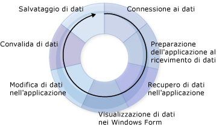

# Creazione di applicazioni dati
In Visual Studio sono disponibili molti strumenti in fase di progettazione che consentono di creare applicazioni che accedono ai dati.  In questa introduzione vengono forniti i cenni preliminari sui processi di base coinvolti nella creazione di applicazioni che utilizzano dati.  Le informazioni qui fornite, in cui sono deliberatamente evitati molti dettagli, vanno intese come fonte generale di informazione e come punto di partenza per le numerose pagine della Guida associate alla creazione di un'applicazione dati.  
  
 Quando si sviluppano applicazioni che richiedono l'accesso ai dati in [!INCLUDE[vsprvs](../code-quality/includes/vsprvs_md.md)], possono presentarsi diverse esigenze.  In alcuni casi, può essere necessario visualizzare i dati in un form.  In altri casi, può invece essere necessario individuare un metodo per condividere le informazioni con altri processi o applicazioni.  
  
 A prescindere dall'utilizzo che viene fatto dei dati, è necessario comprendere alcuni concetti fondamentali.  È possibile che non sorga mai la necessità di conoscere alcuni dettagli della gestione dei dati, ad esempio si può ignorare come si crea un database a livello di codice, ma è molto utile conoscere i concetti base relativi ai dati, nonché gli strumenti dei dati \(procedure guidate e finestre di progettazione\) disponibili in [!INCLUDE[vsprvs](../code-quality/includes/vsprvs_md.md)].  
  
 Un'applicazione dati tipica utilizza la maggior parte dei processi illustrati nel diagramma seguente:  
  
   
Il ciclo dei dati  
  
 Quando si crea un'applicazione, è necessario pensare all'attività che si intende eseguire.  Per un supporto nella ricerca degli strumenti di [!INCLUDE[vsprvs](../code-quality/includes/vsprvs_md.md)] e degli oggetti disponibili, utilizzare le sezioni illustrate di seguito.  
  
> [!NOTE]
>  [!INCLUDE[vsprvs](../code-quality/includes/vsprvs_md.md)] fornisce procedure guidate per semplificare diversi processi illustrati nel diagramma precedente.  La **Configurazione guidata origine dati** fornisce all'applicazione un numero di informazioni sufficiente a connettersi ai dati, creare un dataset tipizzato per riceverli e infine portarli all'interno dell'applicazione.  
  
 Per una rapida descrizione dell'utilizzo di [!INCLUDE[vsprvs](../code-quality/includes/vsprvs_md.md)] come supporto per lo sviluppo di applicazioni dati, vedere [Procedura dettagliata: creazione di un'applicazione dati semplice](../Topic/Walkthrough:%20Creating%20a%20Simple%20Data%20Application.md).  
  
## Connessione ai dati  
 Per portare i dati all'interno dell'applicazione e rinviare le modifiche all'origine dati, è necessario stabilire una sorta di comunicazione bidirezionale.  Questa comunicazione bidirezionale viene generalmente gestita dagli oggetti del modello dati.  
  
 Ad esempio, `TableAdapter` consente di connettere le applicazioni che utilizzano i dataset a un database e <xref:System.Data.Objects.ObjectContext> di connettere le entità in Entity Framework a un database.  [!INCLUDE[vsprvs](../code-quality/includes/vsprvs_md.md)] fornisce diversi strumenti di supporto che possono essere utilizzati dall'applicazione per la creazione di connessioni.  Per ulteriori informazioni sulla connessione dell'applicazione ai dati, vedere [Connessione ai dati in Visual Studio](../data-tools/connecting-to-data-in-visual-studio.md).  
  
 Per informazioni sull'utilizzo dei dataset per connettere l'applicazione ai dati in un database, vedere [Procedura dettagliata: connessione ai dati in un database \(Windows Form\)](../Topic/Walkthrough:%20Connecting%20to%20Data%20in%20a%20Database%20\(Windows%20Forms\).md).  
  
## Preparazione dell'applicazione al ricevimento di dati  
 Se l'applicazione utilizza un modello di dati disconnesso, è necessario archiviare temporaneamente i dati dell'applicazione mentre la si utilizza.  In Visual Studio sono disponibili strumenti che consentono di creare gli oggetti utilizzati dall'applicazione per archiviare temporaneamente i dati: dataset, entità e oggetti [!INCLUDE[vbtecdlinq](../data-tools/includes/vbtecdlinq_md.md)].  
  
> [!NOTE]
>  Di solito, in un'applicazione che utilizza un modello di dati disconnesso si procede effettuando la connessione a un database, eseguendo una query per il passaggio di dati nell'applicazione, effettuando la disconnessione dal database e infine modificando i dati offline prima di riconnettere e aggiornare il database.  
  
 Per ulteriori informazioni sulla creazione di dataset tipizzati nell'applicazione, vedere [Preparazione dell'applicazione al ricevimento di dati](../Topic/Preparing%20Your%20Application%20to%20Receive%20Data.md).  Per informazioni aggiuntive sull'utilizzo dei dataset nelle applicazioni a più livelli, vedere [Procedura: separare dataset e TableAdapter in progetti diversi](../data-tools/separate-datasets-and-tableadapters-into-different-projects.md).  
  
 Per informazioni sulla creazione di un dataset, completare le procedure illustrate in [Procedura dettagliata: creazione di un dataset con Progettazione DataSet](../data-tools/walkthrough-creating-a-dataset-with-the-dataset-designer.md).  
  
 Per informazioni sulla creazione di oggetti [!INCLUDE[vbtecdlinq](../data-tools/includes/vbtecdlinq_md.md)], completare le procedure illustrate in [Procedura dettagliata: creazione di classi LINQ to SQL \(Progettazione relazionale oggetti\)](../Topic/Walkthrough:%20Creating%20LINQ%20to%20SQL%20Classes%20\(O-R%20Designer\).md).  
  
## Recupero di dati nell'applicazione  
 A prescindere dal fatto che nell'applicazione venga utilizzato o meno un modello di dati, è necessario essere in grado di recuperare dati all'interno di questa.  Per passare dati nell'applicazione, si eseguono query o stored procedure in un database  Le applicazioni che archiviano dati nei dataset eseguono query e stored procedure utilizzando `TableAdapter`, mentre le applicazioni che archiviano dati nelle entità eseguono query utilizzando [LINQ to Entities](../Topic/LINQ%20to%20Entities.md) oppure effettuando la connessione delle entità direttamente alle stored procedure.  Per ulteriori informazioni sulla creazione e la modifica delle query che utilizzano TableAdapter, vedere [Procedura: creare query TableAdapter](../data-tools/how-to-create-tableadapter-queries.md) e [Procedura: modificare query TableAdapter](../data-tools/how-to-edit-tableadapter-queries.md).  
  
 Per ulteriori informazioni sul caricamento dei dati nei dataset e sull'esecuzione di query e stored procedure, vedere [Recupero di dati nell'applicazione](../data-tools/fetching-data-into-your-application.md).  
  
 Per informazioni sul caricamento dei dati in un dataset, completare le procedure illustrate in [Procedura dettagliata: visualizzazione di dati in un Windows Form](../data-tools/walkthrough-displaying-data-on-a-windows-form.md) ed esaminare il codice nel gestore eventi di caricamento dei form.  
  
 Per informazioni sul caricamento dei dati negli oggetti [!INCLUDE[vbtecdlinq](../data-tools/includes/vbtecdlinq_md.md)], completare le procedure illustrate in [Procedura dettagliata: creazione di classi LINQ to SQL \(Progettazione relazionale oggetti\)](../Topic/Walkthrough:%20Creating%20LINQ%20to%20SQL%20Classes%20\(O-R%20Designer\).md).  
  
 Per informazioni sulla creazione e l'esecuzione di una query SQL, vedere [Procedura: creare ed eseguire un'istruzione SQL che restituisce righe](../Topic/How%20to:%20Create%20and%20Execute%20an%20SQL%20Statement%20that%20Returns%20Rows.md).  
  
 Per informazioni sull'esecuzione di una stored procedure, vedere [Procedura: eseguire una stored procedure che restituisce righe](../Topic/How%20to:%20Execute%20a%20Stored%20Procedure%20that%20Returns%20Rows.md).  
  
## Visualizzazione di dati nei form  
 Dopo avere inserito dati nell'applicazione, generalmente questi verranno visualizzati in un form per consentire agli utenti di visualizzarli o modificarli.  In [!INCLUDE[vsprvs](../code-quality/includes/vsprvs_md.md)] è disponibile la [Origini dati \(finestra\)](../Topic/Data%20Sources%20Window.md), in cui è possibile trascinare elementi su form per creare automaticamente controlli associati a dati che consentono di visualizzare i dati.  Per ulteriori informazioni sull'associazione ai dati e la visualizzazione dei dati da parte degli utenti, vedere [Associazione di controlli ai dati in Visual Studio](../data-tools/bind-controls-to-data-in-visual-studio.md).  
  
 Per informazioni sulle modalità di presentazione dei dati agli utenti, completare i passaggi illustrati nelle procedure dettagliate seguenti, prestando particolare attenzione al processo di trascinamento degli elementi dalla finestra **Origini dati**:  
  
-   [Procedura dettagliata: visualizzazione di dati in un Windows Form](../data-tools/walkthrough-displaying-data-on-a-windows-form.md).  
  
-   [Procedura dettagliata: associazione di controlli WPF a un servizio dati WCF](../data-tools/bind-wpf-controls-to-a-wcf-data-service.md)  
  
-   [Procedura dettagliata: associazione di controlli Silverlight a un servizio dati WCF](../Topic/Walkthrough:%20Binding%20Silverlight%20Controls%20to%20a%20WCF%20Data%20Service.md)  
  
## Modifica di dati nell'applicazione  
 Dopo che i dati sono stati presentati agli utenti, è probabile che questi ultimi apporteranno delle variazioni aggiungendo nuovi record o modificando quelli esistenti prima di rinviarli al database.  
  
 Per ulteriori informazioni sull'utilizzo dei dati successivamente al loro caricamento nel dataset, vedere [Modifica di dati nell'applicazione](../data-tools/editing-data-in-your-application.md).  
  
## Convalida dei dati  
 Dopo aver apportato modifiche ai dati, solitamente si effettuano delle verifiche prima di consentire che i valori modificati vengano accettati nel dataset o scritti nel database.  Il processo di verifica dell'accettabilità dei nuovi valori in base ai requisiti dell'applicazione è denominato *convalida*.  È possibile aggiungere una logica per il controllo dei valori nell'applicazione mentre sono in corso le modifiche.  In Visual Studio sono disponibili strumenti che consentono di aggiungere codice per la convalida dei dati durante la modifica di colonna e righe.  Per ulteriori informazioni, vedere [Convalida dei dati](../Topic/Validating%20Data.md).  
  
 Per informazioni sull'aggiunta della convalida dei dati all'applicazione, vedere [Procedura dettagliata: aggiunta di convalida a un dataset](../Topic/Walkthrough:%20Adding%20Validation%20to%20a%20Dataset.md).  
  
 Per informazioni su come aggiungere la convalida a un dataset separato in un'applicazione a più livelli, vedere [Procedura: aggiungere la convalida a un dataset a più livelli](../data-tools/add-validation-to-an-n-tier-dataset.md).  
  
## Salvataggio di dati  
 Dopo aver apportato le modifiche nell'applicazione e averle convalidate, generalmente si procede al relativo rinvio al database.  Le applicazioni che archiviano i dati nei dataset utilizzano generalmente un TableAdapterManager per salvare i dati.  Per ulteriori informazioni, vedere [Panoramica di TableAdapterManager](../Topic/TableAdapterManager%20Overview.md).  Le applicazioni Entity Framework utilizzano il metodo <xref:System.Data.Objects.ObjectContext.SaveChanges%2A> per salvare i dati.  
  
 Per ulteriori informazioni sull'invio di dati aggiornati in un database, vedere [Salvataggio di dati](../data-tools/saving-data.md).  
  
 Per informazioni sull'invio di dati aggiornati da un dataset a un database, completare le procedure illustrate in [Procedura dettagliata: salvataggio dei dati dalle tabelle dati correlate \(aggiornamento gerarchico\)](../Topic/Walkthrough:%20Saving%20Data%20from%20Related%20Data%20Tables%20\(Hierarchical%20Update\).md).  
  
## Argomenti correlati  
 [Cenni preliminari sulle applicazioni dati in Visual Studio](../data-tools/overview-of-data-applications-in-visual-studio.md)  
 Vengono forniti collegamenti ad argomenti relativi alla creazione di applicazioni per la gestione dei dati.  
  
 [Connessione ai dati in Visual Studio](../data-tools/connecting-to-data-in-visual-studio.md)  
 Vengono forniti collegamenti agli argomenti relativi all'utilizzo di [!INCLUDE[vsprvs](../code-quality/includes/vsprvs_md.md)] per connettere l'applicazione ai dati e creare origini dati per le applicazioni.  
  
 [Preparazione dell'applicazione al ricevimento di dati](../Topic/Preparing%20Your%20Application%20to%20Receive%20Data.md)  
 Vengono forniti collegamenti ad argomenti che illustrano l'utilizzo di modelli dati nell'applicazione, inclusi dataset ed Entity Data Model.  
  
 [Recupero di dati nell'applicazione](../data-tools/fetching-data-into-your-application.md)  
 Vengono forniti collegamenti ad argomenti che descrivono come caricare dati nell'applicazione.  
  
 [Associazione di controlli ai dati in Visual Studio](../data-tools/bind-controls-to-data-in-visual-studio.md)  
 Vengono forniti collegamenti ad argomenti in cui viene spiegato come associare a origini dati controlli Windows Form, controlli WPF e controlli Silverlight.  
  
 [Modifica di dati nell'applicazione](../data-tools/editing-data-in-your-application.md)  
 Vengono forniti collegamenti ad argomenti che descrivono come modificare i dati nell'applicazione.  
  
 [Convalida dei dati](../Topic/Validating%20Data.md)  
 Vengono forniti collegamenti ad argomenti in cui viene descritto come aggiungere la convalida alle modifiche dei dati.  
  
 [Salvataggio di dati](../data-tools/saving-data.md)  
 Vengono forniti collegamenti ad argomenti che illustrano come inviare dati aggiornati dall'applicazione a un database o come salvarli in altri formati come XML.  
  
 [Strumenti per l'utilizzo delle origini dati in Visual Studio](../Topic/Tools%20for%20Working%20with%20Data%20Sources%20in%20Visual%20Studio.md)  
 Vengono forniti collegamenti ad argomenti relativi agli strumenti che è possibile utilizzare per la gestione delle origini dati in Visual Studio, quali la finestra **Origini dati** e Entity Data Model Designer ADO.NET.