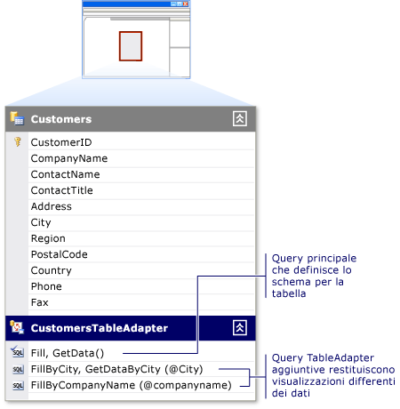

# Procedura: modificare query TableAdapter
Le query TableAdapter vengono modificate con la [TableAdapter \(query, configurazione guidata\)](../data-tools/editing-tableadapters.md) in **Progettazione DataSet**.  Quando una query TableAdapter non è più adeguata alle esigenze dell'applicazione, sarebbe opportuno modificarla.  In tal caso, è possibile creare altre query sul TableAdapter.  Per ulteriori informazioni sull'aggiunta di nuove query, vedere [Procedura: creare query TableAdapter](../data-tools/how-to-create-tableadapter-queries.md).  
  
> [!NOTE]
>  Se, anziché aprire la **Configurazione guidata query TableAdapter**, viene aperta la [TableAdapter \(configurazione guidata\)](../Topic/TableAdapter%20Configuration%20Wizard.md), è possibile che sia stata selezionata la query `Fill` principale del TableAdapter piuttosto che una di quelle aggiuntive.  Per informazioni sulla modifica della query `Fill` principale dell'oggetto TableAdapter, vedere [Procedura: modificare oggetti TableAdapter](../Topic/How%20to:%20Edit%20TableAdapters.md).  
  
   
  
### Per modificare una query TableAdapter  
  
1.  Aprire il dataset in **Progettazione DataSet**.  Per ulteriori informazioni, vedere [Procedura: aprire un dataset in Progettazione DataSet](../Topic/How%20to:%20Open%20a%20Dataset%20in%20the%20Dataset%20Designer.md).  
  
2.  Selezionare la query TableAdapter da modificare.  
  
3.  Fare clic con il pulsante destro del mouse sulla query TableAdapter e scegliere **Configura**.  
  
     Verrà visualizzata la **Configurazione guidata query TableAdapter** per modificare la query o la relativa stored procedure.  
  
4.  Completare la **Configurazione guidata query TableAdapter** con le modifiche desiderate.  Per ulteriori informazioni, vedere [TableAdapter \(query, configurazione guidata\)](../data-tools/editing-tableadapters.md).  
  
## Vedere anche  
 [TableAdapters](../Topic/TableAdapters.md)   
 [Connessione ai dati in Visual Studio](../data-tools/connecting-to-data-in-visual-studio.md)   
 [Preparazione dell'applicazione al ricevimento di dati](../Topic/Preparing%20Your%20Application%20to%20Receive%20Data.md)   
 [Recupero di dati nell'applicazione](../data-tools/fetching-data-into-your-application.md)   
 [Associazione di controlli ai dati in Visual Studio](../data-tools/bind-controls-to-data-in-visual-studio.md)   
 [Modifica di dati nell'applicazione](../data-tools/editing-data-in-your-application.md)   
 [Convalida dei dati](../Topic/Validating%20Data.md)   
 [Salvataggio di dati](../data-tools/saving-data.md)   
 [Procedure dettagliate relative ai dati](../Topic/Data%20Walkthroughs.md)