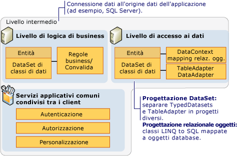
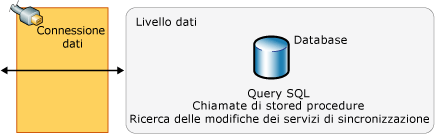

# Cenni preliminari sull&#39;applicazione dati a pi&#249; livelli
Le applicazioni dati *a più livelli* sono applicazioni dati separate in più *livelli*.  Anche chiamate "applicazioni distribuite" e "applicazioni multilivello", il processo di queste applicazioni a più livelli avviene separatamente in livelli discreti, distribuiti tra il clienti e il server.  Quando si sviluppano applicazioni che richiedono l'accesso ai dati, è necessario applicare una netta separazione tra i vari livelli che costituiscono l'applicazione.  
  
 Una tipica applicazione a più livelli include un livello di presentazione, un livello intermedio e un livello dati.  Il modo più semplice per separare i vari livelli in un'applicazione a più livelli consiste nel creare progetti discreti per ogni livello che si desidera includere nell'applicazione.  Ad esempio, il livello di presentazione potrebbe essere un'applicazione Windows Form, mentre la logica di accesso ai dati potrebbe essere una libreria di classi presente nel livello intermedio.  Il livello di presentazione potrebbe inoltre comunicare con la logica di accesso ai dati nel livello intermedio tramite un servizio.  La separazione dei componenti dell'applicazione in questi livelli separati aumenta la manutenibilità e la scalabilità dell'applicazione,  mediante l'adozione di nuove tecnologie che vengono applicate a un singolo livello senza la necessità di dovere riprogettare l'intera soluzione.  Inoltre, le applicazioni a più livelli di solito archiviano le informazioni riservate nel livello intermedio per conservare l'isolamento dal livello di presentazione.  
  
 In Visual Studio sono disponibili molte funzionalità che consentono agli sviluppatori di creare applicazioni a più livelli.  
  
-   [Creazione e modifica di dataset tipizzati](../data-tools/creating-and-editing-typed-datasets.md) fornisce una proprietà **Progetto DataSet** che consente di separare il dataset \(livello di entità di dati\) e i `TableAdapter` \(livello di accesso ai dati\) in progetti discreti.  
  
-   [Progettazione relazionale oggetti](../data-tools/linq-to-sql-tools-in-visual-studio2.md) fornisce le impostazioni per generare DataContext e le classi di dati in spazi dei nomi separati  consentendo la separazione logica dei livelli di accesso ai dati e di entità di dati.  
  
-   [LINQ to SQL](../Topic/LINQ%20to%20SQL.md) fornisce il metodo <xref:System.Data.Linq.Table%601.Attach%2A> che consente di raggruppare DataContext da differenti livelli in un'applicazione.  Per ulteriori informazioni, vedere [Applicazioni a più livelli e remote con LINQ to SQL](../Topic/N-Tier%20and%20Remote%20Applications%20with%20LINQ%20to%20SQL.md).  
  
## Livello di presentazione  
 Il *livello di presentazione* è quello in cui gli utenti interagiscono con un'applicazione.  Spesso contiene anche la logica aggiuntiva dell'applicazione.  I componenti tipici del livello di presentazione sono:  
  
-   Componenti di associazione dati, ad esempio <xref:System.Windows.Forms.BindingSource> e <xref:System.Windows.Forms.BindingNavigator>.  
  
-   Rappresentazioni di oggetti di dati, ad esempio le classi di entità [LINQ to SQL](../Topic/LINQ%20to%20SQL.md) da utilizzare nel livello di presentazione.  
  
 Il livello di presentazione accede generalmente al livello intermedio utilizzando un riferimento al servizio, ad esempio un'applicazione di [Windows Communication Foundation Services and WCF Data Services in Visual Studio](../data-tools/windows-communication-foundation-services-and-wcf-data-services-in-visual-studio.md).  Il livello di presentazione non accede direttamente al livello dati,  bensì comunica con il livello dati per mezzo del componente di accesso ai dati del livello intermedio.  
  
## Livello intermedio  
 Il *livello intermedio* è quello utilizzato dal livello di presentazione e dal livello dati per comunicare tra loro.  I componenti tipici del livello intermedio sono:  
  
-   Logica di business, ad esempio le regole di business e la convalida dei dati.  
  
-   Componenti di accesso ai dati e logica, ad esempio:.  
  
    -   [TableAdapters](../Topic/TableAdapters.md) e [DataAdapter e DataReader](../Topic/DataAdapters%20and%20DataReaders.md).  
  
    -   Rappresentazioni di oggetti di dati, ad esempio le classi di entità [LINQ to SQL](../Topic/LINQ%20to%20SQL.md).  
  
    -   Servizi di applicazione comune, ad esempio l'autenticazione, l'autorizzazione e la personalizzazione.  
  
 Nell'illustrazione seguente vengono mostrate le funzionalità e le tecnologie disponibili in Visual Studio e il relativo utilizzo in un livello intermedio di un'applicazione a più livelli.  
  
   
Livello intermedio  
  
 Il tipico livello intermedio si connette al livello dati tramite una connessione dati.  Di norma, si trova nel componente di accesso ai dati.  
  
## Livello dati  
 Il *livello dati* è fondamentalmente il server in cui vengono archiviati i dati di un'applicazione, ad esempio un server con [!INCLUDE[ssNoVersion](../data-tools/includes/ssnoversion_md.md)].  
  
 Nell'illustrazione seguente vengono mostrate le funzionalità e le tecnologie disponibili in Visual Studio e il relativo utilizzo in un livello dati di un'applicazione a più livelli.  
  
   
Livello dati  
  
 Non è possibile accedere direttamente al livello dati dal client nel livello di presentazione,  quindi per le comunicazioni tra il livello dati e il livello di presentazione viene utilizzato il componente di accesso ai dati del livello intermedio.  
  
## Guida per lo sviluppo a più livelli  
 Negli argomenti riportati di seguito vengono fornite informazioni sull'utilizzo delle applicazioni a più livelli.  
  
 [Procedura: separare dataset e TableAdapter in progetti diversi](../data-tools/separate-datasets-and-tableadapters-into-different-projects.md)  
  
 [Procedura dettagliata: creazione di un'applicazione dati a più livelli](../data-tools/walkthrough-creating-an-n-tier-data-application.md)  
  
 [Procedura dettagliata: aggiunta della convalida a un'applicazione dati a più livelli](../Topic/Walkthrough:%20Adding%20Validation%20to%20an%20N-Tier%20Data%20Application.md)  
  
 [Applicazioni a più livelli e remote con LINQ to SQL](../Topic/N-Tier%20and%20Remote%20Applications%20with%20LINQ%20to%20SQL.md)  
  
## Vedere anche  
 <xref:System.Data.Linq.ITable.Attach%2A>   
 [Procedura dettagliata: creazione di un'applicazione dati a più livelli](../data-tools/walkthrough-creating-an-n-tier-data-application.md)   
 [Aggiornamento gerarchico](../data-tools/hierarchical-update.md)   
 [Utilizzo di dataset in Visual Studio](../data-tools/dataset-tools-in-visual-studio.md)   
 [Accesso ai dati in Visual Studio](../data-tools/accessing-data-in-visual-studio.md)