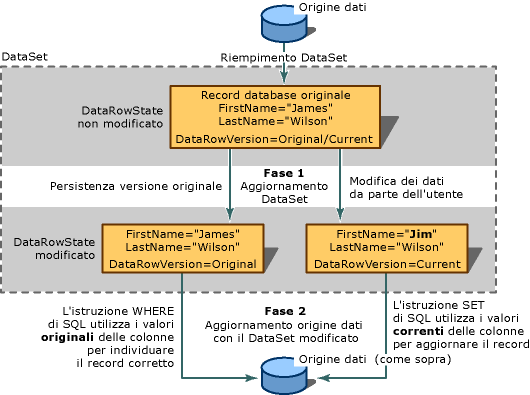

# <a name="save-data-back-to-the-database"></a>Salvare i dati nel database
Il set di dati è una copia in memoria dei dati. Se si modificano i dati, è consigliabile salvare le modifiche al database. Viene eseguita in uno dei tre modi:  
  
-   La chiamata a uno dei metodi di aggiornamento di un oggetto TableAdapter  
  
-   Chiamando uno dei metodi DBDirect di TableAdapter  
  
-   Chiamando il metodo UpdateAll su TableAdapterManager che Visual Studio genera automaticamente quando il set di dati contiene le tabelle correlate ad altre tabelle nel set di dati  
  
Quando si dati associa le tabelle di set di dati a controlli in una pagina di Windows Form o in XAML, l'architettura di associazione di dati esegue tutte le operazioni.  
  
Se si ha familiarità con gli oggetti TableAdapter, è possibile passare direttamente a uno degli argomenti seguenti:  
  
|Argomento|Descrizione|  
|-----------|-----------------|  
|[Inserire nuovi record in un database](../data-tools/insert-new-records-into-a-database.md)|Come eseguire gli aggiornamenti e inserisce usando gli oggetti TableAdapter o un comando|  
|[Aggiornare i dati mediante un TableAdapter](../data-tools/update-data-by-using-a-tableadapter.md)|Come eseguire gli aggiornamenti degli oggetti TableAdapter|  
|[Aggiornamento gerarchico](../data-tools/hierarchical-update.md)|Come eseguire gli aggiornamenti da un set di dati di due o più tabelle correlate|  
|[Gestire un'eccezione di concorrenza](../data-tools/handle-a-concurrency-exception.md)|Come gestire le eccezioni, quando due utenti tentano di modificare gli stessi dati in un database nello stesso momento|  
|[Procedura: salvare dati utilizzando una transazione](../data-tools/save-data-by-using-a-transaction.md)|Come salvare dati in una transazione utilizzando lo spazio dei nomi System. Transactions e un oggetto TransactionScope|  
|[Procedura dettagliata: Salvataggio di dati in una transazione](../data-tools/save-data-in-a-transaction.md)|Procedura dettagliata che consente di creare un'applicazione Windows Form per illustrare il salvataggio dei dati a un database all'interno di una transazione|  
|[Salvare dati in un database (a più tabelle)](../data-tools/save-data-to-a-database-multiple-tables.md)|Come modificare i record e salvare le modifiche in più tabelle nel database|  
|[Salvare dati da un oggetto in un database](../data-tools/save-data-from-an-object-to-a-database.md)|Come passare i dati da un oggetto che non è in un set di dati a un database utilizzando un metodo DbDirect di TableAdapter|  
|[PSalvare dati con i metodi DBDirect di TableAdapter](../data-tools/save-data-with-the-tableadapter-dbdirect-methods.md)|Come utilizzare il TableAdapter per inviare query SQL direttamente al database|  
|[Salvare un set di dati come XML](../data-tools/save-a-dataset-as-xml.md)|Come salvare un set di dati in un documento XML|  
  
## <a name="two-stage-updates"></a>Aggiornamenti in due fasi  
 Aggiornamento di un'origine dati è un processo in due passaggi. Il primo passaggio consiste nell'aggiornare il set di dati con i nuovi record, i record modificati o eliminati i record. Se l'applicazione non invia mai le modifiche all'origine dati, si è finito di lavorare con l'aggiornamento.  
  
 Se si invia le modifiche al database, quindi un secondo passaggio è obbligatorio. Se non si utilizzano controlli con associazione a dati, è necessario chiamare manualmente il metodo Update del stesso TableAdapter (o adattatore di dati) utilizzato per popolare il set di dati. Tuttavia, è possibile utilizzare anche diversi adapter, ad esempio, per spostare i dati da un'origine dati a un altro o per aggiornare più origini dati. Se si non utilizza l'associazione dati e si salvano le modifiche per le tabelle correlate, è necessario creare manualmente un'istanza di una variabile della classe di TableAdapterManager generato automaticamente e quindi chiamare il metodo UdpateAll.  
  
   
Processo di aggiornamento in due fasi e il ruolo di DataRowVersion in un aggiornamento ha esito positivo  
  
 Un set di dati contiene insiemi di tabelle che contengono un raccolta di righe. Se si prevede di aggiornare un'origine dei dati in un secondo momento, è necessario utilizzare i metodi sulla proprietà DataTable.DataRowCollection durante l'aggiunta o rimozione di righe. Questi metodi eseguono il rilevamento delle modifiche che è necessario per l'aggiornamento dell'origine dati. Se si chiama la raccolta RemoveAt sulla proprietà Rows, l'eliminazione non comunicato al database.  
  
## <a name="merge-datasets"></a>Set di dati di tipo merge  
 È possibile aggiornare il contenuto di un set di dati da *unione* con un altro set di dati. Ciò comporta la copia il contenuto di un *origine* set di dati nel dataset chiamante (detto di *destinazione* set di dati). Quando si uniscono i set di dati, vengono aggiunti nuovi record nel set di dati di origine per il set di dati di destinazione. Inoltre, vengono aggiunte altre colonne del set di dati di origine per il set di dati di destinazione. Unione di set di dati è utile quando si dispone di un set di dati locale e si visualizza un secondo set di dati da un'altra applicazione. È inoltre utile quando si riceve un secondo set di dati da un componente, ad esempio un servizio web XML o quando è necessario integrare dati da più set di dati.  
  
 Quando si uniscono i set di dati, è possibile passare un argomento booleano (`preserveChanges`) che indica il <xref:System.Data.DataSet.Merge%2A> metodo se si desidera mantenere le modifiche esistenti nel dataset di destinazione. Poiché i set di dati di gestire più versioni di record, è importante tenere presente che viene eseguita l'unione di più di una versione dei record. La tabella seguente illustra le modalità di unione di un record in due set di dati:  
  
|Enumerazione DataRowVersion|Set di dati di destinazione|Set di dati di origine|  
|--------------------|--------------------|--------------------|  
|Originale|James Wilson|James C. Wilson|  
|Corrente|Jim Wilson|James C. Wilson|  
  
 La chiamata di <xref:System.Data.DataSet.Merge%2A> metodo nella tabella precedente con `preserveChanges=false targetDataset.Merge(sourceDataset)` verifica quanto segue:  
  
|Enumerazione DataRowVersion|Set di dati di destinazione|Set di dati di origine|  
|--------------------|--------------------|--------------------|  
|Originale|James C. Wilson|James C. Wilson|  
|Corrente|James C. Wilson|James C. Wilson|  
  
 La chiamata di <xref:System.Data.DataSet.Merge%2A> metodo con `preserveChanges = true targetDataset.Merge(sourceDataset, true)` verifica quanto segue:  
  
|Enumerazione DataRowVersion|Set di dati di destinazione|Set di dati di origine|  
|--------------------|--------------------|--------------------|  
|Originale|James C. Wilson|James C. Wilson|  
|Corrente|Jim Wilson|James C. Wilson|  
  
> [!CAUTION]
>  Nel `preserveChanges = true` scenario, se il <xref:System.Data.DataSet.RejectChanges%2A> metodo viene chiamato su un record nel dataset di destinazione, quindi ai dati di origine da cui viene ripristinato il *origine* set di dati. Ciò significa che, se si tenta di aggiornare l'origine dei dati con il set di dati di destinazione, potrebbe non essere in grado di trovare la riga originale da aggiornare. È possibile impedire una violazione di concorrenza, la compilazione di un altro set di dati con i record aggiornati dall'origine dati e quindi di eseguire un'operazione di unione per evitare una violazione della concorrenza. (Una violazione di concorrenza si verifica quando un altro utente modifica un record nell'origine dati dopo che è stato compilato il set di dati)  
  
## <a name="update-constraints"></a>Vincoli di aggiornamento  
 Per apportare modifiche a una riga di dati esistente, aggiungere o aggiornare i dati nelle singole colonne. Se il set di dati contiene i vincoli (ad esempio le chiavi esterne o vincoli non nullable), è possibile che il record può essere temporaneamente in stato di errore come eseguire l'aggiornamento. Ovvero, può essere in stato di errore al termine dell'aggiornamento di una colonna, ma prima di passare a quella successiva.  
  
 Per impedire violazioni dei vincoli prematura è possibile sospendere temporaneamente i vincoli di aggiornamento. Questo ha due scopi:  
  
-   Un errore impedisce che venga generata dopo aver terminato di aggiornare una colonna, ma non hanno avviato l'aggiornamento di un altro.  
  
-   Impedisce l'aggiornamento gli eventi vengano generati (eventi che vengono spesso utilizzati per la convalida).  
   
> [!NOTE]
>  In Windows Form, l'architettura di associazione di dati incorporato in datagrid controllo vincoli sospeso finché lo stato attivo si sposta all'esterno di una riga, e non è necessario chiamare in modo esplicito il <xref:System.Data.DataRow.BeginEdit%2A>, <xref:System.Data.DataRow.EndEdit%2A>, o <xref:System.Data.DataRow.CancelEdit%2A> metodi.  
  
 I vincoli vengono automaticamente disabilitato quando il <xref:System.Data.DataSet.Merge%2A> metodo viene richiamato su un set di dati. Quando l'unione è completata, se sono presenti i vincoli per il set di dati che non possono essere attivati, un <xref:System.Data.ConstraintException> viene generata un'eccezione. In questo caso, il <xref:System.Data.DataSet.EnforceConstraints%2A> è impostata su `false,` e tutte le violazioni di vincolo devono essere risolti prima di reimpostare il <xref:System.Data.DataSet.EnforceConstraints%2A> proprietà `true`.  
  
 Dopo aver completato un aggiornamento, è possibile riabilitare verifica dei vincoli, che anche abilita nuovamente gli eventi di aggiornamento e li genera.  
  
 Per ulteriori informazioni sulla sospensione degli eventi, vedere [disattivare i vincoli durante la compilazione di un set di dati](../data-tools/turn-off-constraints-while-filling-a-dataset.md).  
  
## <a name="dataset-update-errors"></a>Errori di aggiornamento di DataSet  
 Quando si aggiorna un record in un set di dati, sussiste la possibilità di un errore. Ad esempio, è possibile scrivere inavvertitamente i dati di tipo non corretto a una colonna, o dati che sono troppo lunghi o dati che dispone di altri problemi di integrità. Oppure si potrebbero disporre i controlli di convalida specifici dell'applicazione in grado di generare gli errori personalizzati in qualsiasi fase di un evento di aggiornamento. Per ulteriori informazioni, vedere [convalidare i dati in set di dati](../data-tools/validate-data-in-datasets.md).  
  
## <a name="maintaining-information-about-changes"></a>Gestione di informazioni sulle modifiche  
 Informazioni sulle modifiche in un set di dati viene mantenute in due modi: contrassegnando le righe che indicano che vengono modificati (<xref:System.Data.DataRow.RowState%2A>) e mantenendo più copie di un record (<xref:System.Data.DataRowVersion>). Utilizzando queste informazioni, i processi possono determinare cosa è cambiato nel set di dati e possono inviare gli aggiornamenti appropriati per l'origine dati.  
  
### <a name="rowstate-property"></a>Proprietà RowState  
 Il <xref:System.Data.DataRow.RowState%2A> proprietà di un <xref:System.Data.DataRow> oggetto è un valore che fornisce informazioni sullo stato di una particolare riga di dati.  
  
 La tabella seguente illustra i valori possibili del <xref:System.Data.DataRowState> enumerazione:  
  
|Valore DataRowState|Descrizione|  
|------------------------|-----------------|  
|<xref:System.Data.DataRowState.Added>|La riga è stata aggiunta come un elemento a un <xref:System.Data.DataRowCollection>. (Una riga in questo stato non è installata una versione originale corrispondente poiché non esisteva quando l'ultimo <xref:System.Data.DataRow.AcceptChanges%2A> metodo è stato chiamato).|  
|<xref:System.Data.DataRowState.Deleted>|La riga è stata eliminata utilizzando il <xref:System.Data.DataRow.Delete%2A> di un <xref:System.Data.DataRow> oggetto.|  
|<xref:System.Data.DataRowState.Detached>|La riga è stata creata ma non fa parte di qualsiasi <xref:System.Data.DataRowCollection>. Oggetto <xref:System.Data.DataRow> oggetto è in questo stato subito dopo che è stato creato, prima è stato aggiunto a una raccolta e dopo che è stato rimosso da una raccolta.|  
|<xref:System.Data.DataRowState.Modified>|Un valore di colonna nella riga è stato modificato in qualche modo.|  
|<xref:System.Data.DataRowState.Unchanged>|La riga è stata modificata dopo <xref:System.Data.DataRow.AcceptChanges%2A> dall'ultima chiamata.|  
  
### <a name="datarowversion-enumeration"></a>DataRowVersion (enumerazione)  
Set di dati di gestire più versioni di record. Il <xref:System.Data.DataRowVersion> campi possono essere usati quando il recupero del valore trovato in un <xref:System.Data.DataRow> utilizzando il <xref:System.Data.DataRow.Item%2A> proprietà o <xref:System.Data.DataRow.GetChildRows%2A> metodo il <xref:System.Data.DataRow> oggetto.  
  
La tabella seguente illustra i valori possibili del <xref:System.Data.DataRowVersion> enumerazione:  
  
|Valore di DataRowVersion|Descrizione|  
|--------------------------|-----------------|  
|<xref:System.Data.DataRowVersion.Current>|La versione corrente di un record contiene tutte le modifiche effettuate nel record dall'ultima volta <xref:System.Data.DataRow.AcceptChanges%2A> è stato chiamato. Se la riga è stata eliminata, non vi è nessuna versione corrente.|  
|<xref:System.Data.DataRowVersion.Default>|Il valore predefinito di un record, come definito dall'origine dati o schema di set di dati.|  
|<xref:System.Data.DataRowVersion.Original>|La versione originale di un record è una copia del record è stato che l'ultima applicazione delle modifiche sono state salvate nel set di dati. In pratica, questo in genere è la versione di un record come di lettura da un'origine dati.|  
|<xref:System.Data.DataRowVersion.Proposed>|Versione proposta di un record che è temporaneamente mentre ancora in corso un aggiornamento, vale a dire tra il momento in cui è stato chiamato il <xref:System.Data.DataRow.BeginEdit%2A> (metodo) e il <xref:System.Data.DataRow.EndEdit%2A> (metodo). In genere si accede alla versione proposta di un record in un gestore per un evento, ad esempio <xref:System.Data.DataTable.RowChanging>. Richiamare il <xref:System.Data.DataRow.CancelEdit%2A> metodo inverte le modifiche e viene eliminata la versione della riga di dati proposta.|  
  
 Le versioni originali e correnti sono utili quando le informazioni di aggiornamento vengono trasmessi a un'origine dati. In genere, quando un aggiornamento viene inviato all'origine dati, le nuove informazioni per il database sono nella versione corrente di un record. Informazioni dalla versione originale vengono utilizzate per individuare i record da aggiornare.  
  
 Ad esempio, nel caso in cui è stata modificata la chiave primaria di un record, è necessario un modo per individuare il record corretto nell'origine dati per aggiornare le modifiche. Se non esistesse alcuna versione originale, quindi il record sarebbe probabilmente aggiunto all'origine dati, risultante non solo in un record supplementare indesiderato, ma in un record impreciso e aggiornata. Le due versioni vengono utilizzate anche nel controllo della concorrenza. È possibile confrontare la versione originale con un record nell'origine dati per determinare se il record è stato modificato dopo il caricamento nel set di dati.  
  
 La versione proposta è utile quando è necessario eseguire la convalida prima di applicare effettivamente le modifiche al set di dati.  
  
 Anche se i record sono stati modificati, non esistono sempre versioni originali o correnti di tale riga. Quando si inserisce una nuova riga nella tabella, non è una versione originale, solo una versione corrente. Analogamente, se si elimina una riga chiamando la tabella `Delete` (metodo), è una versione originale, ma nessuna versione corrente.  
  
 È possibile verificare l'esistenza di una versione specifica di un record eseguendo una query su una riga di dati <xref:System.Data.DataRow.HasVersion%2A> metodo. Entrambe le versioni di un record è possibile accedere passando un <xref:System.Data.DataRowVersion> il valore di enumerazione come argomento facoltativo quando si richiede il valore di una colonna.  
  
## <a name="getting-changed-records"></a>Recupero di record modificati  
 È pratica comune di non aggiornare tutti i record in un set di dati. Ad esempio, un utente lavora con un Windows Form <xref:System.Windows.Forms.DataGridView> controllo che visualizza numero di record. Tuttavia, l'utente potrebbe aggiornare solo alcuni record, eliminare uno e inserire uno nuovo. Set di dati e tabelle dati offrono un metodo (`GetChanges`) per restituire solo le righe che sono state modificate.  
  
 È possibile creare subset di record modificati utilizzando il `GetChanges` (metodo) della tabella dati (<xref:System.Data.DataTable.GetChanges%2A>) o del set di dati (<xref:System.Data.DataSet.GetChanges%2A>) se stesso. Se si chiama il metodo per la tabella di dati, restituisce una copia della tabella che contiene solo i record modificati. Analogamente, se si chiama il metodo sul set di dati, ottenere un nuovo set di dati con solo i record modificati in essa contenuti.  
  
 `GetChanges`autonomamente restituisce tutti i record modificati. Al contrario, passando l'oggetto desiderato <xref:System.Data.DataRowState> come parametro per il `GetChanges` (metodo), è possibile specificare il subset di record modificati desiderato: nuovi record, record contrassegnati per l'eliminazione, aggiunti record disconnessi o record modificati.  
  
 Ottenere un subset di record modificati è utile quando si desidera inviare i record a un altro componente per l'elaborazione. Anziché inviare l'intero set di dati, è possibile ridurre l'overhead della comunicazione con l'altro componente tramite il recupero solo i record che il componente.   
  
## <a name="committing-changes-in-the-dataset"></a>Il commit delle modifiche nel set di dati  
 Quando vengono apportate modifiche nel set di dati, il <xref:System.Data.DataRow.RowState%2A> delle righe modificate viene impostata. Le versioni originali e correnti dei record vengono stabilite, mantenute e rese disponibili dal <xref:System.Data.DataRowView.RowVersion%2A> proprietà. I metadati archiviati nelle proprietà di queste righe modificate sono necessari per inviare gli aggiornamenti corretti per l'origine dati.  
  
 Se le modifiche riflettono lo stato corrente dell'origine dati, non è più necessario mantenere queste informazioni. In genere, sono disponibili due volte quando il set di dati e la relativa origine sono sincronizzati:  
  
-   Immediatamente dopo aver caricato le informazioni nel set di dati, ad esempio quando si leggono dati di origine.  
  
-   Dopo l'invio di modifiche del set di dati all'origine dati (ma non prima, in quanto si perderanno le informazioni sulle modifiche che è necessario per inviare le modifiche apportate al database).  
  
È possibile applicare le modifiche in sospeso per il set di dati chiamando il <xref:System.Data.DataSet.AcceptChanges%2A> metodo. In genere, <xref:System.Data.DataSet.AcceptChanges%2A> viene chiamato nei momenti seguenti:  
  
-   Dopo aver caricato il set di dati. Se si carica un set di dati chiamando un oggetto TableAdapter `Fill` (metodo), quindi l'adapter eseguirà automaticamente il commit modifiche per l'utente. Tuttavia, se si carica un set di dati mediante l'unione di un altro set di dati in esso, quindi è necessario salvare le modifiche manualmente.  
  
    > [!NOTE]
    >  È possibile impedire che l'adapter automaticamente il commit delle modifiche quando si chiama il `Fill` metodo impostando il `AcceptChangesDuringFill` proprietà della scheda di `false`. Se è impostato su `false`, quindi il <xref:System.Data.DataRow.RowState%2A> di ogni riga inserita durante la compilazione è impostato su <xref:System.Data.DataRowState.Added>.  
  
-   Dopo l'invio di modifiche di set di dati a un altro processo, ad esempio un servizio Web XML.  
  
    > [!CAUTION]
    >  Eseguire il commit della modifica in questo modo Cancella le informazioni di modifica. Non il commit delle modifiche fino a dopo aver completato eseguono operazioni che richiedono l'applicazione per conoscere le modifiche apportate nel set di dati.  
  
Questo metodo esegue le operazioni seguenti:  
  
-   Scrive il <xref:System.Data.DataRowVersion.Current> versione di un record nella relativa <xref:System.Data.DataRowVersion.Original> versione e sovrascrive la versione originale.  
  
-   Rimozione delle righe in cui il <xref:System.Data.DataRow.RowState%2A> è impostata su <xref:System.Data.DataRowState.Deleted>.  
  
-   Imposta il <xref:System.Data.DataRow.RowState%2A> proprietà di un record a <xref:System.Data.DataRowState.Unchanged>.  
  
Il <xref:System.Data.DataSet.AcceptChanges%2A> metodo è disponibile a tre livelli. È possibile chiamarlo su un <xref:System.Data.DataRow> le modifiche dell'oggetto a commit per la riga appena. È possibile chiamare anche su un <xref:System.Data.DataTable> oggetto per eseguire il commit di tutte le righe in una tabella. Infine, è possibile chiamare sul <xref:System.Data.DataSet> oggetto per eseguire il commit di tutte le modifiche in sospeso in tutti i record di tutte le tabelle del set di dati.  
  
Nella tabella seguente vengono descritte le modifiche vengono eseguito il commit in base a quale oggetto che su cui viene chiamato il metodo.  
  
|Metodo|Risultato|  
|------------|------------|  
|<xref:System.Data.DataRow.AcceptChanges%2A?displayProperty=fullName>|Le modifiche vengono applicate solo la riga specifica.|  
|<xref:System.Data.DataTable.AcceptChanges%2A?displayProperty=fullName>|Le modifiche vengono applicate a tutte le righe della tabella specifica.|  
|<xref:System.Data.DataSet.AcceptChanges%2A?displayProperty=fullName>|Le modifiche vengono applicate a tutte le righe in tutte le tabelle del set di dati.|  
  
> [!NOTE]
>  Se si carica un set di dati chiamando un oggetto TableAdapter `Fill` metodo, non è necessario accettare in modo esplicito le modifiche. Per impostazione predefinita, il `Fill` chiamate al metodo di `AcceptChanges` metodo al termine dell'inserimento dei dati nella tabella.  
  
 Un metodo correlato, <xref:System.Data.DataSet.RejectChanges%2A>, Annulla l'effetto delle modifiche copiando il <xref:System.Data.DataRowVersion.Original> versione nel <xref:System.Data.DataRowVersion.Current> versione dei record. Imposta inoltre il <xref:System.Data.DataRow.RowState%2A> di ogni record di nuovo ad <xref:System.Data.DataRowState.Unchanged>.  
  
## <a name="data-validation"></a>Convalida dei dati  
 Per verificare che i dati nell'applicazione in uso soddisfino i requisiti dei processi che viene passato a, spesso è necessario aggiungere la convalida. In modo da assicurarsi che la voce dell'utente in un formato sia corretta, la convalida dei dati che viene inviati all'applicazione da un'altra applicazione o controllare anche che le informazioni che viene calcolate all'interno del componente sia compreso entro i limiti dell'origine dati e i requisiti dell'applicazione.  
  
 È possibile convalidare i dati in diversi modi:  
  
-   Nel livello business, mediante l'aggiunta di codice per l'applicazione per convalidare i dati. Il set di dati è un'unica posizione, è possibile farlo. Il set di dati sono disponibili alcuni dei vantaggi della convalida di back-end, ad esempio la possibilità di convalidare le modifiche come siano modificando i valori di colonna e riga. Per ulteriori informazioni, vedere [convalidare i dati in set di dati](../data-tools/validate-data-in-datasets.md).  
  
-   Nel livello di presentazione, aggiungendo la convalida a un form. Per ulteriori informazioni, vedere [convalida dell'Input utente in Windows Form](/dotnet/framework/winforms/user-input-validation-in-windows-forms).  
  
-   Nei dati di back-end, inviando dati all'origine dati, ad esempio, il database e in modo che possa accettare o rifiutare i dati. Se si lavora con un database che dispone di funzionalità per la convalida dei dati e fornire informazioni sugli errori complesse, questo può essere un approccio pratico in quanto è possibile convalidare i dati indipendentemente da cui proviene. Tuttavia, è necessario questo approccio potrebbe non soddisfare i requisiti di convalida specifiche dell'applicazione. Inoltre, con l'origine dati di convalida dei dati può comportare numerosi round trip all'origine dati, a seconda di come l'applicazione facilita la risoluzione di errori di convalida generati dal back-end.  
  
    > [!IMPORTANT]
    >  Quando si utilizzano comandi di dati con un <xref:System.Data.SqlClient.SqlCommand.CommandType%2A> proprietà che è impostato su <xref:System.Data.CommandType.Text>, attentamente controllare le informazioni inviate da un client prima di passarlo al database. Gli utenti malintenzionati potrebbero tentare di inviare (introdurre) istruzioni SQL modificate o aggiuntive nel tentativo di accesso non autorizzato o danneggiare il database. Prima di trasferire l'input dell'utente a un database, verificare sempre che le informazioni non valide. È consigliabile utilizzare sempre query con parametri o stored procedure quando possibile. Per altre informazioni, vedere [Cenni preliminari sugli attacchi tramite script](http://msdn.microsoft.com/Library/772c7312-211a-4eb3-8d6e-eec0aa1dcc07).  
  
## <a name="transmitting-updates-to-the-data-source"></a>Trasmettere gli aggiornamenti dell'origine dati  
Dopo avere apportate le modifiche in un set di dati, è possibile trasmettere le modifiche a un'origine dati. In genere, questo caso, chiamare il `Update` metodo di un oggetto TableAdapter (o un adattatore dati). Il metodo scorre ogni record in una tabella di dati, determina il tipo di aggiornamento è necessario (aggiornare, inserire o eliminare), se presente, e quindi esegue il comando appropriato.  

 Una dimostrazione di come gli aggiornamenti, si supponga che l'applicazione utilizza un set di dati che contiene un'unica tabella dati. L'applicazione recupera due righe dal database. Dopo il recupero, la tabella di dati in memoria è simile al seguente:  
  
```  
(RowState)     CustomerID   Name             Status  
(Unchanged)    c200         Robert Lyon      Good  
(Unchanged)    c400         Nancy Buchanan    Pending  
```  
  
 L'applicazione cambia lo stato di Nancy Buchanan "Preferito". In seguito a questa modifica, il valore di <xref:System.Data.DataRow.RowState%2A> proprietà per la riga viene modificata da <xref:System.Data.DataRowState.Unchanged> a <xref:System.Data.DataRowState.Modified>. Il valore di <xref:System.Data.DataRow.RowState%2A> proprietà per la prima riga rimane <xref:System.Data.DataRowState.Unchanged>. La tabella di dati è ora simile al seguente:  
  
```  
(RowState)     CustomerID   Name             Status  
(Unchanged)    c200         Robert Lyon      Good  
(Modified)     c400         Nancy Buchanan    Preferred  
```  
  
 Tramite l'applicazione in uso viene ora chiamato il metodo `Update` per trasmettere il dataset al database. Il metodo controlla a sua volta a ogni riga. Per la prima riga, il metodo non trasmette istruzione SQL al database perché tale riga non è stata modificata poiché è stata recuperata originariamente dal database.  
  
 Per la seconda riga, tuttavia, il `Update` metodo automaticamente richiama il comando di correggere i dati e la trasmette al database. La sintassi dell'istruzione SQL specifica dipende dal sottolinguaggio SQL supportato dall'archivio dati sottostante. Le seguenti caratteristiche dell'istruzione SQL ma degno di nota.  
  
-   Istruzione SQL è un'istruzione UPDATE. L'adapter è in grado di utilizzare un'istruzione UPDATE perché il valore di <xref:System.Data.DataRow.RowState%2A> proprietà è <xref:System.Data.DataRowState.Modified>.  
  
-   Istruzione SQL include una clausola WHERE che indica che la destinazione dell'istruzione UPDATE è la riga in cui `CustomerID = 'c400'`. Questa parte dell'istruzione SELECT riconosce la riga di destinazione da tutti gli altri utenti, poiché il `CustomerID` è la chiave primaria della tabella di destinazione. Le informazioni per la clausola WHERE è derivata dalla versione originale del record (`DataRowVersion.Original`), nel caso in cui sono stati modificati i valori necessari per identificare la riga.  
  
-   Istruzione SQL include la clausola SET, per impostare i nuovi valori delle colonne modificate.  
  
    > [!NOTE]
    >  Se il TableAdapter `UpdateCommand` proprietà è stata impostata per il nome di una stored procedure, l'adapter non ne crea un'istruzione SQL. Al contrario, richiama la stored procedure con i parametri appropriati passati.  
  
## <a name="passing-parameters"></a>Passaggio di parametri  
 È in genere utilizzare i parametri per passare i valori per i record che sta per essere aggiornato nel database.  Quando il TableAdapter `Update` metodo esegue un'istruzione UPDATE, è necessario inserire i valori di parametro. Ottiene i valori dal `Parameters` raccolta per il comando dati appropriato, in questo caso, il `UpdateCommand` oggetto TableAdapter.  
  
 Se si utilizza Visual Studio tools per generare un adattatore di dati, il `UpdateCommand` oggetto contiene una raccolta di parametri che corrispondono a ogni segnaposto per il parametro nell'istruzione.  
  
 Il <xref:System.Data.SqlClient.SqlParameter.SourceColumn%2A?displayProperty=fullName> proprietà di ogni parametro punta a una colonna nella tabella dati. Ad esempio, il `SourceColumn` proprietà per il `au_id` e `Original_au_id` parametri è impostato su qualsiasi colonna nella tabella di dati contiene l'id dell'autore. Quando l'adapter `Update` viene eseguito il metodo legge l'autore colonna id del record che viene aggiornata e vengono inseriti i valori nell'istruzione.  
  
 In un'istruzione UPDATE, è necessario specificare entrambi i nuovi valori (quelli che verrà scritto il record), nonché i vecchi valori (in modo che il record può trovarsi nel database). Sono pertanto presenti due parametri per ogni valore: uno per la clausola SET e un altro per la clausola WHERE. Entrambi i parametri di leggere i dati dal record che viene aggiornato, ma sono recuperate versioni diverse del valore della colonna in base al parametro [proprietà SqlParameter](https://msdn.microsoft.com/en-us/library/system.data.sqlclient.sqlparameter.sourceversion.aspx). Il parametro per la clausola SET Ottiene la versione corrente e il parametro per la clausola WHERE recupera la versione originale.  
  
> [!NOTE]
>  È inoltre possibile impostare i valori `Parameters` raccolta direttamente nel codice, come accade in genere in un gestore eventi per l'adattatore di dati <xref:System.Data.DataTable.RowChanging> evento.  
  
## <a name="see-also"></a>Vedere anche
[Strumenti di set di dati in Visual Studio](../data-tools/dataset-tools-in-visual-studio.md)   
[Creare e configurare gli oggetti TableAdapter](create-and-configure-tableadapters.md)  
[Aggiornare i dati mediante un TableAdapter](../data-tools/update-data-by-using-a-tableadapter.md)   
[Associazione di controlli ai dati in Visual Studio](../data-tools/bind-controls-to-data-in-visual-studio.md)   
[Convalida dei dati](validate-data-in-datasets.md)   
[Salvataggio di dati](../data-tools/saving-data.md)