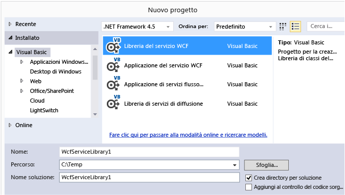
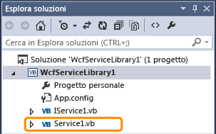
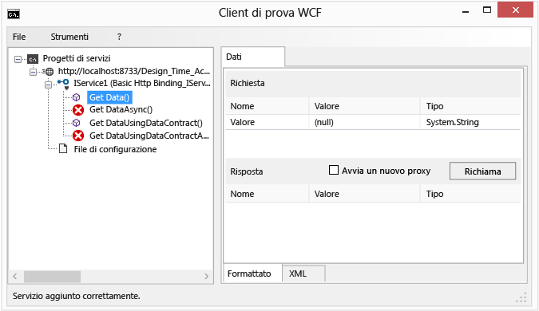
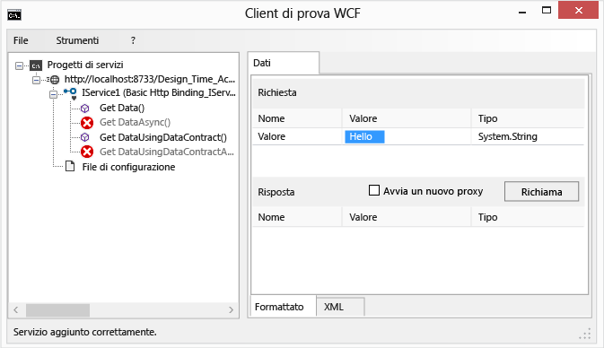
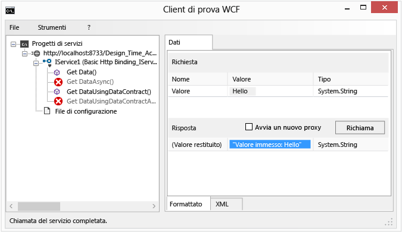
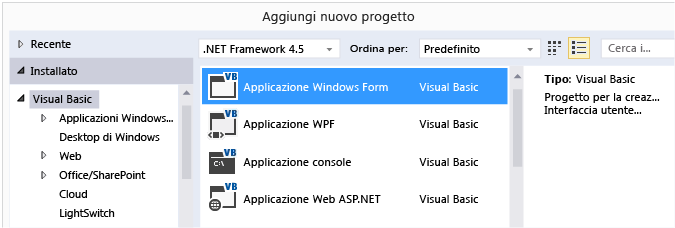
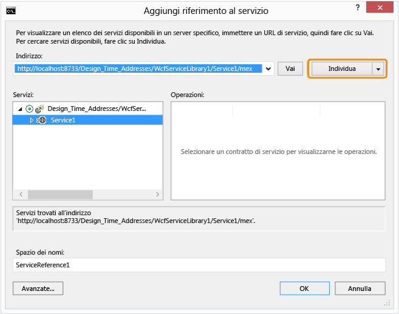
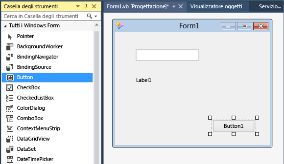

# Walkthrough: Creating and Accessing WCF Services
In questa procedura dettagliata viene illustrato come creare un semplice servizio [!INCLUDE[vsindigo](../data-tools/includes/vsindigo_md.md)], testarlo e accedervi da un'applicazione Windows Form.  
  
 [!INCLUDE[note_settings_general](../data-tools/includes/note_settings_general_md.md)]  
  
## Creazione del servizio  
  
#### Per creare un servizio WCF  
  
1.  Scegliere **Nuovo** dal menu **File**, quindi scegliere **Progetto**.  
  
2.  Nella finestra di dialogo **Nuovo progetto** espandere il nodo **Visual Basic** o **Visual C\#** e fare clic su **WCF**, seguito da **Libreria del servizio WCF**.  Fare clic su **OK** per aprire il progetto.  
  
       
  
    > [!NOTE]
    >  Viene creato un servizio di lavoro che può essere testato e a cui è possibile accedere.  I due passaggi seguenti mostrano come modificare il metodo predefinito per usare un tipo di dati diverso.  In un'applicazione reale verrebbero aggiunte anche le funzioni dell'utente al servizio.  
  
3.    
  
     In **Esplora soluzioni** fare doppio clic su IService1.vb o IService1.cs, quindi trovare la seguente riga:  
  
     [!code-cs[WCFWalkthrough#4](../data-tools/codesnippet/CSharp/walkthrough-creating-a-simple-wcf-service-in-windows-forms_1.cs)]
     [!code-vb[WCFWalkthrough#4](../data-tools/codesnippet/VisualBasic/walkthrough-creating-a-simple-wcf-service-in-windows-forms_1.vb)]  
  
     Modificare il tipo per il parametro `value` su `String`:  
  
     [!code-cs[WCFWalkthrough#1](../data-tools/codesnippet/CSharp/walkthrough-creating-a-simple-wcf-service-in-windows-forms_2.cs)]
     [!code-vb[WCFWalkthrough#1](../data-tools/codesnippet/VisualBasic/walkthrough-creating-a-simple-wcf-service-in-windows-forms_2.vb)]  
  
     Nel codice precedente annotare gli attributi `<OperationContract()>` o `[OperationContract]`.  Questi attributi sono richiesti per tutti i metodi esposti dal servizio.  
  
4.    
  
     In **Esplora soluzioni** fare doppio clic su Service1.vb o Service1.cs, quindi trovare la seguente riga:  
  
     [!code-vb[WCFWalkthrough#5](../data-tools/codesnippet/VisualBasic/walkthrough-creating-a-simple-wcf-service-in-windows-forms_3.vb)]
     [!code-cs[WCFWalkthrough#5](../data-tools/codesnippet/CSharp/walkthrough-creating-a-simple-wcf-service-in-windows-forms_3.cs)]  
  
     Modificare il tipo per il parametro value su `String`:  
  
     [!code-cs[WCFWalkthrough#2](../data-tools/codesnippet/CSharp/walkthrough-creating-a-simple-wcf-service-in-windows-forms_4.cs)]
     [!code-vb[WCFWalkthrough#2](../data-tools/codesnippet/VisualBasic/walkthrough-creating-a-simple-wcf-service-in-windows-forms_4.vb)]  
  
## Test del servizio  
  
#### Per testare un servizio WCF  
  
1.  Premere **F5** per eseguire il servizio.  Viene visualizzato un form **Client di prova WCF** che carica il servizio.  
  
2.  Nel form **Client di prova WCF** fare doppio clic sul metodo **GetData\(\)** in **IService1**.  Viene visualizzata la scheda **GetData**.  
  
       
  
3.  Nella casella **Richiesta** selezionare il campo **Valore** e digitare `Hello`.  
  
       
  
4.  Fare clic sul pulsante **Richiama**.  Se viene visualizzata una finestra di dialogo **Avviso di sicurezza** fare clic su **OK**.  Il risultato viene visualizzato nella casella **Risposta**.  
  
       
  
5.  Nel menu **File** fare clic su **Esci** per chiudere il form di test.  
  
## Accesso al servizio  
  
#### Per fare riferimento a un servizio WCF  
  
1.  Nel menu **File** scegliere **Aggiungi** e fare clic su **Nuovo progetto**.  
  
2.  Nella finestra di dialogo **Nuovo progetto** espandere il nodo **Visual Basic** o **Visual C\#**, selezionare **Windows**, quindi scegliere **Applicazione Windows Form**.  Fare clic su **OK** per aprire il progetto.  
  
       
  
3.  Fare clic con il pulsante destro del mouse su **WindowsApplication1**, quindi scegliere **Aggiungi riferimento al servizio**.  La finestra di dialogo **Aggiungi riferimento al servizio** viene visualizzata.  
  
4.  Nella finestra di dialogo **Aggiungi riferimento al servizio** fare clic su **Individua**.  
  
       
  
     **Service1** viene visualizzato nel riquadro **Servizi**.  
  
5.  Fare clic su **OK** per aggiungere il riferimento al servizio.  
  
#### Per compilare un'applicazione client  
  
1.  In **Esplora soluzioni** fare doppio clic su **Form1.vb** o **Form1.cs** per aprire Progettazione Windows Form, se non è già aperto.  
  
2.  Dalla **Casella degli strumenti** trascinare i controlli `TextBox`, `Label` e `Button` nel form.  
  
       
  
3.  Fare doppio clic su `Button` e aggiungere il seguente codice nel gestore eventi `Click`:  
  
     [!code-cs[WCFWalkthrough#3](../data-tools/codesnippet/CSharp/walkthrough-creating-a-simple-wcf-service-in-windows-forms_5.cs)]
     [!code-vb[WCFWalkthrough#3](../data-tools/codesnippet/VisualBasic/walkthrough-creating-a-simple-wcf-service-in-windows-forms_5.vb)]  
  
4.  In **Esplora soluzioni** fare clic con il pulsante destro del mouse su **WindowsApplication1**, quindi scegliere **Imposta come progetto di avvio**.  
  
5.  Premere **F5** per eseguire il progetto.  Immettere del testo e fare clic sul pulsante.  L'etichetta visualizza "Valore immesso:" e il testo immesso.  
  
       
  
## Vedere anche  
 [Esempio di uso di servizi ASMX e WCF](http://msdn.microsoft.com/it-it/788ddf2c-2ac1-416b-8789-2fbb1e29b8fe)