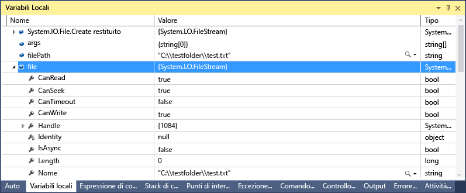
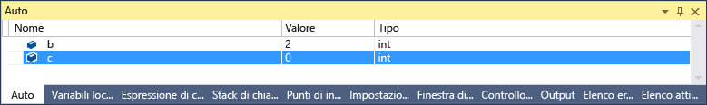
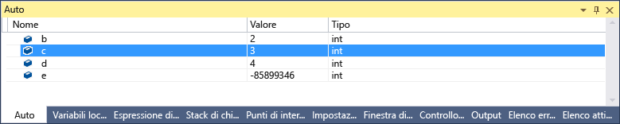
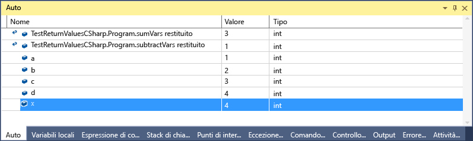

# <a name="inspect-variables-in-the-autos-and-locals-windows-in-visual-studio"></a>Controllare le variabili in auto e variabili locali Windows in Visual Studio
Il **Auto** finestra (durante il debug **CTRL + ALT + V, A**, o **Debug > Windows > Auto**) e **variabili locali** finestra (durante il debug **CTRL + ALT + V, L**, o **Debug > Windows > variabili locali**) sono molto utili quando si desidera visualizzare i valori delle variabili durante il debug. La finestra **Variabili locali** mostra le variabili definite nell'ambito locale, che corrisponde in genere alla funzione o al metodo attualmente in esecuzione. La finestra **Auto** mostra le variabili usate attorno alla riga corrente (il punto in cui il debugger viene arrestato). Esattamente le variabili da visualizzare in questa finestra è diverso in lingue diverse. Vedere [What variables appear in the Autos Window?](#bkmk_whatvariables) più avanti.  
  
Per altre informazioni sul debug di base, vedere [Getting Started with the Debugger](../debugger/getting-started-with-the-debugger.md).  
  
## <a name="looking-at-objects-in-the-autos-and-locals-windows"></a>Oggetti nelle finestre Variabili locali e Auto  
Le matrici e gli oggetti vengono visualizzati nelle finestre Variabili locali e Auto come controlli ad albero. Fare clic sulla freccia a sinistra del nome della variabile per espandere la visualizzazione e mostrare i campi e le proprietà. Ecco un esempio di oggetto [FileStream](http://msdn.microsoft.com/Library/a8737776-e545-4867-91ed-51c7f031fa19) nella finestra **Variabili locali** :  
  
  
  
## <a name="bkmk_whatvariables"></a> Quali variabili vengono visualizzate nella finestra Auto?  
 È possibile usare la finestra **Auto** nel codice C#, Visual Basic e C++. La finestra **Auto** non supporta JavaScript o F#.  
  
 In C# e Visual Basic la finestra **Auto** mostra tutte le variabili usate nella riga corrente o precedente. Se ad esempio si dichiarano quattro variabili impostate nel modo seguente:

```CSharp
    public static void Main()
    {
       int a, b, c, d;
       a = 1;
       b = 2;
       c = 3;
       d = 4;
    }
```

 Se si imposta un punto di interruzione nella riga `c = 3`e si esegue il debugger, quando l'esecuzione si arresta la finestra **Auto** risulterà analoga alla seguente:  

   

 Si noti che il valore di `c` è 0 perché la riga `c = 3` non è ancora stata eseguita.  

 In C++ la finestra **Auto** mostra le variabili usate almeno tre righe prima della riga corrente (la riga in cui viene arrestata l'esecuzione). Se si dichiarano sei variabili:

```C++
    void main() {
        int a, b, c, d, e, f;
        a = 1;
        b = 2;
        c = 3;
        d = 4;
        e = 5;
        f = 6;
    }
```

 Se si imposta un punto di interruzione nella riga `e = 5;` e si esegue il debugger, quando l'esecuzione si arresta la finestra **Auto** risulterà analoga alla seguente:  
  
   
  
 Si noti che la variabile e non è inizializzata perché il codice nella riga `e = 5;` non è ancora stato eseguito.  
  
 In alcune circostanze è anche possibile visualizzare i valori restituiti di funzioni e metodi. Vedere [View return values of method calls](#bkmk_returnValue) più avanti.  
  
##  <a name="bkmk_returnValue"></a> View return values of method calls  
 Nel codice .NET e C++ è possibile esaminare i valori restituiti quando si eseguono istruzioni/routine di una chiamata di metodo o si esce dalla chiamata. Questa funzionalità è utile quando il risultato di una chiamata di metodo non è archiviata in una variabile locale, ad esempio quando un metodo viene usato come parametro o valore restituito di un altro metodo.  
  
 Il codice C# seguente aggiunge i valori restituiti di due funzioni:  

```CSharp
static void Main(string[] args)  
{  
    int a, b, c, d;  
    a = 1;  
    b = 2;  
    c = 3;  
    d = 4;  
    int x = sumVars(a, b) + subtractVars(c, d);  
}  
  
private static int sumVars(int i, int j)  
{  
    return i + j;  
}  
  
private static int subtractVars(int i, int j)  
{  
    return j - i;  
}  
```

 Impostare un punto di interruzione su `int x = sumVars(a, b) + subtractVars(c, d);` linea  
  
 Avviare il debug e, quando l'esecuzione si interrompe al primo punto di interruzione, premere **F10 (Esegui istruzione/routine)**. Verrà visualizzato quanto segue nella finestra **Auto** :  
  
   
  
## <a name="why-are-variable-values-sometimes-red-in-locals-and-autos-windows"></a>Perché i valori delle variabili a volte sono visualizzati in rosso nelle finestre Variabili locali e Auto?  
In alcuni casi il valore di una variabile è visualizzato in rosso nelle finestre **Variabili locali** e **Auto** . Si tratta di valori variabili che sono stati modificati dopo l'ultima valutazione. La modifica può derivare da una precedente sessione di debug o dalla variazione del valore nella finestra.  
  
## <a name="changing-the-numeric-format-of-a-variable-window"></a>Modifica del formato numerico di una finestra di variabili  
Il formato numerico predefinito è decimale, ma è possibile cambiarlo in esadecimale. Fare clic con il pulsante destro del mouse all'interno di una finestra **Variabili locali** o **Auto** e scegliere **Visualizzazione esadecimale**. La modifica interessa tutte le finestre del debugger.  
  
## <a name="editing-a-value-in-a-variable-window"></a>Modifica di un valore in una finestra delle variabili  
È possibile modificare i valori della maggior parte delle variabili visualizzate nelle finestre **Auto**, **Variabili locali**, **Espressioni di controllo**e **Controllo immediato** . Per informazioni sulle finestre **Espressioni di controllo** e **Controllo immediato** , vedere [Watch and QuickWatch Windows](../debugger/watch-and-quickwatch-windows.md). È sufficiente fare doppio clic sul valore che si vuole modificare e aggiungere il nuovo valore.  
  
Si può immettere un'espressione al posto di un valore, ad esempio `a + b`. Il debugger accetta la maggior parte delle espressioni di linguaggio valide.  
  
Nel codice C++ nativo potrebbe essere necessario qualificare il contesto di un nome di variabile. Per altre informazioni, vedere [Context Operator (C++)](../debugger/context-operator-cpp.md).  
 
Prestare comunque attenzione quando si modificano i valori. Di seguito vengono indicati alcuni dei problemi possibili:  
  
-   La valutazione di alcune espressioni può comportare la modifica del valore di una variabile o altri effetti sullo stato del programma. Ad esempio, la valutazione `var1 = ++var2` modifica il valore di `var1` e `var2`.  
  
     Le espressioni che modificano i dati possono avere [effetti collaterali](https://en.wikipedia.org/wiki/Side_effect_\(computer_science\))che è necessario tenere in considerazione per evitare risultati imprevisti. Prima di apportare tali modifiche, è importante essere consapevoli delle conseguenze.  
  
-   La modifica di valori a virgola mobile può causare lievi inesattezze dovute alla conversione dei componenti frazionari da decimali a binari. Anche una modifica apparentemente innocua può generare modifiche in alcuni dei bit meno significativi in una variabile a virgola mobile.  
  
## <a name="changing-the-window-context"></a>La modifica del contesto di finestra  
È possibile utilizzare il **posizione di Debug** barra degli strumenti per selezionare la funzione desiderata, thread o processo che modifica il contesto per le finestre delle variabili. Impostare un punto di interruzione e avviare il debug (se questa barra degli strumenti non è visualizzata, è possibile abilitarla facendo clic in una parte vuota dell'area della barra degli strumenti; quando viene visualizzato un elenco delle barre degli strumenti, selezionare **Posizione di debug**). Quando viene raggiunto il punto di interruzione, esecuzione si interrompe e si può vedere barra degli strumenti posizione di Debug, ovvero la riga inferiore nella figura seguente.
  
   
  
## <a name="see-also"></a>Vedere anche  
 [Finestre del debugger](../debugger/debugger-windows.md)
