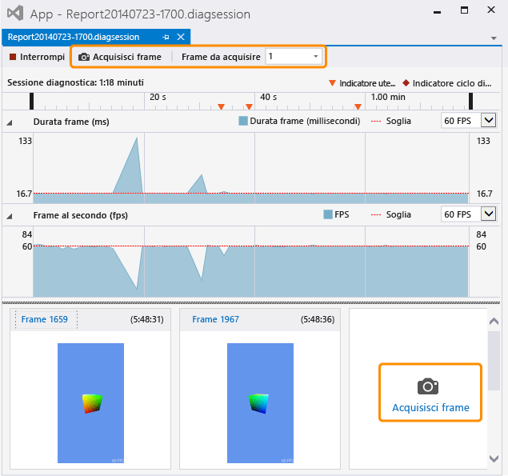

# Cattura informazioni grafica
[!INCLUDE[vs2017banner](../code-quality/includes/vs2017banner.md)]

Acquisire informazioni grafiche dall'app Direct3D così da poter usare Analizzatore grafica di Visual Studio per diagnosticare i problemi di rendering e di prestazioni.  
  
## Acquisizione di informazioni grafiche  
 L'acquisizione di informazioni grafiche è un processo costituito da due fasi.  Innanzitutto, eseguire l'applicazione nella diagnostica grafica, quindi specificare uno o più frame da cui acquisire informazioni dettagliate.  
  
#### Per eseguire l'applicazione nella diagnostica grafica  
  
-   Nella barra dei menu scegliere **Debug**, **Grafica**, **Avvia diagnostica**.  Tastiera: premere ALT\+F5.  
  
-   Nella barra degli strumenti **Grafica** selezionare il pulsante **Avvia diagnostica**.  
  
 Se un'app è in esecuzione nella diagnostica grafica, verranno costantemente acquisiti determinati tipi di informazioni grafiche, tra cui la configurazione dei dispositivi, la creazione della catena di scambio e di oggetti grafici e risorse, nonché altri eventi importanti che influiscono su più di un frame.  Contemporaneamente, è possibile acquisire informazioni dettagliate su frame specifici; tali informazioni includono chiamate di disegno e invii di compute shader, oltre a risorse e oggetti Direct3D che li supportano.  
  
#### Per acquisire un frame  
  
-   Nella barra degli strumenti **Grafica** in Visual Studio selezionare il pulsante **Acquisisci frame**.  
  
-   Premere STAMP sulla tastiera.  
  
    > [!NOTE]
    >  Mentre un'app è in esecuzione in **Diagnostica grafica**, è possibile usare il tasto STAMP solo per acquisire un frame di informazioni grafiche e non per eseguire la funzione standard.  Questa condizione rimarrà attiva finché non si deciderà di interrompere l'acquisizione delle informazioni grafiche, in genere arrestando il debug o chiudendo l'app, anche se un'altra app presenta lo stato attivo.  
  
-   Nell'interfaccia di acquisizione di Visual Studio scegliere il pulsante **Acquisisci frame** che si trova sopra la sequenza temporale **Diagnostica sessione** o scegliere il pulsante di grandi dimensioni **Acquisisci frame** che si trova sotto la corsia **Frame al secondo** e a destra dei frame acquisiti in precedenza.  Entrambi i pulsanti sono evidenziati nell'immagine seguente.  
  
       
  
     Quando si è pronti per esaminare i frame acquisiti, avviare **Analizzatore grafica di Visual Studio** facendo clic sul collegamento **Frame** sopra le anteprime delle immagini oppure facendo doppio clic sull'anteprima.  
  
 È possibile acquisire solo frame interi e quindi, all'avvio di un'acquisizione, verranno effettivamente registrate le informazioni grafiche dal frame successivo.  La registrazione inizierà immediatamente dopo aver verificato il frame in cui è stata avviata l'acquisizione e terminerà dopo aver verificato il frame acquisito.  È possibile acquisire un numero indefinito di frame mentre l'app è in esecuzione nella diagnostica grafica.  In assenza di frame acquisiti, il log di grafica verrà rimosso.  
  
 Durante l'acquisizione dei frame, Visual Studio visualizza la finestra della sessione di diagnostica \(con estensione diagsession\).  Se si chiude questa finestra, si arresta il debug o si chiude l'app, non sarà possibile acquisire altri frame nel log.  Per acquisire più informazioni grafiche, è necessario eseguire nuovamente l'app in Diagnostica grafica per avviare un nuovo log di grafica.  
  
### Opzioni di acquisizione di diagnostica grafica  
 È possibile configurare l'acquisizione per raccogliere stack di chiamate per tutti gli eventi grafici o per un subset limitato, per disabilitare l'HUD per l'acquisizione e per abilitare o disabilitare l'acquisizione in modalità di compatibilità.  
  
##### Per configurare le opzioni di acquisizione di diagnostica grafica  
  
1.  Nella barra dei menu scegliere Strumenti, Opzioni.  Verrà visualizzata la finestra di dialogo Opzioni.  
  
2.  Nell'elenco di categorie delle opzioni a sinistra scegliere Diagnostica grafica, quindi configurare le opzioni desiderate di Diagnostica grafica.  
  
     **Raccogli stack di chiamate durante l'acquisizione \(rallenta l'acquisizione\)**  
     Selezionare questa casella per raccogliere gli stack di chiamate.  Per impostazione predefinita, gli stack di chiamate non vengono raccolti.  Per acquisire gli stack di chiamate, assicurarsi che la casella di controllo **Raccogli stack di chiamate durante l'acquisizione \(rallenta l'acquisizione\)** sia selezionata e quindi impostare l'opzione **per indicatori \_draw, dispatch, present e perf** \(predefinita\) per raccogliere solo gli stack di chiamate più importanti oppure l'opzione **per tutto** per raccogliere tutti gli stack di chiamate.  Per interrompere la raccolta degli stack di chiamate in un momento successivo, deselezionare la casella di controllo **Raccogli stack di chiamate durante l'acquisizione \(rallenta l'acquisizione\)**.  
  
     **Disabilita HUD di gioco durante l'acquisizione**  
     Selezionare questa casella per disabilitare l'hud in sovraimpressione visualizzato in genere da un'app in esecuzione nella diagnostica grafica.  Deselezionarla per visualizzare l'hud in sovraimpressione.  
  
     **Acquisisci in modalità di compatibilità**  
     Selezionare questa casella per acquisire le informazioni grafiche in modalità di compatibilità.  L'acquisizione in modalità di compatibilità è l'impostazione predefinita.  In modalità di compatibilità Direct3D non segnalerà che la GPU supporta tutte le funzionalità aggiuntive oltre a quelle definite nel livello funzionalità di base.  Ciò impedisce all'app da acquisire di usare le estensioni specifiche dell'hardware della GPU su cui viene acquisita e assicura che il log di grafica possa essere riprodotto con qualsiasi GPU che supporta lo stesso livello funzionalità o un livello superiore.  Deselezionare questa casella per disabilitare la modalità di compatibilità. I log acquisiti con la modalità di compatibilità disabilitata non verranno riprodotti su una GPU che non supporta le stesse funzionalità aggiuntive usate dall'app durante l'acquisizione.  
  
     **Arresta acquisizione in presenza di errori dei livelli SDK**  
     Selezionare questa casella per interrompere immediatamente l'acquisizione se vengono rilevati errori.  
  
## Acquisizione remota di informazioni grafiche  
 È possibile acquisire informazioni grafiche da un'app in esecuzione nel computer locale o in un computer o dispositivo remoto.  L'acquisizione remota è supportata per i computer [!INCLUDE[winblue_client_2](../debugger/includes/winblue_client_2_md.md)] e i dispositivi [!INCLUDE[winblue_winrt_2](../debugger/includes/winblue_winrt_2_md.md)].  Per acquisire informazioni grafiche da un'app in esecuzione in remoto, configurare il progetto per il debug remoto e quindi eseguire l'app nella diagnostica grafica come descritto in precedenza.  L'app viene eseguita nel computer remoto e le informazioni grafiche acquisite vengono registrate nel computer di sviluppo.  
  
 La modalità di configurazione del progetto per il debug remoto varia a seconda del tipo di app sviluppata e dal linguaggio di programmazione in uso.  Per informazioni su come configurare il debug remoto di un'app di Windows Store, vedere [Eseguire app di Windows Store in un computer remoto](../debugger/run-windows-store-apps-on-a-remote-machine.md).  Per informazioni su come configurare il debug remoto per un'app desktop di Windows, vedere [Impostazione del debug remoto per un progetto di Visual Studio](../Topic/Set%20Up%20Remote%20Debugging%20for%20a%20Visual%20Studio%20Project.md).  
  
 Successivamente sarà possibile usare un computer o un dispositivo remoto per riprodurre le informazioni grafiche, indipendentemente dall'origine dell'acquisizione.  Per altre informazioni, vedere [Procedura: modificare il computer di riproduzione della diagnostica grafica](../debugger/how-to-change-the-graphics-diagnostics-playback-machine.md).  
  
## Acquisizione di informazioni grafiche dalla riga di comando  
 È possibile acquisire le informazioni grafiche da un'app con uno strumento da riga di comando.  Questo strumento, DXCap.exe, può acquisire e riprodurre rapidamente le informazioni grafiche senza usare Visual Studio o l'acquisizione a livello di codice.  In particolare, è possibile usare DXCap.exe per l'automazione o in un ambiente di test.  Per altre informazioni su DXCap.exe, vedere [Strumento di acquisizione da riga di comando](../debugger/command-line-capture-tool.md).  
  
## Vedere anche  
 [Procedura dettagliata: cattura delle informazioni grafica](../debugger/walkthrough-capturing-graphics-information.md)