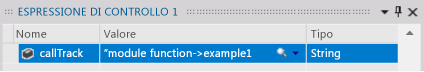
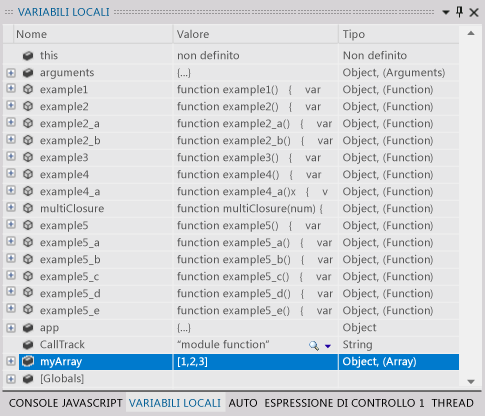
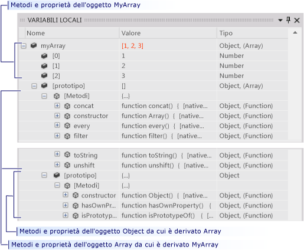
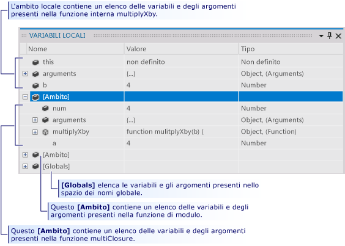

# Controllare l'esecuzione di un'app UWP in una sessione di debug di Visual Studio (JavaScript)
Questa guida introduttiva illustra come spostarsi nel debugger di Visual Studio e come visualizzare lo stato del programma in una sessione.  
  
 La guida è destinata agli sviluppatori che non hanno familiarità con il debug in Visual Studio e a coloro che desiderano avere maggiori informazioni su come spostarsi in una sessione di debug di Visual Studio, ma non insegna l'arte stessa del debug Le funzioni incluse nel codice di esempio sono concepite solo per illustrare le procedure di debug descritte in questo argomento. Non usano procedure consigliate per la progettazione di app o funzioni. In realtà, come si scoprirà presto, le funzioni e l'app stessa non hanno alcuna finalità pratica.  
  
 Le sezioni di questa guida introduttiva sono state progettate nell'ottica della massima indipendenza per consentire di ignorare le eventuali sezioni contenenti informazioni già note. Non è necessario creare l'app di esempio, anche se è consigliabile e abbiamo fatto in modo da rendere il processo più semplice possibile.  
  
 **Tasti di scelta rapida del debugger.** La navigazione all'interno del debugger di Visual Studio è ottimizzata sia per il mouse che per la tastiera. In molti passaggi di questo argomento è indicato il tasto di scelta rapida in un commento racchiuso tra parentesi. Ad esempio, (tastiera: F5) indica che premendo il tasto F5 si avvia o si continua l'esecuzione del debugger.  
  
> [!NOTE]
>  **Il modello di modulo**  
>   
>  App UWP usano spesso il codice JavaScript *modello Module* per incapsulare i dati e le funzioni in una pagina. Il modello Module usa una singola chiusura anonima a esecuzione automatica per mantenere la funzionalità della pagina separata dallo spazio dei nomi globale. Tale funzione viene chiamata *module*in questo argomento.  
  
## Contenuto dell'argomento  
 Vengono illustrate le seguenti procedure:  
  
 [Creare l'app di esempio](#BKMK_Create_the_sample_app)  
  
 [Impostare e raggiungere un punto di interruzione, eseguire un'istruzione in una funzione ed esaminare i dati del programma](#BKMK_Set_and_run_to_a_breakpoint__step_into_a_function__and_examine_program_data)  
  
 [Eseguire un'istruzione, eseguire un'istruzione/routine e uscire da un'istruzione/routine delle funzioni](#BKMK_Step_into__over__and_out_of_functions)  
  
 [Impostare un punto di interruzione condizionale, eseguire fino al cursore e visualizzare una variabile](#BKMK_Set_a_conditional_breakpoint__run_to_the_cursor__and_visualize_a_variable)  
  
 [Visualizzare i dati delle variabili nella finestra Variabili locali](#BKMK_View_variable_data_in_the_Locals_window)  
  
-   [Visualizzare i dati delle variabili e la catena di prototipi di un oggetto](#BKMK_View_variable_data_and_the_prototype_chain_of_an_object)  
  
-   [Esaminare i dati nella catena dell'ambito](#BKMK_Examine_scope_chain_data)  
  
 [Passare al codice tramite la finestra Stack di chiamate](#BKMK_Navigate_to_code_by_using_the_Call_Stack_window)  
  
##   Creare l'app di esempio  
 Il debug viene eseguito sul codice, l'app di esempio Usa il framework dell'app UWP solo per creare un file di origine in cui è possibile vedere come funziona la navigazione in una sessione di debug e come esaminare lo stato del programma. Tutto il codice richiamato viene chiamato dalla funzione `module` del file default.js. Non vengono aggiunti controlli, né gestiti eventi.  
  
1.  **Creare un'app UWP JavaScript vuota.** Aprire Visual Studio. Nella home page scegliere il collegamento **Nuovo progetto** . Nel **nuovo progetto** finestra di dialogo scegliere **JavaScript** nel **installato** elenco e quindi scegliere **universali di Windows**. Nell'elenco dei modelli di progetto, scegliere **App vuota (Windows universale)**. Visual Studio crea una nuova soluzione e il progetto, visualizzando il file default.htm nell'editor di codice.  
  
     Osservare i file di script caricati nella pagina.  
  
    -   I file `base.js` e `ui.js` creano la **libreria Windows per JavaScript**. La libreria Windows per JavaScript è un set di JavaScript e il file CSS che rendono più semplice per creano App UWP scritte in JavaScript. Viene usata insieme a HTML, CSS e Windows Runtime per creare l'app.  
  
    -   Il codice inizia nel file `default.js`  .  
  
2.  **Aprire il file di origine default.js.** In Esplora soluzioni aprire il nodo **js** e scegliere `default.js`in questo argomento.  
  
3.  **Sostituire il contenuto della pagina con il codice di esempio.** Eliminare tutto il contenuto dal file `default.js` . Fare clic sul collegamento: [Debugger navigation sample code (JavaScript)](../debugger/debugger-navigation-sample-code-javascript.md), quindi copiare negli Appunti il codice elencato nella sezione JavaScript. (Scegliere **nuovamente** nel browser o Visualizzatore della Guida per tornare a questa pagina introduttiva.) Nell'editor di Visual Studio incolla il codice nel file `default.js` vuoto. Scegliere **CTRL+S** per salvare il file.  
  
 È ora possibile continuare seguendo gli esempi in questo argomento.  
  
##   Impostare e raggiungere un punto di interruzione, eseguire un'istruzione in una funzione ed esaminare i dati del programma  
 Il modo più comune per avviare una sessione di debug consiste nello scegliere **Avvia debug** dal menu **Debug** (tastiera: F5). L'app viene avviata e resta in esecuzione fino a quando non viene raggiunto un punto di interruzione, non viene sospesa manualmente o non si verifica un'eccezione oppure fino al termine dell'app.  
  
 Quando l'esecuzione viene sospesa nel debugger, è possibile visualizzare il valore di una variabile attiva in un suggerimento dati posizionando il puntatore del mouse sulla variabile.  
  
 Dopo la sospensione dell'esecuzione dell'app, un'operazione nota anche come inserimento di un'interruzione nel debugger, è possibile controllare in che modo viene eseguito il resto del codice programma. Si può continuare riga per riga, passando da una chiamata di funzione alla funzione stessa, o eseguire una funzione chiamata in un singolo passaggio. Queste procedure sono dette esecuzione dell'app un'istruzione alla volta. È inoltre possibile riprendere la normale esecuzione dell'app, continuandola fino al successivo punto di interruzione impostato o fino alla riga in cui è posizionato il cursore. La sessione di debug può essere terminata in qualsiasi momento. Il debugger è progettato per eseguire le necessarie operazioni di pulizia e per uscire dall'esecuzione.  
  
###   Esempio 1  
 In questo esempio viene impostato un punto di interruzione nel corpo della funzione `module` in `default.js` che chiama la prima delle istruzioni utente. Viene quindi eseguita un'istruzione nella funzione, vengono visualizzati i valori delle variabili nei suggerimenti dati del debugger, quindi si arresta il debug.  
  
1.  **Impostare un punto di interruzione.** Impostare un punto di interruzione in corrispondenza dell'istruzione `callTrack = "module function";` subito dopo la chiamata a `app.start()`in questo argomento. Scegliere la riga nella barra di navigazione ombreggiata dell'editor del codice sorgente (tastiera: posizionare il cursore sulla riga e premere **F9** ).  
  
       
  
     L'icona del punto di interruzione viene visualizzata nella barra.  
  
2.  **Eseguire fino al punto di interruzione.** Avviare la sessione di debug scegliendo **Avvia debug** on the **Debug** (tastiera: F5).  
  
     L'esecuzione dell'app inizia e viene sospesa immediatamente prima dell'istruzione in cui è stato impostato il punto di interruzione. L'icona della riga corrente nella barra di navigazione identifica la posizione e l'istruzione corrente risulta evidenziata.  
  
       
  
     A questo punto è possibile controllare l'esecuzione dell'app ed esaminare lo stato del programma mentre si esegue il codice un'istruzione alla volta.  
  
3.  **Eseguire un'istruzione nella funzione.** Nella finestra di dialogo **Debug** dal menu **Debug** (tastiera: **F11**).  
  
       
  
     Si noti che il debugger passa alla riga successiva, che corrisponde a una chiamata alla funzione `example1` . Scegliere di nuovo **Esegui istruzione** . Il debugger passa alla prima riga di codice della funzione `example1` . La riga evidenziata non è stata eseguita, ma la funzione è stata caricata nello stack di chiamate ed è stata allocata la memoria per le variabili locali.  
  
4.  Quando si esegue un'istruzione in una riga di codice, il debugger esegue una delle seguenti azioni:  
  
    -   Se l'istruzione successiva non è una chiamata a una funzione nella soluzione, il debugger esegue l'istruzione, passa all'istruzione successiva e quindi sospende l'esecuzione.  
  
    -   Se l'istruzione è una chiamata a una funzione nella soluzione, il debugger passa alla prima riga della funzione chiamata, quindi sospende l'esecuzione.  
  
     Continua a eseguire le istruzioni in `example1` finché non avrai raggiunto il punto di uscita. Il debugger evidenzia la parentesi graffa chiusa della funzione.  
  
5.  **Visualizzare i valori delle variabili nei suggerimenti dati.** Continua a eseguire le istruzioni in `example1` finché non avrai raggiunto il punto di uscita. Il debugger evidenzia la parentesi graffa chiusa della funzione. Quando si posiziona il puntatore del mouse su un nome di variabile, il nome e il valore della variabile vengono visualizzati in un suggerimento dati.  
  
       
  
6.  **Aggiungere un'espressione di controllo per la variabile callTrack** I file `callTrack` viene usata in tutta la guida introduttiva per illustrare le funzioni chiamate negli esempi. Per visualizzare più facilmente il valore della variabile, aggiungerla a una finestra Espressioni di controllo. Selezionare il nome della variabile nell'editor, quindi scegliere **Aggiungi espressione di controllo** dal menu di scelta rapida.  
  
       
  
     È possibile controllare più variabili in una finestra Espressioni di controllo. I valori delle variabili controllate, come i valori nelle finestre dei suggerimenti dati, vengono aggiornati a ogni sospensione dell'esecuzione. Le variabili controllate vengono salvate in tutte le sessioni di debug.  
  
7.  **Terminare il debug.** Nella finestra di dialogo **Debug** dal menu **Debug** (tastiera: **MAIUSC+F5**). La sessione di debug verrà terminata.  
  
##   Eseguire un'istruzione, eseguire un'istruzione/routine e uscire da un'istruzione/routine delle funzioni  
 A differenza dell'esecuzione di un'istruzione in una funzione chiamata da una funzione padre, l'esecuzione di un'istruzione/routine in una funzione comporta l'esecuzione della funzione figlio e la successiva sospensione dell'esecuzione nella funzione chiamante alla ripresa della funzione padre. Prima di eseguire un'istruzione/routine di una funzione, è opportuno avere acquisito familiarità con il funzionamento della funzione e avere la certezza che questa operazione non influisca sul problema che si sta analizzando.  
  
 L'esecuzione di un'istruzione/routine in una riga di codice che non contiene una chiamata alla funzione ha lo stesso effetto della semplice esecuzione di un'istruzione nella riga.  
  
 All'uscita da un'istruzione/routine di una funzione figlio, l'esecuzione della funzione continua, quindi viene sospesa dopo che la funzione sarà ritornata alla relativa funzione chiamante. È possibile uscire da un'istruzione/routine di una funzione lunga dopo aver stabilito che il resto della funzione non è significativo.  
  
 Sia l'esecuzione che l'uscita da un'istruzione/routine di una funzione comporta l'esecuzione della funzione.  
  
   
  
###   Esempio 2  
 In questo esempio proverai a eseguire un'istruzione, eseguire un'istruzione/routine e uscire da un'istruzione/routine delle funzioni.  
  
1.  **Chiamare la funzione example2 nella funzione module** . Modificare la funzione `module` e sostituire la riga che segue `var callTrack = "module function"` con `example2();`in questo argomento.  
  
       
  
2.  **Eseguire fino al punto di interruzione.** Avviare la sessione di debug scegliendo **Avvia debug** on the **Debug** (tastiera: F5). Il debugger sospende l'esecuzione in corrispondenza del punto di interruzione.  
  
3.  **Eseguire un'istruzione/routine della riga di codice.** Nella finestra di dialogo **Debug** dal menu **Debug** (tastiera: F10). Il debugger esegue l'istruzione `var callTrack = "module function"` nello stesso modo in cui procede all'esecuzione dell'istruzione.  
  
4.  **Eseguire un'istruzione in example2 e in example2_a.** Premere **F11** per eseguire un'istruzione nella funzione `example2` . Continuare a eseguire le istruzioni in `example2` fino a raggiungere la riga `var x = example2_a();`. Eseguire quindi l'istruzione in questa riga per passare al punto di ingresso di `example2_a`. Continuare a eseguire ogni istruzione in `example2_a` fino a tornare a `example2`.  
  
       
  
5.  **Eseguire un'istruzione/routine di una funzione.** Si noti che la riga successiva in `example2`, `var y = example2_a();` è fondamentalmente uguale alla riga precedente. È possibile eseguire tranquillamente l'istruzione/routine in questa riga. Premere **F10** per passare dalla ripresa di `example2` a questa seconda chiamata a `example2_a`. La stringa `callTrack` indica che la funzione `example2_a` è stata eseguita due volte.  
  
6.  **Uscire dall'istruzione/routine di una funzione.** Premere **F11** per eseguire un'istruzione nella funzione `example2_b` . Si noti che `example2_b` non è molto diversa da `example2_a`. Per uscire dall'istruzione/routine della funzione, scegliere **Esci da istruzione/routine** dal menu **Debug** (tastiera: **MAIUSC+F11**). La variabile `callTrack` indica che `example2_b` è stato eseguito e che il debugger è ritornato al punto in cui riprende `example2` .  
  
7.  **Terminare il debug.** Nella finestra di dialogo **Debug** dal menu **Debug** (tastiera: **MAIUSC+F5**). La sessione di debug verrà terminata.  
  
##   Impostare un punto di interruzione condizionale, eseguire fino al cursore e visualizzare una variabile  
 Un punto di interruzione condizionale specifica una condizione che determina la sospensione dell'esecuzione da parte del debugger. La condizione viene specificata da una qualsiasi espressione di codice che possa restituire true o false. È possibile usare un punto di interruzione, ad esempio, per esaminare lo stato del programma in una funzione chiamata di frequente solo quando una variabile raggiunge un determinato valore.  
  
 L'esecuzione fino al cursore corrisponde all'impostazione di un punto di interruzione unico. Quando l'esecuzione viene sospesa, è possibile selezionare una riga nell'origine e riprendere l'esecuzione fino a raggiungere la riga selezionata. Ad esempio, si supponga che durante l'esecuzione di un ciclo in una funzione si determini che il codice nel ciclo viene eseguito correttamente. Anziché eseguire ogni singola iterazione del ciclo, è possibile scegliere di eseguire fino al cursore che viene posizionato dopo l'esecuzione del ciclo.  
  
 A volte è difficile visualizzare il valore di una variabile nella riga di un suggerimento dati o in un'altra finestra dati. Il debugger consente di visualizzare stringhe, HTML e XML in un visualizzatore di testo che presenta una visualizzazione formattata del valore in una finestra scorrevole.  
  
###   Esempio 3  
 In questo esempio si imposterà un punto di interruzione condizionale che interrompe un'iterazione specifica di un ciclo, quindi procede all'esecuzione fino al cursore inserito dopo il ciclo. È inoltre possibile visualizzare il valore di una variabile in un visualizzatore di testo.  
  
1.  **Chiamare la funzione example3 nella funzione module.** . Modificare la funzione `module` e sostituire la riga che segue `var callTrack = "module function";` con la riga `example3();`in questo argomento.  
  
       
  
2.  **Eseguire fino al punto di interruzione.** Avviare la sessione di debug scegliendo **Avvia debug** on the **Debug** (tastiera: **F5**). Il debugger sospende l'esecuzione nel punto di interruzione della funzione `module` .  
  
3.  **Eseguire un'istruzione nella funzione example3.** Scegliere **Debug** on the **Debug** (tastiera: **F11**) per passare al punto di ingresso della funzione `example3` . Continuare a eseguire istruzioni nella funzione fino a completare l'iterazione di uno o due cicli del blocco `for` . Si noti che l'esecuzione di tutte e 1000 le iterazioni richiederebbe molto tempo.  
  
4.  **Impostare un punto di interruzione condizionale.** Nella barra di navigazione a sinistra della finestra del codice fare clic con il pulsante destro del mouse sulla riga `s += i.toString() + "\n";` e quindi scegliere **Condizione** dal menu di scelta rapida.  
  
     Selezionare la casella di controllo **Condizione** e quindi digitare `i == 500;` nella casella di testo. Scegliere l'opzione **È true** e quindi **OK**. Il punto di interruzione consente di controllare il valore alla 500a iterazione del ciclo `for` . È possibile identificare un punto di interruzione condizionale dalla relativa icona con una croce bianca.  
  
       
  
5.  **Eseguire fino al punto di interruzione.** Nella finestra di dialogo **Debug** dal menu **Debug** (tastiera: **F5**). Posizionare il puntatore del mouse su `i` per verificare che il valore corrente di `i` sia 500. Si noti anche che la variabile `s` viene rappresentata come riga singola ed è molto più lunga della finestra Suggerimento dati.  
  
6.  **Visualizzare una variabile di tipo stringa.** Fare clic sull'icona a forma di lente di ingrandimento nel suggerimento dati di `s`in questo argomento.  
  
     Verrà visualizzata la finestra del Visualizzatore testo con il valore della stringa presentato come una stringa con più righe.  
  
       
  
7.  **Eseguire fino al cursore.** Selezionare la riga `callTrack += "->example3";` e quindi scegliere **Esegui fino al cursore** dal menu di scelta rapida (tastiera: **CTRL+F10**). Il debugger completa le iterazioni del ciclo e quindi sospende l'esecuzione in corrispondenza della riga.  
  
8.  **Terminare il debug.** Nella finestra di dialogo **Debug** dal menu **Debug** (tastiera: **MAIUSC+F5**). La sessione di debug verrà terminata.  
  
###   Usare Esegui fino al cursore per tornare al codice ed eliminare un punto di interruzione  
 L'esecuzione fino al cursore può essere molto utile quando è stata eseguita un'istruzione nel codice di libreria di Microsoft o di terze parti. Mentre l'esecuzione di un'istruzione alla volta nel codice di libreria può fornire informazioni, spesso richiede molto tempo e in genere si è molto più interessati al proprio codice. Questo esercizio illustra come procedere.  
  
1.  **Impostare un punto di interruzione nella chiamata di app.start.** In the `module` impostare un punto di interruzione sulla riga `app.start()`  
  
2.  **Eseguire fino al punto di interruzione ed eseguire un'istruzione nella funzione della libreria.**  
  
     Quando esegui un'istruzione in `app.start()`, l'editor visualizza il codice in `base.js`. Eseguire un'istruzione in qualche altra riga.  
  
3.  **Eseguire un'istruzione/routine e uscire da un'istruzione/routine delle funzioni.** Mentre si esegue un'istruzione/routine (**F10**) e si esce da un'istruzione/routine (**SHIFT+F11**) del codice in `base.js`, è possibile che si decida che esaminare la complessità e la lunghezza della funzione di avvio non sia ciò che si vuole fare.  
  
4.  **Impostare il cursore nel codice e procedere all'esecuzione fino a quel punto.** Tornare al file `default.js` nell'editor di codice. Selezionare la prima riga di codice dopo `app.start()` (non si può eseguire fino a un commento o a una riga vuota). Scegliere **Esegui fino al cursore** dal menu di scelta rapida. Il debugger continua l'esecuzione della funzione app.start e sospende l'esecuzione in corrispondenza del punto di interruzione.  
  
##   Visualizzare i dati delle variabili nella finestra Variabili locali  
 La finestra Variabili locali è una visualizzazione ad albero dei parametri e delle variabili nella catena dell'ambito della funzione attualmente in esecuzione.  
  
###   Visualizzare i dati delle variabili e la catena di prototipi di un oggetto  
  
1.  **Aggiungere un oggetto array alla funzione module.** . Modificare la funzione `module` e sostituire la riga che segue `var callTrack = "module function"` con `var myArray = new Array(1, 2, 3);`  
  
       
  
2.  **Eseguire fino al punto di interruzione.** Avviare la sessione di debug scegliendo **Avvia debug** on the **Debug** (tastiera: **F5**). Il debugger sospende l'esecuzione in corrispondenza del punto di interruzione. Eseguire un'istruzione nella riga.  
  
3.  **Aprire la finestra Variabili locali.** Nella finestra di dialogo **Debug** dal menu **Debug**e quindi **Variabili locali**in questo argomento. (Tastiera: ALT+4).  
  
4.  **Esaminare le variabili locali nella funzione module** Le finestra Variabili locali visualizza le variabili della funzione attualmente in esecuzione (la funzione `module` ) come nodi di primo livello dell'albero. Quando si immette una funzione, JavaScript crea tutte le variabili e fornisce a ognuna un valore `undefined`. Nelle funzioni definite nella funzione viene usato il relativo testo come valore.  
  
       
  
5.  **Eseguire le definizioni callTrack e myArray un'istruzione alla volta.** Individuare le variabili callTrack e myArray nella finestra Variabili locali. Eseguire un'istruzione/routine (**F10**) delle due definizioni e notare che i campi **Valore** e **Tipo** vengono modificati. Nella finestra Variabili locali vengono evidenziati i valori delle variabili modificati dall'ultima interruzione.  
  
6.  **Esaminare l'oggetto myArray** Espandere la variabile `myArray` . Ogni elemento della matrice è elencato nel nodo **[prototype]** che contiene la gerarchia di ereditarietà dell'oggetto `Array` . Espandere questo nodo.  
  
       
  
    -   Nel nodo **Methods** sono elencati tutti i metodi dell'oggetto `Array` .  
  
    -   Il nodo **[prototype]** contiene il prototipo dell'oggetto `Object` da cui è derivato `Array` . I nodi**[prototype]** possono essere ricorsivi. Ogni oggetto padre in una gerarchia di oggetti è descritto nel nodo **[prototype]** del relativo elemento figlio.  
  
7.  **Terminare il debug.** On the **Debug** dal menu **Debug** (tastiera: MAIUSC+F5). La sessione di debug verrà terminata.  
  
##   Esaminare i dati nella catena dell'ambito  
 La *catena dell'ambito* di una funzione include tutte le variabili attive e raggiungibili dalla funzione. Le variabili globali fanno parte della catena dell'ambito, come tutti gli oggetti (funzioni incluse) specificati nella funzione che definisce la funzione attualmente in esecuzione. La variabile `callTrack` definita nella funzione `module` di `default.js` , ad esempio, è raggiungibile da qualsiasi funzione definita nella funzione `module` . Ogni ambito è elencato separatamente nella finestra Variabili locali.  
  
-   Le variabili della funzione attualmente in esecuzione sono elencate nella parte superiore della finestra.  
  
-   Le variabili dell'ambito di ogni funzione nella catena dell'ambito sono elencate nel nodo **[Scope]** relativo alla funzione. Le funzioni di ambito sono elencate in base al relativo ordine nella catena, dalla funzione che definisce la funzione corrente alla funzione più esterna della catena.  
  
-   Nel nodo **[Globals]** sono elencati gli oggetti globali definiti all'esterno di qualsiasi funzione.  
  
 Le catene dell'ambito possono generare confusione e vengono illustrate più chiaramente con un esempio. L'esempio seguente illustra in che modo la funzione `module` crea il relativo ambito e come è possibile creare un altro livello di ambito creando una chiusura.  
  
###   Esempio 4  
  
1.  **Chiamare la funzione example4 dalla funzione module.** . Modificare la funzione `module` e sostituire la riga che segue `var callTrack = "module function"` con `example4()`:  
  
       
  
2.  **Eseguire fino al punto di interruzione.** Avviare la sessione di debug scegliendo **Avvia debug** on the **Debug** (tastiera: **F5**). Il debugger sospende l'esecuzione in corrispondenza del punto di interruzione.  
  
3.  **Aprire la finestra Variabili locali.** Se necessario, scegliere **Debug** dal menu **Debug**e quindi **Variabili locali**in questo argomento. (Tastiera: **ALT+4**). Si noti che nella finestra sono elencate tutte le variabili e le funzioni della funzione `module` ed è presente anche un nodo **[Globals]** .  
  
4.  **Esaminare le variabili globali.** Espandere la variabile **[Globals]** . Gli oggetti e le variabili in questo nodo sono stati impostati dalla Libreria Windows per JavaScript. È possibile aggiungere variabili personalizzate all'ambito globale.  
  
5.  **Eseguire un'istruzione in example4 ed esaminare le variabili di ambito e locali** Eseguire un'istruzione (tastiera: **F11**) nella funzione `example4` . Poiché `example4` è definito nella funzione `module` , la funzione `module` diventa l'ambito padre. `example4` può chiamare qualsiasi funzione nella funzione `module` e accedere alle relative variabili. Espandere il nodo **[Scope]** nella finestra Variabili locali e notare che contiene le stesse variabili della funzione `module` .  
  
       
  
6.  **Eseguire un'istruzione in example4_a ed esaminare le variabili di ambito e locali** Continuare a eseguire istruzioni in `example4` e nella chiamata a `example4_a`. Si noti che a questo punto le variabili locali provengono da `example4_a`e il nodo **[Scope]** contiene ancora le variabili della funzione `module` . Anche se le variabili di `example4` sono attive, non possono essere raggiunte da `example4_a` e non fanno più parte della catena dell'ambito.  
  
7.  **Eseguire un'istruzione in multipyByA ed esaminare le variabili di ambito e locali** Eseguire un'istruzione alla volta nel resto di `example4_a` e nella riga `var x = multilpyByA(b);`.  
  
     La variabile della funzione `multipyByA` è stata impostata sulla funzione `multiplyClosure` che è una *chiusura*. `multipyClosure` definisce e restituisce una funzione interna, `mulitplyXby`, e acquisisce (chiude) il parametro e la variabile corrispondenti. In una chiusura, la funzione interna restituita ha accesso ai dati della funzione esterna e crea quindi il proprio livello di ambito.  
  
     Quando si esegue un'istruzione in `var x = multilpyByA(b);`, si passa alla riga `return a * b;` nella funzione interna `mulitplyXby` .  
  
8.  Nella finestra Variabili locali solo il parametro `b` è elencato come variabile locale in `multiplyXby`, ma è stato aggiunto un nuovo livello **[Scope]** . Se si espande questo nodo, si noterà che contiene i parametri, le funzioni e le variabili di `multiplyClosure`, inclusa la variabile `a` chiamata nella prima riga di `multiplyXby`. Un rapido controllo del secondo nodo **[Scope]** rivela le variabili della funzione module, a cui `multiplyXby` accede nella riga successiva.  
  
       
  
9. **Terminare il debug.** Nella finestra di dialogo **Debug** dal menu **Debug** (tastiera: **MAIUSC+F5**). La sessione di debug verrà terminata.  
  
##   Passare al codice tramite la finestra Stack di chiamate  
 Lo stack di chiamate è una struttura dei dati che contiene informazioni sulle funzioni attualmente in esecuzione nel thread corrente dell'applicazione. Quando si raggiunge un punto di interruzione, nella finestra Stack di chiamate viene visualizzato un elenco di tutte le funzioni attive nello stack. La funzione attualmente in esecuzione è visualizzata all'inizio dell'elenco nella finestra Stack di chiamate. La funzione che avvia il thread si trova in fondo all'elenco. Le funzioni tra la prima e l'ultima mostrano il percorso di chiamate dalla funzione iniziale a quella corrente.  
  
 Oltre a visualizzare il percorso di chiamate alla funzione attualmente in esecuzione, la finestra Stack di chiamate può essere usata per passare al codice nell'editor di codice. Questa funzionalità può essere utile quando si lavora su più file e si vuole passare rapidamente a una determinata funzione.  
  
###   Esempio 5  
 In questo esempio si esegue un'istruzione in un percorso di chiamate contenente cinque funzioni definite dall'utente.  
  
1.  **Chiamare la funzione example5 nella funzione module.** . Modificare la funzione `module` e sostituire la riga che segue `var callTrack = "module function";` con la riga `example5();`in questo argomento.  
  
       
  
2.  **Eseguire fino al punto di interruzione.** Avviare la sessione di debug scegliendo **Avvia debug** on the **Debug** (tastiera: **F5**). Il debugger sospende l'esecuzione nel punto di interruzione della funzione.  
  
3.  **Aprire la finestra Stack di chiamate.** Nella finestra di dialogo **Debug** dal menu **Debug**e quindi **Stack di chiamate** (tastiera: ALT+7). La finestra Stack di chiamate presenta due funzioni:  
  
    -   **Global code** è il punto di ingresso della funzione `module` nella parte inferiore dello stack di chiamate.  
  
    -   **Anonymous function** indica la riga nella funzione `module` in cui l'esecuzione viene sospesa. Questa è la parte superiore dello stack di chiamate.  
  
4.  **Eseguire un'istruzione nelle funzioni per raggiungere la funzione example5_d.** Scegliere **Debug** on the **Debug** (tastiera: **F11**) per eseguire le chiamate nel percorso di chiamate fino a raggiungere il punto di ingresso della funzione example5_d. Ogni volta che una funzione chiama una funzione, il numero di riga della funzione chiamante viene salvato e la funzione chiamata viene posizionata all'inizio dello stack. Il numero di riga della funzione chiamante è il punto in cui la funzione chiamante ha sospeso l'esecuzione. Una freccia gialla indica la funzione attualmente in esecuzione.  
  
       
  
5.  **Usare la finestra Stack di chiamate per passare al codice di example5_a e impostare un punto di interruzione.** Nella finestra Stack di chiamate selezionare l'elemento di elenco `example5_a` , quindi scegliere **Vai a origine** dal menu di scelta rapida. L'editor di codice imposta il cursore in corrispondenza del ritorno a capo della funzione. Impostare un punto di interruzione in questa riga. Si noti che la riga di esecuzione corrente non è cambiata. Solo il cursore dell'editor è stato spostato.  
  
6.  **Eseguire un'istruzione nelle funzioni, quindi eseguire fino al punto di interruzione.** Continuare a eseguire istruzioni in `example5_d`in questo argomento. Quando si esce dalla funzione, questa viene eliminata dallo stack di chiamate. Premere **F5** per continuare l'esecuzione del programma. L'esecuzione si arresterà nel punto di interruzione creato nel passaggio precedente.  
  
7.  **Terminare il debug.** Nella finestra di dialogo **Debug** dal menu **Debug** (tastiera: **MAIUSC+F5**). La sessione di debug verrà terminata.  
  
## Vedere anche  
 [Avviare una sessione di debug (JavaScript)](../debugger/start-a-debugging-session-for-store-apps-in-visual-studio-javascript.md)   
 [Guida introduttiva: Navigazione nel Debugger (JavaScript)](../debugger/control-execution-of-a-store-app-in-a-visual-studio-debug-session-for-windows-store-apps-javascript.md)   
 [Guida introduttiva: Debug di HTML e CSS](../debugger/quickstart-debug-html-and-css.md)   
 [Attivare sospensione, ripresa e background eventi per App UWP)](../debugger/how-to-trigger-suspend-resume-and-background-events-for-windows-store-apps-in-visual-studio.md)   
 [Debug delle App in Visual Studio](../debugger/debug-store-apps-in-visual-studio.md)
