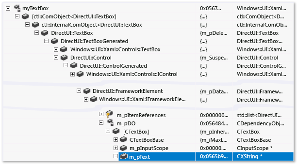
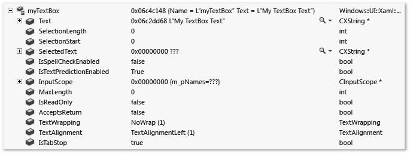
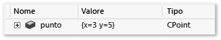
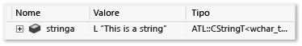
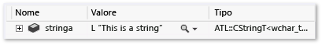
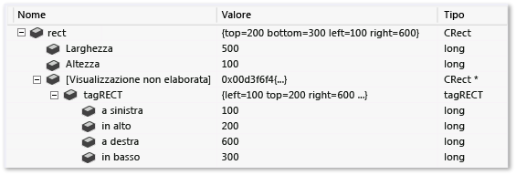
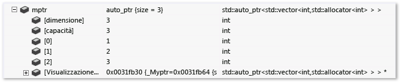
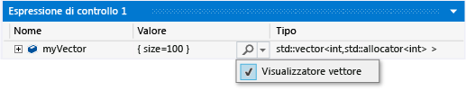

# Creare viste personalizzate di oggetti nativi
[!INCLUDE[vs2017banner](../code-quality/includes/vs2017banner.md)]

Il framework Natvis di Visual Studio consente di personalizzare il modo in cui Visual Studio visualizza i tipi nativi nelle finestre delle variabili del debugger \(ad esempio, le finestre **Espressioni di controllo**, **Variabili locali** e **Suggerimenti dati**\).  
  
 Natvis sostituisce il file **autoexp.dat** usato nelle versioni precedenti di Visual Studio e include la sintassi XML, funzionalità di diagnostica migliorate, controllo delle versioni e supporto di più file.  
  
> [!NOTE]
>  Non è possibile usare il framework Natvis per le visualizzazioni quando:  
>   
>  -   Si esegue il debug di un progetto per desktop Windows C\+\+ con tipo di debug impostato su **misto**.  
> -   Si sta eseguendo il debug in modalità mista in un'applicazione desktop di Windows in modalità di compatibilità gestita \(**Strumenti\/Opzioni\/Debug\/Generale\/ Utilizza modalità di compatibilità gestita**\).  
> -   Si sta eseguendo il debug in un'applicazione desktop di Windows in modalità di compatibilità gestita \(**Strumenti\/Opzioni\/Debug\/Generale\/ Utilizza modalità di compatibilità gestita**\).  
  
##  <a name="BKMK_Why_create_visualizations_"></a> Perché creare visualizzazioni Natvis?  
 È possibile usare il framework Natvis per creare regole di visualizzazione per i tipi creati in modo che gli sviluppatori possano vederli facilmente durante il debug.  
  
 Ad esempio, l'immagine seguente mostra una variabile di tipo [Windows::UI::Xaml::Controls::TextBox](http://go.microsoft.com/fwlink/?LinkId=258422) visualizzata nel debugger, alla quale non è stata applicata alcuna visualizzazione personalizzata.  
  
   
  
 La riga evidenziata mostra la proprietà `Text` della classe `TextBox`. La complessa gerarchia di classi non consente di trovare facilmente questo valore; inoltre, dal momento che il debugger non riesce a interpretare il tipo di stringa personalizzato usato dall'oggetto, non è possibile visualizzare la stringa contenuta nella casella di testo.  
  
 Lo stesso oggetto `TextBox` ha un aspetto molto più semplice nella finestra delle variabili quando vengono applicate regole di visualizzazione personalizzate. I membri importanti della classe possono essere visualizzati insieme e il debugger mostra il valore della stringa sottostante del tipo di stringa personalizzato.  
  
   
  
##  <a name="BKMK_Using_Natvis_files"></a> Uso di file Natvis  
 I file NATVIS sono file XML con estensione natvis. Lo schema è definito in **%VSINSTALLDIR%\\Xml\\Schemas\\natvis.xsd**.  
  
 La struttura di base di un file NATVIS è costituita da uno o più elementi `Type`, in cui ogni elemento `Type` rappresenta una voce di visualizzazione relativa a un tipo il cui nome completo è specificato nell'attributo `Name`.  
  
```xml  
  
<?xml version="1.0" encoding="utf-8"?> <AutoVisualizer xmlns="http://schemas.microsoft.com/vstudio/debugger/natvis/2010"> <Type Name="MyNamespace::CFoo"> . . </Type> <Type Name="..."> . . </Type> </AutoVisualizer>  
```  
  
 Visual Studio fornisce alcuni file NATVIS nella cartella **%VSINSTALLDIR%\\Common7\\Packages\\Debugger\\Visualizers**. Questi file contengono regole di visualizzazione per molti tipi comuni e possono essere usati come esempio per scrivere visualizzazioni per nuovi tipi.  
  
## Aggiunta di file NATVIS ai progetti  
 È possibile aggiungere i file NATVIS a qualsiasi progetto C\+\+.  
  
 Per aggiungere un nuovo file NATVIS, selezionare il nodo di un progetto C\+\+ aperto in **Esplora soluzioni**, quindi fare clic su **Aggiungi\/Nuovo elemento\/Visual C\+\+\/Utilità\/File di visualizzazione debugger \(.natvis\)**. Il debugger caricherà i file Natvis dai progetti C\+\+ automaticamente. Per impostazione predefinita, i file Natvis del progetto vengono inseriti anche nel file PDB compilato dal progetto. Ciò significa che se si esegue il debug del file binario compilato da questo progetto, il debugger carica il file Natvis dal file PDB anche se il progetto non è aperto. Per non includere il file NATVIS nel file PDB, fare clic con il pulsante destro del mouse sul file NATVIS in **Esplora soluzioni** e impostare **Escluso dalla compilazione** su **Sì** nella finestra **Proprietà di configurazione**.  
  
 Si consiglia di modificare i file Natvis usando Visual Studio. Qualsiasi modifica apportata durante il debug diventano effettive quando si salva il file. È anche possibile ottenere una migliore esperienza di modifica con IntelliSense.  
  
 I file nativi che vengono caricati da un file PDB si applicano solo ai tipi nel modulo a cui fa riferimento il file PDB. Ad esempio, se Module1.pdb definisce una voce per un tipo denominato `Test`, questa voce viene applicata solo alla classe **Test** in Module1.dll. Se un altro modulo definisce anche una classe denominata **Test**, la voce NATVIS di Module1.pdb non si applica a tale classe.  
  
##  <a name="BKMK_natvis_location"></a> Distribuzione di file NATVIS  
 Se il file NATVIS si applica solo ai tipi creati in un progetto di Visual Studio, non è necessario eseguire alcuna operazione perché il file NATVIS è incluso nel file PDB. Tuttavia, è possibile aggiungere i file NATVIS alla directory dell'utente a una directory di sistema per applicarli a più progetti.  
  
 L'ordine con cui vengono valutati i file NATVIS è il seguente:  
  
1.  File NATVIS incorporati in un file PDB di cui si sta eseguendo il debug \(a meno che non esista già un file con lo stesso nome in un progetto caricato\)  
  
2.  File NATVIS che fanno parte di progetti C\+\+ caricati o di un elemento della soluzione di primo livello. Sono inclusi tutti i progetti C\+\+ caricati, incluse le librerie di classi, ma non i progetti di altri linguaggi \(ad esempio, non è possibile caricare un file NATVIS da un progetto C\#\). Per i progetti eseguibili, usare gli elementi della soluzione per ospitare i file NATVIS non ancora presenti in un file PDB, poiché non è disponibile alcun progetto C\+\+.  
  
3.  La directory Natvis specifica dell'utente \(**%USERPROFILE%\\My Documents\\Visual Studio 2015\\Visualizers**\)  
  
4.  La directory Natvis a livello di sistema \(**%VSINSTALLDIR%\\Common7\\Packages\\Debugger\\Visualizers**\). Posizione in cui vengono copiati i file NATVIS installati con Visual Studio. È anche possibile aggiungere altri file a questa directory se si hanno le autorizzazioni di amministratore.  
  
## Modifica dei file NATVIS durante il debug  
 È possibile modificare un file NATVIS nell'IDE durante il debug del progetto in cui è incluso. Aprire il file nell'IDE \(usando la stessa istanza di Visual Studio con cui si esegue il debug\), modificarlo e salvarlo. Non appena il file viene salvato, le finestre **Espressioni di controllo** e **Variabili locali** devono essere aggiornate per riflettere la modifica. Se si modifica il file NATVIS all'esterno dell'IDE, le modifiche non diventano effettive automaticamente. Per aggiornare le finestre, è possibile valutare il comando **.natvisreload** nella finestra **Espressioni di controllo**. In questo modo le modifiche vengono applicate senza necessità di riavviare la sessione di debug.  
  
 È anche possibile aggiungere o eliminare i file NATVIS in una soluzione di cui si sta eseguendo il debug e Visual Studio aggiungerà o rimuoverà le visualizzazioni pertinenti.  
  
 Non è possibile modificare un file NATVIS durante il debug se è incorporato in un file PDB.  
  
 Usare il comando **.natvisreload** quando si aggiorna il file NATVIS a una versione più recente \(ad esempio, se è archiviato nel controllo del codice sorgente e si vogliono visualizzare le modifiche recenti apportate da altri utenti al file\). Si consiglia di modificare i file con estensione natvis con l'editor xml di Visual Studio.  
  
##  <a name="BKMK_Expressions_and_formatting"></a> Espressioni e formattazione  
 Nelle visualizzazioni Natvis si usano espressioni C\+\+ per specificare gli elementi di dati da visualizzare. Oltre ai miglioramenti e alle limitazioni delle espressioni C\+\+ nel debugger descritte in [Operatore di contesto \(C\+\+\)](../debugger/context-operator-cpp.md), è importante tenere presenti le seguenti differenze:  
  
-   Le espressioni di Natvis vengono valutate nel contesto dell'oggetto da visualizzare, non nello stack frame corrente. Ad esempio, se si usa `x` in un'espressione Natvis, questo fa riferimento al campo denominato `x` nell'oggetto visualizzato, non a una variabile locale denominata `x` nella funzione attualmente in esecuzione. Non è possibile accedere a variabili locali all'interno di espressioni Natvis, mentre è possibile accedere a variabili globali.  
  
-   Le espressioni natvis non consentono la valutazione di funzioni o effetti collaterali. Ciò significa che le chiamate di funzione e gli operatori di assegnazione vengono ignorati. Dal momento che le [funzioni intrinseche del debugger](../debugger/expressions-in-the-debugger.md#BKMK_Using_debugger_intrinisic_functions_to_maintain_state) non hanno effetti collaterali, possono essere chiamate liberamente da qualsiasi espressione Natvis, anche se non sono consentite altre chiamate di funzione.  
  
 Per controllare la visualizzazione di un'espressione in una finestra delle variabili, è possibile usare uno qualsiasi degli identificatori di formato descritti nella sezione [Identificatori di formato](../debugger/format-specifiers-in-cpp.md#BKMK_Visual_Studio_2012_format_specifiers) dell'argomento [Identificatori di formato in C\+\+](../debugger/format-specifiers-in-cpp.md). Gli identificatori di formato vengono ignorati quando la voce di virtualizzazione viene usata internamente da Natvis, ad esempio l'espressione `Size` in [Espansione di ArrayItems](../debugger/create-custom-views-of-native-objects.md#BKMK_ArrayItems_expansion).  
  
## Visualizzazioni di Natvis  
 Le visualizzazioni di natvis consentono di visualizzare qualsiasi tipo in più modi. Ad esempio, è possibile definire una visualizzazione denominata **simple** che fornisce la visualizzazione semplificata di un tipo. Ad esempio, ecco la visualizzazione di `std::vector`:  
  
```xml  
<Type Name="std::vector<*>"> <DisplayString>{{ size={_Mylast - _Myfirst} }}</DisplayString> <Expand> <Item Name="[size]" ExcludeView="simple">_Mylast - _Myfirst</Item> <Item Name="[capacity]" ExcludeView="simple">_Myend - _Myfirst</Item> <ArrayItems> <Size>_Mylast - _Myfirst</Size> <ValuePointer>_Myfirst</ValuePointer> </ArrayItems> </Expand> </Type>  
```  
  
 Gli elementi `DisplayString` e `ArrayItems` vengono usati nella visualizzazione predefinita e nella visualizzazione semplice, mentre gli elementi `[size]` e `[capacity]` sono esclusi dalla visualizzazione semplice. È possibile usare l'identificatore di formato **view** per specificare una visualizzazione alternativa. Nella finestra **Espressioni di controllo** specificare la visualizzazione semplice come **vec,view\(simple\)**:  
  
   
  
##  <a name="BKMK_Diagnosing_Natvis_errors"></a> Diagnostica degli errori di Natvis  
 È possibile usare la diagnostica di Natvis per risolvere i problemi di sintassi e gli errori di analisi. Quando il debugger rileva errori in una voce di visualizzazione, li ignora e visualizza il tipo nel formato non elaborato o seleziona un'altra visualizzazione appropriata. Per capire perché una determinata voce di visualizzazione viene ignorata e visualizzare quali sono gli errori sottostanti, è possibile attivare l'opzione della diagnostica di Natvis dal seguente percorso: **Strumenti\/Opzioni\/Debug\/Finestra di output\/Messaggi di diagnostica natvis \(solo C\+\+\)**. Gli errori vengono visualizzati nella finestra **Output**.  
  
##  <a name="BKMK_Syntax_reference"></a> Riferimento per la sintassi di Natvis  
  
###  <a name="BKMK_AutoVisualizer"></a> Elemento AutoVisualizer  
 L'elemento `AutoVisualizer`  è il nodo radice del file NATVIS e contiene l'attributo `xmlns:` dello spazio dei nomi.  
  
```xml  
<?xml version="1.0" encoding="utf-8"?> <AutoVisualizer xmlns="http://schemas.microsoft.com/vstudio/debugger/natvis/2010"> . . </AutoVisualizer>  
```  
  
###  <a name="BKMK_Type"></a> Elemento Type  
 Un elemento Type di base ha un aspetto simile al seguente:  
  
```xml  
<Type Name="[fully qualified type name]"> <DisplayString Condition="[Boolean expression]">[Display value]</DisplayString> <Expand> ... </Expand> </Type>  
  
```  
  
 Specifica:  
  
1.  Il tipo per cui usare questa visualizzazione \(l'attributo `Type Name`\).  
  
2.  A quale valore di un oggetto di tale tipo deve essere simile \(elemento `DisplayString`\).  
  
3.  Quale deve essere l'aspetto dei membri del tipo quando l'utente lo espande in una finestra delle variabili \(nodo `Expand`\).  
  
 **Classi basate su modelli** L'attributo `Name` dell'elemento `Type` accetta come carattere jolly un asterisco `*` che può essere usato per i nomi delle classi basate su modelli:  
  
```xml  
<Type Name="ATL::CAtlArray<*>"> <DisplayString>{{Count = {m_nSize}}}</DisplayString> </Type>  
  
```  
  
 In questo esempio verrà usata la stessa visualizzazione indipendentemente che l'oggetto sia `CAtlArray<int>` o `CAtlArray<float>`. Se presente, una voce di visualizzazione specifica per un oggetto `CAtlArray<float>` ha la precedenza rispetto a quella generica.  
  
 Si noti che per fare riferimento ai parametri di modello nella voce di visualizzazione, è possibile usare le macro $T1, $T2 e così via. Per esempi di queste macro, vedere i file NATVIS forniti con Visual Studio.  
  
####  <a name="BKMK_Visualizer_type_matching"></a> Corrispondenza del tipo di visualizzatore  
 Se non si riesce ad convalidare una voce di visualizzazione, verrà usata la successiva visualizzazione disponibile.  
  
#### Attributo Inheritable  
 È possibile specificare se una visualizzazione si applica solo a un tipo di base o a un tipo di base e tutti i tipi derivati con attributo `Inheritable` facoltativo. Nell'esempio seguente la visualizzazione si applica solo al tipo `BaseClass`:  
  
```xml  
<Type Name="Namespace::BaseClass" Inheritable=“true”> <DisplayString>{{Count = {m_nSize}}}</DisplayString> </Type>  
```  
  
 Il valore predefinito di `Inheritable` è `true`.  
  
#### Attributo Priority  
 L'attributo `Priority` specifica l'ordine in cui le definizioni alternative vengono usate se l'analisi di una definizione ha esito negativo. I valori possibili di `Priority` sono `Low`, `MediumLow`,`Medium`, `MediumHigh` e `High` e il valore predefinito è `Medium`.  
  
 L'attributo Priority deve essere usato per distinguere le priorità solo all'interno dello stesso file NATVIS, non in file diversi.  
  
 Nell'esempio seguente verrà prima di tutto analizzata la voce corrispondente a STL 2015 e, nel caso in cui dovesse verificarsi un errore di analisi, verrà usata la voce alternativa per la versione 2013 di STL:  
  
```xml  
<!-- VC 2013 --> <Type Name="std::reference_wrapper<*>" Priority="MediumLow"> <DisplayString>{_Callee}</DisplayString> <Expand> <ExpandedItem>_Callee</ExpandedItem> </Expand> </Type> <!-- VC 2015 --> <Type Name="std::reference_wrapper<*>"> <DisplayString>{*_Ptr}</DisplayString> <Expand> <Item Name="[ptr]">_Ptr</Item> </Expand> </Type>  
```  
  
####  <a name="BKMK_Versioning"></a> Elemento Version  
 Usare l'elemento `Version` per definire l'ambito delle visualizzazioni per moduli specifici e le versioni corrispondenti in modo da ridurre al minimo i conflitti di nome e usare visualizzazioni diverse per versioni diverse dei tipi. Di seguito è riportato un esempio:  
  
```xml  
<Type Name="DirectUI::Border"> <Version Name="Windows.UI.Xaml.dll" Min="1.0" Max="1.5"/> <DisplayString>{{Name = {*(m_pDO->m_pstrName)}}}</DisplayString> <Expand> <ExpandedItem>*(CBorder*)(m_pDO)</ExpandedItem> </Expand> </Type>  
```  
  
 In questo esempio la visualizzazione è valida solo per il tipo `DirectUI::Border` disponibile nella versione dalla 1.0 alla 1.5 del file `Windows.UI.Xaml.dll`. Si noti che l'aggiunta di elementi della versione consentirà di definire l'ambito della voce di visualizzazione per un modulo e una versione specifici e di ridurre le mancate corrispondenze indesiderate, ma se si definisce un tipo in un file di intestazione comune usato da moduli diversi, la visualizzazione con versione non viene applicata quando il tipo non è presente nel modulo specificato.  
  
#### Attributo Optional  
 L'attributo `Optional` può apparire in qualsiasi nodo. Se è impossibile analizzare qualsiasi sottoespressione all'interno di un nodo facoltativo, tale nodo viene ignorato, ma il resto dell'elemento Type è ancora valido. Nel tipo seguente `[State]` non è facoltativo, mentre `[Exception]` lo è.  Questo significa che se `MyNamespace::MyClass` contiene un campo denominato \_`M_exceptionHolder`, verranno visualizzati sia il nodo `[State]` che il nodo `[Exception]`, ma se `_M_exceptionHolder`è mancante, verrà visualizzato solo il nodo `[State]`.  
  
```xml  
<Type Name="MyNamespace::MyClass"> <Expand> <Item Name="[State]">_M_State</Item> <Item Name="[Exception]" Optional="true">_M_exceptionHolder</Item> </Expand> </Type>  
```  
  
###  <a name="BKMK_Condition_attribute"></a> Attributo Condition  
 L'attributo facoltativo `Condition` è disponibile per molti elementi di visualizzazione e consente di specificare quando usare una regola di visualizzazione. Se l'espressione all'interno dell'attributo Condition si risolve in `false`, la regola di visualizzazione specificata dall'elemento non viene applicata. Se invece restituisce true, o se non esiste alcun attributo `Condition`, la regola di visualizzazione viene applicata al tipo. È possibile usare questo attributo per la logica `if-else` nelle voci di visualizzazione. Ad esempio, la visualizzazione seguente presenta due elementi `DisplayString` per un tipo di puntatore intelligente:  
  
```xml  
<Type Name="std::auto_ptr<*>"> <DisplayString Condition="_Myptr == 0">empty</DisplayString> <DisplayString>auto_ptr {*_Myptr}</DisplayString> <Expand> <ExpandedItem>_Myptr</ExpandedItem> </Expand> </Type>  
  
```  
  
 Quando il membro `_Myptr` è `null`, la condizione del primo elemento `DisplayString` si risolve in `true`, in modo da visualizzare il modulo. Quando il membro `_Myptr` non è `null`, la condizione restituisce `false` e il secondo elemento `DisplayString` viene visualizzato.  
  
### Attributi IncludeView e ExcludeView  
 Questi attributi specificano gli elementi che devono essere visualizzati o non visualizzati in visualizzazioni diverse. Si consideri, ad esempio, la specifica Natvis di `std::vector`:  
  
```xml  
<Type Name="std::vector<*>"> <DisplayString>{{ size={_Mylast - _Myfirst} }}</DisplayString> <Expand> <Item Name="[size]" ExcludeView="simple">_Mylast - _Myfirst</Item> <Item Name="[capacity]" ExcludeView="simple">_Myend - _Myfirst</Item> <ArrayItems> <Size>_Mylast - _Myfirst</Size> <ValuePointer>_Myfirst</ValuePointer> </ArrayItems> </Expand> </Type>  
```  
  
 Nella vista semplice gli elementi \[size\] e \[capacity\] non sono visualizzati. Se avessimo usato `IncludeView="simple"` invece di `ExcludeView`, gli elementi `[size]` e `[capacity]` sarebbero stati mostrati nella visualizzazione semplice e non nella visualizzazione predefinita.  
  
 È possibile usare gli attributi `IncludeView` e `ExcludeView` sui tipi nonché sui singoli membri.  
  
###  <a name="BKMK_DisplayString"></a> DisplayString  
 Un elemento `DisplayString` consente di specificare la stringa da visualizzare come valore della variabile. Accetta stringhe arbitrarie combinate con espressioni. Tutto ciò che è racchiuso tra parentesi graffe viene interpretato come un'espressione. Ad esempio, con una voce `DisplayString` simile alla seguente:  
  
```xml  
<Type Name="CPoint"> <DisplayString>{{x={x} y={y}}}</DisplayString> </Type>  
  
```  
  
 Indica che le variabili di tipo `CPoint` vengono visualizzate nel modo seguente:  
  
   
  
 Nell'espressione `DisplayString``x` e `y`, che sono membri di `CPoint`, sono racchiusi tra parentesi graffe, pertanto i relativi valori vengono valutati. L'espressione mostra anche come fare in modo che una parentesi graffa venga ignorata usando doppie parentesi graffe \(`{{` o `}}`\).  
  
> [!NOTE]
>  L'elemento `DisplayString` è l'unico elemento che accetta stringhe arbitrarie e la sintassi con parentesi graffe. Tutti gli altri elementi di visualizzazioni accettano solo espressioni valutate dal debugger.  
  
###  <a name="BKMK_StringView"></a> StringView  
 L'elemento `StringView` consente di definire l'espressione il cui valore verrà inviato al visualizzatore di testo incorporato. Ad esempio, si supponga che per il tipo `ATL::CStringT` sia disponibile la visualizzazione seguente:  
  
```xml  
<Type Name="ATL::CStringT<wchar_t,*>"> <DisplayString>{m_pszData,su}</DisplayString> </Type>  
  
```  
  
 L'oggetto `CStringT` sarà simile a:  
  
   
  
 La visualizzazione mostra un oggetto `CStringT` in una finestra delle variabili simile alla seguente:  
  
 L'aggiunta di un elemento `StringView` indicherà al debugger che questo valore può essere visualizzato da una visualizzazione di testo:  
  
```  
<Type Name="ATL::CStringT<wchar_t,*>"> <DisplayString>{m_pszData,su}</DisplayString> <StringView>m_pszData,su</StringView> </Type>  
  
```  
  
 Si noti l'icona a forma di lente di ingrandimento visualizzata accanto al valore seguente. Scegliendo l'icona verrà avviato il visualizzatore di testo che mostrerà la stringa a cui punta `m_pszData`.  
  
   
  
> [!NOTE]
>  Si noti che l'espressione `{m_pszData,su}` include un identificatore di formato C\+\+ `su` per visualizzare il valore come stringa Unicode. Per altre informazioni, vedere [Identificatori di formato in C\+\+](../debugger/format-specifiers-in-cpp.md).  
  
###  <a name="BKMK_Expand"></a> Espandi  
 Il nodo `Expand` viene usato per personalizzare i figli del tipo visualizzato quando l'utente lo espande nelle finestre delle variabili. Accetta un elenco di nodi figlio che definiscono gli elementi figlio.  
  
 Il nodo `Expand` è facoltativo.  
  
-   Se non si specifica un nodo `Expand` in una voce di visualizzazione, vengono usate le regole di espansione predefinite di Visual Studio.  
  
-   Se si specifica un nodo `Expand` senza i nodi figlio sottostanti, il tipo non sarà espandibile nelle finestre del debugger.  
  
####  <a name="BKMK_Item_expansion"></a> Espansione di Item  
 L'elemento `Item` è l'elemento più semplice e comune da usare in un nodo `Expand`.`Item` definisce un singolo elemento figlio. Ad esempio, si supponga di disporre di una classe `CRect` i cui campi sono `top`, `left`, `right` e `bottom` e che contiene la seguente voce di visualizzazione:  
  
```xml  
<Type Name="CRect"> <DisplayString>{{top={top} bottom={bottom} left={left} right={right}}}</DisplayString> <Expand> <Item Name="Width">right - left</Item> <Item Name="Height">bottom - top</Item> </Expand> </Type>  
  
```  
  
 Il tipo `CRect` avrà un aspetto simile al seguente:  
  
   
  
 Le espressioni specificate negli elementi `Width` e `Height` vengono valutate e illustrate nella colonna del valore. Il nodo `[Raw View]` viene creato automaticamente dal debugger ogni volta che si usa un'espansione personalizzata. Viene espanso nella schermata precedente per mostrare le differenze tra la visualizzazione non elaborata dell'oggetto e la relativa visualizzazione. L'espansione predefinita di Visual Studio crea un sottoalbero per la classe base ed elenca tutti i membri dati della classe base come elementi figlio.  
  
> [!NOTE]
>  Se l'espressione dell'elemento Item punta a un tipo complesso, anche lo stesso nodo `Item` è espandibile.  
  
####  <a name="BKMK_ArrayItems_expansion"></a> Espansione di ArrayItems  
 Usare il nodo `ArrayItems` per consentire al debugger di Visual Studio di interpretare il tipo come una matrice e visualizzarne i singoli elementi. La visualizzazione per `std::vector` costituisce un ottimo esempio:  
  
```xml  
<Type Name="std::vector<*>"> <DisplayString>{{size = {_Mylast - _Myfirst}}}</DisplayString> <Expand> <Item Name="[size]">_Mylast - _Myfirst</Item> <Item Name="[capacity]">(_Myend - _Myfirst)</Item> <ArrayItems> <Size>_Mylast - _Myfirst</Size> <ValuePointer>_Myfirst</ValuePointer> </ArrayItems> </Expand> </Type>  
  
```  
  
 Un elemento `std::vector` visualizza i singoli elementi quando viene espanso nella finestra delle variabili:  
  
   
  
 Come minimo, il nodo `ArrayItems` deve disporre di:  
  
1.  Un'espressione `Size` \(che deve restituire un numero intero\) per consentire al debugger di riconoscere la lunghezza della matrice  
  
2.  Un'espressione `ValuePointer` che deve puntare al primo elemento \(un puntatore di un tipo di elemento diverso da `void*`\).  
  
 Il valore predefinito del limite inferiore della matrice è 0. Il valore può essere sostituito con un elemento `LowerBound` \(per gli esempi, vedere i file NATVIS forniti con Visual Studio\).  
  
 Ora è possibile usare l'operatore `[]` con un'espansione `ArrayItems`, ad esempio `vector[i]`. L'operatore \[\] può essere usato con qualsiasi visualizzazione di una matrice unidimensionale che usa `ArrayItems` o `IndexListItems`, anche se il tipo stesso non supporta questo operatore \(ad esempio `CATLArray`\).  
  
 È anche possibile specificare matrici multidimensionali. In questo caso il debugger deve disporre di altre informazioni per visualizzare correttamente gli elementi figlio:  
  
```xml  
<Type Name="Concurrency::array<*,*>"> <DisplayString>extent = {_M_extent}</DisplayString> <Expand> <Item Name="extent">_M_extent</Item> <ArrayItems Condition="_M_buffer_descriptor._M_data_ptr != 0"> <Direction>Forward</Direction> <Rank>$T2</Rank> <Size>_M_extent._M_base[$i]</Size> <ValuePointer>($T1*) _M_buffer_descriptor._M_data_ptr</ValuePointer> </ArrayItems> </Expand> </Type>  
  
```  
  
 `Direction` specifica se la matrice è ordinata in base alla riga o in base alla colonna.`Rank` specifica l'ordine di priorità della matrice. L'elemento `Size` accetta il parametro `$i` implicito che sostituisce con l'indice delle dimensioni per individuare la lunghezza della matrice in quella dimensione. Ad esempio, nell'esempio precedente, sopra l'espressione `_M_extent.M_base[0]` deve fornire la lunghezza della dimensione 0, `_M_extent._M_base[1]` quella della dimensione 1 e così via.  
  
 L'aspetto di un oggetto `Concurrency::array` bidimensionale nel debugger è il seguente:  
  
   
  
####  <a name="BKMK_IndexListItems_expansion"></a> Espansione di IndexListItems  
 È possibile usare l'espansione `ArrayItems` solo se gli elementi della matrice vengono disposti in modo contiguo nella memoria. Il debugger ottiene l'elemento successivo semplicemente incrementando il relativo puntatore all'elemento corrente. Per supportare i casi in cui è necessario modificare l'indice nel nodo value, si possono usare i nodi `IndexListItems`. Di seguito è illustrata una visualizzazione in cui viene usato il nodo `IndexListItems`:  
  
```xml  
<Type Name="Concurrency::multi_link_registry<*>"> <DisplayString>{{size = {_M_vector._M_index}}}</DisplayString> <Expand> <Item Name="[size]">_M_vector._M_index</Item> <IndexListItems> <Size>_M_vector._M_index</Size> <ValueNode>*(_M_vector._M_array[$i])</ValueNode> </IndexListItems> </Expand> </Type>  
  
```  
  
 Ora è possibile usare l'operatore `[]` con un'espansione `IndexListItems`, ad esempio `vector[i]`. L'operatore `[]` può essere usato con qualsiasi visualizzazione di una matrice unidimensionale che usa `ArrayItems` o `IndexListItems`, anche se il tipo stesso non supporta questo operatore \(ad esempio `CATLArray`\).  
  
 L'unica differenza tra `ArrayItems` e `IndexListItems` è che `ValueNode` prevede l'espressione completa dell'nesimo elemento con il parametro implicito `$i`.  
  
####  <a name="BKMK_LinkedListItems_expansion"></a> Espansione di LinkedListItems  
 Se il tipo visualizzato rappresenta un elenco collegato, il debugger può visualizzarne i figli tramite un nodo `LinkedListItems`. Di seguito è illustrata la visualizzazione per il tipo `CAtlList` in cui viene usata questa funzionalità:  
  
```xml  
<Type Name="ATL::CAtlList<*,*>"> <DisplayString>{{Count = {m_nElements}}}</DisplayString> <Expand> <Item Name="Count">m_nElements</Item> <LinkedListItems> <Size>m_nElements</Size> <HeadPointer>m_pHead</HeadPointer> <NextPointer>m_pNext</NextPointer> <ValueNode>m_element</ValueNode> </LinkedListItems> </Expand> </Type>  
  
```  
  
 L'elemento `Size` si riferisce alla lunghezza dell'elenco.`HeadPointer` punta al primo elemento, `NextPointer` fa riferimento all'elemento successivo e `ValueNode` fa riferimento al valore dell'elemento.  
  
-   Le espressioni `NextPointer` e `ValueNode` vengono valutate nel contesto dell'elemento oggetto nodo e non del tipo di elenco padre. Nell'esempio precedente `CAtlList` include una classe `CNode` \(presente in `atlcoll.h`\) che rappresenta un nodo dell'elenco collegato.`m_pNext` e `m_element` sono campi di questa classe `CNode` e non della classe `CAtlList`.  
  
-   L'espressione `ValueNode` può essere lasciata vuota o contenere `this` per fare riferimento allo stesso nodo dell'elenco collegato.  
  
#### Espansione CustomListItems  
 L'espansione `CustomListItems` consente di scrivere una logica personalizzata per attraversare una struttura dei dati, ad esempio una tabella hash. È consigliabile usare `CustomListItems` per visualizzare i dati in cui tutto ciò che è necessario valutare può essere espresso con espressioni C\+\+, ma non rientra nel modello per `ArrayItems`, `TreeItems` o `LinkedListItems.`  
  
 Il visualizzatore per CAtlMap è un ottimo esempio in cui l'uso di `CustomListItems` è appropriato.  
  
```xml  
<Type Name="ATL::CAtlMap<*,*,*,*>"> <AlternativeType Name="ATL::CMapToInterface<*,*,*>"/> <AlternativeType Name="ATL::CMapToAutoPtr<*,*,*>"/> <DisplayString>{{Count = {m_nElements}}}</DisplayString> <Expand> <CustomListItems MaxItemsPerView="5000" ExcludeView="Test"> <Variable Name="iBucket" InitialValue="-1" /> <Variable Name="pBucket" InitialValue="m_ppBins == nullptr ? nullptr : *m_ppBins" /> <Variable Name="iBucketIncrement" InitialValue="-1" /> <Size>m_nElements</Size> <Exec>pBucket = nullptr</Exec> <Loop> <If Condition="pBucket == nullptr"> <Exec>iBucket++</Exec> <Exec>iBucketIncrement = __findnonnull(m_ppBins + iBucket, m_nBins - iBucket)</Exec> <Break Condition="iBucketIncrement == -1" /> <Exec>iBucket += iBucketIncrement</Exec> <Exec>pBucket = m_ppBins[iBucket]</Exec> </If> <Item>pBucket,na</Item> <Exec>pBucket = pBucket->m_pNext</Exec> </Loop> </CustomListItems> </Expand> </Type>  
```  
  
####  <a name="BKMK_TreeItems_expansion"></a> Espansione di TreeItems  
 Se il tipo visualizzato rappresenta un albero, il debugger può esaminare l'albero e visualizzarne i figli tramite un nodo `TreeItems`. Di seguito è illustrata la visualizzazione per il tipo `std::map` in cui viene usata questa funzionalità:  
  
```xml  
<Type Name="std::map<*>"> <DisplayString>{{size = {_Mysize}}}</DisplayString> <Expand> <Item Name="[size]">_Mysize</Item> <Item Name="[comp]">comp</Item> <TreeItems> <Size>_Mysize</Size> <HeadPointer>_Myhead->_Parent</HeadPointer> <LeftPointer>_Left</LeftPointer> <RightPointer>_Right</RightPointer> <ValueNode Condition="!((bool)_Isnil)">_Myval</ValueNode> </TreeItems> </Expand> </Type>  
  
```  
  
 La sintassi è molto simile a quella del nodo `LinkedListItems`.`LeftPointer`, `RightPointer` e `ValueNode` vengono valutati nel contesto della classe del nodo dell'albero e l'espressione `ValueNode` può essere lasciata vuota o includere `this` per fare riferimento allo stesso nodo dell'albero.  
  
####  <a name="BKMK_ExpandedItem_expansion"></a> Espansione di ExpandedItem  
 L'elemento `ExpandedItem` può essere usato per generare una visualizzazione figlio aggregata visualizzando le proprietà delle classi base o dei membri dati come se fossero figli del tipo visualizzato. L'espressione specificata viene valutata e i nodi figlio del risultato vengono aggiunti all'elenco figlio del tipo visualizzato. Ad esempio, si supponga di disporre di un tipo di puntatore intelligente `auto_ptr<vector<int>>` che, in genere, viene visualizzato nel modo seguente:  
  
   
  
 Per visualizzare i valori del vettore, è necessario eseguire il drill\-down di due livelli nella finestra delle variabili e attraversare il membro \_Myptr. Aggiungendo un elemento `ExpandedItem`, è possibile eliminare la variabile `_Myptr` dalla gerarchia e visualizzare direttamente gli elementi del vettore:  
  
```xml  
<Type Name="std::auto_ptr<*>"> <DisplayString>auto_ptr {*_Myptr}</DisplayString> <Expand> <ExpandedItem>_Myptr</ExpandedItem> </Expand> </Type>  
  
```  
  
   
  
 L'esempio seguente mostra come aggregare proprietà dalla classe base in una classe derivata. Si supponga che la classe `CPanel` derivi da `CFrameworkElement`. Invece di ripetere le proprietà fornite dalla classe base `CFrameworkElement`, il nodo `ExpandedItem` consente di aggiungere queste proprietà all'elenco figlio della classe `CPanel`. In questo caso è necessario l'identificatore di formato **nd** che disattiva la corrispondenza della visualizzazione per la classe derivata. In caso contrario, con l'espressione `*(CFrameworkElement*)this` sarà nuovamente applicata la visualizzazione `CPanel` perché viene considerata la più appropriata secondo le regole predefinite di corrispondenza del tipo di visualizzazione. L'uso dell'identificatore di formato **nd** consente di indicare al debugger di usare la visualizzazione della classe base o l'espansione predefinita della classe base se questa non include una visualizzazione.  
  
```xml  
<Type Name="CPanel"> <DisplayString>{{Name = {*(m_pstrName)}}}</DisplayString> <Expand> <Item Name="IsItemsHost">(bool)m_bItemsHost</Item> <ExpandedItem>*(CFrameworkElement*)this,nd</ExpandedItem> </Expand> </Type>  
  
```  
  
####  <a name="BKMK_Synthetic_Item_expansion"></a> Espansione di elementi Synthetic  
 il nodo `ExpandedItem` esegue la funzione opposta rispetto all'elemento `Synthetic`, che fornisce una visualizzazione dei dati più semplice eliminando le gerarchie. Consente di creare un elemento figlio artificiale, vale a dire un elemento figlio che non è il risultato di un'espressione. Questo elemento figlio può contenere elementi figlio propri. Nell'esempio seguente nella visualizzazione del tipo `Concurrency::array` viene usato un nodo `Synthetic` per mostrare un messaggio di diagnostica all'utente:  
  
```xml  
<Type Name="Concurrency::array<*,*>"> <DisplayString>extent = {_M_extent}</DisplayString> <Expand> <Item Name="extent" Condition="_M_buffer_descriptor._M_data_ptr == 0">_M_extent</Item> <ArrayItems Condition="_M_buffer_descriptor._M_data_ptr != 0"> <Rank>$T2</Rank> <Size>_M_extent._M_base[$i]</Size> <ValuePointer>($T1*) _M_buffer_descriptor._M_data_ptr</ValuePointer> </ArrayItems> <Synthetic Name="Array" Condition="_M_buffer_descriptor._M_data_ptr == 0"> <DisplayString>Array members can be viewed only under the GPU debugger</DisplayString> </Synthetic> </Expand> </Type>  
  
```  
  
   
  
###  <a name="BKMK_HResult"></a> HResult  
 L'elemento `HResult` consente di personalizzare le informazioni visualizzate per un HRESULT nelle finestre del debugger. L'elemento `HRValue` deve contenere il valore a 32 bit di HRESULT da personalizzare. L'elemento `HRDescription` contiene le informazioni visualizzate nel debugger.  
  
```  
  
<HResult Name="MY_E_COLLECTION_NOELEMENTS"> <HRValue>0xABC0123</HRValue> <HRDescription>No elements in the collection.</HRDescription> </HResult>  
```  
  
###  <a name="BKMK_UIVisualizer"></a> UIVisualizer  
 Un elemento `UIVisualizer` consente di registrare un plug\-in del visualizzatore grafico con il debugger. Tale plug\-in crea una finestra di dialogo o un'altra interfaccia per visualizzare una variabile o un oggetto in modo appropriato al relativo tipo di dati. Il plug\-in del visualizzatore deve essere creato come [VSPackage](../extensibility/internals/vspackages.md) e deve esporre un servizio che può essere usato dal debugger. Il file NATVIS contiene informazioni di registrazione per il plug\-in, ad esempio il nome, il GUID del servizio esposto e anche i tipi che è possibile visualizzare.  
  
 Il seguente è un esempio di elemento UIVisualizer:  
  
```xml  
  
<?xml version="1.0" encoding="utf-8"?> <AutoVisualizer xmlns="http://schemas.microsoft.com/vstudio/debugger/natvis/2010"> <UIVisualizer ServiceId="{5452AFEA-3DF6-46BB-9177-C0B08F318025}" Id="1" MenuName="Vector Visualizer"/> <UIVisualizer ServiceId="{5452AFEA-3DF6-46BB-9177-C0B08F318025}" Id="2" MenuName="List Visualizer"/> . . </AutoVisualizer>  
```  
  
 `UIVisualizer` viene identificato per mezzo di una coppia di attributi `ServiceId` \- `Id`.`ServiceId` è il GUID del servizio esposto dal pacchetto del visualizzatore, mentre `Id` è un identificatore univoco che può essere usato per distinguere i visualizzatori se un servizio fornisce più visualizzatori. Nell'esempio precedente lo stesso servizio del visualizzatore fornisce due visualizzatori.  
  
 L'attributo `MenuName` corrisponde al nome del visualizzatore visualizzato dagli utenti quando viene aperto il menu a discesa accanto all'icona a forma di lente di ingrandimento nelle finestre delle variabili del debugger, ad esempio:  
  
   
  
 Ogni tipo definito nel file NATVIS deve elencare esplicitamente i visualizzatori dell'interfaccia utente in grado di visualizzarlo. Il debugger abbina i riferimenti del visualizzatore nelle voci dei tipi ai tipi con i visualizzatori registrati. Ad esempio, la voce del tipo seguente per `std::vector` fa riferimento all'elemento UIVisualizer dell'esempio precedente.  
  
```  
  
<Type Name="std::vector<int,*>"> <UIVisualizer ServiceId="{5452AFEA-3DF6-46BB-9177-C0B08F318025}" Id="1" /> </Type>  
```  
  
 È possibile visualizzare un esempio di UIVisualizer nell'estensione delle espressioni di controllo immagine usate per visualizzare le bitmap in memoria: [ImageWatch](https://visualstudiogallery.msdn.microsoft.com/e682d542-7ef3-402c-b857-bbfba714f78d)  
  
### Elemento CustomVisualizer  
 `CustomVisualizer` è un punto di estendibilità che specifica un'estensione VSIX che è possibile scrivere per controllare la visualizzazione nel codice in esecuzione in Visual Studio. Per altre informazioni sulla scrittura di estensioni VSIX, vedere [Visual Studio SDK](../extensibility/visual-studio-sdk.md). La scrittura di un visualizzatore personalizzato comporta molte più operazioni rispetto alla scrittura di una definizione natvis XML, ma non sussistono vincoli su ciò che Natvis supporta o non supporta. I visualizzatori personalizzati hanno accesso al set completo di API di estendibilità del debugger, che possono essere usate per eseguire query e modificare il processo dell'oggetto del debug o per comunicare con altre parti di Visual Studio.  
  
 È possibile usare gli attributi `Condition`, `IncludeView` e `ExcludeView` su elementi CustomVisualizer.