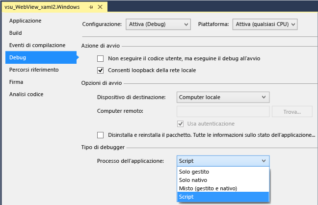
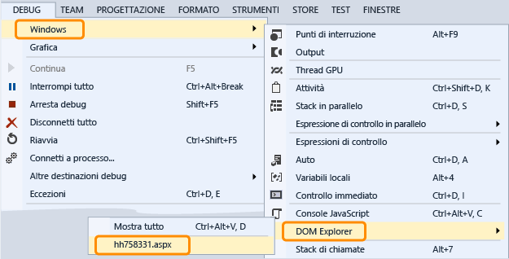

# Debug di un controllo WebView
[!INCLUDE[vs2017banner](../code-quality/includes/vs2017banner.md)]

  
  
 Per esaminare ed eseguire il debug dei controlli `WebView` in un'app di Windows Runtime, puoi configurare Visual Studio in modo da collegare Script Debugger all'avvio dell'app.  A partire da Visual Studio 2013 Update 2, sono disponibili due modi per interagire con i controlli `WebView` tramite il debugger:  
  
-   Apri [DOM Explorer](../debugger/quickstart-debug-html-and-css.md) per un'istanza di `WebView` ed esamina gli elementi DOM, controlla i problemi relativi allo stile CSS e sottoponi a test le modifiche apportate agli stili con rendering dinamico.  
  
-   Seleziona la pagina Web o l'`iFrame` visualizzato nell'istanza di `WebView` come destinazione nella finestra [Console JavaScript](../debugger/javascript-console-commands.md) e quindi interagisci con la pagina Web usando i comandi della console.  La console consente di accedere al contesto di esecuzione dello script corrente.  
  
### Collegare il debugger \(C\#, Visual Basic, C\+\+\)  
  
1.  In Visual Studio, aggiungi un controllo `WebView` all'app di Windows Runtime.  
  
2.  In Esplora soluzioni, apri le proprietà del progetto scegliendo **Proprietà** nel menu di scelta rapida del progetto.  
  
3.  Scegli **Debug**.  Nell'elenco **Processo applicativo** scegli **Script**.  
  
       
  
4.  \(Facoltativo\) Per le versioni non Express di Visual Studio, disabilita il debug just\-in\-time \(JIT\) scegliendo **Strumenti**, **Opzioni**, **Debug**, **Just\-In\-Time** e quindi disabilitando il debug JIT per Script.  
  
    > [!NOTE]
    >  Disabilitando il debug JIT, puoi nascondere le finestre di dialogo per le eccezioni non gestite che si verificano in alcune pagine Web.  In Visual Studio Express, il debug JIT è sempre disabilitato.  
  
5.  Premere F5 per avviare il debug.  
  
### Usare DOM Explorer per esaminare ed eseguire il debug di un controllo WebView  
  
1.  \(C\#, Visual Basic, C\+\+\) Collega Script Debugger all'app.  Per istruzioni consulta la prima sezione.  
  
2.  Se non l'hai già fatto, aggiungi un controllo `WebView` all'app e premi F5 per avviare il debug.  
  
3.  Passa alla pagina contenente i controlli `Webview`.  
  
4.  Apri la finestra di DOM Explorer per il controllo `WebView` scegliendo **Debug**, **Finestre**, **DOM Explorer** e quindi scegli l'URL del controllo `WebView` che vuoi esaminare.  
  
       
  
     La finestra di DOM Explorer associata al controllo `WebView` viene visualizzata come nuova scheda in Visual Studio.  
  
5.  Visualizza e modifica gli elementi DOM attivi e gli stili CSS come descritto in [Eseguire il debug di stili CSS tramite DOM Explorer](../debugger/debug-css-styles-using-dom-explorer.md).  
  
### Usare la finestra Console JavaScript per esaminare ed eseguire il debug di un controllo WebView  
  
1.  \(C\#, Visual Basic, C\+\+\) Collega Script Debugger all'app.  Per istruzioni consulta la prima sezione.  
  
2.  Se non l'hai già fatto, aggiungi un controllo `WebView` all'app e premi F5 per avviare il debug.  
  
3.  Apri la finestra Console JavaScript per il controllo `WebView` scegliendo **Debug**, **Finestre**, **Console JavaScript**.  
  
     La finestra Console JavaScript viene visualizzata.  
  
4.  Passa alla pagina contenente i controlli `Webview`.  
  
5.  Nella finestra Console, seleziona la pagina Web o un `iFrame` visualizzato mediante il controllo `WebView` nell'elenco **Destinazione**.  
  
       
  
    > [!NOTE]
    >  Tramite la console puoi interagire con un singolo `WebView`, `iFrame`, contratto di condivisione o Web worker alla volta.  Ogni elemento richiede un'istanza separata dell'host della piattaforma Web \(WWAHost.exe\).  Puoi interagire con un solo host alla volta.  
  
6.  Visualizza e modifica le variabili nell'app oppure usa i comandi della console, come descritto in [Guida introduttiva: Eseguire il debug di JavaScript](../debugger/quickstart-debug-javascript-using-the-console.md) e [Comandi della console JavaScript](../debugger/javascript-console-commands.md).  
  
## Vedere anche  
 [Guida introduttiva: Eseguire il debug di HTML e CSS](../debugger/quickstart-debug-html-and-css.md)