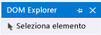
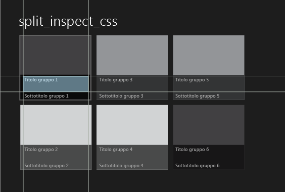
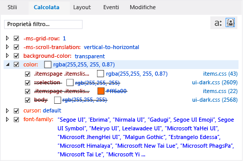

# Eseguire il debug di stili CSS tramite DOM Explorer
[!INCLUDE[vs2017banner](../code-quality/includes/vs2017banner.md)]

  
  
 Quando si esegue il debug delle app di Windows Store o di Windows Phone Store e di app create usando Strumenti di Visual Studio per Apache Cordova, è possibile visualizzare e modificare le regole CSS per alcuni elementi DOM e i relativi elementi figlio.  
  
 Le schede **Stili** e **Calcolata** di DOM Explorer mostrano le regole CSS applicabili a un elemento selezionato. Le regole sono visualizzate nell'ordine di specificità secondo le regole di precedenza CSS. Le regole nella parte superiore di un selettore o di uno stile in una scheda \(le regole più specifiche\) vengono applicate per ultime all'elemento selezionato, mentre quelle nella parte inferiore vengono applicate per prime. Quando le regole vengono applicate, hanno la precedenza su quelle applicate in precedenza.  
  
 Le schede **Stili**, **Calcolata** e **Modifiche** forniscono visualizzazioni diverse delle informazioni di stile.  
  
-   Usare la scheda **Stili** per visualizzare le regole organizzate in base al nome del selettore CSS, ad esempio `html, body`. È anche possibile usare questa scheda per abilitare o disabilitare stili specifici, modificare manualmente i valori e vedere i risultati immediati delle modifiche.  
  
-   Usare la scheda **Calcolata** per visualizzare i valori calcolati di uno stile. Se ad esempio si imposta una dimensione a 1em, il valore calcolato da Internet Explorer potrebbe essere 16px. Gli stili in questa scheda sono organizzati in base al nome dello stile, ad esempio `height`. È anche possibile usare questa scheda per abilitare o disabilitare stili specifici, modificare manualmente i valori e vedere i risultati immediati delle modifiche.  
  
    > [!NOTE]
    >  In Visual Studio 2013 Update 2, le informazioni presenti nella scheda **Traccia** sono state aggiunte alla scheda **Calcolata** e la scheda **Traccia** è stata rimossa.  
  
-   Usare la scheda **Modifiche** \(solo per app di Windows Store e Windows Phone Store\) per identificare e tenere traccia degli stili CSS modificati durante la sessione di debug.  
  
> [!TIP]
>  Le modifiche apportate nelle schede **Stili** e **Calcolata** non sono permanenti, vengono infatti perse quando si arresta il debug. Per modificare il codice sorgente e ricaricare le pagine senza arrestare e riavviare il debugger, aggiornare l'app usando il pulsante  \(**Aggiorna applicazione Windows**\) nella barra degli strumenti **Debug** \(solo per app di Windows Store e Windows Phone Store\). Per altre informazioni, vedere [Aggiornare un'applicazione \(JavaScript\)](../debugger/refresh-an-app-javascript.md).  
  
## Esempio di correzione di una regola CSS  
 Questo esempio illustra come controllare le regole CSS ed eseguire il debug di un problema di stile. Per questo esempio, si supponga di voler modificare il colore di un carattere usato per visualizzare i titoli di gruppo nel modello Applicazione divisa di [!INCLUDE[win8_appname_long](../debugger/includes/win8_appname_long_md.md)].  
  
> [!NOTE]
>  Questo esempio mostra un'app di Windows Store, ma tutte le funzionalità di DOM Explorer illustrate sono valide anche per le app di Windows Phone Store e, ad eccezione della scheda Modifiche, per le app create con Strumenti di Visual Studio per Apache Cordova.  
  
#### Per visualizzare e modificare le regole CSS  
  
1.  In Visual Studio creare una nuova app di [!INCLUDE[win8_appname_long](../debugger/includes/win8_appname_long_md.md)] usando JavaScript e HTML nel modello di progetto Applicazione divisa.  
  
2.  In **Esplora soluzioni** aprire items.css, disponibile nella cartella delle pagine.  
  
3.  Sostituire il codice CSS riportato di seguito:  
  
    ```css  
    .itemspage .itemslist .item { -ms-grid-columns: 1fr; -ms-grid-rows: 1fr 90px; display: -ms-grid; height: 250px; width: 250px; }  
    ```  
  
     con il seguente:  
  
    ```css  
    .itemspage .itemslist .item { -ms-grid-columns: 1fr; -ms-grid-rows: 1fr 90px; display: -ms-grid; height: 250px; width: 250px; color: #ff6a00; }  
    ```  
  
     Questa operazione aggiunge uno stile che specifica il colore \#ff6a00 \(arancione\) per ogni elemento nell'elenco. Il selettore CSS, `.itemspage .itemslist .item`, indica un set di nomi di classe per gli elementi DIV in items.html, che vengono visualizzati come elementi annidati nel DOM attivo. L'elemento DIV `item` specifica gli elementi dell'elenco.  
  
4.  Selezionare **Simulatore** nell'elenco a discesa della barra degli strumenti **Debug** \(**Computer locale** è il valore predefinito\).  
  
       
  
5.  Premere F5 per eseguire l'app in modalità debug.  
  
     Al termine del caricamento dell'app, osservare le intestazioni degli elementi dell'elenco, ad esempio **Titolo gruppo: 1**. Il colore rimane invariato, quindi il tentativo di applicare un colore arancione ai titoli non ha funzionato. Si cercherà di capire qual è la causa dell'errore che verrà risolto usando le schede CSS in DOM Explorer.  
  
    > [!TIP]
    >  Dopo che l'app viene visualizzata nel simulatore, posizionare il simulatore proprio accanto alla finestra di Visual Studio in modo che sia possibile osservare immediatamente i risultati delle selezioni e le modifiche apportate agli stili CSS.  
  
6.  Passare a Visual Studio e fare clic su **Seleziona elemento** in DOM Explorer \(o premere CTRL\+B\). In questo modo la modalità di selezione cambia per consentire la selezione di un elemento facendovi clic sopra e l'applicazione viene portata in primo piano. La modalità viene ripristinata dopo un singolo clic. Ecco il pulsante **Seleziona elemento**.  
  
    > [!TIP]
    >  È anche possibile selezionare elementi HTML direttamente in DOM Explorer. Per altre informazioni sulla selezione di elementi, vedere [Guida introduttiva: Eseguire il debug di HTML e CSS](../debugger/quickstart-debug-html-and-css.md).  
  
7.  Nel simulatore passare il mouse sul titolo del primo elemento nell'elenco, **Titolo gruppo: 1**, nel riquadro sinistro della home page. Il titolo è evidenziato come illustrato qui:  
  
       
  
    > [!NOTE]
    >  L'emulatore Windows Phone supporta solo in parte l'evidenziazione degli elementi al passaggio del mouse.  
  
8.  Fare clic sul titolo con il contorno. In DOM Explorer viene selezionato automaticamente l'elemento HTML corrispondente, simile a quello illustrato.  
  
    ```html  
    <h4 class="item-title">Group Title: 1</h4>  
    ```  
  
     Quando si seleziona l'elemento H4 in DOM Explorer, le relative schede ora mostrano le regole associate all'elemento H4. La scheda **Calcolata** è illustrata qui, con la proprietà `color` aperta:  
  
       
  
     Questa visualizzazione fornisce informazioni utili sulle regole associate allo stile `color`, come illustrato di seguito:  
  
    -   Il selettore CSS modificato in items.css, `.itemspage .itemslist .item` non viene usato nel calcolo dello stile finale \(visualizzato con testo barrato\). Non vengono usate neanche molte altre occorrenze dello stile `color`.  
  
        > [!TIP]
        >  Per i nomi di selettore più lunghi, il nome completo è visibile in una descrizione comando.  
  
    -   Il valore CSS finale calcolato, `rgba(255, 255, 255, 0.87)`, viene impostato in modo specifico per il selettore CSS seguente: `.itemspage .itemslist .item .item-overlay .item-title`, anch'esso definito in items.css.  
  
        > [!TIP]
        >  Ora che è nota la posizione in cui viene impostato il colore, è possibile modificarlo. È tuttavia possibile verificare anche le modifiche in DOM Explorer senza aggiornare l'app, come illustrato negli altri passaggi.  
  
9. Deselezionare la casella di controllo per la prima occorrenza dello stile `color`, ovvero per il selettore `.itemspage .itemslist .item .item-overlay .item-title`. A questo punto, nel simulatore si vedrà che il colore dei titoli dell'elemento diventa arancione, come previsto, e non viene più eseguito l'override del selettore modificato in CSS `.itemspage .itemslist .item`, \(non viene più applicato il testo barrato\). Di seguito è riportata la scheda **Calcolata** dopo aver deselezionato la casella di controllo.  
  
       
  
10. Selezionare la scheda **Modifiche**.  
  
     Usare la scheda **Modifiche** per identificare e tenere traccia delle modifiche degli stili apportate durante la sessione di debug. La figura seguente illustra il selettore `.itemspage .itemslist .item .item-overlay .item-title` nella scheda **Modifiche**, di cui è stato eseguito l'override.  
  
       
  
11. È anche possibile modificare manualmente i valori di stile CSS e visualizzare il risultato immediato tramite la scheda **Stili**.  
  
12. Fare clic sulla scheda **Stili**.  
  
13. Aprire il selettore di stile `.itemspage .itemslist .item .item-overlay .item-title`.  
  
14. Selezionare la prima occorrenza dello stile `color` quindi fare doppio clic sul valore della proprietà `rgb(255, 255, 255, 0.87)`.  
  
15. Usare la tastiera per modificare questo valore. Sostituirlo con `rgb(255, 255, 0, 0.87)` e quindi premere INVIO. I colori dei titoli degli elementi nel simulatore vengono tutti cambiati in giallo.  
  
16. Per apportare modifiche al file CSS di origine, fare clic sul collegamento **items.css** nella scheda **Stili**. Verrà aperto items.css, dove è possibile modificare il valore dello stile `color` nel codice dell'app. Per aggiornare l'applicazione senza arrestare e riavviare il debugger, fare clic sul pulsante  \(**Aggiorna applicazione Windows**\) nella barra degli strumenti **Debug**.  
  
## Vedere anche  
 [Guida introduttiva: Eseguire il debug di HTML e CSS](../debugger/quickstart-debug-html-and-css.md)   
 [Eseguire il debug del layout usando DOM Explorer](../debugger/debug-layout-using-dom-explorer.md)   
 [Visualizzare i listener di eventi DOM](../debugger/view-dom-event-listeners.md)   
 [Supporto tecnico e accessibilità](http://go.microsoft.com/fwlink/?LinkId=253502)