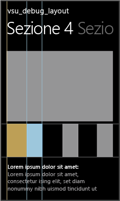
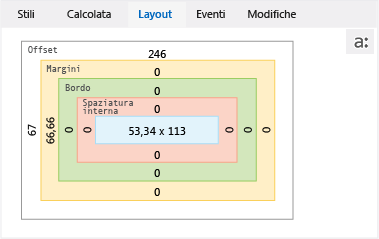

# Eseguire il debug del layout usando DOM Explorer
[!INCLUDE[vs2017banner](../code-quality/includes/vs2017banner.md)]

  
  
 La scheda **Layout** di DOM Explorer mostra il [modello di riquadro CSS](http://go.microsoft.com/fwlink/?LinkID=238778) per l'elemento selezionato in un'app [!INCLUDE[win8_appname_long](../debugger/includes/win8_appname_long_md.md)], un'app di Windows Phone Store o un'applicazione creata con Strumenti di Visual Studio per Apache Cordova. È possibile usare questa rappresentazione visiva del modello di riquadro per identificare e modificare i valori correlati al layout che hanno effetto sull'aspetto degli elementi.  
  
> [!TIP]
>  Le modifiche apportate nella scheda **Layout** non sono permanenti. È possibile apportare modifiche permanenti al codice sorgente e quindi aggiornare l'app con il pulsante **Aggiorna applicazione Windows** sulla barra degli strumenti Debug \(solo per app di Windows Store e Windows Phone Store\). In questo modo, si può evitare di riavviare il debugger.  
  
 Per usare DOM Explorer per modificare gli aspetti di layout che non vengono visualizzati nel modello di riquadro, vedere [Guida introduttiva: Eseguire il debug di HTML e CSS](../debugger/quickstart-debug-html-and-css.md) e [Eseguire il debug di stili CSS tramite DOM Explorer](../debugger/debug-css-styles-using-dom-explorer.md).  
  
## Esempio di correzione di un problema di layout  
 Questo esempio mostra come selezionare un elemento di elenco nel modello Hub\/Pivot, interpretare i valori del modello di riquadro presenti nella scheda **Layout** e quindi modificare uno dei valori di proprietà per correggere un problema di layout.  
  
#### Per correggere il problema di layout  
  
1.  In Visual Studio creare una nuova app di Windows Store basata sul modello di progetto Hub\/Pivot.  
  
2.  Nella cartella shared pages\\hub apri il file hub.css.  
  
3.  Sostituire il codice CSS riportato di seguito:  
  
    ```css  
    .hubpage .hub .section4 .sub-image-row img { height: 95px; width: 130px; }  
    ```  
  
     Con questo codice CSS:  
  
    ```css  
    .hubpage .hub .section4 .sub-image-row img { height: 95px; width: 130px; margin-left: 5em; }  
    ```  
  
4.  Selezionare il progetto appName.WindowsPhone o appName.Windows in Esplora soluzioni e poi scegliere **Imposta come progetto di avvio** dal menu di scelta rapida.  
  
5.  A seconda del progetto di avvio, seleziona **Emulator 8.1 WVGA 4 inch 512MB** o **Simulatore** nell'elenco a discesa sulla barra degli strumenti Debug \(il valore predefinito è **Computer locale**\).  
  
       
  
6.  Premere F5 per eseguire l'app in modalità debug.  
  
7.  Scorrere o eseguire un gesto rapido per aprire Sezione 4.  
  
    > [!TIP]
    >  Posizionare l'emulatore Windows Phone o il simulatore proprio accanto alla finestra di Visual Studio, per poter osservare immediatamente i risultati delle selezioni e le modifiche apportate agli stili CSS.  
  
     Al caricamento di Sezione 4, è possibile notare che l'aspetto delle immagini inferiori non è corretto. Ogni immagine dell'elemento viene tagliata a metà \(con la metà sinistra mancante\).  
  
8.  Passare a Visual Studio e scegliere **Seleziona elemento** in DOM Explorer oppure premere CTRL\+B. In questo modo la modalità di selezione cambia per consentire la selezione di un elemento facendovi clic sopra e l'applicazione viene portata in primo piano. La modalità viene ripristinata dopo un singolo clic.  
  
    > [!TIP]
    >  È anche possibile usare i tasti di direzione o altri metodi per selezionare elementi HTML direttamente in DOM Explorer. Per altre informazioni sulla selezione di elementi, vedere [Guida introduttiva: Eseguire il debug di HTML e CSS](../debugger/quickstart-debug-html-and-css.md).  
  
9. Nell'emulatore Windows Phone o nel simulatore seleziona la metà di destra grigia di una delle immagini tagliate a metà. Attorno all'elemento selezionato appare un'evidenziazione, come mostrato qui nell'emulatore Windows Phone:  
  
       
  
    > [!TIP]
    >  Il simulatore supporta il posizionamento del cursore sopra gli elementi per mostrare l'evidenziazione del riquadro attorno agli elementi DOM prima di selezionarne uno. Nell'emulatore Windows Phone, invece, questo comportamento non è supportato.  
  
     Quando selezioni un elemento DOM, DOM Explorer seleziona automaticamente l'elemento IMG corrispondente in Visual Studio. L'elemento selezionato DOM Explorer è analogo al seguente:  
  
    ```html  
     </img>  
    ```  
  
10. Fai clic sulla scheda **Layout**. Questa scheda mostra il modello di riquadro dell'elemento selezionato, come illustrato nell'emulatore Windows Phone.  
  
       
  
     In questa visualizzazione sono disponibili alcune informazioni utili sull'elemento:  
  
    -   I colori corrispondono all'evidenziazione della casella visualizzata nel simulatore al passaggio del mouse sugli elementi. Il colore blu rappresenta le dimensioni dell'elemento \. Il colore marrone chiaro rappresenta i valori dei margini.  
  
    -   Il margine sinistro \(margin\-left\) è impostato e questa può essere la causa del problema in quanto corrisponde al sintomo \(nero sul lato sinistro delle immagini\).  
  
    -   Nelle caselle in cui è presente un valore pari a 0 pixel \(ad esempio, Spaziatura interna e Bordo\) indicano che le proprietà CSS corrispondenti probabilmente non sono impostate.  
  
11. Per scoprire come viene applicata la regola margin\-left, fai clic sulla scheda **Calcolata** e guarda sotto la regola margin\-left. Come si può notare, questa regola è impostata sul valore 5em, ma il valore calcolato è 66,66px o 146,66px, a seconda del dispositivo di destinazione.  
  
    > [!TIP]
    >  La scheda **Calcolata** indica che la regola margin\-left è impostata nel selettore CSS `..hubpage .hub. section4 .sub-image-row img`, disponibile in hub.css. In questa app demo è qui che occorre apportare la correzione.  
  
     È anche possibile usare la scheda **Layout** per verificare le modifiche apportate ai valori del layout.  
  
12. Nella scheda **Layout** scegli **66,66** o **146,66**, che viene visualizzato sul lato sinistro del riquadro **Margine**.  
  
13. Digitare `0` e premere INVIO. È anche possibile anche usare i tasti FRECCIA SU e FRECCIA GIÙ per modificare il valore.  
  
14. Seleziona gli altri elementi \ in DOM Explorer e modificane i valori di margin\-left su 0.  
  
15. Passa all'emulatore Windows Phone o al simulatore. I valori di margin\-left aggiornati sono stati applicati alle immagini di Sezione 4. Questi valori vengono anche aggiornati nella scheda **Calcolata** sotto la regola margin\-left.  
  
## Vedere anche  
 [Guida introduttiva: Eseguire il debug di HTML e CSS](../debugger/quickstart-debug-html-and-css.md)   
 [Eseguire il debug di stili CSS tramite DOM Explorer](../debugger/debug-css-styles-using-dom-explorer.md)   
 [Visualizzare i listener di eventi DOM](../debugger/view-dom-event-listeners.md)