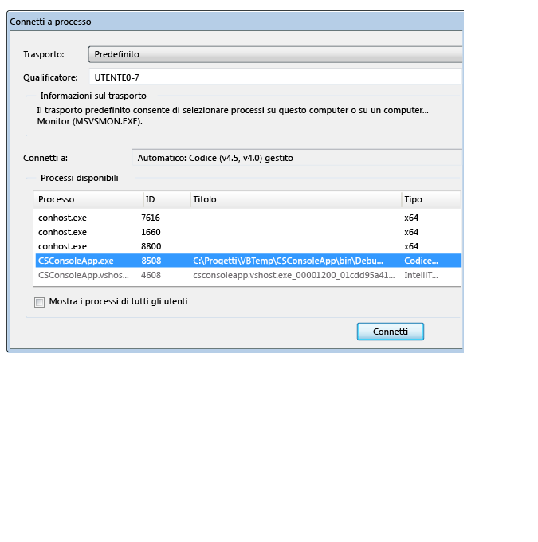
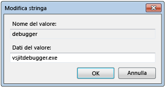
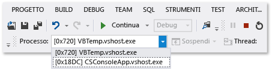
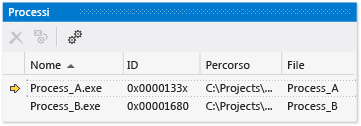

# Eseguire il debug di uno o pi&#249; processi in Visual Studio
[!INCLUDE[vs2017banner](../code-quality/includes/vs2017banner.md)]

Viene illustrato come avviare i processi di debug, passare da un processo all'altro, interrompere e continuare l'esecuzione, eseguire l'origine un'istruzione alla volta, interrompere il debug e terminare o disconnettersi dai processi.  
  
##   Contenuto  
 [Configurare il comportamento di esecuzione di più processi](#BKMK_Configure_the_execution_behavior_of_multiple_processes)  
  
 [Individuare i file di origine e di simboli (con estensione pdb)](#BKMK_Find_the_source_and_symbol___pdb__files)  
  
 [Avviare più processi in una soluzione VS, connettersi a un processo, avviare automaticamente un processo nel debugger](#BKMK_Start_multiple_processes_in_a_VS_solution__attach_to_a_process__automatically_start_a_process_in_the_debugger)  
  
 [Passare da un processo all'altro, interrompere e continuare l'esecuzione, eseguire l'origine un'istruzione alla volta](#BKMK_Switch_processes__break_and_continue_execution__step_through_source)  
  
 [Interrompere il debug, terminare o disconnettersi dai processi](#BKMK_Stop_debugging__terminate_or_detach_from_processes)  
  
##   Configurare il comportamento di esecuzione di più processi  
 Per impostazione predefinita, quando più processi sono in esecuzione nel debugger, i comandi del debugger di interruzione, esecuzione delle istruzioni e arresto di solito interessano tutti i processi.  Ad esempio, quando un processo viene sospeso in corrispondenza di un punto di interruzione, viene sospesa anche l'esecuzione di tutti gli altri processi.  È possibile modificare questo comportamento predefinito per ottenere un maggiore controllo sulle destinazioni dei comandi di esecuzione.  
  
1.  Scegliere **Opzioni e impostazioni** dal menu **Debug**.  
  
2.  In **Debug**, nella pagina **Generale**, deselezionare la casella di testo **Quando si interrompe un processo, interrompi tutti i processi**.  
  
  [Contenuto](#BKMK_Contents)  
  
##   Individuare i file di origine e di simboli \(con estensione pdb\)  
 Per esplorare il codice sorgente di un processo, il debugger deve accedere ai file di origine e di simboli del processo.  Vedere [Specifica di file di simboli \(con estensione pdb\) e di origine](../debugger/specify-symbol-dot-pdb-and-source-files-in-the-visual-studio-debugger.md).  
  
 Se non è possibile accedere ai file per un processo, è possibile spostarsi utilizzando la finestra Disassembly.  Vedere [Procedura: utilizzare la finestra Disassembly](../debugger/how-to-use-the-disassembly-window.md)  
  
  [Contenuto](#BKMK_Contents)  
  
##   Avviare più processi in una soluzione VS, connettersi a un processo, avviare automaticamente un processo nel debugger  
  
-   [Avviare il debug di più processi in una soluzione Visual Studio](#BKMK_Start_debugging_multiple_processes_in_a_Visual_Studio_solution) • [Modificare il progetto di avvio](#BKMK_Change_the_startup_project) • [Avviare un progetto specifico in una soluzione](#BKMK_Start_a_specific_project_in_a_solution) • [Avviare più progetti in una soluzione](#BKMK_Start_multiple_projects_in_a_solution) • [Connettersi a un processo](#BKMK_Attach_to_a_process) • [Avviare automaticamente un processo nel debugger](#BKMK_Automatically_start_an_process_in_the_debugger)  
  
> [!NOTE]
>  Il debugger non si connette automaticamente a un processo figlio che viene avviato da un processo sottoposto a debug, anche se il progetto figlio si trova nella stessa soluzione.  Per eseguire il debug di un processo figlio:  
>   
>  -   Connettersi al processo figlio dopo averlo avviato.  
>   
>      \-oppure\-  
> -   Configurare Windows per avviare automaticamente il processo figlio in una nuova istanza del debugger.  
  
###   Avviare il debug di più processi in una soluzione Visual Studio  
 Quando sono presenti più progetti in una soluzione Visual Studio che è possibile eseguire in modo indipendente \(progetti eseguiti in processi distinti\), è possibile selezionare quali progetti vengono avviati dal debugger.  
  
   
  
####   Modificare il progetto di avvio  
 Per modificare il progetto di avvio per una soluzione, selezionarlo in Esplora soluzioni e scegliere **Imposta come progetto di avvio** dal menu di scelta rapida.  
  
####   Avviare un progetto specifico in una soluzione  
 Per avviare un progetto per una soluzione senza modificare il progetto di avvio predefinito, selezionare il progetto in Esplora soluzioni e scegliere **Debug** dal menu di scelta rapida.  È quindi possibile scegliere **Avvia nuova istanza** o **Esegui istruzione nuova istanza**.  
  
  [Avviare più processi in una soluzione VS, connettersi a un processo, avviare automaticamente un processo nel debugger](../debugger/debug-multiple-processes.md#BKMK_Start_multiple_processes_in_a_VS_solution__attach_to_a_process__automatically_start_a_process_in_the_debugger)  
  
  [Contenuto](#BKMK_Contents)  
  
####   Avviare più progetti in una soluzione  
  
1.  Selezionare la soluzione in Esplora soluzioni, quindi scegliere **Proprietà** dal menu a scelta rapida.  
  
2.  Selezionare **Proprietà comuni** e **Progetto di avvio** nella finestra di dialogo **Proprietà**.  
  
3.  Per ogni progetto da modificare, scegliere **Avvia**, **Avvia senza eseguire debug** o **Nessuno**.  
  
  [Avviare più processi in una soluzione VS, connettersi a un processo, avviare automaticamente un processo nel debugger](../debugger/debug-multiple-processes.md#BKMK_Start_multiple_processes_in_a_VS_solution__attach_to_a_process__automatically_start_a_process_in_the_debugger)  
  
  [Contenuto](#BKMK_Contents)  
  
###   Connettersi a un processo  
 Il debugger può inoltre *connettersi* ai programmi in esecuzione in processi esterni a Visual Studio, inclusi i programmi in esecuzione in un dispositivo remoto.  Dopo essersi connessi a un programma, è possibile utilizzare i comandi di esecuzione del debugger, analizzare lo stato del programma e così via.  La possibilità di analisi del programma dipende dall'eventualità che il programma sia stato generato con informazioni di debug, che si disponga dell'accesso al relativo codice sorgente e che il compilatore JIT di Common Language Runtime stia registrando informazioni di debug.  
  
 Per ulteriori informazioni, vedere [Connessione a processi in esecuzione](../debugger/attach-to-running-processes-with-the-visual-studio-debugger.md).  
  
 **Connettersi a un processo in esecuzione nel computer locale**  
  
 Scegliere **Debug**, **Connetti a processo**.  Nella finestra di dialogo **Connetti a processo** selezionare il processo dall'elenco **Processi disponibili**, quindi scegliere **Connetti**.  
  
   
  
  [Contenuto](#BKMK_Contents)  
  
###   Avviare automaticamente un processo nel debugger  
 In alcuni casi potrebbe essere necessario eseguire il debug del codice di avvio di un programma avviato da un altro processo.  Può ad esempio trattarsi di servizi o operazioni di installazione personalizzate.  In questi scenari è possibile avviare e connettere il debugger automaticamente all'avvio dell'applicazione.  
  
1.  Avviare l'Editor del Registro di sistema \(**regedit.exe**\).  
  
2.  Individuare la cartella **HKEY\_LOCAL\_MACHINE\\Software\\Microsoft\\Windows NT\\CurrentVersion\\Image File Execution Options**.  
  
3.  Selezionare la cartella dell'app da avviare nel debugger.  
  
     Se il nome dell'app non è elencato come cartella figlio, selezionare **Image File Execution Options**, quindi **Nuova** e **Chiave** nel menu di scelta rapida.  Selezionare la nuova chiave, scegliere **Rinomina** dal menu di scelta rapida, quindi immettere il nome dell'app.  
  
4.  Nel menu di scelta rapida della cartella delle app scegliere **Nuova** e **Valore stringa**.  
  
5.  Modificare il nome del nuovo valore da **New Value** a `debugger`.  
  
6.  Nel menu di scelta rapida della voce del debugger scegliere **Modifica**.  
  
7.  Nella finestra di dialogo Modifica stringa digitare `vsjitdebugger.exe` nella casella **Dati valore**.  
  
       
  
   
  
  [Contenuto](#BKMK_Contents)  
  
##   Passare da un processo all'altro, interrompere e continuare l'esecuzione, eseguire l'origine un'istruzione alla volta  
  
-   [Spostarsi tra i processi](#BKMK_Switch_between_processes) • [Comandi per interrompere, eseguire le istruzioni e continuare](#BKMK_Break__step__and_continue_commands)  
  
###   Spostarsi tra i processi  
 Nonostante durante il debug sia possibile connettersi a più processi, nel debugger è sempre attivo un solo processo in un dato momento.  È possibile impostare il processo attivo o *corrente* nella barra degli strumenti Posizione di debug o nella finestra **Processi**.  Per passare da un processo all'altro, entrambi i processi devono essere in modalità di interruzione.  
  
 **Per impostare il processo corrente**  
  
-   Sulla barra degli strumenti Posizione di debug scegliere **Processo** per visualizzare la relativa casella di riepilogo.  Selezionare il processo da designare come processo corrente.  
  
       
  
     Se la barra degli strumenti **Posizione di debug** non è visibile, scegliere **Strumenti**, **Personalizza**.  Nella scheda **Barre degli strumenti** scegliere **Posizione di debug**.  
  
-   Aprire la finestra **Processi** \(tasti di scelta rapida **Ctrl\+Alt\+Z**\), individuare il processo da impostare come corrente e fare doppio clic su di esso.  
  
       
  
     Il processo corrente è contrassegnato da una freccia gialla.  
  
 Quando si passa a un progetto esso viene impostato per il debug.  In tutte le finestre del debugger visualizzate è mostrato lo stato del processo corrente e tutti i comandi per l'esecuzione di istruzioni interessano solo il processo corrente.  
  
  [Passare da un processo all'altro, interrompere e continuare l'esecuzione, eseguire l'origine un'istruzione alla volta](../debugger/debug-multiple-processes.md#BKMK_Switch_processes__break_and_continue_execution__step_through_source)  
  
  [Contenuto](#BKMK_Contents)  
  
###   Comandi per interrompere, eseguire le istruzioni e continuare  
  
> [!NOTE]
>  Per impostazione predefinita, i comandi del debugger per interrompere, continuare ed eseguire le istruzioni interessano tutti i processi sottoposti a debug.  Per modificare questo comportamento, vedere [Configurare il comportamento di esecuzione di più processi](#BKMK_Configure_the_execution_behavior_of_multiple_processes)  
  
||||  
|-|-|-|  
|**Comando**|**Quando si interrompe un processo, interrompi tutti i processi**   Selezionato \(impostazione predefinita\)|**Quando si interrompe un processo, interrompi tutti i processi**   Deselezionato|  
|Menu **Debug**:   -   **Interrompi tutto**|Interruzione di tutti i processi.|Interruzione di tutti i processi.|  
|Menu **Debug**:   -   **Continua**|Ripresa di tutti i processi.|Ripresa di tutti i processi sospesi.|  
|Menu **Debug**:   -   **Esegui istruzione** -   **Esegui istruzione\/routine** -   **Esci da istruzione\/routine**|Esecuzione di tutti i processi durante l'esecuzione delle istruzioni del processo corrente.   Successiva interruzione di tutti i processi.|Esecuzione delle istruzioni del processo corrente.   Ripresa dei processi sospesi.   Continuazione dei processi in esecuzione.|  
|Menu **Debug**:   -   **Esegui istruzione processo corrente** -   **Esegui istruzione\/routine processo corrente** -   **Esci da istruzione\/routine processo corrente**|N\/D|Esecuzione delle istruzioni del processo corrente.   Mantenimento dello stato esistente \(sospeso o in esecuzione\) degli altri processi.|  
|Finestra di origine   -   **Punto di interruzione**|Interruzione di tutti i processi.|Interruzione solo del processo della finestra di origine.|  
|Menu di scelta rapida della finestra di origine:   -   **Esecuzione fino al cursore**   La finestra di origine deve essere nel processo corrente.|Esecuzione di tutti i processi mentre il processo della finestra di origine viene eseguito fino al cursore e quindi interrotto.   Successiva interruzione di tutti gli altri processi.|Esecuzione del processo della finestra di origine fino al cursore.   Mantenimento dello stato esistente \(sospeso o in esecuzione\) degli altri processi.|  
|Menu di scelta rapida della finestra**Processi**:   -   **Interrompi processo**|N\/D|Interruzione del processo selezionato.   Mantenimento dello stato esistente \(sospeso o in esecuzione\) degli altri processi.|  
|Menu di scelta rapida della finestra**Processi**:   -   **Continua processo**|N\/D|Ripresa del processo selezionato.   Mantenimento dello stato esistente \(sospeso o in esecuzione\) degli altri processi.|  
  
  [Passare da un processo all'altro, interrompere e continuare l'esecuzione, eseguire l'origine un'istruzione alla volta](../debugger/debug-multiple-processes.md#BKMK_Switch_processes__break_and_continue_execution__step_through_source)  
  
  [Contenuto](#BKMK_Contents)  
  
##   Interrompere il debug, terminare o disconnettersi dai processi  
  
-   [Interrompere, terminare e disconnettere i comandi](#BKMK_Stop__terminate__and_detach_commands)  
  
 Per impostazione predefinita, se si sceglie **Debug**, **Interrompi debug** quando più processi sono aperti nel debugger, questo termina o disconnette tutti i processi a seconda della modalità di apertura del processo nel debugger:  
  
-   Se il processo corrente è stato avviato nel debugger, esso viene terminato.  
  
-   Se il debugger è stato connesso al processo corrente, viene disconnesso e il processo rimane in esecuzione.  
  
 Ad esempio, se si avvia il debug di un processo da una soluzione Visual Studio, si connette un altro processo già in esecuzione e si sceglie **Interrompi debug**, la sessione di debug termina, il processo avviato in Visual Studio viene interrotto, mentre quello connesso viene mantenuto in esecuzione.  È possibile utilizzare le procedure seguenti per controllare la modalità di interruzione del debug.  
  
> [!NOTE]
>  L'opzione **Quando si interrompe un processo, interrompi tutti i processi** non influisce sull'interruzione del debug o sull'interruzione e la disconnessione dai processi.  
  
 **Per modificare gli effetti dell'interruzione del debug su un singolo processo**  
  
-   Aprire la finestra **Processi** \(tasti di scelta rapida **Ctrl\+Alt\+Z**\).  Selezionare un processo, quindi selezionare o deselezionare la casella di controllo **Disconnetti al termine del debug**.  
  
###   Interrompere, terminare e disconnettere i comandi  
  
|||  
|-|-|  
|**Comando**|**Descrizione**|  
|Menu **Debug**:   -   **Interrompi debug**|A meno che il comportamento non sia stato modificato mediante l'opzione **Disconnetti al termine del debug** della finestra **Processi**:   1.  I processi avviati dal debugger vengono terminati. 2.  I processi connessi vengono disconnessi dal debugger.|  
|Menu **Debug**:   -   **Termina tutto**|Tutti i processi vengono terminati.|  
|Menu **Debug**:   -   **Disconnetti tutto**|Il debugger si disconnette da tutti i processi.|  
|Menu di scelta rapida della finestra**Processi**:   -   **Disconnetti processo**|Il debugger si disconnette da tutti i processi selezionati.   Mantenimento dello stato esistente \(sospeso o in esecuzione\) degli altri processi.|  
|Menu di scelta rapida della finestra**Processi**:   -   **Termina processo**|Il processo selezionato viene terminato.   Mantenimento dello stato esistente \(sospeso o in esecuzione\) degli altri processi.|  
|Menu di scelta rapida della finestra**Processi**:   -   **Disconnetti al termine del debug**|Attiva\/disattiva il comportamento di **Debug**, **Interrompi debug** per il processo selezionato:   -   Opzione selezionata: il debugger si disconnette da tutti i processi. -   Opzione deselezionata: il processo viene terminato.|  
  
  [Interrompere il debug, terminare o disconnettersi dai processi](../debugger/debug-multiple-processes.md#BKMK_Stop_debugging__terminate_or_detach_from_processes)  
  
  [Contenuto](#BKMK_Contents)  
  
## Vedere anche  
 [Specifica di file di simboli \(con estensione pdb\) e di origine](../debugger/specify-symbol-dot-pdb-and-source-files-in-the-visual-studio-debugger.md)   
 [Connessione a processi in esecuzione](../debugger/attach-to-running-processes-with-the-visual-studio-debugger.md)   
 [Spostarsi nel codice con il Debugger](../debugger/navigating-through-code-with-the-debugger.md)   
 [Debug JIT](../debugger/just-in-time-debugging-in-visual-studio.md)   
 [Debug di applicazioni multithreading](../debugger/debug-multithreaded-applications-in-visual-studio.md)