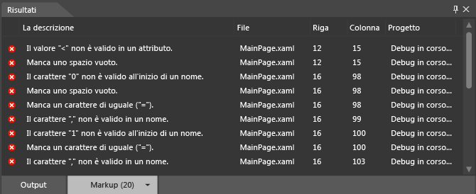

# Debug XAML in Blend
[!INCLUDE[vs2017banner](../code-quality/includes/vs2017banner.md)]

Puoi usare gli strumenti disponibili in [!INCLUDE[blend_first](../debugger/includes/blend_first_md.md)] per eseguire il debug del codice XAML nell'app.  Quando compili un progetto, eventuali errori vengono visualizzati nel pannello **Risultati**.  Fai doppio clic su un errore per trovare il markup correlato all'errore.  Se desideri avere più spazio per lavorare, puoi nascondere il pannello **Risultati** premendo F12.  
  
## Errori di sintassi  
 Si verificano errori di sintassi se il codice XAML o i file code\-behind non rispettano le regole di formattazione del linguaggio.  La descrizione dell'errore ti aiuterà a capire come risolverlo.  L'elenco specifica anche il nome del file e il numero della riga in cui è presente l'errore.  Gli errori XAML sono elencati nella scheda **Markup** del pannello **Risultati**.  
  
> [!TIP]
>  XAML è un linguaggio di markup basato su XML che segue le regole di sintassi XML.  
  
 Di seguito sono elencate alcune cause comuni degli errori di sintassi XAML:  
  
-   In una parola chiave è presente un errore di ortografia oppure l'uso delle lettere maiuscole\/minuscole non è corretto.  
  
-   Le stringhe di testo o gli attributi non sono racchiusi tra virgolette.  
  
-   In un elemento XAML manca un tag di chiusura.  
  
-   È presente un elemento XAML in una posizione non consentita.  
  
 Per ulteriori informazioni sulla sintassi XAML comune, vedi [Guida alla sintassi XAML di base](http://go.microsoft.com/fwlink/?LinkId=329942).  
  
 Puoi anche identificare e risolvere semplici errori di sintassi code\-behind, errori di compilazione ed errori di runtime in [!INCLUDE[blend_subs](../debugger/includes/blend_subs_md.md)].  Ricorda, tuttavia, che gli errori code\-behind sono più facilmente individuabili e risolvibili in Visual Studio.  
  
### Debug di codice XAML di esempio  
 L'esempio riportato di seguito descrive una semplice sessione di debug XAML in [!INCLUDE[blend_subs](../debugger/includes/blend_subs_md.md)].  
  
##### Per creare un progetto  
  
1.  In [!INCLUDE[blend_subs](../debugger/includes/blend_subs_md.md)] apri il menu **File**, quindi scegli **Nuovo progetto**.  
  
     Nella finestra di dialogo **Nuovo progetto** viene visualizzato un elenco di tipi di progetto sul lato sinistro.  Quando fai clic su un tipo di progetto, i modelli di progetto a esso associati vengono visualizzati a destra.  
  
2.  Nell'elenco dei tipi di progetto fai clic su **XAML \(Windows Store\)**.  
  
3.  Nell'elenco dei modelli di progetto fai clic su **Applicazione vuota**.  
  
4.  Nella casella di testo **Nome** digita `DebuggingSample`.  
  
5.  Nella casella di testo **Percorso** verifica il percorso del progetto.  
  
6.  Nell'elenco **Linguaggio** fai clic su **Visual C\#**, quindi scegli **OK** per creare il progetto.  
  
7.  Fai clic con il pulsante destro del mouse sull'area di progettazione, quindi scegli **Visualizza origine** per passare alla visualizzazione divisa.  
  
8.  Copia il codice seguente facendo clic sul link **Copia** nell'angolo in alto a destra del codice.  
  
    ```  
    <Grid HorizontalAlignment="Left" Height="222" VerticalAlignment="Top>  
         <Button content="Button" x:Mame="Home" HorizontalAlignment="Left" VerticalAlignment="Top"/>  
         <Button Content="Button" HorizontalAlignment="Left" VerticalAlignment="Top" Margin="0,38,0,0">  
         <Button Content="Button" HorizontalAlignment="Left" VerticalAlignment="Top" Margin="0,75,0,0"/>  
         <Button Content="Button" HorizontalAlignment="Left" VerticalAlignment="Top" Margin="0,112,0,0"/>  
         <Button Content="Button" HorizontalAlignment="Left" VerticalAlignment="Top Margin="0,149,0,0"/>  
    </Grid>  
  
    ```  
  
9. Individua l'oggetto **Grid** predefinito e incolla il codice tra i tag **Grid** di apertura e chiusura.  Al termine, il codice dovrebbe risultare simile al seguente:  
  
    ```  
    <Grid Background="{ThemeResource ApplicationPageBackgroundThemeBrush}">  
         <Grid HorizontalAlignment="Left" Height="222" VerticalAlignment="Top>  
              <Button content="Button" x:Mame="Home" HorizontalAlignment="Left" VerticalAlignment="Top"/>  
              <Button Content="Button" HorizontalAlignment="Left" VerticalAlignment="Top" Margin="0,38,0,0">  
              <Button Content="Button" HorizontalAlignment="Left" VerticalAlignment="Top" Margin="0,75,0,0"/>  
              <Button Content="Button" HorizontalAlignment="Left" VerticalAlignment="Top" Margin="0,112,0,0"/>  
              <Button Content="Button" HorizontalAlignment="Left" VerticalAlignment="Top Margin="0,149,0,0"/>  
         </Grid>  
    </Grid>  
  
    ```  
  
10. Premi CTRL\+MAIUSC\+B per compilare il progetto.  
  
 Un messaggio di errore ti avvisa che il progetto non può essere compilato e nella parte superiore dell'app appare il pannello **Risultati**, che elenca gli errori.  
  
   
  
### Risoluzione degli errori XAML  
 Quando vengono rilevati errori XAML, nell'area di progettazione viene visualizzato un avviso che indica che il progetto contiene markup non valido.  Mentre risolvi gli errori, il relativo elenco nel pannello **Risultati** si aggiorna automaticamente.  Dopo che avrai risolto tutti gli errori, l'area di progettazione sarà abilitata e visualizzerà l'app.  
  
##### Per risolvere gli errori XAML  
  
1.  Fai doppio clic sul primo errore nell'elenco.  La descrizione è "Il valore '\<' non è valido in un attributo". Quando fai doppio clic sull'errore, il puntatore trova la posizione corrispondente nel codice.  Il valore `<` che precede `Button` è valido e non è un attributo come suggerito nel messaggio di errore.  Se osservi la riga di codice precedente, noterai che le virgolette di chiusura per l'attributo `Top` sono mancanti.  Digita le virgolette di chiusura.  L'elenco degli errori presente nel pannello **Risultati** si aggiorna automaticamente per riflettere le modifiche.  
  
2.  Fai doppio clic sulla descrizione "Carattere non valido '0' all'inizio di un nome". `Margin="0,149,0,0"` presenta il formato corretto.  Nota che la codifica colori di `Margin` non corrisponde alle altre istanze di `Margin` nel codice.  Poiché le virgolette di chiusura mancano nella coppia nome\/valore precedente \(`VerticalAlignment="Top`\), `Margin="` viene letto come parte del valore dell'attributo precedente e 0 viene letto come carattere iniziale di una coppia nome\/valore.  Digita le virgolette di chiusura per `Top`.  L'elenco degli errori presente nel pannello **Risultati** si aggiorna automaticamente per riflettere le modifiche.  
  
3.  Fai doppio clic sull'errore rimanente, "Tag XML di chiusura 'Button' non corrispondente". Il puntatore si trova in corrispondenza del tag **Grid** di chiusura \(`</Grid>`\), suggerendo che l'errore si trova all'interno dell'oggetto `Grid`.  Nota che il secondo oggetto `Button` è privo del tag di chiusura.  Dopo aver aggiunto il tag `/` di chiusura, l'elenco del pannello **Risultati** viene aggiornato.  Ora che questi errori iniziali sono stati risolti, ne vengono identificati altri due.  
  
4.  Fai doppio clic su "Membro 'content' non riconosciuto o non accessibile". `c` in `content` deve essere maiuscolo.  Sostituisci la lettera "c" minuscola con una "c" maiuscola.  
  
5.  Fai doppio clic su "La proprietà 'Mame' non esiste nello spazio dei nomi 'http:\/\/schemas.microsoft.com\/winfx\/2006\/xaml'". La "M" in "Mame" dovrebbe essere una "N". Sostituisci la "M" con una "N". Ora che il codice XAML può essere analizzato, l'app appare nell'area di progettazione.  
  
       
  
     Premi CTRL\+MAIUSC\+B per compilare il progetto e confermare che non vi sono altri errori.  
  
## Debug in Visual Studio  
 Puoi aprire progetti [!INCLUDE[blend_subs](../debugger/includes/blend_subs_md.md)] in Visual Studio per eseguire più facilmente il debug del codice nell'app.  Per aprire un progetto di [!INCLUDE[blend_subs](../debugger/includes/blend_subs_md.md)] in Visual Studio, fai clic con il pulsante destro del mouse sul progetto nel pannello **Progetti**, quindi scegli **Modifica in Visual Studio**.  Una volta completata la sessione di debug in Visual Studio, premi CTRL\+MAIUSC\+S per salvare tutte le modifiche e poi torna a [!INCLUDE[blend_subs](../debugger/includes/blend_subs_md.md)].  Ti verrà chiesto di ricaricare il progetto.  Fai clic su **Sì tutti** per continuare a lavorare in [!INCLUDE[blend_subs](../debugger/includes/blend_subs_md.md)].  
  
 Per ulteriori informazioni sul debug dell'app, vedi [Debug di applicazioni Windows Store in Visual Studio](http://go.microsoft.com/fwlink/?LinkId=329944).  
  
## Per ulteriori informazioni  
 Per ulteriori informazioni sul debug dell'app [!INCLUDE[blend_subs](../debugger/includes/blend_subs_md.md)], puoi eseguire ricerche di post correlati al problema o inserire una domanda nei [forum delle community delle app Windows Store](http://go.microsoft.com/fwlink/?LinkId=280308).