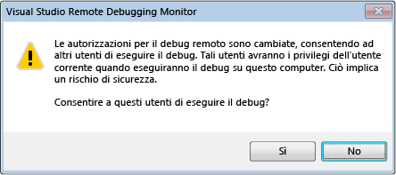

# Sicurezza del debugger
[!INCLUDE[vs2017banner](../code-quality/includes/vs2017banner.md)]

La possibilità di eseguire il debug di un altro processo offre grandi potenzialità che altrimenti non si avrebbero, in particolare nel debug remoto. Un debugger dannoso potrebbe causare gravi danni al computer oggetto del debug.  
  
 Molti sviluppatori, tuttavia, non considerano il fatto che i rischi di sicurezza possono avere effetti opposti. È infatti possibile che il codice dannoso presente nel processo oggetto del debug metta a rischio la sicurezza del computer in cui è in corso il debug: molti sono gli attacchi da cui è necessario proteggersi.  
  
## Procedure di sicurezza consigliate  
 Esiste una relazione di trust implicita tra il codice di cui è in corso il debug e il debugger. Se si è disposti a eseguire il debug di un qualche oggetto si deve essere disposti anche a eseguirlo. Il fatto è che l'oggetto del debug deve essere ritenuto attendibile. Se non è possibile accertarne l'attendibilità, è consigliabile non eseguire il debug oppure eseguirlo da un computer per il quale si è disposti a correre dei rischi e che si trovi in un ambiente isolato.  
  
 Per ridurre le vulnerabilità potenziali, è consigliabile disabilitare il debug nei computer di produzione. Per lo stesso motivo non disabilitare mai il debug per un tempo indefinito.  
  
### Sicurezza del debug gestito  
 Di seguito sono riportati alcuni consigli generali che riguardano il debug gestito.  
  
-   Prestare attenzione a eseguire il collegamento a un processo utente ritenuto non attendibile; così facendo, infatti, si presuppone che sia attendibile. Quando si prova a eseguire il collegamento a un processo utente ritenuto non attendibile, viene visualizzata una finestra di dialogo contenente un avviso di sicurezza che chiede di confermare l'operazione. Gli "utenti ritenuti attendibili" includono l'utente corrente e un set di utenti standard comunemente definiti nei computer in cui è installato .NET Framework, ad esempio **aspnet**, **localsystem**, **networkservice** e **localservice**. Per altre informazioni, vedere [Avviso di sicurezza: può essere pericoloso connettersi a un processo appartenente a un account utente non attendibile. Se le seguenti sottostanti risultano sospette o non sicure, non stabilire la connessione al processo.](../debugger/security-warning-attaching-to-a-process-owned-by-an-untrusted-user-can-be-dangerous-if-the-following-information-looks-suspicious-or-you-are-unsure-do-not-attach-to-this-process.md).  
  
-   Prestare attenzione nell'eseguire il download di un progetto da Internet e nel caricarlo in [!INCLUDE[vsprvs](../code-quality/includes/vsprvs_md.md)]. Si tratta di un'operazione molto rischiosa anche senza debug. Così facendo si presuppone che il progetto e il codice in esso contenuto siano attendibili.  
  
 Per altre informazioni, vedere [Debug del codice gestito](../debugger/debugging-managed-code.md).  
  
### Sicurezza del debug remoto  
 Il debug locale è in genere più sicuro del debug remoto. Con il debug remoto aumentano i rischi di intrusione.  
  
 Nel debug remoto viene usato Visual Studio Remote Debugging Monitor \(msvsmon.exe\) e per configurarlo sono disponibili numerosi consigli di sicurezza. Il modo migliore per configurare la modalità di autenticazione è Autenticazione di Windows, perché la modalità Nessuna autenticazione non è protetta.  
  
   
  
 Quando si usa la modalità Autenticazione di Windows, ricordare che è pericoloso concedere a un utente ritenuto non attendibile l'autorizzazione a eseguire la connessione a msvsmon, in quanto all'utente vengono concesse tutte le autorizzazioni per il computer in uso.  
  
 Non eseguire il debug di un processo sconosciuto in un computer remoto: numerosi sono gli attacchi che potrebbero mettere a rischio il computer in cui è in esecuzione il debugger o che potrebbero compromettere Visual Studio Remote Debugging Monitor. Se è assolutamente necessario eseguire il debug di un processo sconosciuto, provare a eseguire il debug locale e usare un firewall per contenere eventuali rischi.  
  
 Per altre informazioni, vedere [Debug remoto](../debugger/remote-debugging.md).  
  
### Sicurezza del debug di servizi Web  
 Il debug locale è più sicuro, ma poiché è probabile che [!INCLUDE[vsprvs](../code-quality/includes/vsprvs_md.md)] non sia installato nel server, non è sempre pratico. In genere, il debug dei servizi Web viene eseguito in remoto, tranne durante lo sviluppo, pertanto le procedure consigliate relative alla sicurezza del debug remoto si applicano anche al debug dei servizi Web. Di seguito sono riportate alcune procedure consigliate aggiuntive. Per altre informazioni, vedere [Debugging XML Web Services](http://msdn.microsoft.com/it-it/c900b137-9fbd-4f59-91b5-9c2c6ce06f00).  
  
-   Non attivare il debug in un server Web compromesso.  
  
-   Prima di eseguire il debug assicurarsi che il server Web sia protetto. In caso di dubbi non procedere con il debug.  
  
-   Prestare particolare attenzione nell'eseguire il debug di un servizio Web esposto su Internet.  
  
### Componenti esterni  
 Assicurarsi che i componenti esterni con cui il programma interagisce siano attendibili, soprattutto se il codice è stato scritto da altri. Verificare anche i componenti che [!INCLUDE[vsprvs](../code-quality/includes/vsprvs_md.md)] o il debugger potrebbe usare.  
  
### Simboli e codice sorgente  
 Di seguito sono riportati due strumenti di [!INCLUDE[vsprvs](../code-quality/includes/vsprvs_md.md)] che richiedono alcune riflessioni sulla sicurezza:  
  
-   Server di origine che fornisce le versioni di codice sorgente da un repository di codice sorgente. È utile quando non si dispone della versione corrente del codice sorgente di un programma.[Avviso di sicurezza: il debugger deve eseguire un comando non attendibile](../debugger/security-warning-debugger-must-execute-untrusted-command.md).  
  
-   Server di simboli che fornisce i simboli necessari per eseguire il debug di un arresto anomalo durante una chiamata di sistema.  
  
 Vedere [Specifica di file di simboli \(con estensione pdb\) e di origine](../debugger/specify-symbol-dot-pdb-and-source-files-in-the-visual-studio-debugger.md)  
  
## Vedere anche  
 [Impostazioni di debug e preparazione](../debugger/debugger-settings-and-preparation.md)   
 [Nozioni di base sul debugger](../debugger/debugger-basics.md)   
 [Avviso di sicurezza: può essere pericoloso connettersi a un processo appartenente a un account utente non attendibile. Se le seguenti sottostanti risultano sospette o non sicure, non stabilire la connessione al processo.](../debugger/security-warning-attaching-to-a-process-owned-by-an-untrusted-user-can-be-dangerous-if-the-following-information-looks-suspicious-or-you-are-unsure-do-not-attach-to-this-process.md)   
 [Avviso di sicurezza: il debugger deve eseguire un comando non attendibile](../debugger/security-warning-debugger-must-execute-untrusted-command.md)