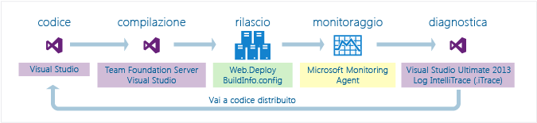
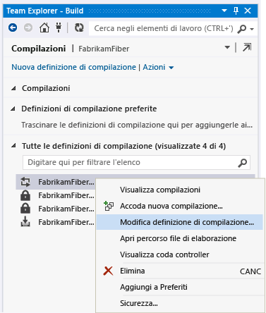
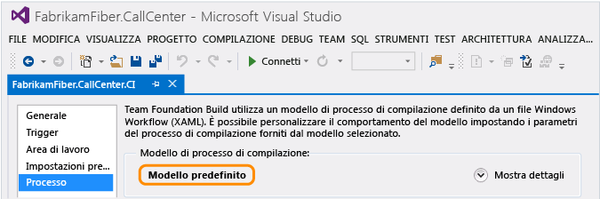
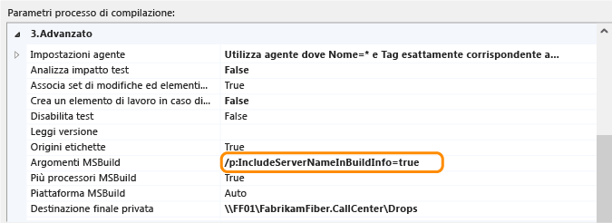
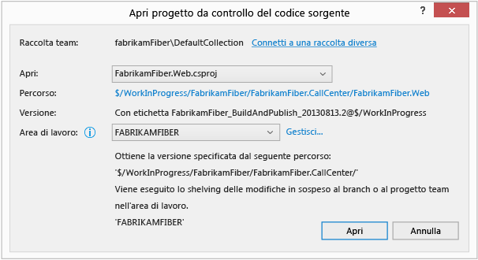
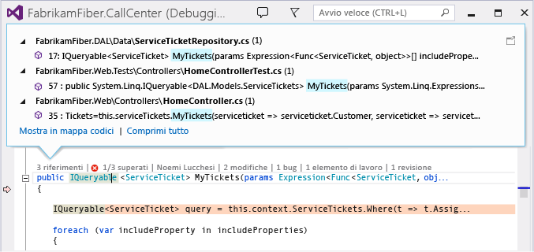
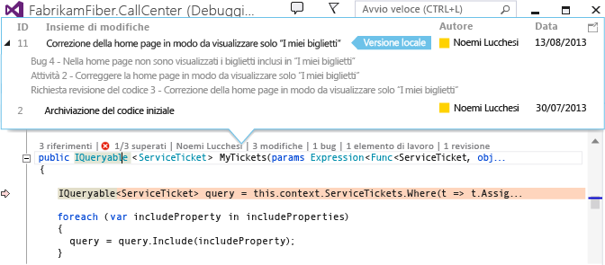
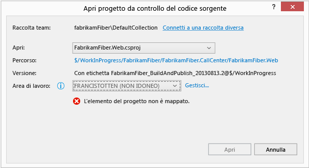
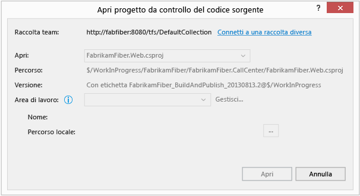
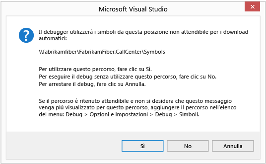

# Diagnosticare i problemi dopo la distribuzione
[!INCLUDE[vs2017banner](../code-quality/includes/vs2017banner.md)]

Per diagnosticare i problemi nell'app Web ASP.NET dopo la distribuzione usando IntelliTrace, includere le informazioni di compilazione nella versione per consentire a Visual Studio di trovare automaticamente i file di origine corretti e i file di simboli necessari per il debug del log IntelliTrace.  
  
 Se si usa Microsoft Monitoring Agent per controllare IntelliTrace, è necessario configurare il monitoraggio delle prestazioni delle applicazioni nel server Web. In questo modo vengono registrati gli eventi di diagnostica durante l'esecuzione dell'applicazione e vengono salvati gli eventi nel file di log IntelliTrace. È quindi possibile esaminare gli eventi in Visual Studio Enterprise (ma non edizioni Professional o Community), passare al codice nel punto in cui si è verificato l'evento, esaminare i valori registrati in quel momento e spostarsi avanti o indietro lungo il codice che è stato eseguito. Dopo aver trovato e risolto il problema, ripetere il ciclo per compilare, rilasciare e monitorare la versione per risolvere eventuali problemi futuri più tempestivamente e rapidamente.  
  
   
  
 **È necessario:**  
  
-   Visual Studio 2015 o Team Foundation Server 2015, 2013, 2012 o 2010 per configurare la build  
  
-   Microsoft Monitoring Agent per monitorare i dati di diagnostica della registrazione dell'applicazione  
  
-   Visual Studio Enterprise (ma non edizioni Professional o Community) per esaminare i dati diagnostici ed eseguire il debug del codice con IntelliTrace  
  
##  <a name="a-namesetupbuilda-step-1-include-build-information-with-your-release"></a><a name="SetUpBuild"></a> Passaggio 1: Includere informazioni con il rilascio di compilazione  
 Configurare il processo di compilazione per creare un manifesto di compilazione (file BuildInfo.config) per il progetto Web e includere il manifesto nella versione. Il manifesto contiene informazioni relative al progetto, al controllo del codice sorgente e al sistema di compilazione usati per creare una specifica build. Con queste informazioni, è possibile trovare tramite Visual Studio l'origine e i simboli corrispondenti, dopo aver aperto il log IntelliTrace per esaminare gli eventi registrati.  
  
###  <a name="a-nameautomatedbuilda-create-the-build-manifest-for-an-automated-build-using-team-foundation-server"></a><a name="AutomatedBuild"></a> Creare il manifesto di compilazione per una compilazione automatica con Team Foundation Server  
 Seguire questi passaggi se si usa il controllo della versione di Team Foundation o Git.  
  
####  <a name="a-nametfs2013a-team-foundation-server-2013"></a><a name="TFS2013"></a> Team Foundation Server 2013  
 Configurare la definizione di compilazione per aggiungere le posizioni di origine, compilazione e simboli al manifesto di compilazione (file BuildInfo.config). Team Foundation Build crea automaticamente questo file e lo inserisce nella cartella di output del progetto.  
  
1.  [Modificare la definizione di compilazione o creare una nuova definizione di compilazione.](../Topic/Create%20or%20edit%20a%20build%20definition.md)  
  
       
  
2.  Scegliere il modello predefinito (TfvcTemplate.12.xaml) o il proprio modello personalizzato.  
  
       
  
3.  Specificare dove salvare il file dei simboli (PDB) in modo da indicizzare automaticamente l'origine.  
  
     Se si usa un modello personalizzato, verificare che disponga di un'attività per l'indicizzazione dell'origine. In seguito verrà aggiunto un argomento MSBuild per specificare il percorso in cui salvare i file dei simboli.  
  
       
  
     Per altre informazioni sui simboli, vedere [Pubblicare i dati dei simboli](../Topic/Index%20and%20publish%20symbol%20data.md).  
  
4.  Aggiungere questo argomento MSBuild per inserire i percorsi di TFS e simboli nel file manifesto di compilazione:  
  
     **/p:IncludeServerNameInBuildInfo = true**  
  
     Chiunque possa aver accesso al server Web può visualizzare questi percorsi nel manifesto di compilazione. Assicurarsi che il server di origine sia sicuro.  
  
5.  Se si usa un modello personalizzato, aggiungere questo argomento MSBuild per specificare dove salvare il file dei simboli:  
  
     **/p: buildsymbolstorepath =**\<*percorso dei simboli*>  
  
       
  
     Aggiungere le righe seguenti al file di progetto Web (estensione csproj o vbproj):  
  
    ```  
    <!-- Import the targets file. Change the folder location as necessary. -->  
       <Import Project=""$(MSBuildExtensionsPath)\Microsoft\VisualStudio\v$(VisualStudioVersion)\BuildInfo\Microsoft.VisualStudio.ReleaseManagement.BuildInfo.targets" />  
  
    ```  
  
6.  Eseguire una nuova compilazione.  
  
 **Passaggio 2:** [Passaggio 2: Release your app](#DeployRelease)  
  
####  <a name="a-nametfs20122010a-team-foundation-server-2012-or-2010"></a><a name="TFS2012_2010"></a> Team Foundation Server 2012 o 2010  
 Seguire questi passaggi per creare automaticamente il manifesto di compilazione (file BuildInfo.config) per il progetto e inserire il file nella cartella di output del progetto. Il file viene visualizzato come "*ProjectName*.BuildInfo.config" nella cartella di output ma viene rinominato "BuildInfo.config" nella cartella di distribuzione dopo la pubblicazione dell'applicazione.  
  
1.  Installare Visual Studio 2013 (qualsiasi edizione) nel server Team Foundation Build.  
  
2.  Nella definizione della compilazione specificare il percorso in cui salvare i simboli in modo da indicizzare automaticamente l'origine.  
  
     Se si usa un modello personalizzato, verificare che disponga di un'attività per l'indicizzazione dell'origine.  
  
3.  Aggiungere gli argomenti MSBuild alla definizione della compilazione:  
  
    -   **/p:VisualStudioVersion = 12.0**  
  
    -   **/p:MSBuildAssemblyVersion = 12.0**  
  
    -   **/TV:12.0**  
  
    -   **/p:IncludeServerNameInBuildInfo = true**  
  
    -   **/p: buildsymbolstorepath =**\<*percorso dei simboli*>  
  
4.  Eseguire una nuova compilazione.  
  
 **Passaggio 2:** [Passaggio 2: Release your app](#DeployRelease)  
  
###  <a name="a-namemanualbuilda-create-the-build-manifest-for-a-manual-build-using-visual-studio"></a><a name="ManualBuild"></a> Creare il manifesto di compilazione per una compilazione manuale usando Visual Studio  
 Seguire questi passaggi per creare automaticamente il manifesto di compilazione (file BuildInfo.config) per il progetto e inserire il file nella cartella di output del progetto. Il file viene visualizzato come "*ProjectName*.BuildInfo.config" nella cartella di output ma viene rinominato "BuildInfo.config" nella cartella di distribuzione dopo la pubblicazione dell'applicazione.  
  
1.  Scaricare il progetto Web in **Esplora soluzioni**.  
  
2.  Aprire il file di progetto (estensione .csproj o .vbproj). Aggiungere queste righe:  
  
    ```xml  
    <!-- **************************************************** -->  
    <!-- Build info -->  
    <PropertyGroup>  
       <!-- Generate the BuildInfo.config file -->  
       <GenerateBuildInfoConfigFile>True</GenerateBuildInfoConfigFile>  
       <!-- Include server name in build info -->   
       <IncludeServerNameInBuildInfo>True</IncludeServerNameInBuildInfo>   
       <!-- Include the symbols path so Visual Studio can find the matching deployed code when you start debugging. -->  
       <BuildSymbolStorePath><path to symbols></BuildSymbolStorePath>  
    </PropertyGroup>  
    <!-- **************************************************** -->  
    ```  
  
3.  Archiviare il file di progetto aggiornato.  
  
4.  Eseguire una nuova compilazione.  
  
 **Passaggio 2:** [Passaggio 2: Release your app](#DeployRelease)  
  
###  <a name="a-namemsbuilda-create-the-build-manifest-for-a-manual-build-using-msbuildexe"></a><a name="MSBuild"></a> Creare il manifesto di compilazione per una compilazione manuale con MSBuild.exe  
 Aggiungere gli argomenti di compilazione quando si eseguirà una compilazione:  
  
 **/p:GenerateBuildInfoConfigFile = true**  
  
 **/p:IncludeServerNameInBuildInfo = true**  
  
 **/p: buildsymbolstorepath =**\<*percorso dei simboli*>  
  
##  <a name="a-namedeployreleasea-step-2-release-your-app"></a><a name="DeployRelease"></a> Passaggio 2: Rilasciare l'applicazione  
 Se si usa il [pacchetto Web.Deploy](http://msdn.microsoft.com/library/dd394698.aspx) creato dal processo di compilazione per distribuire l'applicazione, il manifesto di compilazione viene rinominato automaticamente da "*NomeProgetto*.BuildInfo.config" a "BuildInfo.config" e viene inserito nella stessa cartella del file Web.config dell'applicazione, nel server Web.  
  
 Se vengono usati altri metodi per distribuire l'applicazione, assicurarsi che il manifesto di compilazione sia rinominato da "*ProjectName*.BuildInfo.config" a "BuildInfo.config" inserito nella stessa cartella del file Web.config dell'applicazione, nel server Web.  
  
## <a name="step-3-monitor-your-app"></a>Passaggio 3: Monitorare l'applicazione  
 Impostare il monitoraggio delle prestazioni dell'applicazione sul server Web in modo tale da poter monitorare l'insorgere di problemi nell'applicazione, registrare eventi diagnostici e salvare tali eventi nel file di log IntelliTrace. Vedere la pagina relativa al [monitoraggio della versione per il rilevamento di problemi di distribuzione](../debugger/using-the-intellitrace-stand-alone-collector.md).  
  
##  <a name="a-nameinvestigateeventsa-step-4-find-the-problem"></a><a name="InvestigateEvents"></a> Passaggio 4: Individuare il problema  
 È necessario che sia presente Visual Studio Enterprise nel computer di sviluppo o in un altro computer per esaminare gli eventi registrati ed eseguire il debug del codice con IntelliTrace. È inoltre possibile usare strumenti come CodeLens, mappe del debugger e mappe del codice per diagnosticare il problema.  
  
### <a name="open-the-intellitrace-log-and-matching-solution"></a>Aprire il log IntelliTrace e la soluzione corrispondente  
  
1.  Aprire il log IntelliTrace (file .iTrace) da Visual Studio Enterprise. In alternativa, fare doppio clic sul file se nello stesso computer è presente Visual Studio Enterprise.  
  
2.  Scegliere **Apri soluzione** per fare in modo che Visual Studio apra automaticamente la soluzione o il progetto corrispondente, se il progetto non è stato compilato come parte di una soluzione. [D: nel log IntelliTrace mancano le informazioni sull'applicazione distribuita. Per quale motivo? Quale operazione devo eseguire?](#InvalidConfigFile)  
  
     Visual Studio esegue automaticamente lo shelving di qualsiasi modifica in sospeso all'apertura della soluzione o del progetto corrispondente. Per ottenere ulteriori dettagli su questo shelveset, aprire la finestra **Output** o **Team Explorer**.  
  
     Prima di apportare modifiche, verificare di disporre dell'origine corretta. Se si usano i rami, è possibile che il ramo su cui si sta lavorando sia diverso rispetto a quello in cui Visual Studio cerca l'origine corrispondente, ad esempio il ramo della versione.  
  
       
  
     Se è presente un'area di lavoro mappata per questa soluzione o questo progetto, Visual Studio la seleziona per inserirvi l'origine trovata.  
  
       
  
     In caso contrario, scegliere un'altra area di lavoro già mappata o crearne una nuova. Visual Studio esegue il mapping dell'intero ramo a quest'area di lavoro.  
  
       
  
     Per creare un'area di lavoro con mapping specifici o un nome diverso dal nome del computer, scegliere **Gestisci**.  
  
     [D: perché Visual Studio ad esempio che l'area di lavoro selezionata è inadatta](#IneligibleWorkspace)  
  
     [D: perché non è possibile continuare finché non si sceglie una raccolta team o una raccolta diversa?](#ChooseTeamProject)  
  
### <a name="diagnose-a-performance-problem"></a>Identificare un problema di prestazioni  
  
1.  In **Violazioni prestazioni**esaminare gli eventi di prestazioni registrati, i relativi tempi di esecuzione totali e altre informazioni sugli eventi. Esaminare ulteriori dettagli sui metodi chiamati durante un evento di prestazioni specifico.  
  
       
  
     È inoltre sufficiente fare doppio clic sull'evento.  
  
2.  Nella pagina dell'evento rivedere i tempi di esecuzione per queste chiamate. Cercare una chiamata lenta nell'albero di esecuzione.  
  
     Le chiamate più lente vengono visualizzate nella specifica sezione in caso di più chiamate, annidate o meno.  
  
     Espandere tale chiamata per rivedere tutte le chiamate e i valori annidati registrati in quel momento. Avviare quindi il debug dalla chiamata.  
  
       
  
     È inoltre sufficiente fare doppio clic sulla chiamata.  
  
     Se il metodo è incluso nel codice dell'applicazione, Visual Studio passa a tale metodo.  
  
       
  
     È possibile esaminare altri valori registrati, lo stack di chiamate, eseguire un'istruzione alla volta nel codice o usare la finestra **IntelliTrace** per [spostarsi in avanti o indietro tra gli altri metodi](../debugger/intellitrace.md) chiamati durante questo evento di prestazioni. [Che cosa sono gli altri eventi e informazioni riportati nel log IntelliTrace?](../debugger/using-saved-intellitrace-data.md)[What else can I do from here?](#WhatElse)[Servono altre informazioni sugli eventi relativi alle prestazioni?](http://blogs.msdn.com/b/visualstudioalm/archive/2013/09/20/performance-details-in-intellitrace.aspx)  
  
### <a name="diagnose-an-exception"></a>Diagnosticare un'eccezione  
  
1.  In **Dati eccezione**esaminare gli eventi di eccezione registrati, i relativi tipi, i messaggi e il momento in cui si sono verificate le eccezioni. Per esaminare il codice in dettaglio, avviare il debug dall'evento più recente in un gruppo di eccezioni.  
  
       
  
     È inoltre sufficiente fare doppio clic sull'evento.  
  
     Se l'eccezione si è verificata nel codice dell'applicazione, Visual Studio passa a questa posizione.  
  
       
  
     È possibile esaminare altri valori registrati, lo stack di chiamate o usare la finestra **IntelliTrace** per [spostarsi in avanti o indietro tra gli altri eventi registrati](../debugger/intellitrace.md), il codice correlato e i valori registrati in questi specifici momenti. [Che cos'è tutti gli altri eventi e le informazioni nel log IntelliTrace?](../debugger/using-saved-intellitrace-data.md)  
  
###  <a name="a-namewhatelsea-what-else-can-i-do-from-here"></a><a name="WhatElse"></a> Cos'altro è possibile eseguire da qui?  
  
-   [Ottenere altre informazioni su questo codice](../ide/find-code-changes-and-other-history-with-codelens.md). Per trovare riferimenti a questo codice, alla cronologia delle modifiche, a bug, elementi di lavoro, revisioni del codice o unit test correlati senza uscire dall'editor, usare gli indicatori di CodeLens nell'editor  
  
       
  
       
  
-   [Eseguire il mapping della posizione nel codice durante il debug.](../debugger/map-methods-on-the-call-stack-while-debugging-in-visual-studio.md) Per rilevare visivamente i metodi chiamati durante la sessione di debug, eseguire il mapping dello stack di chiamate.  
  
       
  
###  <a name="a-namefaqa-q-a"></a><a name="FAQ"></a> DOMANDE E RISPOSTE  
  
####  <a name="a-namewhyincludea-q-why-include-information-about-my-project-source-control-build-and-symbols-with-my-release"></a><a name="WhyInclude"></a> D: perché include informazioni sul progetto, controllo del codice sorgente, compilazione e simboli con il rilascio?  
 Visual Studio usa queste informazioni per trovare la soluzione e l'origine corrispondenti alla versione su cui si sta eseguendo il debug. Dopo aver aperto il log IntelliTrace e aver selezionato un evento per avviare il debug, Visual Studio usa simboli per trovare e visualizzare il codice dove si è verificato l'evento. È quindi possibile esaminare i valori registrati e spostarsi in avanti o indietro nell'esecuzione del codice.  
  
 Se si usa TFS e queste informazioni non sono presenti nel manifesto di compilazione (file BuildInfo.config), Visual Studio cerca l'origine e i simboli corrispondenti nel TFS attualmente connesso. Se Visual Studio non trova il TFS corretto o l'origine corrispondente, verrà richiesto di scegliere un altro TFS.  
  
####  <a name="a-nameinvalidconfigfilea-q-the-intellitrace-log-is-missing-information-about-my-deployed-app-why-did-this-happen-what-do-i-do"></a><a name="InvalidConfigFile"></a> D: nel log IntelliTrace mancano le informazioni sull'applicazione distribuita. Per quale motivo? Che cosa si può fare?  
 Questo può verificarsi quando la distribuzione viene effettuata dal computer di sviluppo oppure non si è connessi a TFS durante la distribuzione.  
  
1.  Passare alla cartella di distribuzione del progetto.  
  
2.  Trovare e aprire il manifesto di compilazione (file BuildInfo.config).  
  
3.  Assicurarsi che il file contenga le informazioni richieste:  
  
-   **Nome progetto**  
  
     Il nome del progetto in Visual Studio. Ad esempio:  
  
    ```  
    <ProjectName>FabrikamFiber.Extranet.Web</ProjectName>  
    ```  
  
-   **Proprietà SourceControl**  
  
-   Le informazioni sul sistema di controllo del codice sorgente e queste proprietà richieste:  
  
    -   **TFS**  
  
        -   **ProjectCollectionUri**: URI per Team Foundation Server e l'insieme di progetti  
  
        -   **ProjectItemSpec**: percorso del file del progetto dell'applicazione (estensione .csproj o .vbproj)  
  
        -   **ProjectVersionSpec**: versione del progetto  
  
         Ad esempio:  
  
        ```  
        <SourceControl type="TFS">  
           <TfsSourceControl>  
              <ProjectCollectionUri>http://fabrikamfiber:8080/tfs/FabrikamFiber</ProjectCollectionUri>  
              <ProjectItemSpec>$/WorkInProgress/FabrikamFiber/FabrikamFiber.CallCenter/FabrikamFiber.Web/FabrikamFiber.Web.csproj</ProjectItemSpec>  
              <ProjectVersionSpec>LFabrikamFiber_BuildAndPublish_20130813@$/WorkInProgress</ProjectVersionSpec>  
           </TfsSourceControl>  
        </SourceControl>  
        ```  
  
    -   **GIT**  
  
        -   **GitSourceControl**: posizione dello schema **GitSourceControl**  
  
        -   **RepositoryUrl**: URI per Team Foundation Server, insieme di progetti e repository Git  
  
        -   **ProjectPath**: percorso del file del progetto dell'applicazione (estensione .csproj o .vbproj)  
  
        -   **CommitId**: ID del commit  
  
         Ad esempio:  
  
        ```  
        <SourceControl type="Git">   
           <GitSourceControl xmlns="http://schemas.microsoft.com/visualstudio/deploymentevent_git/2013/09">  
              <RepositoryUrl>http://gittf:8080/tfs/defaultcollection/_git/FabrikamFiber</RepositoryUrl>  
              <ProjectPath>/FabrikamFiber.CallCenter/FabrikamFiber.Web/FabrikamFiber.Web.csproj</ProjectPath>  
              <CommitId>50662c96502dddaae5cd5ced962d9f14ec5bc64d</CommitId>  
           </GitSourceControl>  
        </SourceControl>  
        ```  
  
-   **Compilazione**  
  
     Informazioni sul sistema di compilazione, `"TeamBuild"` o `"MSBuild"`e queste proprietà richieste:  
  
    -   **BuildLabel** (per TeamBuild): nome e il numero della build. Questa etichetta viene usata anche come nome dell'evento di distribuzione. Per altre informazioni sui numeri di build, vedere [Usare i numeri di build per assegnare nomi significativi alle compilazioni completate](../Topic/Use%20build%20numbers%20to%20give%20meaningful%20names%20to%20completed%20builds.md).  
  
    -   **SymbolPath** (Consigliato): elenco di URI per le posizioni dei simboli (file PDB)separati da punto e virgola. Questi URI possono essere URL o UNC. In tal modo è più facile trovare i simboli corrispondenti, utili per il debug.  
  
    -   **BuildReportUrl** (per TeamBuild): posizione del report di compilazione in TFS  
  
    -   **BuildId** (per TeamBuild): URI per i dettagli della compilazione in TFS. Questo URI viene usato anche come ID per l'evento di distribuzione. Deve essere un ID univoco se non si usa TeamBuild.  
  
    -   **BuiltSolution**: percorso del file di soluzione usato da Visual Studio per trovare e aprire la soluzione corrispondente. Si tratta del contenuto della proprietà **SolutionPath** MsBuild.  
  
     Ad esempio:  
  
    -   **TFS**  
  
        ```  
        <Build type="TeamBuild">  
           <MsBuild>  
              <BuildLabel kind="label">FabrikamFiber_BuildAndPublish_20130813.1</BuildLabel>  
              <SymbolPath>\\fabrikamfiber\FabrikamFiber.CallCenter\Symbols</SymbolPath>  
              <BuildReportUrl kind="informative, url" url="http://fabrikamfiber:8080/tfs/FabrikamFiber/_releasePipeline/FindRelease?buildUri=fabrikamfiber%3a%2f%2f%2fBuild%2fBuild%2f448">Build Report Url</BuildReportUrl>  
              <BuildId kind="id">1c4444d2-518d-4673-a590-dce2773c7744,fabrikamfiber:///Build/Build/448</BuildId>  
              <BuiltSolution>$/WorkInProgress/FabrikamFiber/FabrikamFiber.CallCenter/FabrikamFiber.CallCenter.sln</BuiltSolution>  
           </MsBuild>  
        </Build>  
        ```  
  
    -   **GIT**  
  
        ```  
        <Build type="MSBuild">   
           <MSBuild>  
              <SymbolPath>\\gittf\FabrikamFiber.CallCenter\Symbols</SymbolPath>  
              <BuiltSolution>/FabrikamFiber.CallCenter/FabrikamFiber.CallCenter.sln</BuiltSolution>  
           </MSBuild>  
        </Build>  
        ```  
  
####  <a name="a-nameineligibleworkspacea-q-why-does-visual-studio-say-my-selected-workspace-is-ineligible"></a><a name="IneligibleWorkspace"></a> D: perché Visual Studio ad esempio che l'area di lavoro selezionata è inadatta  
 **R:** L'area di lavoro selezionata non include mapping tra la cartella del controllo del codice sorgente e una cartella locale. Per creare un mapping per questa area di lavoro, scegliere **Gestisci**. In caso contrario, scegliere un'area di lavoro già mappata o creare una nuova area di lavoro.  
  
   
  
####  <a name="a-namechooseteamprojecta-q-why-cant-i-continue-until-i-choose-a-team-collection-or-a-different-collection"></a><a name="ChooseTeamProject"></a> D: perché non è possibile continuare finché non si sceglie una raccolta team o una raccolta diversa?  
 **R:** Questo può verificarsi per uno qualsiasi dei seguenti motivi:  
  
-   Visual Studio non è connesso a TFS.  
  
       
  
-   In Visual Studio non è stata trovata la soluzione o il progetto nella raccolta del team corrente.  
  
     Quando la compilazione file manifesto di (\<*NomeProgetto*>. Buildinfo. config) non specifica in cui Visual Studio può individuare l'origine corrispondente, Visual Studio utilizza il TFS attualmente connesso per trovare la soluzione corrispondente o il progetto. Se la raccolta del team corrente non dispone dell'origine corrispondente, in Visual Studio viene richiesto di connettersi a una raccolta del team diversa.  
  
-   Visual Studio non trova la soluzione o progetto nella raccolta specificata dal file manifesto di compilazione (\<*NomeProgetto*>. Buildinfo. config).  
  
     È possibile che il TFS specificato non disponga più dell'origine corrispondente o non esista più, probabilmente perché è stata eseguita la migrazione a un nuovo TFS. Se il TFS specificato non esiste, è possibile che si verifichi il timeout di Visual Studio dopo circa un minuto e viene quindi richiesto di connettersi a una raccolta diversa. Per continuare, connettersi al server TFS corretto.  
  
       
  
####  <a name="a-namewhatworkspacea-q-whats-a-workspace"></a><a name="WhatWorkspace"></a> D: che cos'è un'area di lavoro?  
 **R:** [L'area di lavoro consente di archiviare una copia dell'origine](../Topic/Create%20and%20work%20with%20workspaces.md) per consentire di svilupparla prima di archiviare il lavoro. Se non è già presente un'area di lavoro mappata specificatamente alla soluzione o al progetto trovato, in Visual Studio viene richiesto di scegliere un'area di lavoro disponibile oppure di crearne una nuova con il nome del computer in uso come nome predefinito dell'area di lavoro.  
  
####  <a name="a-nameuntrustedsymbolsa-q-why-do-i-get-this-message-about-untrusted-symbols"></a><a name="UntrustedSymbols"></a> D: perché viene visualizzato questo messaggio sui simboli non attendibili?  
   
  
 **R:** questo messaggio viene visualizzato quando il percorso dei simboli nel file manifesto di compilazione (\<*NomeProgetto*>. Buildinfo. config) non è incluso nell'elenco di percorsi dei simboli attendibili. È possibile aggiungere il percorso dell'elenco di percorsi di simboli nelle opzioni del debugger.