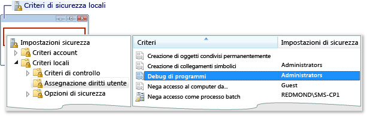
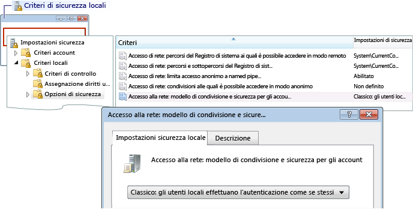

# Errore: accesso remoto al gruppo di lavoro non riuscito
[!INCLUDE[vs2017banner](../code-quality/includes/vs2017banner.md)]

Il testo del messaggio di errore è il seguente:  
  
 Accesso non riuscito: nome utente sconosciuto o password errata.  
  
 **Causa**  
  
 Questo errore può verificarsi quando si esegue il debug da un computer che fa parte di un gruppo di lavoro e si tenta di stabilire la connessione a un computer remoto.  Fra le cause possibili vi sono le seguenti:  
  
-   Nel computer remoto non esiste un account con il nome e la password specificati.  
  
-   Se il computer di Visual Studio e il computer remoto fanno entrambi parte di gruppi di lavoro, questo errore può essere causato dall'impostazione predefinita di **Criteri di sicurezza locali** del computer remoto.  L'impostazione predefinita di **Criteri di sicurezza locali** è **Solo Guest: gli utenti locali effettuano l'autenticazione come Guest**.  Per eseguire il debug con questa configurazione, è necessario modificare l'impostazione del computer remoto in **Classico: gli utenti locali effettuano l'autenticazione di se stessi**.  
  
> [!NOTE]
>  Per effettuare le attività elencate di seguito è necessario disporre di diritti amministrativi.  
  
### Per aprire la finestra Criteri di sicurezza locali  
  
1.  Avviare lo snap\-in **secpol.msc** di Microsoft Management Console.  Digitare secpol.msc nella funzionalità di ricerca di Windows, nella casella Esegui di Windows o a un prompt dei comandi.  
  
### Per aggiungere assegnazioni di diritti utente  
  
1.  Aprire la  
  
2.  Aprire la finestra **Criteri di sicurezza locali**.  
  
3.  Espandere la cartella **Criteri locali**.  
  
4.  Scegliere **Assegnazione diritti utente**.  
  
5.  Nella colonna **Criteri** fare doppio clic su **Debug di programmi** per visualizzare le assegnazioni dei criteri di gruppo locali correnti nella finestra di dialogo relativa all'impostazione di criteri di sicurezza locali.  
  
       
  
6.  Per aggiungere nuovi utenti, fare clic sul pulsante **Aggiungi utente o gruppo**.  
  
### Per modificare il modello di condivisione e sicurezza  
  
1.  Aprire la finestra **Criteri di sicurezza locali**.  
  
2.  Espandere la cartella **Criteri locali**.  
  
3.  Fare clic su **Opzioni di sicurezza**.  
  
4.  Nella colonna **Criteri** fare doppio clic su **Accesso di rete: modello di condivisione e sicurezza per gli account locali**.  
  
5.  Nella finestra di dialogo **Accesso di rete: modello di condivisione e sicurezza per gli account locali** modificare l'impostazione in **Classico: gli utenti locali effettuano l'autenticazione di se stessi**, quindi scegliere il pulsante **Applica**.  
  
       
  
## Vedere anche  
 [Errori e risoluzione dei problemi relativi al debug remoto](../debugger/remote-debugging-errors-and-troubleshooting.md)   
 [Debug remoto](../debugger/remote-debugging.md)