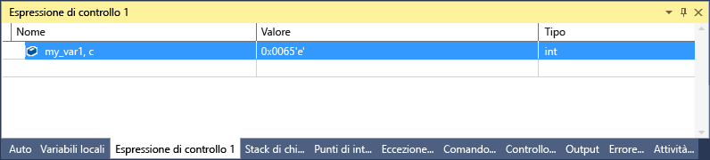

# Identificatori di formato in C++
[!INCLUDE[vs2017banner](../code-quality/includes/vs2017banner.md)]

È possibile modificare il formato con cui viene visualizzato il valore nella finestra **Espressioni di controllo** usando gli identificatori di formato.  
  
 Gli identificatori di formato possono essere usati anche nella finestra **Immediata**, nella finestra **Comando** e persino nelle finestre di origine. Se in queste finestre ci si posiziona su un'espressione, il risultato verrà visualizzato in un suggerimento dati. La visualizzazione Suggerimento dati riflette l'identificatore di formato.  
  
> [!NOTE]
>  Il debugger nativo di Visual Studio è cambiato in un nuovo motore di debug. Come parte di questa modifica, sono stati aggiunti nuovi identificatori di formato e alcuni precedenti sono stati rimossi. Il debugger precedente viene ancora usato per il debug di interoperabilità \(nativo e gestito combinati\) con C\+\+\/CLI. Le sezioni seguenti in questo argomento illustrano gli identificatori di formato per ogni motore di debug.  
>   
>  -   [Identificatori di formato](#BKMK_Visual_Studio_2012_format_specifiers) descrive gli identificatori di formato nel nuovo motore di debug.  
> -   [Identificatori di formato per il debug di interoperabilità con C++/CLI](#BKMK_Format_specifiers_for_interop_debugging_and_C___edit_and_continue) descrive gli identificatori di formato nel motore di debug precedente.  
  
## Uso degli identificatori di formato  
 Se si ha il codice seguente:  
  
```cpp  
int main() { int my_var1 = 0x0065; int my_var2 = 0x0066; int my_var3 = 0x0067; }  
```  
  
 Aggiungere la variabile `my_var1` alla finestra **Espressioni di controllo** \(durante il debug: **Debug\/Windows\/Espressioni di controllo\/Espressione di controllo 1**\) e impostare la visualizzazione su esadecimale \(nella finestra **Espressioni di controllo** fare clic con il pulsante destro del mouse sulla variabile e scegliere **Visualizzazione esadecimale**\). La finestra Espressioni di controllo mostra il valore 0x0065. Per visualizzare il valore espresso come carattere anziché come intero, nella colonna Nome, dopo il nome della variabile, aggiungere l'identificatore del formato di carattere **, c**. A questo punto, la colonna **valore** mostra **101 'e'**.  
  
   
  
##  <a name="BKMK_Visual_Studio_2012_format_specifiers"></a> Identificatori di formato  
 Le tabelle seguenti mostrano gli identificatori di formato che è possibile usare in Visual Studio. Gli identificatori in grassetto non sono supportati per il debug di interoperabilità con C\+\+\/CLI.  
  
|Identificatore|Formato|Valore dell'espressione di controllo originale|Valore visualizzato|  
|--------------------|-------------|----------------------------------------------------|-------------------------|  
|d|intero decimale|0x00000066|102|  
|o|intero ottale senza segno|0x00000066|000000000146|  
|x<br /><br /> **h**|intero esadecimale|102|0xcccccccc|  
|X<br /><br /> **H**|intero esadecimale|102|0xCCCCCCCC|  
|c|carattere singolo|0x0065, c|101 'e'|  
|s|stringa const char\*|\<posizione\> “hello world”|"hello world"|  
|**sb**|stringa const char\*|\<posizione\> “hello world”|hello world|  
|s8|stringa const char\*|\<posizione\> “hello world”|"hello world"|  
|**s8b**|stringa const char\*|\<posizione\> “hello world”|"hello world"|  
|su|costante const wchar\_t\*<br /><br /> stringa char16\_t\*|\<posizione\> L”hello world”|L"hello world"<br /><br /> u"hello world"|  
|sub|costante const wchar\_t\*<br /><br /> stringa char16\_t\*|\<posizione\> L”hello world”|hello world|  
|bstr|stringa BSTR|\<posizione\> L”hello world”|L”hello world”|  
|**s32**|stringa UTF\-32|\<posizione\> U”hello world”|U”hello world”|  
|**s32b**|stringa UTF\-32 \(senza virgolette\)|\<posizione\> U”hello world”|hello world|  
|**en**|enum|Saturday\(6\)|Saturday|  
|**hv**|Tipo di puntatore: indica che il valore del puntatore in esame è il risultato dell'allocazione di heap di una matrice, ad esempio `new int[3]`.|\<posizione\>{\<primo membro\>}|\<posizione\>{\<primo membro\>, \<secondo membro\>, …}|  
|**na**|Elimina l'indirizzo di memoria di un puntatore a un oggetto.|\<posizione\>, {member\=value…}|{member\=value…}|  
|**nd**|Visualizza solo le informazioni sulla classe base, ignorando le classi derivate|`(Shape*) square` include informazioni sulla classe base e sulle classi derivate|Visualizza solo informazioni sulla classe base|  
|hr|HRESULT o codice di errore Win32. Poiché ora il debugger decodifica gli HRESULT automaticamente, l'identificatore non è necessario.|S\_OK|S\_OK|  
|wc|flag della classe di finestre|0x0010|WC\_DEFAULTCHAR|  
|wm|Numeri di messaggio Windows|16|WM\_CLOSE|  
|\!|formato non elaborato in cui vengono ignorate le personalizzazioni delle visualizzazioni del tipo di dati|\<rappresentazione personalizzata\>|4|  
  
> [!NOTE]
>  Quando è presente l'identificatore di formato **hv**, il debugger tenta di determinare la lunghezza del buffer e visualizza il numero appropriato di elementi. Poiché il debugger non sempre riesce a individuare le dimensioni esatte del buffer di una matrice, è consigliabile usare un identificatore della dimensione `(pBuffer,[bufferSize])`, se possibile. L'identificatore di formato **hv** è destinato agli scenari in cui la dimensione del buffer non è prontamente disponibile.  
  
###  <a name="BKMK_Size_specifiers_for_pointers_as_arrays_in_Visual_Studio_2012"></a> Identificatori di dimensioni per puntatori quali matrici  
 Se è presente un puntatore a un oggetto che si desidera visualizzare come matrice, è possibile usare un numero intero o un'espressione per specificare il numero di elementi di matrice:  
  
|Identificatore|Formato|Valore dell'espressione di controllo originale|Valore visualizzato|  
|--------------------|-------------|----------------------------------------------------|-------------------------|  
|n|Intero decimale o **esadecimale**|pBuffer,\[32\]<br /><br /> pBuffer,**\[0x20\]**|Visualizza `pBuffer` come matrice di 32 elementi.|  
|**\[exp\]**|Espressione C\+\+ valida che restituisce un numero intero.|pBuffer,\[bufferSize\]|Visualizza pBuffer come matrice di elementi `bufferSize`.|  
|**expand\(n\)**|Espressione C\+\+ valida che restituisce un numero intero|pBuffer, expand\(2\)|Visualizza il terzo elemento di `pBuffer`|  
  
##  <a name="BKMK_Format_specifiers_for_interop_debugging_and_C___edit_and_continue"></a> Identificatori di formato per il debug di interoperabilità con C\+\+\/CLI  
 Gli identificatori in **grassetto** sono supportati solo per il debug di codice nativo e C\+\+\/CLI.  
  
|Identificatore|Formato|Valore dell'espressione di controllo originale|Valore visualizzato|  
|--------------------|-------------|----------------------------------------------------|-------------------------|  
|**d,i**|Intero con segno decimale|0xF000F065|\-268373915|  
|**u**|Intero senza segno decimale|0x0065|101|  
|o|intero ottale senza segno|0xF065|0170145|  
|x,X|Intero esadecimale|61541|0x0000f065|  
|**l,h**|prefisso lungo o breve per: d, i, u, o, x, X|00406042|0x0c22|  
|**f**|virgola mobile signed|\(3.\/2.\), f|1.500000|  
|**e**|notazione scientifica signed|\(3.0\/2.0\)|1.500000e\+000|  
|**g**g|virgola mobile signed o notazione scientifica signed \(a seconda di quale sia più breve\)|\(3.0\/2.0\)|1,5|  
|c|carattere singolo|\<posizione\>|101 'e'|  
|s|const char\*|\<posizione\>|"hello world"|  
|su|const wchar\_t\*<br /><br /> const char16\_t\*|\<posizione\>|L"hello world"|  
|sub|const wchar\_t\*<br /><br /> const char16\_t\*|\<posizione\>|hello world|  
|s8|const char\*|\<posizione\>|"hello world"|  
|hr|HRESULT o codice di errore Win32. Poiché ora il debugger decodifica gli HRESULT automaticamente, l'identificatore non è necessario.|S\_OK|S\_OK|  
|wc|Flag della classe Window.|0x00000040,|WC\_DEFAULTCHAR|  
|wm|Numeri di messaggio Windows|0x0010|WM\_CLOSE|  
|\!|formato non elaborato in cui vengono ignorate le personalizzazioni delle visualizzazioni del tipo di dati|\<rappresentazione personalizzata\>|4|  
  
###  <a name="BKMK_Format_specifiers_memory_locations_in_interop_debugging_and_C___edit_and_continue"></a> Identificatori di formato per i percorsi di memoria nel debug di interoperabilità con C\+\+\/CLI  
 Nella tabella seguente sono elencati i simboli di formattazione usati per le posizioni di memoria. Gli identificatori della posizione di memoria possono essere usati con qualsiasi valore o espressione che restituisce una posizione.  
  
|Simbolo|Formato|Valore dell'espressione di controllo originale|Valore visualizzato|  
|-------------|-------------|----------------------------------------------------|-------------------------|  
|**ma**|64 caratteri ASCII|0x0012ffac|0x0012ffac .4...0...".0W&.......1W&.0.:W..1...."..1.JO&.1.2.."..1...0y....1|  
|**m**|16 byte in formato esadecimale, seguiti da 16 caratteri ASCII|0x0012ffac|0x0012ffac B3 34 CB 00 84 30 94 80 FF 22 8A 30 57 26 00 00 .4...0...".0W&..|  
|**mb**|16 byte in formato esadecimale, seguiti da 16 caratteri ASCII|0x0012ffac|0x0012ffac B3 34 CB 00 84 30 94 80 FF 22 8A 30 57 26 00 00 .4...0...".0W&..|  
|**mw**|8 parole|0x0012ffac|0x0012ffac 34B3 00CB 3084 8094 22FF 308A 2657 0000|  
|**md**|4 parole doppie|0x0012ffac|0x0012ffac 00CB34B3 80943084 308A22FF 00002657|  
|**mq**|2 parole quadruple|0x0012ffac|0x0012ffac 7ffdf00000000000 5f441a790012fdd4|  
|**mu**|caratteri da 2 byte \(Unicode\)|0x0012ffac|0x0012ffac 8478 77f4 ffff ffff 0000 0000 0000 0000|  
  
###  <a name="BKMK_Size_specifier_for_pointers_as_arrays_in_interop_debugging_and_C___edit_and_continue"></a> Identificatore di dimensioni per puntatori quali matrici nel debug di interoperabilità con C\+\+\/CLIt  
 Se è presente un puntatore a un oggetto che si desidera visualizzare come matrice, è possibile usare un numero intero per specificare il numero di elementi di matrice:  
  
|Identificatore|Formato|Espressione|Valore visualizzato|  
|--------------------|-------------|-----------------|-------------------------|  
|n|Intero decimale|pBuffer\[32\]|Visualizza `pBuffer` come matrice di 32 elementi.|