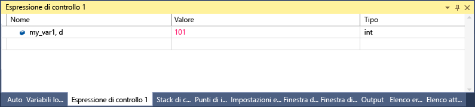

# <a name="format-specifiers-in-c-in-the-visual-studio-debugger"></a>Identificatori di formato in c# il debugger di Visual Studio
È possibile modificare il formato con cui viene visualizzato il valore nella finestra **Espressioni di controllo** usando gli identificatori di formato. Gli identificatori di formato possono essere usati anche nella finestra **Immediata** , nella finestra **Comando** e persino nelle finestre di origine. Se in queste finestre ci si posiziona su un'espressione, il risultato verrà visualizzato in un suggerimento dati. I suggerimenti dati riflettono l'identificatore di formato nella visualizzazione Suggerimento dati.  
  
 Per usare un identificatore di formato, digitare l'espressione seguita da una virgola e dall'identificatore appropriato.  
  
## <a name="using-format-specifiers"></a>Uso degli identificatori di formato  
 Se si ha il codice seguente:  
  
```CSharp  
{  
        int my_var1 = 0x0065;  
        int my_var2 = 0x0066;  
        int my_var3 = 0x0067;  
}  
```  
  
 Aggiungere il `my_var1` variabile alla finestra Espressioni di controllo (durante il debug **Debug > Windows > espressioni di controllo > controllo1**) e impostare la visualizzazione su esadecimale (nella **espressioni di controllo** finestra destro la variabile e Selezionare **visualizzazione esadecimale**). La finestra **Espressioni di controllo** mostra il valore 0x0065. Per visualizzare questo valore espresso come intero decimale invece che intero esadecimale, aggiungere l'identificatore di formato decimale dopo la variabile del nome nella colonna Nome: **, d**. La colonna Valore visualizza il valore decimale 101  
  
   
  
## <a name="format-specifiers"></a>Identificatori di formato  
 Nella tabella riportata di seguito sono elencati gli identificatori di formato C# riconosciuti dal debugger.  
  
|Identificatore|Formato|Valore dell'espressione di controllo originale|Visualizza|  
|---------------|------------|--------------------------|--------------|  
|ac|Impone la valutazione di un'espressione. Può risultare utile quando la valutazione implicita di proprietà e di chiamate di funzione implicite è disattivata.|Messaggio "valutazione della funzione implicita è stata disattivata dall'utente"|\<valore >|  
|d|intero decimale|0x0065|101|  
|dynamic|Visualizza l'oggetto specificato usando una visualizzazione dinamica|Visualizza tutti i membri dell'oggetto, inclusa la visualizzazione dinamica|Visualizza solo la visualizzazione dinamica|  
|h|intero esadecimale|61541|0x0000F065|  
|nq|stringa senza virgolette|"Stringa"|Stringa|  
|hidden|Visualizza tutti i membri pubblici e non pubblici|Visualizza i membri pubblici|Visualizza tutti i membri|  
|raw|Visualizza l'elemento così come appare nel nodo degli elementi non elaborati. Valido unicamente sugli oggetti proxy.|Dizionario\<T >|Visualizzazione non elaborata di Dictionary\<T >|  
|results|Utilizzato con una variabile di un tipo che implementa IEnumerable o IEnumerable\<T >, in genere il risultato di un'espressione di query. Visualizza solo i membri che contengono il risultato della query.|Visualizza tutti i membri.|Visualizza i membri che soddisfano le condizioni della query.|  
  
## <a name="see-also"></a>Vedere anche  
 [Espressioni di controllo e finestre di controllo immediato](../debugger/watch-and-quickwatch-windows.md)   
 [Finestre Auto e Variabili locali](../debugger/autos-and-locals-windows.md)
