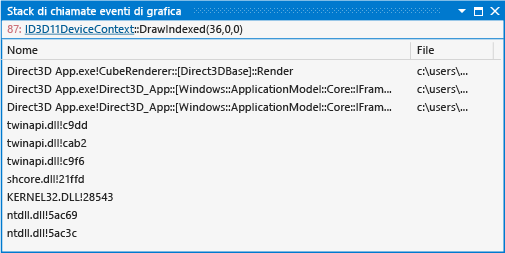

# Stack di chiamate eventi grafici
[!INCLUDE[vs2017banner](../code-quality/includes/vs2017banner.md)]

Stack di chiamate eventi di grafica in Analizzatore grafica di Visual Studio consente di mappare la relazione tra gli eventi di grafica problematici e il codice sorgente dell'app.  
  
 Questa è la finestra Stack di chiamate eventi:  
  
   
  
## Nozioni di base sullo stack di chiamate eventi grafici  
 È possibile usare lo stack di chiamate eventi per esaminare il flusso di esecuzione che ha provocato un particolare evento Direct3D.  È simile alla finestra dello stack di chiamate di Visual Studio, ma anziché visualizzare lo stack di chiamate corrente del thread attivo in un'app in esecuzione, visualizza lo stack di chiamate come si presentava quando si è verificato l'evento Direct3D selezionato.  Dallo stack di chiamate eventi è possibile passare al sito di chiamata dell'evento Direct3D selezionato per controllare il codice adiacente.  
  
 Usando lo stack di chiamate eventi di grafica per identificare il percorso del codice da cui ha origine un problema, è possibile usare la conoscenza del codebase per dedurre le origini potenziali del problema oppure è possibile aggiungere dei punti di interruzione nel codice sorgente dell'app in modo da poter usare le tecniche di debug tradizionali per esaminare come lo stato dell'app o i parametri dell'evento causino il comportamento errato dell'evento.  Questa analisi può aiutare a individuare i problemi nel codice sorgente che si sono manifestati solo come problemi di rendering.  
  
### Informazioni sullo stack di chiamate eventi grafici  
 Lo stack di chiamate eventi non supporta gli eventi pre\-frame o gli eventi definiti dall'utente.  Lo stack di chiamate dell'evento grafico viene visualizzato in un formato tabella.  
  
|Colonna|Descrizione|  
|-------------|-----------------|  
|**Nome**|Simbolo che identifica in modo univoco la funzione che contiene il sito di chiamata.  Il simbolo di debug per la funzione viene visualizzato quando è disponibile; in caso contrario, viene visualizzato l'offset della funzione.|  
|**File**|Nome del file di codice sorgente o di libreria contenente il sito di chiamata.|  
|**Percorso**|Numero di riga del sito di chiamata.|  
  
### Collegamenti a oggetti grafici  
 Per comprendere l'evento di grafica selezionato potrebbero essere necessarie informazioni sull'oggetto Direct3D a cui è associato.  Nella finestra **Stack di chiamate eventi di grafica** è presente un collegamento a tali informazioni.  
  
## Vedere anche  
 [Procedura dettagliata: oggetti mancanti a causa dello sfondo Vertex](../debugger/walkthrough-missing-objects-due-to-vertex-shading.md)