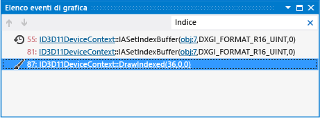

# Elenco eventi grafici
[!INCLUDE[vs2017banner](../code-quality/includes/vs2017banner.md)]

Usare l'Elenco eventi di grafica in Analizzatore grafica di Visual Studio per esplorare gli eventi Direct3D registrati durante il rendering di un frame del gioco o dell'app.  
  
 Questo è l'elenco di eventi:  
  
   
  
## Uso dell'elenco di eventi  
 Quando si seleziona un evento nell'elenco, l'attività si riflette nelle informazioni visualizzate dagli altri strumenti di analisi grafica. Usando l'elenco di eventi insieme a questi altri strumenti è possibile esaminare in dettaglio un problema di rendering per determinarne la causa. Per altre informazioni su come risolvere i problemi di rendering usando l'elenco di eventi insieme agli altri strumenti di analisi grafica, vedere [Esempi](../debugger/graphics-diagnostics-examples.md).  
  
 Usare le funzionalità dell'elenco di eventi in modo efficace è importante per operare su frame complessi che possono contenere migliaia di eventi. Per usare l'elenco di eventi in modo efficace, scegliere la visualizzazione più adatta alla proprie esigenze, seguire i collegamenti per altre informazioni sugli oggetti Direct3D associati a un evento e usare le frecce per spostarsi rapidamente tra le chiamate di disegno.  
  
### Eventi contraddistinti dal colore in Direct3D 12  
 Direct3D 12 espone più code che corrispondono a funzionalità hardware diverse. Per agevolare l'identificazione della coda associata a un particolare evento di grafica in Direct3D 12, quando si lavora su una cattura di un'app Direct3D 12, all'interno dell'elenco gli eventi sono contraddistinti da colori diversi in base alla coda.  
  
|Coda Direct3D 12|Colore|  
|-----------------------|-----------|  
|Coda di rendering|Verde|  
|Coda di calcolo|Giallo|  
|Coda di copia|Arancione|  
  
 Direct3D 11 non espone più code, dunque gli eventi non sono contraddistinti dal colore nell'elenco di eventi quando si lavora con una cattura di un'app Direct3D 11.  
  
### Visualizzazioni dell'elenco di eventi  
 L'elenco di eventi supporta due diverse visualizzazioni che organizzano gli eventi grafici in modo diverso, per supportare il flusso di lavoro e le preferenze dell'utente. La prima è la *visualizzazione chiamate di disegno* , che organizza gli eventi e lo stato associato in gerarchie. La seconda è la *visualizzazione cronologia* , che organizza gli eventi in ordine cronologico, in un elenco semplice.  
  
 Visualizzazione **Chiamate di disegno**  
 Visualizza gli eventi acquisiti e il relativo stato in una gerarchia. Il primo livello della gerarchia contiene eventi come chiamate di disegno, cancellazioni, presentazioni ed eventi associati alle visualizzazioni. Nell'elenco di eventi è possibile espandere le chiamate di disegno per visualizzare lo stato del dispositivo al momento della chiamata di disegno ed espandere ulteriormente ogni tipo di stato per visualizzare gli eventi che hanno impostato i valori. A questo livello è anche possibile vedere se un particolare stato è stato impostato in un frame precedente oppure se è stato impostato più volte dall'ultima chiamata di disegno.  
  
 Visualizzazione **Cronologia**  
 Visualizza gli eventi acquisiti in ordine cronologico. Questo tipo di organizzazione dell'elenco di eventi è uguale a quello usato nelle versioni precedenti di Visual Studio.  
  
##### Per modificare la modalità di visualizzazione dell'elenco di eventi  
  
-   Nella finestra **Elenco eventi grafici** , sopra l'elenco degli eventi, individuare l'elenco a discesa **Visualizza** e scegliere la visualizzazione **Cronologia** o la visualizzazione **Chiamate di disegno** .  
  
### Filtro degli eventi  
 La casella Cerca, situata nell'angolo superiore destro della finestra **Elenco eventi grafici** consente di filtrare l'elenco di eventi in modo da includere solo gli eventi i cui nomi contengono determinate parole chiave. È possibile specificare singole parole chiave, ad esempio `Vertex`, come mostrato nella figura precedente, oppure un elenco di parole chiave separate da punti e virgola, come `Draw;Primitive`, per visualizzare solo gli eventi il cui nome contiene `Draw` o `Primitive` . Le ricerche sono sensibili agli spazi. Ad esempio, `VSSet` e `VS Set` sono differenti. Fare quindi attenzione a formulare le ricerche nel modo corretto.  
  
### Spostamento tra chiamate di disegno  
 Poiché esaminare le chiamate `Draw` è particolarmente importante, è possibile usare i pulsanti **Passa a chiamata di disegno successiva** e **Passa a chiamate di disegno precedente** situati nell'angolo superiore sinistro della finestra **Elenco eventi grafici** , per trovare rapidamente gli eventi e spostarsi da uno all'altro.  
  
### Collegamenti a oggetti grafici  
 Per comprendere gli eventi di grafica potrebbero essere necessarie informazioni aggiuntive sullo stato corrente di Direct3D o sugli oggetti Direct3D a cui viene fatto riferimento dall'evento. In molti eventi sono presenti i collegamenti alle informazioni, che è possibile seguire per accedere a ulteriori dettagli.  
  
## Tipi di eventi e marcatori di eventi  
 Gli eventi visualizzati nell'elenco di eventi sono organizzati in quattro categorie: eventi generali, eventi di disegno, gruppi di eventi definiti dall'utente e marcatori di eventi definiti dall'utente. Tutti gli eventi, ad eccezione degli eventi generali, sono visualizzati insieme a un'icona che indica la categoria di appartenenza.  
  
|Icona|Descrizione evento|  
|----------|-----------------------|  
|(nessuna icona)|Evento generale  Qualsiasi evento diverso da un evento definito dall'utente, un gruppo di eventi definito dall'utente o un evento di disegno.|  
||Evento di disegno  Contrassegna un evento di disegno che si è verificato durante il frame acquisito.|  
||Gruppo di eventi definito dall'utente  Raggruppa gli eventi correlati, in base a quanto definito dall'app.|  
||Marcatore di eventi definito dall'utente  Contrassegna una posizione specifica, in base a quanto definito dall'app.|  
  
## Contrassegno di eventi definiti dall'utente nell'app  
 Gli eventi definiti dall'utente sono specifici dell'app. Possono essere usati per correlare gli eventi significativi che si verificano nell'app a quelli presenti nell'Elenco eventi grafici. Ad esempio, è possibile creare gruppi di eventi definiti dall'utente per organizzare in gruppi o gerarchie gli eventi correlati al rendering dell'interfaccia, in modo da poter sfogliare più facilmente l'elenco di eventi, oppure creare marcatori quando vengono disegnati determinati tipi di oggetti, in modo da trovare facilmente gli eventi grafici correlati nell'elenco di eventi.  
  
 Per creare gruppi e marcatori nell'app si usano le stesse API fornite da Direct3D per altri strumenti di debug Direct3D. A volte queste API cambiano tra una versione e l'altra di Direct3D, ma le funzionalità di base sono le stesse.  
  
### Eventi definiti dall'utente in Direct3D 12  
 Per creare gruppi e marcatori in Direct3D 12, usare le API descritte in questa sezione. La tabella di seguito contiene un riepilogo delle API che è possibile usare in base alla posizione in cui si contrassegnano gli eventi, ovvero in una coda di comandi o in un elenco di comandi.  
  
|Descrizione API|[ID3D12CommandQueue](https://msdn.microsoft.com/library/dn788627.aspx)|[ID3D12GraphicsCommandList](https://msdn.microsoft.com/library/dn903537.aspx)|  
|---------------------|----------------------------------------------------------------------------|-----------------------------------------------------------------------------------|  
|Controllare la disponibilità di un evento definito dall'utente|[PIXGetStatus](http://msdn.microsoft.com/it-it/f7ebd985-fb5d-46d7-abec-099df4b9be0e)|[PIXGetStatus](http://msdn.microsoft.com/it-it/1046ac43-a0a3-42bf-bae8-14aa72fa7567)|  
|Iniziare un gruppo di eventi|[PIXBeginEvent](http://msdn.microsoft.com/it-it/5f51fff7-f313-4558-965b-2a443653cd7b)|[PIXBeginEvent](http://msdn.microsoft.com/it-it/4ddb3311-b9b5-449a-bbfb-7634e0d56e87)|  
|Terminare un gruppo di eventi|[PIXEndEvent](http://msdn.microsoft.com/it-it/fb526bf2-c17d-4a2a-8665-3b577a0f7fba)|[PIXEndEvent](http://msdn.microsoft.com/it-it/a3cd34a9-9dd9-40e1-ae86-0214b25ff185)|  
|Creare un marcatore di eventi|[PIXSetMarker](http://msdn.microsoft.com/it-it/0caf49ed-c99d-405e-89f4-0c887b8474ad)|[PIXSetMarker](http://msdn.microsoft.com/it-it/6610e5b9-a0c5-4236-b551-b6eb9fac64c1)|  
  
### Eventi definiti dall'utente in Direct3D 11 e versioni precedenti  
 Per creare gruppi e marcatori in Direct3D 11 o versione precedente, usare le API descritte in questa sezione. La tabella di seguito contiene un riepilogo delle API che è possibile usare per versioni diverse di Direct3D 11 e versioni precedenti di Direct3D.  
  
|Descrizione API|[ID3D11DeviceContext2](http://msdn.microsoft.com/library/windows/desktop/dn280498.aspx) (Direct3D 11.2)|[ID3DUserDefinedAnnotation](http://go.microsoft.com/fwlink/p/?LinkID=250967) (Direct3D 11.1)|Famiglia D3DPerf_ API (Direct3D 11.0 e precedenti)|  
|---------------------|---------------------------------------------------------------------------------------------------------------|----------------------------------------------------------------------------------------------------|--------------------------------------------------------|  
|Iniziare un gruppo di eventi|`BeginEventInt`|`BeginEvent`|`D3DPerf_BeginEvent`|  
|Terminare un gruppo di eventi|`EndEventInt`|`EndEvent`|`D3DPerf_EndEvent`|  
|Creare un marcatore di eventi|`SetMarkerInt`|`SetMarker`|`D3DPerf_SetMarker`|  
  
 È possibile usare qualsiasi API supportata dalla versione di Direct3D in uso. Ad esempio, se la destinazione è l'API Direct3D 11.1, per creare un marcatore di eventi si può usare `SetMarker` o `D3DPerf_SetMarker` , ma non `SetMarkerInt` perché quest'ultima è disponibile solo in Direct3D 11.2. È anche possibile combinare nella stessa app le API che supportano versioni diverse di Direct3D.  
  
## Vedere anche  
 [Procedura dettagliata: oggetti mancanti a causa dello stato del dispositivo](../debugger/walkthrough-missing-objects-due-to-device-state.md)