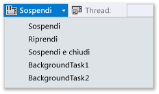
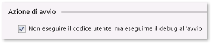

# Come attivare eventi di sospensione, ripresa e background nelle applicazioni Windows Store in Visual Studio
[!INCLUDE[vs2017banner](../code-quality/includes/vs2017banner.md)]

Quando non esegui il debug, Windows **Process Lifetime Management** \(PLM\) controlla lo stato di esecuzione dell'app, cioè avvio, sospensione, ripresa e terminazione, in risposta alle azioni dell'utente e allo stato del dispositivo. Quando esegui il debug, Windows disabilita questi eventi di attivazione. In questo argomento viene descritto come generare tali eventi nel debugger.  
  
 Viene inoltre descritto come eseguire il debug di **attività in background**. Le attività in background consentono di eseguire determinate operazioni in un processo in background, anche quando l'app non è in esecuzione. Puoi utilizzare il debugger per attivare la modalità di debug dell'app, quindi avviare l'attività in background ed eseguire il debug, senza avviare l'interfaccia utente.  
  
 Per ulteriori informazioni su Process Lifetime Management e le attività in background, vedi [Launching, resuming, and multitasking](http://msdn.microsoft.com/it-it/04307b1b-05af-46a6-b639-3f35e297f71b).  
  
##   Contenuto dell'argomento  
 [Attivare gli eventi di Process Lifetime Management](#BKMK_Trigger_Process_Lifecycle_Management_events)  
  
 [Attivare attività in background](#BKMK_Trigger_background_tasks)  
  
-   [Attivare un evento di attività in background da una sessione di debug standard](#BKMK_Trigger_a_background_task_event_from_a_standard_debug_session)  
  
-   [Attivare un'attività in background quando l'app non è in esecuzione](#BKMK_Trigger_a_background_task_when_the_app_is_not_running)  
  
 [Attivare gli eventi di Process Lifecycle Management e le attività in background da un'app installata](#BKMK_Trigger_Process_Lifetime_Management_events_and_background_tasks_from_an_installed_app)  
  
 [Diagnostica degli errori di attivazione di attività in background](#BKMK_Diagnosing_background_task_activation_errors)  
  
##   Attivare gli eventi di Process Lifetime Management  
 Windows può sospendere l'app quando l'utente passa a un'altra visualizzazione o quando viene attivata la modalità basso consumo. Puoi rispondere all'evento `Suspending` per salvare i dati utente e dell'app rilevanti in un archivio permanente e per liberare risorse. Quando un'app viene riattivata dallo stato **Sospeso**, passa allo stato **In esecuzione** e continua dal punto in cui si trovava al momento della sospensione. Puoi rispondere all'evento `Resuming` per ripristinare o aggiornare lo stato dell'app e recuperare le risorse.  
  
 Anche se Windows tenta di mantenere in memoria quante più app sospese possibile, può terminare un'app se non sono disponibili risorse sufficienti per mantenerla in memoria. Un utente può anche chiudere in modo esplicito l'app. Non esiste un evento speciale per indicare che l'utente ha chiuso un'app.  
  
 Nel debugger di Visual Studio, puoi sospendere, riprendere e terminare manualmente le app per eseguire il debug degli eventi relativi al ciclo di vita di elaborazione. Per eseguire il debug di un evento relativo al ciclo di vita di elaborazione:  
  
1.  Imposta un punto di interruzione nel gestore dell'evento di cui vuoi eseguire il debug.  
  
2.  Premere **F5** per avviare il debug.  
  
3.  Sulla barra degli strumenti **Posizione di debug** scegli l'evento da generare:  
  
       
  
     Nota che **Sospendi e termina** chiude l'app e termina la sessione di debug.  
  
##   Attivare attività in background  
 Qualsiasi app può registrare un'attività in background per rispondere a determinati eventi di sistema, anche quando l'app non è in esecuzione. Le attività in background non possono eseguire codice che aggiorna direttamente l'interfaccia utente. Visualizzano invece informazioni all'utente con aggiornamenti di riquadri, aggiornamenti di notifiche e notifiche di tipo avviso popup. Per altre informazioni, vedere [Supporting your app with background tasks](http://msdn.microsoft.com/it-it/4c7bb148-eb1f-4640-865e-41f627a46e8e).  
  
 Puoi attivare eventi che avviano attività in background per l'app dal debugger.  
  
> [!NOTE]
>  Il debugger può attivare solo gli eventi che non contengono dati, come gli eventi che segnalano una modifica dello stato del dispositivo. Devi attivare manualmente le attività in background che richiedono l'input dell'utente o altri dati.  
  
 Il modo più realistico di generare un evento di attività in background si verifica quando l'app non è in esecuzione. È tuttavia supportata anche l'attivazione dell'evento in una sessione di debug standard.  
  
###   Attivare un evento di attività in background da una sessione di debug standard  
  
1.  Imposta un punto di interruzione nel codice dell'attività in background di cui desideri eseguire il debug.  
  
2.  Premere **F5** per avviare il debug.  
  
3.  Dall'elenco degli eventi sulla barra degli strumenti **Posizione di debug** scegli l'attività in background che vuoi avviare.  
  
       
  
###   Attivare un'attività in background quando l'app non è in esecuzione  
  
1.  Imposta un punto di interruzione nel codice dell'attività in background di cui desideri eseguire il debug.  
  
2.  Apri la pagina delle proprietà di debug per il progetto di avvio. Selezionare il progetto in Esplora soluzioni. Scegli **Proprietà** dal menu **Debug**.  
  
     Per i progetti C\+\+, potresti dover espandere **Proprietà di configurazione** e quindi scegliere **Debug**.  
  
3.  Eseguire una delle operazioni seguenti:  
  
    -   Per i progetti Visual C\# e Visual Basic, scegli **Non eseguire il codice utente, ma eseguine il debug all'avvio**.  
  
           
  
    -   Per i progetti JavaScript e Visual C\+\+ scegli **No** dall'elenco **Avvia applicazione**.  
  
           
  
4.  Premi **F5** per mettere l'app in modalità debug. Nota che nell'elenco **Processo** sulla barra degli strumenti **Posizione di debug** è visualizzato il nome del pacchetto dell'app per indicare che sei in modalità debug.  
  
       
  
5.  Dall'elenco degli eventi sulla barra degli strumenti **Posizione di debug** scegli l'attività in background che vuoi avviare.  
  
       
  
##   Attivare gli eventi di Process Lifecycle Management e le attività in background da un'app installata  
 Utilizza la finestra di dialogo Debug pacchetto applicazione installato per caricare un'app già installata nel debugger. Ad esempio, è possibile eseguire il debug di un'app installata da Windows Store oppure eseguirlo quando disponi dei file di origine dell'app, ma non di un progetto di Visual Studio per l'app. La finestra di dialogo Debug pacchetto applicazione installato ti consente di avviare un'app in modalità debug nel computer Visual Studio o in un dispositivo remoto oppure impostare l'app per l'esecuzione in modalità debug, senza avviarla. Per ulteriori informazioni, vedi la sezione **Avviare un'app installata nel debugger** nelle versioni per [JavaScript](../debugger/start-a-debugging-session-for-store-apps-in-visual-studio-javascript.md#BKMK_Start_an_installed_app_in_the_debugger) o [Visual C\+\+, Visual C\# e Visual Basic](../debugger/start-a-debugging-session-for-a-store-app-in-visual-studio-vb-csharp-cpp-and-xaml.md#BKMK_Start_an_installed_app_in_the_debugger) di **Come avviare una sessione di debug**.  
  
 Una volta caricata l'app nel debugger, puoi utilizzare una qualsiasi tra le procedure descritte sopra.  
  
##   Diagnostica degli errori di attivazione di attività in background  
 I log di diagnostica nel visualizzatore eventi di Windows per l'infrastruttura in background includono informazioni dettagliate che puoi utilizzare per diagnosticare e risolvere gli errori delle attività in background. Per visualizzare il log:  
  
1.  Aprire l'applicazione Visualizzatore eventi.  
  
2.  Nel riquadro **Azioni** scegli **Visualizza** e verificare che **Visualizza registri analitici e di debug** sia selezionata.  
  
3.  Nell'albero **Visualizzatore eventi \(locale\)** espandi i nodi **Registri applicazioni e servizi** \/ **Microsoft** \/ **Windows** \/ **BackgroundTasksInfrastructure**.  
  
4.  Scegli il log **Diagnostica**.  
  
## Vedere anche  
 [Test delle applicazioni Store con Visual Studio](../test/testing-store-apps-with-visual-studio.md)   
 [Eseguire il debug di app in Visual Studio](../debugger/debug-store-apps-in-visual-studio.md)   
 [Application lifecycle](http://msdn.microsoft.com/it-it/53cdc987-c547-49d1-a5a4-fd3f96b2259d)   
 [Launching, resuming, and multitasking](http://msdn.microsoft.com/it-it/04307b1b-05af-46a6-b639-3f35e297f71b)