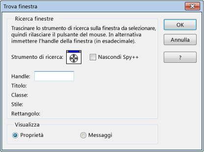

# How to: Use the Finder Tool
[!INCLUDE[vs2017banner](../code-quality/includes/vs2017banner.md)]

È possibile utilizzare lo strumento di ricerca nella finestra di dialogo **Trova finestra** per visualizzare proprietà o messaggi della finestra.  Tramite lo strumento di ricerca è possibile inoltre individuare le finestre figlio disabilitate e scegliere la finestra da evidenziare se queste sono sovrapposte.  
  
   
Strumento di ricerca nella finestra di dialogo Trova finestra  
  
 Nella figura precedente viene mostrata la finestra di dialogo Trova finestra dopo il terzo passaggio indicato di seguito.  
  
### Per visualizzare proprietà o messaggi  
  
1.  Disporre le finestre in modo che la finestra di Spy\+\+ e quella di destinazione siano visibili.  
  
2.  Scegliere **Trova finestra** dal menu **Spy**.  
  
     Viene visualizzata la [finestra di dialogo Trova finestra](../debugger/find-window-dialog-box.md).  
  
3.  Trascinare lo **strumento di ricerca** sulla finestra di destinazione.  
  
     Quando si trascina lo strumento, nella finestra di dialogo **Trova finestra** vengono visualizzati i dettagli sulla finestra selezionata.  
  
     \- oppure \-  
  
     Se si conosce l'handle della finestra che si desidera esaminare \(copiato ad esempio dal debugger\), digitarlo nella casella di testo **Handle**.  
  
    > [!TIP]
    >  Per semplificare l'organizzazione dello schermo, selezionare l'opzione **Nascondi Spy**.  Questa opzione consente di nascondere la finestra principale di Spy\+\+ e di mantenere solo la finestra di dialogo **Trova finestra** visibile in primo piano rispetto alle altre applicazioni.  La finestra principale di Spy\+\+ viene ripristinata quando si fa clic su **OK** o su **Annulla** oppure quando si deseleziona l'opzione **Nascondi Spy\+\+**.  
  
4.  Da **Mostra** selezionare **Proprietà** o **Messaggi**.  
  
5.  Scegliere **OK**.  
  
     Se è stato selezionato **Proprietà**, viene visualizzata la [finestra di dialogo Proprietà finestra](../debugger/window-properties-dialog-box.md).  Se è stato selezionato **Messaggi**, viene visualizzata una finestra [Visualizzazione messaggi](../debugger/messages-view.md).  
  
## Vedere anche  
 [Spy\+\+ Views](../debugger/spy-increment-views.md)   
 [Using Spy\+\+](../debugger/using-spy-increment.md)   
 [Spy\+\+ Reference](../debugger/spy-increment-reference.md)