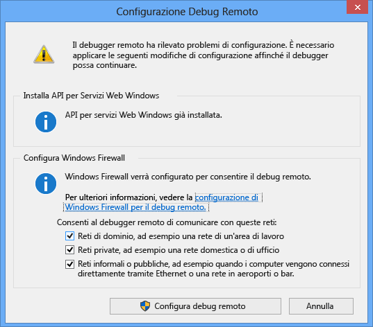

---
translation.priority.ht:
- cs-cz
- de-de
- es-es
- fr-fr
- it-it
- ja-jp
- ko-kr
- pl-pl
- pt-br
- ru-ru
- tr-tr
- zh-cn
- zh-tw
ms.openlocfilehash: 05a288a2d8dff776d8a5d3faea47b06d101f2ea3
ms.sourcegitcommit: aadb9588877418b8b55a5612c1d3842d4520ca4c
ms.translationtype: MT
ms.contentlocale: it-IT
ms.lasthandoff: 10/27/2017
---
È necessario disporre delle autorizzazioni amministrative nel computer remoto.  
  
1.  Trovare l'applicazione del debugger remoto. (Individuare msvsmon.exe nel percorso in cui è stato installato, o aprire il menu Start e cercare **Debugger remoto**.)
  
     Se si esegue il debugger remoto in un server remoto, è possibile fare doppio clic su app il Debugger remoto e scegliere **Esegui come amministratore**. Se non si vengono eseguiti in un server remoto, semplicemente avviarlo normalmente.
  
3.  Quando si avvia remote tools per la prima volta (o prima di aver configurato), il **configurazione debug remoto** viene visualizzata la finestra di dialogo.  
  
       
  
4.  Se l'API del servizio Windows non è installato (che si verifica solo in Windows Server 2008 R2), scegliere il **installare** pulsante.  
  
5.  Selezionare i tipi di reti su cui usare Remote Tools. Almeno un tipo di rete deve essere selezionato. Se i computer sono connessi tramite un dominio, è necessario scegliere il primo elemento. Se i computer sono connessi tramite un gruppo di lavoro o un gruppo home, è necessario scegliere il secondo o il terzo elemento a seconda delle esigenze.  
  
6.  Scegliere **configurare il debug remoto** per configurare il firewall e avviare lo strumento.  
  
7.  Al termine della configurazione viene visualizzata la finestra del debugger remoto.
  
     
  
     Il debugger remoto è in attesa per una connessione. Prendere nota del nome del server e il numero che viene visualizzato, porta, poiché deve corrispondere la configurazione utilizzata in Visual Studio in un secondo momento.  
  
 Al termine delle operazioni di debug ed è necessario arrestare il debugger remoto, fare clic su **File > uscita** della finestra. È possibile riavviare il sistema dal **avviare** menu o dalla riga di comando:  
  
 **\<Directory di installazione di Visual Studio > \Common7\IDE\Remote Debugger\\< x86, x64 o Appx\msvsmon.exe**.  