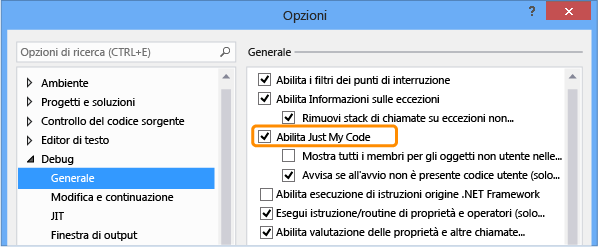

# <a name="specify-whether-to-debug-only-user-code-using-just-my-code-in-visual-studio"></a>Specificare se eseguire il debug solo il codice utente con Just My Code in Visual Studio
È possibile configurare Visual Studio per automaticamente l'istruzione/routine di sistema, framework e altre chiamate non dell'utente e si comprimono tali chiamate nella finestra stack di chiamate. La funzionalità che abilita o disabilita questo comportamento viene chiamata *Just My Code*. In questo argomento viene illustrato come utilizzare Just My Code in progetti c#, Visual Basic, C++ e JavaScript.

Per la maggior parte dei linguaggi di programmazione, Just My Code è attivato per impostazione predefinita.
  
##  <a name="BKMK_Enable_or_disable_Just_My_Code"></a>Abilitare o disabilitare Just My Code  
 Per abilitare o disabilitare Just My Code, scegliere il **strumenti > Opzioni** menu in Visual Studio. Nel **debug** > **generale** nodo, selezionare o deselezionare **Abilita Just My Code**.
  
   
  
> [!NOTE]
>  Il **Abilita Just My Code** un'impostazione globale che viene applicato a tutti i progetti di Visual Studio in tutte le lingue.  
  
###  <a name="BKMK_Override_call_stack_filtering"></a>Mostra il codice non utente in visualizzazioni dello stack di chiamate  
 Nelle visualizzazioni che mostrano lo stack di chiamate, ad esempio il **Stack di chiamate** e **attività** windows, Just My Code consente di comprimere il codice non utente in un frame annotato con etichetta `[External Code]`. Per visualizzare i frame compressi, scegliere **Mostra codice esterno** visualizzare il menu di scelta rapida dello stack di chiamate.

 
  
> [!NOTE]
>  Il **Mostra codice esterno** impostazione viene salvata per il profiler dell'utente corrente. e si applica a tutti i progetti in tutti i linguaggi aperti dall'utente.
  
##  <a name="BKMK__NET_Framework_Just_My_Code"></a>.NET framework, Just My Code  
  
###  <a name="BKMK_NET_User_and_non_user_code"></a>Codice utente e non utente  
 Per distinguere il codice utente da codice non utente, Just My Code vengono esaminati i file di simboli (PDB) e ottimizzazioni del programma. Il debugger considera il codice come codice non utente quando il file binario è ottimizzato o quando il file con estensione pdb non è disponibile.
  
 Tre ulteriori attributi influiscono sul codice che viene considerato My Code dal debugger:  
  
-   <xref:System.Diagnostics.DebuggerNonUserCodeAttribute> indica al debugger che il codice a cui è applicato non è My Code.  
  
-   <xref:System.Diagnostics.DebuggerHiddenAttribute> nasconde il codice al debugger, anche se Just My Code è disattivato.  
  
-   <xref:System.Diagnostics.DebuggerStepThroughAttribute> indica al debugger di eseguire un'istruzione alla volta il codice a cui viene applicato, anziché eseguire tutto il codice.  
  
 Tutto il codice rimanente viene considerato codice utente.  
  
###  <a name="BKMK_NET_Stepping_behavior"></a>Comportamento dell'esecuzione  
 Quando si **Esegui istruzione** (tasto di scelta rapida: F11) il codice non utente, il debugger passa al codice della successiva istruzione utente. Quando si **Esci** (tastiera: MAIUSC + F11), il debugger viene eseguito dalla riga successiva del codice utente. Se non viene rilevato nessun codice utente, l'esecuzione continua fino a quando l'applicazione viene chiusa, un punto di interruzione o si verifica un'eccezione.  
  
###  <a name="BKMK_NET_Breakpoint_behavior"></a>Comportamento punto di interruzione  
 Se Just My Code è abilitato, è possibile scegliere **Interrompi tutto** (tastiera: Ctrl + Alt + INTERR) e arrestare l'esecuzione in corrispondenza della posizione in cui è presente alcun codice utente da visualizzare. In questo caso viene visualizzata la finestra Nessuna origine. Se a questo punto si sceglie un comando di esecuzione, il debugger passerà alla successiva riga del codice utente.  
  
###  <a name="BKMK_NET_Exception_behavior"></a>Comportamento delle eccezioni  
 Se si verifica un'eccezione non gestita nel codice non utente, il debugger si interrompe alla riga del codice utente in cui l'eccezione è stata generata.  
  
 Se per l'eccezione sono abilitate le eccezioni first-chance, la riga di codice utente viene evidenziata in verde. Lo stack di chiamate viene visualizzato un frame annotato con etichettato **[codice esterno]**.  
  
##  <a name="BKMK_C___Just_My_Code"></a>Just My Code in C++  
  
###  <a name="BKMK_CPP_User_and_non_user_code"></a>Codice utente e non utente  
 Just My Code in C++ è diverso da Just My Code in .NET Framework e in JavaScript perché il comportamento dell'esecuzione di istruzioni è indipendente da quello dello stack di chiamate.  
  
 **Stack di chiamate**  
  
 Per impostazione predefinita, nelle finestre dello stack di chiamate il debugger considera le funzioni seguenti come codice non utente:  
  
-   Funzioni con informazioni di origine rimosse nei propri file di simboli.  
  
-   Funzioni i cui file di simboli indicano che non esiste alcun file di origine corrispondente allo stack frame.  
  
-   Funzioni specificate nei file `*.natjmc` e nella cartella `%VsInstallDirectory%\Common7\Packages\Debugger\Visualizers`.  
  
 **L'esecuzione di istruzioni**  
  
 Per impostazione predefinita solo le funzioni specificate nei file `*.natstepfilter` nella cartella `%VsInstallDirectory%\Common7\Packages\Debugger\Visualizers` vengono considerate codice non utente.  
  
 È possibile creare i propri file `.natstepfilter` e `.natjmc` per personalizzare il comportamento dell'esecuzione di istruzioni e della finestra dello stack di chiamate in `%USERPROFILE%\My Documents\Visual Studio 2015\Visualizers`.  
  
###  <a name="BKMK_CPP_Stepping_behavior"></a>Comportamento dell'esecuzione  
 Quando si **Esegui istruzione** (tasto di scelta rapida: F11) il codice non utente dal codice utente, il debugger passa al codice per la riga successiva del codice utente. Quando si **Esci** (tastiera: MAIUSC + F11), il debugger viene eseguito dalla riga successiva del codice utente. Se non viene rilevato nessun codice utente, l'esecuzione continua fino a quando l'applicazione viene chiusa, un punto di interruzione o si verifica un'eccezione.  
  
 Se il debugger si interrompe nel codice non utente, ad esempio se un comando Interrompi tutto si arresta nel codice non utente, l'esecuzione continua nel codice non utente.  
  
###  <a name="BKMK_CPP_Exception_behavior"></a>Comportamento delle eccezioni  
 Quando il debugger raggiunge un'eccezione, viene interrotta sull'eccezione indipendentemente dal fatto che sia in codice non utente o l'utente. Il **gestita dall'utente** opzioni il **eccezioni** la finestra di dialogo vengono ignorati.  
  
###  <a name="BKMK_CPP_Customize_stepping_behavior"></a>Personalizzare il comportamento di esecuzione di istruzioni  
 È possibile specificare le funzioni da ignorare elencandole come codice non utente nei file `*.natstepfilter`.  
  
-   Per specificare il codice non utente per tutti gli utenti del computer di Visual Studio, aggiungere il file .natstepfilter il `%VsInstallDirectory%\Common7\Packages\Debugger\Visualizers` cartella.  
  
-   Per specificare il codice non utente per un singolo utente, aggiungere il file .natstepfilter il `%USERPROFILE%\My Documents\Visual Studio 2015\Visualizers` cartella.  
  
 I file con estensione natstepfilter sono file XML con la sintassi seguente:  
  
```xml  
<?xml version="1.0" encoding="utf-8"?>  
<StepFilter xmlns="http://schemas.microsoft.com/vstudio/debugger/natstepfilter/2010">  
    <Function>  
        <Name>FunctionSpec</Name>  
        <Action>StepAction</Action>  
    </Function>  
    <Function>  
        <Name>FunctionSpec</Name>  
        <Module>ModuleSpec</Module>  
        <Action>StepAction</Action>  
    </Function>  
</StepFilter>  
  
```  
  
|Elemento|Descrizione|  
|-------------|-----------------|  
|Funzione|Obbligatorio. Specifica una o più funzioni come funzioni non utente.|  
|`Name`|Obbligatorio. Espressione regolare formattata in base a ECMA-262 che specifica il nome completo della funzione da mettere in corrispondenza. Ad esempio:<br /><br /> `<Name>MyNS::MyClass.*</Name>`<br /><br /> indica al debugger che tutti i metodi in `MyNS::MyClass` devono essere considerati codice non utente. La corrispondenza prevede la distinzione tra maiuscole e minuscole.|  
|`Module`|Parametro facoltativo. Espressione regolare formattata in base a ECMA-262 che specifica il percorso completo del modulo che contiene la funzione. La corrispondenza non fa distinzione tra maiuscole e minuscole.|  
|`Action`|Obbligatorio. Uno dei valori seguenti (viene effettuata la distinzione tra maiuscole e minuscole):<br /><br /> -   `NoStepInto`-indica al debugger di eseguire la funzione corrispondente.<br />-   `StepInto`-indica al debugger di eseguire le funzioni corrispondenti, eseguendo l'override di qualsiasi altro `NoStepInto` per le funzioni corrispondenti.|  
  
###  <a name="BKMK_CPP_Customize_call_stack_behavior"></a>Personalizzare il comportamento dello stack di chiamate  
 È possibile specificare i moduli, i file di origine e le funzioni da trattare come codice non utente negli stack di chiamate specificandoli nei file `*.natjmc`.  
  
-   Per specificare il codice non utente per tutti gli utenti del computer di Visual Studio, aggiungere il file .natjmc il `%VsInstallDirectory%\Common7\Packages\Debugger\Visualizers` cartella.  
  
-   Per specificare il codice non utente per un singolo utente, aggiungere il file .natjmc il `%USERPROFILE%\My Documents\Visual Studio 2015\Visualizers` cartella.  
  
 I file con estensione natjmc sono file XML con la sintassi seguente:  
  
```xml  
<?xml version="1.0" encoding="utf-8"?>  
<NonUserCode xmlns="http://schemas.microsoft.com/vstudio/debugger/jmc/2015">  
  
  <!-- Modules -->  
  <Module Name="ModuleSpec" />  
  <Module Name="ModuleSpec" Company="CompanyName" />  
  
  <!-- Files -->  
  <File Name="FileSpec"/>  
  
  <!-- Functions -->  
  <Function Name="FunctionSpec" />  
  <Function Name="FunctionSpec" Module ="ModuleSpec" />  
  <Function Name="FunctionSpec" Module ="ModuleSpec" ExceptionImplementation="true" />  
  
</NonUserCode>  
  
```  
  
 **Attributi dell'elemento modulo**  
  
|Attributo|Descrizione|  
|---------------|-----------------|  
|`Name`|Obbligatorio. Percorso completo del modulo o dei moduli. È possibile utilizzare i caratteri jolly di Windows `?` (carattere zero o uno) e `*` (zero o più caratteri). Di seguito è riportato un esempio:<br /><br /> `<Module Name="?:\3rdParty\UtilLibs\*" />`<br /><br /> indica al debugger di considerare tutti i moduli nella cartella in `\3rdParty\UtilLibs` di qualsiasi unità come codice esterno.|  
|`Company`|Parametro facoltativo. Nome della società che pubblica il modulo che viene incorporato nel file eseguibile. È possibile utilizzare questo attributo per evitare ambiguità tra i moduli.|  
  
 **Attributi dell'elemento file**  
  
|Attributo|Descrizione|  
|---------------|-----------------|  
|`Name`|Obbligatorio. Percorso completo del file o dei file di codice sorgente da considerare come codice esterno. È possibile usare i caratteri jolly di Windows `?` e `*` quando si specifica il percorso.|  
  
 **Attributi dell'elemento (funzione)**  
  
|Attributo|Descrizione|  
|---------------|-----------------|  
|`Name`|Obbligatorio. Nome completo della funzione da considerare come codice esterno.|  
|`Module`|Parametro facoltativo. Nome o percorso completo del modulo che contiene la funzione. È possibile utilizzare questo attributo per evitare ambiguità tra funzioni con lo stesso nome.|  
|`ExceptionImplementation`|Se impostato su `true`, lo stack di chiamate mostra la funzione che ha generato l'eccezione anziché questa funzione.|  
  
##  <a name="BKMK_JavaScript_Just_My_Code"></a>Just My Code in JavaScript  
  
###  <a name="BKMK_JS_User_and_non_user_code"></a>Codice utente e non utente  
 **Classificazioni del codice**  
  
 Just My Code in JavaScript controlla l'esecuzione e la visualizzazione dello stack di chiamate suddividendo il codice in una delle classificazioni seguenti:  
  
|||  
|-|-|  
|**MyCode**|Codice utente che si possiede e si controlla.|  
|**LibraryCode**|Codice non utente da librerie utilizzate regolarmente e su cui si basa l'applicazione per essere eseguita correttamente (ad esempio WinJS o jQuery).|  
|**UnrelatedCode**|Codice non utente che potrebbe essere in esecuzione l'applicazione, ma non il proprietario e l'applicazione non si basa direttamente su di essa per funzionare correttamente. (Ad esempio, potrebbe trattarsi di un SDK che mostra annunci pubblicitari.) Nei progetti UWP, qualsiasi codice che viene caricato nell'applicazione da un URI HTTP o HTTPS viene anche considerato UnrelatedCode.|  
  
 Il debugger JavaScript classifica automaticamente questi tipi di codice:  
  
-   Script eseguito passando una stringa a fornita dall'host `eval` funzione viene classificata come **MyCode**.  
  
-   Script eseguito passando una stringa per il `Function` costruttore viene classificato come **LibraryCode**.  
  
-   Lo script contenuto in un riferimento di framework, ad esempio WinJS o Azure SDK, viene classificato come **LibraryCode**.  
  
-   Script eseguito passando una stringa per il `setTimeout`, `setImmediate`, o `setInterval` viene classificato come **UnrelatedCode**.  
  
-   `%VSInstallDirectory%\JavaScript\JustMyCode\mycode.default.wwa.json` specifica altro codice non utente e utente per tutti i progetti di Visual Studio JavaScript.  
  
 È possibile modificare le classificazioni predefinite e classificare file e URL specifici aggiungendo un file con estensione json denominato `mycode.json` nella cartella radice di un progetto.  
  
 Tutto l'altro codice viene classificato come **MyCode**.  
  
###  <a name="BKMK_JS_Stepping_behavior"></a>Comportamento dell'esecuzione  
  
-   Se una funzione non è utente (**MyCode**), codice **Esegui istruzione** (tasto di scelta rapida: F11) si comporta come **Esegui istruzione/routine** (tastiera: F10).  
  
-   Se un passaggio inizia in non utente (**LibraryCode** o **UnrelatedCode**) del codice, l'esecuzione temporanea si comporta come se Just My Code non è abilitato. Quando si esegue nuovamente codice utente, Just My Code per il debug è nuovamente abilitata.  
  
-   Quando un'esecuzione nel codice utente comporta l'uscita dal contesto di esecuzione corrente (ad esempio eseguire l'ultima riga di un gestore eventi), il debugger si arresta alla successiva riga di codice utente eseguita. Ad esempio, se un callback viene eseguito **LibraryCode** codice il debugger continua finché non viene eseguita la riga successiva del codice utente.
  
-   **Esci da istruzione /** (tastiera: MAIUSC + F11) si interrompe nella riga successiva del codice utente. Se non viene rilevato nessun codice utente, l'esecuzione continua fino a quando l'applicazione viene chiusa, un punto di interruzione o si verifica un'eccezione.  
  
###  <a name="BKMK_JS_Breakpoint_behavior"></a>Comportamento punto di interruzione  
  
-   Punti di interruzione impostati nel codice verranno raggiunti sempre indipendentemente dalla classificazione del codice.  
  
-   Se la parola chiave `debugger` viene rilevata in:  
  
    -   **LibraryCode** codice, il debugger si interrompe sempre.  
  
    -   **UnrelatedCode** codice, il debugger non si arresta.  
  
###  <a name="BKMK_JS_Exception_behavior"></a>Comportamento delle eccezioni  
 Se un'eccezione non gestita viene generata in:  
  
-   **MyCode** o **LibraryCode** codice, il debugger si interrompe sempre.  
  
-   **UnrelatedCode** codice, e **MyCode** o **LibraryCode** codice è nello stack di chiamate, il debugger si interrompe.  
  
 Eccezioni first-chance sono abilitate per l'eccezione nella finestra di dialogo eccezioni, se l'eccezione viene generata **LibraryCode** o **UnrelatedCode** codice:  
  
-   Se l'eccezione gestita, il debugger non viene interrotta.  
  
-   Se l'eccezione non è gestita, il debugger si interrompe.  
  
###  <a name="BKMK_JS_Customize_Just_My_Code"></a>Personalizzare Just My Code  
 Per classificare il codice utente e non utente per un singolo progetto di Visual Studio, aggiungere un file con estensione json denominato `mycode.json` nella cartella radice del progetto.  
  
 Le classificazioni vengono eseguite nell'ordine seguente:  
  
1.  Classificazioni predefinite  
  
2.  Classificazioni nel file `%VSInstallDirectory%\JavaScript\JustMyCode\mycode.default.wwa.json`  
  
3.  Classificazioni nel file `mycode. json` del progetto corrente.  
  
 Ogni passaggio di classificazione esegue l'override dei passaggi precedenti. Per elencare tutte le coppie chiave-valore, non è necessario un file con estensione JSON e **MyCode**, **librerie**, e **Unrelated** i valori possono essere matrici vuote.  
  
 I file My Code con estensione json utilizzano la sintassi seguente:  
  
```json  
{  
    "Eval" : "Classification",  
    "Function" : "Classification",  
    "ScriptBlock" : "Classification",  
    "MyCode" : [  
        "UrlOrFileSpec",  
        . . .  
        "UrlOrFileSpec"  
    ],  
    "Libraries" : [  
        "UrlOrFileSpec",  
        . .  
        "UrlOrFileSpec"  
    ],  
    "Unrelated" : [  
        "UrlOrFileSpec",  
        . . .  
        "UrlOrFileSpec"  
    ]  
}  
  
```  
  
 **Eval, Function e ScriptBlock**  
  
 Il **Eval**, **funzione**, e **ScriptBlock** coppie chiave-valore determinare come dinamicamente codice generato viene classificato.  
  
|||  
|-|-|  
|**Eval**|Script eseguito passando una stringa alla funzione `eval` fornita dall'host. Per impostazione predefinita, lo script Eval viene classificato come **MyCode**.|  
|**Function**|Script eseguito passando una stringa al costruttore `Function`. Per impostazione predefinita, lo script Function viene classificato come **LibraryCode**.|  
|**Blocco di script**|Script eseguito passando una stringa alla funzione `setTimeout`, `setImmediate` o `setInterval`. Per impostazione predefinita, lo script ScriptBlock viene classificato come **UnrelatedCode**.|  
  
 È possibile modificare il valore a una delle parole chiave seguenti:  
  
-   `MyCode`Classifica lo script come **MyCode**.  
  
-   `Library`Classifica lo script come **LibraryCode**.  
  
-   `Unrelated`Classifica lo script come **UnrelatedCode**.  
  
 **MyCode, Libraries e Unrelated**  
  
 Il **MyCode**, **librerie**, e **Unrelated** coppie chiave-valore specificare gli URL o un file che si desidera includere in una classificazione:  
  
|||  
|-|-|  
|**MyCode**|Matrice di URL o di file classificati come **MyCode**.|  
|**Librerie**|Matrice di URL o di file classificati come **LibraryCode**.|  
|**Non correlati**|Matrice di URL o di file classificati come **UnrelatedCode**.|  
  
 La stringa dell'URL o del file può contenere uno o più caratteri `*`, che corrispondono a zero o più caratteri. `*` è l'equivalente dell'espressione regolare `.*`.