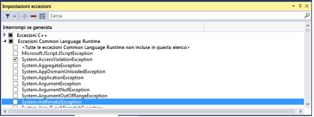
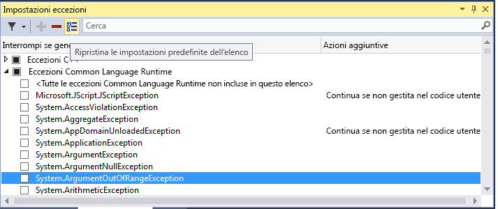
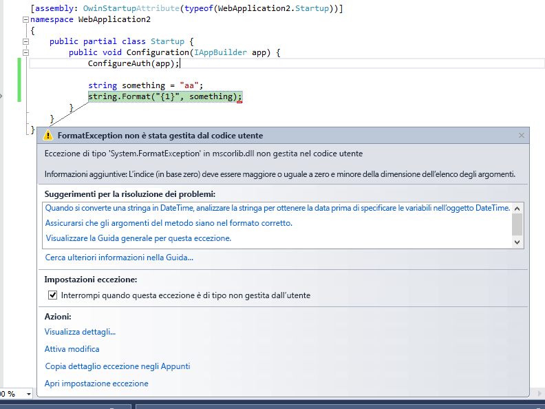
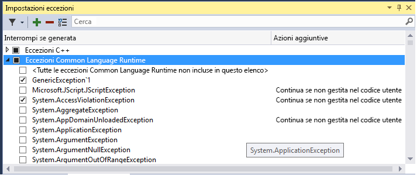

# Gestione delle eccezioni con il Debugger
[!INCLUDE[vs2017banner](../code-quality/includes/vs2017banner.md)]

Un'eccezione è un'indicazione di uno stato di errore che si verifica durante l’esecuzione di un programma. È possibile e consigliabile fornire gestori che rispondono alle eccezioni più importanti, ma è fondamentale sapere come impostare il debugger per l’interruzione dell’esecuzione in corrispondenza delle eccezioni che si desidera visualizzare.  
  
 Quando si verifica un'eccezione, il debugger scrive un messaggio di eccezione nella finestra di Output. Il debugger può interrompere l'esecuzione nei casi seguenti:  
  
-   quando un'eccezione viene generata e non viene gestita.  
  
-   quando il debugger è impostato in modo da interrompere l'esecuzione immediatamente quando viene generata un'eccezione, prima che venga richiamato un gestore.  
  
-   se è stato impostato [Just My Code](../debugger/just-my-code.md) e il debugger è impostato in modo da interrompere l'esecuzione per qualsiasi eccezione non gestita nel codice utente.  
  
> [!NOTE]
>  ASP.NET dispone di un gestore di eccezioni di livello superiore che mostra le pagine di errore in un browser. Questo gestore non interrompe l'esecuzione a meno che **Just My Code** non sia attivato. Per un esempio, vedere [Impostazione del debugger per continuare in caso di eccezioni non gestite dall'utente](../debugger/managing-exceptions-with-the-debugger.md#BKMK_UserUnhandled) di seguito.  
  
> [!NOTE]
>  In un'applicazione Visual Basic, il debugger gestisce tutti gli errori come eccezioni, anche se si usano gestori degli errori di tipo On Error.  
  
## Gestione delle eccezioni con la finestra Impostazioni eccezioni  
 È possibile usare la finestra **Impostazioni eccezioni** per specificare quali eccezioni \(o set di eccezioni\) causeranno l'interruzione da parte del debugger e in quale punto si verificherà l’interruzione. È possibile aggiungere o eliminare eccezioni o specificare in corrispondenza di quali eccezioni interrompere l’esecuzione. Aprire la finestra quando è aperta una soluzione facendo clic su **Debug\/Windows\/Impostazioni eccezioni**.  
  
 È possibile trovare eccezioni specifiche dalla finestra **Cerca** nella barra degli strumenti **Impostazioni eccezioni** o utilizzare la ricerca per filtrare per spazi dei nomi specifici \(ad esempio **System.IO**\).  
  
### Impostazione del debugger per interrompere l'esecuzione in caso di eccezione  
 È possibile impostare il debugger in modo da interrompere l'esecuzione quando si verifica un'eccezione e poter quindi esaminare l'eccezione prima che venga richiamato un gestore.  
  
 Nella finestra **Impostazioni eccezioni**, espandere il nodo per una categoria di eccezioni \(ad esempio, **Eccezioni Common Language Runtime**, vale a dire eccezioni .NET\) e selezionare la casella di controllo per un'eccezione specifica all'interno di tale categoria \(ad esempio **System. AccessViolationException**\). È inoltre possibile selezionare un'intera categoria di eccezioni.  
  
   
  
 Se si seleziona una determinata eccezione, l’esecuzione del debugger viene interrotta ogni volta che viene generata l'eccezione, indipendentemente dal fatto che venga gestita o meno. A questo punto, l'eccezione viene chiamata eccezione first\-chance. Di seguito vengono riportati un paio di scenari di esempio:  
  
1.  Nell'applicazione console C\# seguente, il metodo Main genera un'eccezione **AccessViolationException** all'interno di un blocco `try/catch`:  
  
    ```c#  
    static void Main(string[] args)  
    {  
        try  
        {  
            throw new AccessViolationException();  
            Console.WriteLine("here");  
        }  
        catch (Exception e)  
        {  
            Console.WriteLine("caught exception");  
        }  
        Console.WriteLine("goodbye");  
    }  
    ```  
  
     Se l'eccezione **AccessViolationException** è selezionata in **Impostazioni eccezioni**, quando si esegue questo codice nel debugger, l'esecuzione si interrompe alla riga `throw`. È quindi possibile continuare l'esecuzione. Nella console dovrebbero essere visualizzate entrambe le righe:  
  
    ```  
    caught exception  
    goodbye  
    ```  
  
     ma non viene visualizzata la riga `here`.  
  
2.  Un'applicazione console C\# che fa riferimento a una libreria di classi con una classe che dispone di due metodi, un metodo che genera un'eccezione e la gestisce e un secondo metodo che genera la stessa eccezione e non la gestisce:  
  
    ```vb  
    public class Class1  
    {  
        public void ThrowHandledException()  
        {  
            try  
            {  
                throw new AccessViolationException();  
            }  
            catch (AccessViolationException ave)  
            {  
                Console.WriteLine("caught exception" + ave.Message);  
            }  
        }  
  
        public void ThrowUnhandledException()  
        {  
            throw new AccessViolationException();  
        }  
    }  
    ```  
  
     Ecco il metodo Main\(\) dell'applicazione console:  
  
    ```c#  
    static void Main(string[] args)  
    {  
        Class1 class1 = new Class1();  
        class1.ThrowHandledException();  
        class1.ThrowUnhandledException();  
    }  
    ```  
  
     Se l'eccezione **AccessViolationException** è selezionata in **Impostazioni eccezioni**, quando si esegue questo codice nel debugger, l'esecuzione si interrompe alla riga `throw` in **ThrowHandledException\(\)** e **ThrowUnhandledException\(\)**.  
  
 Se si desidera ripristinare le impostazioni di eccezioni sulle impostazioni predefinite, è possibile scegliere il pulsante **Ripristina** nella barra degli strumenti:  
  
   
  
###  <a name="BKMK_UserUnhandled"></a> Impostazione del debugger per continuare in caso di eccezioni non gestite dall'utente  
 Se si esegue il debug del codice .NET o JavaScript con [Just My Code](../debugger/just-my-code.md), è possibile impostare il debugger in modo da non interrompere l'esecuzione in corrispondenza di eccezioni non gestite nel codice utente, ma gestite in un'altra posizione.  
  
1.  Nella finestra **Impostazioni eccezioni**, aprire il menu di scelta rapida facendo clic con il pulsante destro del mouse nella finestra e selezionando **Mostra colonne**. \(Se **Just My Code** è stato disattivato, questo comando non verrà visualizzato\).  
  
2.  Dovrebbe essere visualizzata una seconda colonna denominata **Azioni aggiuntive**. In questa colonna viene visualizzato **Continua se non gestita dal codice utente** per eccezioni specifiche, vale a dire che il debugger non interrompe l’esecuzione se l'eccezione non viene gestita nel codice utente ma viene gestita nel codice esterno.  
  
3.  È possibile modificare questa impostazione per una determinata eccezione \(selezionare l'eccezione, fare clic con il pulsante destro del mouse e selezionare\/deselezionare **Continua se non gestita nel codice utente**\) o per un'intera categoria di eccezioni \(ad esempio, tutte le eccezioni Common Language Runtime\).  
  
 Ad esempio, le applicazioni Web ASP.NET gestiscono le eccezioni convertendole in un codice di stato HTTP 500 \([Gestione delle eccezioni nell'API ASP.NET](http://www.asp.net/web-api/overview/error-handling/exception-handling)\), che potrebbe non aiutare a determinare l'origine dell'eccezione. Nell'esempio seguente, il codice utente effettua una chiamata a `String.Format()` che genera un’eccezione <xref:System.FormatException>. L'esecuzione si interrompe come segue:  
  
   
  
### Aggiunta ed eliminazione di eccezioni  
 È possibile aggiungere ed eliminare le eccezioni. È possibile eliminare qualsiasi tipo di eccezione da qualsiasi categoria selezionando l'eccezione e facendo clic sul pulsante **Elimina** \(il segno meno\) nella barra degli strumenti **Impostazioni eccezioni** o facendo clic con il pulsante destro del mouse sull'eccezione e selezionando **Elimina** dal menu di scelta rapida. L'eliminazione di un'eccezione ha lo stesso effetto di un’eccezione non selezionata, vale a dire che il debugger non interrompe l’esecuzione quando l’eccezione viene generata.  
  
 Per aggiungere un'eccezione: nella finestra **Impostazioni eccezioni** selezionare una delle categorie di eccezioni \(ad esempio, **Common Language Runtime**\) e fare clic sul pulsante **Aggiungi**. Digitare il nome dell'eccezione \(ad esempio **System.UriTemplateMatchException**\). L'eccezione viene aggiunta all'elenco \(in ordine alfabetico\) e viene selezionata automaticamente.  
  
 Se si desidera aggiungere un'eccezione alle eccezioni di accesso alla memoria GPU, alle eccezioni di runtime JavaScript o alle categorie di eccezioni Win32, è necessario includere il codice di errore, nonché la descrizione.  
  
> [!TIP]
>  Controllare l’ortografia. La finestra **Impostazioni eccezioni** non verifica l'esistenza di un'eccezione aggiunta. Pertanto, se si digita **Sytem.UriTemplateMatchException**, si ottiene una voce per tale eccezione \(e non per **System.UriTemplateMatchException**\).  
  
 Le impostazioni di eccezioni sono persistenti nel file con estensione suo della soluzione, per cui si applicano a una particolare soluzione. Non è possibile riutilizzare impostazioni di eccezioni specifiche in tutte le soluzioni. A questo punto, vengono mantenute solo le eccezioni aggiunte e non le eccezioni eliminate. In altre parole, è possibile aggiungere un'eccezione, chiudere e riaprire la soluzione e l'eccezione sarà ancora disponibile. Ma se si elimina un'eccezione e si chiude e si riapre la soluzione, l'eccezione viene visualizzata nuovamente.  
  
 La finestra **Impostazioni eccezioni** supporta tipi di eccezioni generiche in C\#, ma non in Visual Basic. Per interrompere l’esecuzione in corrispondenza di eccezioni come `MyNamespace.GenericException<T>`, è necessario aggiungere l'eccezione come **MyNamespace.GenericException'1**. Vale a dire, se è stata creata un'eccezione simile alla seguente:  
  
```c#  
public class GenericException<T> : Exception  
{  
    public GenericException() : base("This is a generic exception.")  
    {  
    }  
}  
```  
  
 È possibile aggiungere l'eccezione a **Impostazioni eccezioni** come segue:  
  
   
  
## Vedere anche  
 [Continuazione dell'esecuzione dopo un'eccezione](../debugger/continuing-execution-after-an-exception.md)   
 [Procedura: esaminare il codice di sistema dopo un'eccezione](../debugger/how-to-examine-system-code-after-an-exception.md)   
 [Procedura: utilizzare controlli runtime nativi](../debugger/how-to-use-native-run-time-checks.md)   
 [Utilizzo dei controlli runtime senza la libreria di runtime del linguaggio C](../debugger/using-run-time-checks-without-the-c-run-time-library.md)   
 [Exception Assistant](../Topic/Exception%20Assistant.md)   
 [Nozioni di base sul debugger](../debugger/debugger-basics.md)