# Creare una mappa visiva dello stack di chiamate durante il debug in Visual Studio Enterprise
Creare una mappa codici per tracciare visivamente lo stack di chiamate durante il debug. È possibile inserire note sulla mappa per tenere traccia dell'attività del codice e in tal modo concentrarsi sull'individuazione di bug.

 Sono necessari:  
  
-   [Visual Studio Enterprise](https://www.visualstudio.com/downloads/download-visual-studio-vs)  
  
-   Codice di cui è possibile eseguire il debug, ad esempio Visual C# .NET, Visual Basic .NET., C++, JavaScript o X++.  

Ecco un rapido controllo di una mappa del codice:
  
 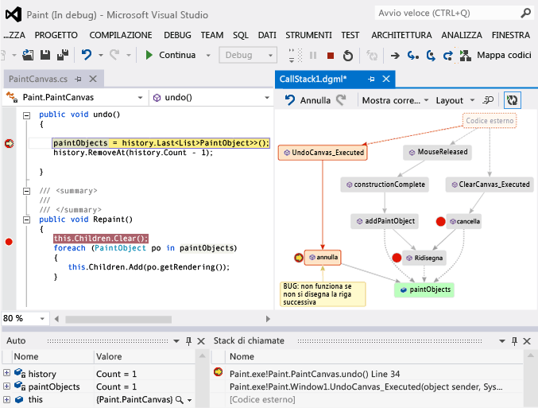  
  
 Vedere:  
  
-   [Video: Debug visivo con l'integrazione del debugger Mappa codici (Channel 9)](http://go.microsoft.com/fwlink/?LinkId=293418)  
  
-   [Eseguire il mapping dello stack di chiamate](#MapStack)  
  
-   [Aggiungere appunti sul codice](#MakeNotes)  
  
-   [Aggiornare la mappa con lo stack di chiamate successivo](#UpdateMap)  
  
-   [Aggiungere il codice correlato alla mappa](#AddRelatedCode)  
  
-   [Individuare bug utilizzando la mappa](#FindBugs)  
  
-   [DOMANDE E RISPOSTE](#QA)  
  
 Per informazioni dettagliate sui comandi e le azioni che è possibile utilizzare quando si lavora con le mappe del codice, vedere [cercare e ridisporre le mappe codice](../modeling/browse-and-rearrange-code-maps.md).  
  
##  Eseguire il mapping dello stack di chiamate  
  
1.  Avviare il debug. (Tastiera: **F5**)  
  
2.  Dopo che l'app passa alla modalità di interruzione o esegue una funzione, scegliere **mappa del codice**. (Tastiera: **Ctrl** + **MAIUSC** + **`**)  
  
       
  
     Lo stack di chiamate corrente verrà visualizzato in arancione in una nuova mappa del codice:  
  
     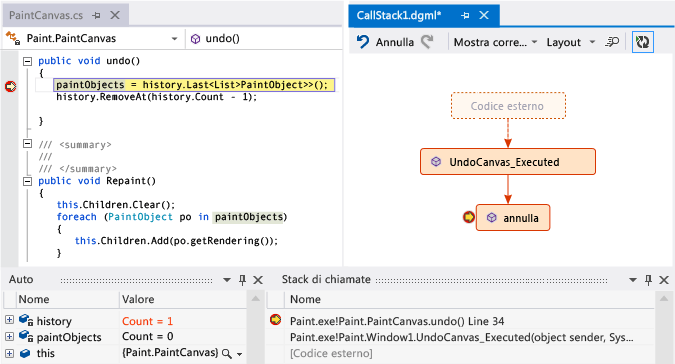  
  
     La mappa si aggiornerà automaticamente durante il debug. Vedere [aggiornare la mappa con lo stack di chiamate successivo](#UpdateMap).  
  
##  Aggiungere appunti sul codice  
 Aggiungere commenti per tenere traccia di cosa avviene nel codice. Per aggiungere una nuova riga in un commento, premere **MAIUSC + INVIO**.  
  
 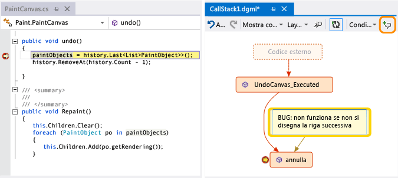  
  
##  Aggiornare la mappa con lo stack di chiamate successivo  
 Eseguire l'app fino al punto di interruzione successivo o eseguire una funzione. La mappa aggiungerà un nuovo stack di chiamate.  
  
 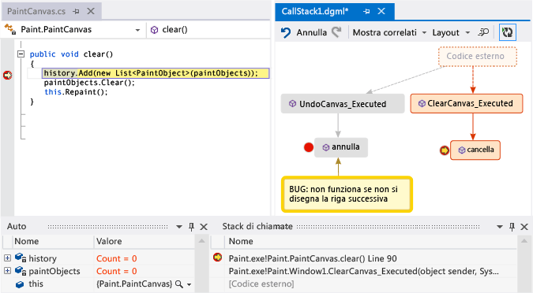  
  
##  Aggiungere il codice correlato alla mappa  
 Ora si ha una mappa - cosa successivo? Se si utilizza Visual c# .NET o Visual Basic .NET, aggiungere elementi, ad esempio campi, proprietà e altri metodi, per tenere traccia di cosa avviene nel codice.  
  
 Fare doppio clic su un metodo per visualizzarne la definizione del codice o usare il menu di scelta rapida del metodo. (Tastiera: selezionare il metodo nella mappa e premere **F12**)  
  
 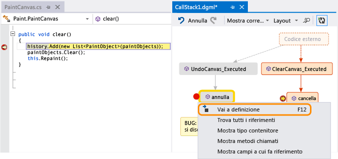  
  
 Aggiungere gli elementi di cui si vuole tenere traccia nella mappa.  
  
 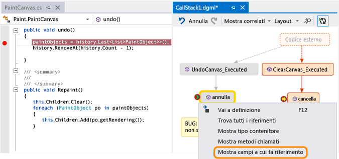  
  
> [!NOTE]
>  Per impostazione predefinita, quando si aggiungono gli elementi alla mappa si aggiungono anche i nodi di gruppo padre, ad esempio la classe, spazio dei nomi e l'assembly. Sebbene ciò sia utile, è possibile mantenere la mappa semplice disattivando questa funzionalità mediante il **Includi padri** pulsante sulla barra degli strumenti della mappa o premendo **CTRL** quando si aggiungono elementi.  
  
 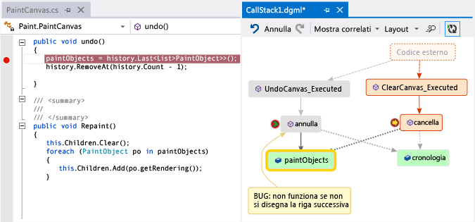  
  
 Di seguito è possibile visualizzare i metodi in cui vengono usati gli stessi campi. Gli elementi aggiunti più di recente sono indicati in verde.  
  
 Continuare a compilare la mappa per visualizzare altro codice.  
  
 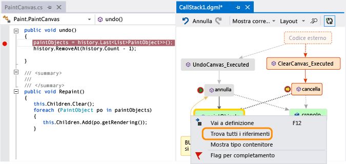  
  
 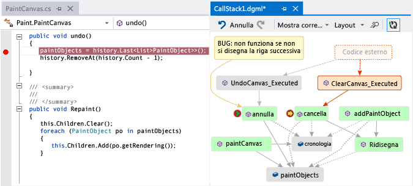  
  
##  Individuare bug utilizzando la mappa  
 Visualizzando il codice, sarà possibile rilevare i bug più rapidamente. Si supponga, ad esempio, che si sta verificando un bug in un programma di disegno. Quando si disegna una linea e si tenta di annullare l'operazione, non accadrà nulla finché non si disegnerà un'altra riga.  
  
 Pertanto, impostare punti di interruzione nei metodi `clear`, `undo` e `Repaint`, avviare il debug e compilare una mappa come quella indicata di seguito:  
  
 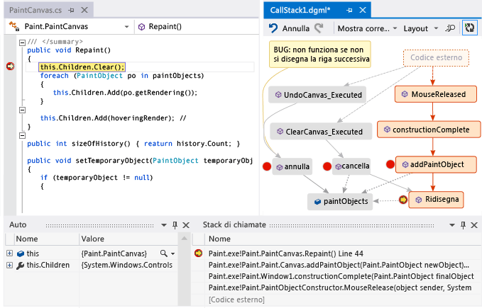  
  
 Tutte le azioni dell'utente nella mappa chiamano `Repaint`, tranne `undo`. Ciò potrebbe spiegare il motivo `undo` non funziona nell'immediato.  
  
 Dopo aver corretto il bug e continuato a eseguire il programma, la mappa aggiungerà la nuova chiamata da `undo` in `Repaint`:  
  
 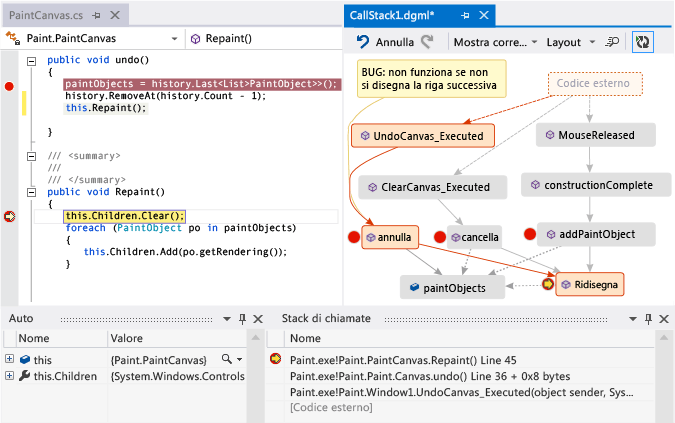  
  
##   Domande e risposte  
  
-   **Non tutte le chiamate vengono visualizzati sulla mappa. Perché?**  
  
     Per impostazione predefinita, nella mappa viene visualizzato solo il proprio codice. Per visualizzare il codice esterno, attivarlo nella **Stack di chiamate** finestra:  
  
       
  
     oppure disattivare **Abilita Just My Code** di Visual Studio, opzioni di debug:  
  
       
  
-   **La modifica della mappa influisce sul codice?**  
  
     La modifica della mappa non influenza in alcun modo il codice. È possibile rinominare, spostare o rimuovere qualsiasi elemento nella mappa.  
  
-   **Cosa significa questo messaggio: "il diagramma può essere basato su una versione precedente del codice"?**  
  
     È possibile che il codice sia stato modificato dopo l'ultimo aggiornamento della mappa. Ad esempio, nel codice potrebbe non essere più disponibile una chiamata alla mappa. Chiudere il messaggio, quindi provare a ricompilare la soluzione prima di aggiornare di nuovo la mappa.  
  
-   **Come controllare il layout della mappa**  
  
     Aprire il **Layout** menu sulla barra degli strumenti della mappa:  
  
    -   Modificare il layout predefinito.  
  
    -   Per arrestare automaticamente la ridisposizione della mappa, disattivare **Layout automatico durante il debug**.  
  
    -   Per ridisporre la mappa il meno possibile quando si aggiungono elementi, disattivare **Layout incrementale**.  
  
-   **È possibile condividere la mappa con altri?**  
  
     È possibile esportare la mappa, inviarla ad altri se è installato Microsoft Outlook o salvarla nella soluzione in modo che sia possibile archiviarla nel controllo della versione di Team Foundation.  
  
     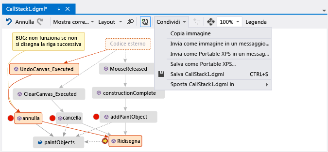  
  
-   **Come è possibile interrompere la mappa, dall'aggiunta di nuovi stack di chiamate automaticamente?**  
  
     Scegliere  sulla barra degli strumenti della mappa. Per aggiungere manualmente lo stack di chiamate corrente alla mappa, premere **Ctrl** + **MAIUSC** + **`**.  
  
     La mappa continuerà a evidenziare gli stack di chiamate esistenti sulla mappa durante il debug.  
  
-   **Le icone degli elementi e le frecce significato?**  
  
     Per ottenere ulteriori informazioni su un elemento, spostare il puntatore del mouse su di esso e osservare la descrizione comando dell'elemento. È anche possibile esaminare il **legenda** per informazioni su cosa significa ogni icona.  
  
     ![Significano delle icone nella mappa del codice dello stack di chiamate ] (../debugger/media/debuggermap_showlegend.png "DebuggerMap_ShowLegend")  
  
 Vedere:  
  
-   [Eseguire il mapping dello stack di chiamate](#MapStack)
  
-   [Aggiungere appunti sul codice](#MakeNotes)
  
-   [Aggiornare la mappa con lo stack di chiamate successivo](#UpdateMap)
  
-   [Aggiungere il codice correlato alla mappa](#AddRelatedCode)
  
-   [Individuare bug utilizzando la mappa](#FindBugs)  
  
## Vedere anche  
 [Mappare le dipendenze nelle soluzioni](../modeling/map-dependencies-across-your-solutions.md)   
 [Usare le mappe codice per il debug delle applicazioni](../modeling/use-code-maps-to-debug-your-applications.md)   
 [Trovare problemi potenziali usando gli analizzatori di mappe codice](../modeling/find-potential-problems-using-code-map-analyzers.md)   
 [Cercare e ridisporre le mappe del codice](../modeling/browse-and-rearrange-code-maps.md)