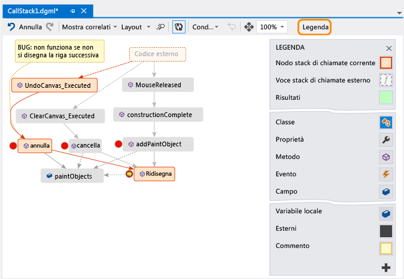

# Mappare i metodi sullo stack di chiamate durante il debug in Visual Studio
[!INCLUDE[vs2017banner](../code-quality/includes/vs2017banner.md)]

Creare una mappa codici per tracciare visivamente lo stack di chiamate durante il debug.  È possibile inserire note sulla mappa per tenere traccia dell'attività del codice e in tal modo concentrarsi sull'individuazione di bug.  
  
   
  
 Requisiti necessari:  
  
-   [Visual Studio Enterprise](https://www.visualstudio.com/downloads/download-visual-studio-vs)  
  
-   Codice di cui è possibile eseguire il debug, ad esempio Visual C\# .NET, Visual Basic .NET., C\+\+, JavaScript o X\+\+.  
  
 Vedere: [Video: Debug visivo con l'integrazione del debugger con la mappa codici \(Channel 9\)](http://go.microsoft.com/fwlink/?LinkId=293418) • [Eseguire il mapping dello stack di chiamate](#MapStack) • [Aggiungere appunti sul codice](#MakeNotes) • [Aggiornare la mappa con lo stack di chiamata successiva](#UpdateMap) • [Aggiungere il codice correlato alla mappa](#AddRelatedCode) • [Individuare bug usando la mappa](#FindBugs) • [Domande e risposte](#QA)  
  
 Per informazioni dettagliate sui comandi e sulle azioni che è possibile usare quando si usano le mappe codice, vedere [Browse and rearrange code maps](../modeling/browse-and-rearrange-code-maps.md).  
  
##   Eseguire il mapping dello stack di chiamate  
  
1.  Avviare il debug.  \(Tastiera: **F5**\)  
  
2.  Dopo che l'app passa alla modalità di interruzione o si esegue una funzione, scegliere **Mappa codici**.  Tastiera: **CTRL** \+ **MAIUSC** \+ **'**.  
  
       
  
     Lo stack di chiamate corrente verrà visualizzato in arancione in una nuova mappa codici:  
  
       
  
     La mappa si aggiornerà automaticamente durante il debug.  Vedere [Aggiornare la mappa con lo stack di chiamata successiva](#UpdateMap).  
  
##   Aggiungere appunti sul codice  
 Aggiungere commenti per tenere traccia delle operazioni in corso nel codice.  Per aggiungere una nuova riga in un commento, premere **MAIUSC \+ INVIO**.  
  
   
  
##   Aggiornare la mappa con lo stack di chiamata successiva  
 Eseguire l'app fino al punto di interruzione successivo o eseguire una funzione.  La mappa aggiungerà un nuovo stack di chiamate.  
  
   
  
##   Aggiungere il codice correlato alla mappa  
 Ora che si dispone di una mappa, è possibile effettuare diverse operazioni.  Se si usa Visual C\# .NET o Visual Basic .NET, aggiungere elementi, ad esempio campi, proprietà e altri metodi, per tenere traccia delle operazioni in corso nel codice.  
  
 Fare doppio clic su un metodo per visualizzarne la definizione del codice o usare il menu di scelta rapida del metodo.  Tastiera: selezionare il metodo nella mappa e premere **F12**.  
  
   
  
 Aggiungere gli elementi di cui si vuole tenere traccia nella mappa.  
  
   
  
> [!NOTE]
>  Per impostazione predefinita, quando si aggiungono gli elementi alla mappa si aggiungono anche i nodi di gruppo padre, ad esempio la classe, spazio dei nomi e l'assembly.  Sebbene ciò sia utile, è possibile mantenere la mappa semplice disattivando questa funzionalità con il pulsante **Includi padri** sulla barra degli strumenti della mappa o premendo **CTRL** quando si aggiungono gli elementi.  
  
   
  
 Di seguito è possibile visualizzare i metodi in cui vengono usati gli stessi campi.  Gli elementi aggiunti più di recente sono indicati in verde.  
  
 Continuare a compilare la mappa per visualizzare altro codice.  
  
   
  
   
  
##   Individuare bug usando la mappa  
 Visualizzando il codice, sarà possibile rilevare i bug più rapidamente.  Ad esempio, si supponga di esaminare un bug in un programma di disegno.  Quando si disegna una linea e si tenta di annullare l'operazione, non accadrà nulla finché non si disegnerà un'altra riga.  
  
 Pertanto, impostare punti di interruzione nei metodi `clear`, `undo` e `Repaint`, avviare il debug e compilare una mappa come quella indicata di seguito:  
  
   
  
 Tutte le azioni dell'utente nella mappa chiamano `Repaint`, tranne `undo`.  Ciò potrebbe spiegare per quale motivo `undo` non funziona nell'immediato.  
  
 Dopo aver corretto il bug e continuato a eseguire il programma, la mappa aggiungerà la nuova chiamata da `undo` in `Repaint`:  
  
   
  
##   Domande e risposte  
  
-   **Non tutte le chiamate vengono visualizzate nella mappa.  Perché?**  
  
     Per impostazione predefinita, nella mappa viene visualizzato solo il proprio codice.  Per visualizzare il codice esterno, attivarlo nella finestra **Stack di chiamate**:  
  
       
  
     oppure disattivare **Abilita Just My Code** nelle opzioni di debug di Visual Studio:  
  
       
  
-   **La modifica della mappa influisce sul codice?**  
  
     La modifica della mappa non influisce in alcun modo sul codice.  È possibile rinominare, spostare o rimuovere qualsiasi elemento nella mappa.  
  
-   **Cosa significa questo messaggio: "Il diagramma potrebbe essere basato su una versione precedente del codice"?**  
  
     È possibile che il codice sia stato modificato dopo l'ultimo aggiornamento della mappa.  Ad esempio, nel codice potrebbe non essere più disponibile una chiamata alla mappa.  Chiudere il messaggio, quindi provare a ricompilare la soluzione prima di aggiornare di nuovo la mappa.  
  
-   **In che modo è possibile controllare il layout della mappa?**  
  
     Aprire il menu **Layout** nella barra degli strumenti della mappa:  
  
    -   Modificare il layout predefinito.  
  
    -   Per arrestare automaticamente la ridisposizione della mappa, disattivare **Layout automatico durante il debug**.  
  
    -   Per ridisporre al minimo la mappa quando si aggiungono elementi, disattivare **Layout incrementale**.  
  
-   **È possibile condividere la mappa con altri?**  
  
     È possibile esportare la mappa, inviarla ad altri se è installato Microsoft Outlook o salvarla nella soluzione in modo che sia possibile archiviarla nel controllo della versione di Team Foundation.  
  
       
  
-   **In che modo è possibile arrestare l'aggiunta automatica di nuovi stack di chiamate nella mappa?**  
  
     Scegliere  nella barra degli strumenti della mappa.  Per aggiungere manualmente lo stack di chiamate corrente nella mappa, premere **CTRL** \+ **MAIUSC** \+ **'**.  
  
     La mappa continuerà a evidenziare gli stack di chiamate esistenti sulla mappa durante il debug.  
  
-   **Che cosa significano le icone degli elementi e le frecce?**  
  
     Per ottenere altre informazioni su un elemento, spostare il puntatore del mouse su di esso e vedere la descrizione comando dell'elemento.  È anche possibile consultare la **legenda** per conoscere il significato di ciascuna icona.  
  
       
  
 Vedere: [Eseguire il mapping dello stack di chiamate](#MapStack) • [Aggiungere appunti sul codice](#MakeNotes) • [Aggiornare la mappa con lo stack di chiamata successiva](#UpdateMap) • [Aggiungere il codice correlato alla mappa](#AddRelatedCode) • [Individuare bug usando la mappa](#FindBugs)  
  
## Vedere anche  
 [Map dependencies across your solutions](../modeling/map-dependencies-across-your-solutions.md)   
 [Use code maps to debug your applications](../modeling/use-code-maps-to-debug-your-applications.md)   
 [Trovare problemi potenziali usando gli analizzatori di mappe codice](../modeling/find-potential-problems-using-code-map-analyzers.md)   
 [Browse and rearrange code maps](../modeling/browse-and-rearrange-code-maps.md)