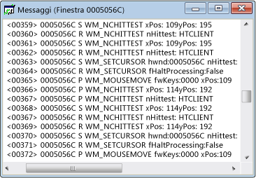

# Messages View
[!INCLUDE[vs2017banner](../code-quality/includes/vs2017banner.md)]

A ogni finestra è associato un flusso di messaggi,  che viene visualizzato in una finestra di visualizzazione dei messaggi.  Vengono mostrati l'handle della finestra, il codice del messaggio e il messaggio.  È possibile creare una visualizzazione messaggi anche per un thread o per un processo.  In questo modo sarà possibile visualizzare i messaggi inviati a tutte le finestre di proprietà di un determinato processo o thread; ciò risulta particolarmente utile per acquisire i messaggi di inizializzazione della finestra.  
  
 Di seguito viene riportata una tipica finestra di visualizzazione dei messaggi.  Si noti che la prima colonna contiene l'handle della finestra, mentre la seconda contiene un codice di messaggio \(come illustrato in [Codici di messaggio](../debugger/message-codes.md)\).  I parametri del messaggio decodificato e i valori restituiti vengono visualizzati a destra.  
  
   
Visualizzazione messaggi Spy\+\+  
  
## Procedure  
  
#### Per aprire una visualizzazione messaggi per una finestra, un processo o un thread  
  
1.  Spostare lo stato attivo su una finestra [Visualizzazione finestre](../debugger/windows-view.md), [Visualizzazione processi](../debugger/processes-view.md) o [Visualizzazione thread](../debugger/threads-view.md).  
  
2.  Individuare il nodo relativo all'elemento di cui si desidera esaminare i messaggi e selezionarlo.  
  
3.  Nel menu **Spy** scegliere **Registra messaggi**.  
  
     Viene visualizzata la [finestra di dialogo Opzioni messaggio](../debugger/message-options-dialog-box.md).  
  
4.  Selezionare le opzioni per il messaggio che si desidera visualizzare.  
  
5.  Premere **OK** per iniziare la registrazione dei messaggi.  
  
     Viene aperta una finestra di visualizzazione dei messaggi e aggiunto un menu **Messaggi** alla barra degli strumenti di Spy\+\+.  In base alle opzioni selezionate, i messaggi cominciano a essere inviati in un flusso nella finestra di visualizzazione messaggi attiva.  
  
6.  Quando si raggiunge un numero sufficiente di messaggi, scegliere **Arresta registrazione** dal menu **Messaggi**.  
  
## Argomenti della sezione  
 [Controllo della visualizzazione messaggi](../debugger/how-to-control-messages-view.md)  
 Viene illustrato come gestire la visualizzazione messaggi.  
  
 [Apertura della visualizzazione messaggi da Trova finestra](_asug_choosing_message_options)  
 Viene illustrato come aprire la visualizzazione messaggi dalla finestra di dialogo Trova finestra.  
  
 [Ricerca di un messaggio nella visualizzazione messaggi](../debugger/how-to-search-for-a-message-in-messages-view.md)  
 Viene illustrato come individuare un messaggio specifico nella visualizzazione messaggi.  
  
 [Avvio e interruzione della visualizzazione del log dei messaggi](../debugger/how-to-start-and-stop-the-message-log-display.md)  
 Viene illustrato come avviare e arrestare la registrazione dei messaggi.  
  
 [Codici di messaggio](../debugger/message-codes.md)  
 Vengono definiti i codici per i messaggi elencati nella visualizzazione messaggi.  
  
 [Visualizzazione delle proprietà dei messaggi](../debugger/how-to-display-message-properties.md)  
 Viene illustrato come visualizzare ulteriori informazioni su un messaggio.  
  
## Sezioni correlate  
 [Visualizzazioni di Spy\+\+](../debugger/spy-increment-views.md)  
 Vengono illustrate le visualizzazioni struttura ad albero di Spy\+\+ relative a finestre, messaggi, processi e thread.  
  
 [Utilizzo di Spy\+\+](../debugger/using-spy-increment.md)  
 Vengono illustrati lo strumento Spy\+\+ e il relativo utilizzo.  
  
 [Finestra di dialogo Opzioni messaggio](../debugger/message-options-dialog-box.md)  
 Utilizzata per selezionare i messaggi da elencare nella visualizzazione messaggi attiva.  
  
 [Finestra di dialogo Ricerca messaggi](../debugger/message-search-dialog-box.md)  
 Utilizzata per individuare il nodo relativo a un messaggio specifico nella visualizzazione messaggi.  
  
 [Finestra di dialogo Proprietà messaggio](../debugger/message-properties-dialog-box.md)  
 Utilizzata per visualizzare le proprietà di un messaggio selezionato nella visualizzazione messaggi.  
  
 [Riferimenti per Spy\+\+](../debugger/spy-increment-reference.md)  
 Sono incluse le sezioni in cui vengono descritti tutti i menu e le finestre di dialogo di Spy\+\+.