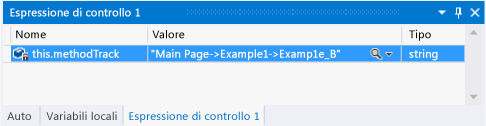
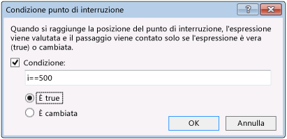
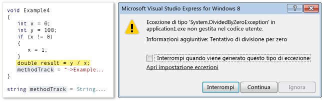
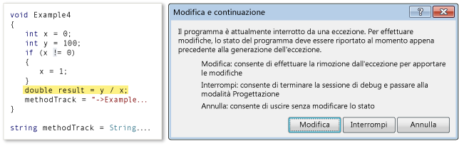
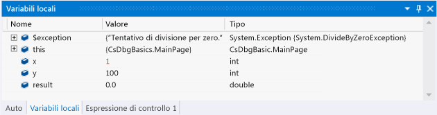

# Esplorare una sessione di debug in Visual Studio (Xaml e C#)
[!INCLUDE[vs2017banner](../code-quality/includes/vs2017banner.md)]

Questa guida introduttiva illustra come spostarsi nelle sessioni di debug di Visual Studio e come visualizzare e modificare lo stato del programma in una sessione.  
  
 La guida è destinata agli sviluppatori che non hanno familiarità con il debug in Visual Studio e a coloro che desiderano avere maggiori informazioni su come spostarsi in una sessione di debug di Visual Studio, ma non insegna l'arte stessa del debug I metodi inclusi nel codice di esempio sono concepiti solo per illustrare le procedure di debug descritte in questo argomento. Non utilizzano procedure consigliate per la progettazione di app o funzioni. In realtà, come si scoprirà presto, i metodi e l'app stessa non hanno alcuna finalità pratica.  
  
 Le sezioni di questa guida introduttiva sono state progettate nell'ottica della massima indipendenza per consentire di ignorare le eventuali sezioni contenenti informazioni già note.  Non è inoltre obbligatorio creare un'app di esempio, anche se è consigliabile e abbiamo fatto in modo da rendere il processo più semplice possibile.  
  
 **Tasti di scelta rapida del debugger.** Gli spostamenti all'interno del debugger di Visual Studio sono ottimizzati sia per il mouse che per la tastiera. In molti passaggi di questo argomento è indicato il tasto di scelta rapida in un commento racchiuso tra parentesi. Ad esempio, \(tastiera: F5\) indica che premendo il tasto F5 si avvia o si continua l'esecuzione del debugger.  
  
## Contenuto dell'argomento  
 Vengono illustrate le seguenti procedure:  
  
-   [Creare l'app di esempio](#BKMK_CreateTheApplication)  
  
-   [Impostare e raggiungere un punto di interruzione, eseguire un'istruzione in un metodo ed esaminare i dati del programma](#BKMK_StepInto)  
  
-   [Eseguire un'istruzione, eseguire un'istruzione/routine e uscire da un'istruzione/routine dei metodi](#BKMK_StepIntoOverOut)  
  
-   [Impostare un punto di interruzione condizionale, eseguire fino al cursore e visualizzare una variabile](#BKMK_ConditionCursorVisualize)  
  
-   [Modifica e continuazione per il recupero da un'eccezione](#BKMK_EditContinueRecoverExceptions)  
  
##   Creare l'app di esempio  
 Il debug viene eseguito sul codice. L'app di esempio usa quindi il framework dell'app di Windows Store solo per creare un file di origine in cui è possibile vedere come funziona la navigazione in una sessione di debug e come esaminare e modificare lo stato del programma. Tutto il codice che verrà richiamato viene chiamato dal costruttore della pagina principale. Non vengono aggiunti controlli, né gestiti eventi.  
  
 **Creare un'app di Windows Store C\# predefinita.** Aprire Visual Studio. Nella home page scegliere il collegamento **Nuovo progetto**. Nella finestra di dialogo Nuovo progetto scegliere **Visual C\#** nell'elenco **Installato** e quindi scegliere **Windows Store**. Nell'elenco dei modelli di progetto scegliere **Applicazione**. In Visual Studio verranno creati una nuova soluzione e il progetto, quindi verranno visualizzati la finestra di progettazione del file MainPage.xaml e l'editor di codice XAML.  
  
 **Aprire il file di origine MainPage.xaml.cs.** Fare clic con il pulsante destro del mouse in un punto qualsiasi dell'editor XAML e scegliere **Visualizza codice**. Verrà visualizzato il file code\-behind MainPage.xaml.cs. Si noti che nel file è elencato un solo metodo, ovvero il costruttore `MainPage()`.  
  
 **Sostituire il costruttore MainPage con il codice di esempio.** Eliminare il metodo MainPage\(\). Fare clic sul collegamento: [Codice di esempio di navigazione del debugger \(Xaml e C\#\)](../debugger/debugger-navigation-sample-code-xaml-and-csharp.md), quindi copiare il codice elencato nella sezione C\# negli Appunti. \(Scegliere **Indietro** nel browser o nel visualizzatore della Guida per tornare a questa pagina della guida introduttiva.\) Nell'editor di Visual Studio incollare il codice nel blocco `partial class MainPage`. Scegliere CTRL\+S per salvare il file.  
  
 È ora possibile continuare seguendo gli esempi in questo argomento.  
  
##   Impostare e raggiungere un punto di interruzione, eseguire un'istruzione in un metodo ed esaminare i dati del programma  
 Il modo più comune per avviare una sessione di debug consiste nello scegliere **Avvia debug** dal menu **Debug** \(tastiera: F5\). L'esecuzione inizia e continua fino a raggiungere un punto di interruzione, fino alla sospensione manuale dell'esecuzione, fino a quando non si verifica un'eccezione oppure fino al termine dell'app.  
  
 Dopo la sospensione dell'esecuzione nel debugger, è possibile visualizzare il valore di una variabile attiva in un suggerimento dati passando il mouse sulla variabile. È inoltre possibile aprire le finestre Variabili locali e Auto per vedere gli elenchi delle variabili attive e i relativi valori correnti. Aggiungendo una o più variabili a una finestra Espressioni di controllo, è possibile concentrarsi sul valore delle variabili mentre l'esecuzione dell'app continua.  
  
 Dopo la sospensione dell'esecuzione dell'app, un'operazione nota anche come inserimento di un'interruzione nel debugger, è possibile controllare in che modo viene eseguito il resto del codice programma. È possibile continuare riga per riga, passando da una chiamata al metodo al metodo stesso, o eseguire un metodo chiamato in un singolo passaggio. Queste procedure sono dette esecuzione dell'app un'istruzione alla volta. È inoltre possibile riprendere la normale esecuzione dell'app, continuandola fino al successivo punto di interruzione impostato o fino alla riga in cui è posizionato il cursore. La sessione di debug può essere terminata in qualsiasi momento. Il debugger è progettato per eseguire le necessarie operazioni di pulizia e per uscire dall'esecuzione.  
  
### Esempio 1  
 In questo esempio è possibile impostare un punto di interruzione nel costruttore MainPage del file MainPage.xaml.cs, eseguire un'istruzione nel primo metodo, visualizzare i valori delle variabili e quindi terminare il debug.  
  
 **Impostare un punto di interruzione.** Impostare un punto di interruzione in corrispondenza dell'istruzione `methodTrack = "Main Page";` nel costruttore MainPage. Scegliere la riga nella barra di navigazione ombreggiata dell'editor del codice sorgente \(tastiera: posizionare il cursore sulla riga e premere F9\).  
  
   
  
 L'icona del punto di interruzione viene visualizzata nella barra.  
  
 **Eseguire fino al punto di interruzione.** Avviare la sessione di debug scegliendo **Avvia debug** dal menu **Debug** \(tastiera: F5\).  
  
 L'esecuzione dell'app inizia e viene sospesa immediatamente prima dell'istruzione in cui è stato impostato il punto di interruzione. L'icona della riga corrente nella barra di navigazione identifica la posizione e l'istruzione corrente risulta evidenziata.  
  
   
  
 A questo punto è possibile controllare l'esecuzione dell'app ed esaminare lo stato del programma mentre si esegue il codice un'istruzione alla volta.  
  
 **Eseguire un'istruzione nel metodo.** Scegliere **Esegui istruzione** dal menu **Debug** \(tastiera: F11\).  
  
   
  
 Si noti che il debugger passa alla riga successiva, che corrisponde a una chiamata al metodo Example1. Scegliere di nuovo Esegui istruzione. Il debugger passa al punto di ingresso del metodo Example1. Ciò indica che il metodo è stato caricato nello stack di chiamate e che è stata allocata la memoria per le variabili locali.  
  
 Quando si esegue un'istruzione in una riga di codice, il debugger esegue una delle seguenti azioni:  
  
-   Se l'istruzione successiva non è una chiamata a una funzione nella soluzione, il debugger esegue l'istruzione, passa all'istruzione successiva e quindi sospende l'esecuzione.  
  
-   Se l'istruzione è una chiamata a una funzione nella soluzione, il debugger passa al punto di ingresso della funzione chiamata e quindi sospende l'esecuzione.  
  
 Continuare a eseguire le istruzioni di Example1 fino a raggiungere il punto di uscita. Il debugger evidenzia la parentesi graffa di chiusura del metodo.  
  
 **Esaminare i valori delle variabili nei suggerimenti dati.** Quando si passa il puntatore del mouse su un nome di variabile, il nome, il valore e il tipo vengono visualizzati in un suggerimento dati.  
  
   
  
 Passare il mouse sulla variabile `a`. Notare il nome, il valore e il tipo di dati. Passare il mouse sulla variabile `methodTrack`. Anche in questo caso sono indicati il nome, il valore e il tipo di dati.  
  
 **Esaminare i valori delle variabili nella finestra Variabili locali.** Scegliere **Finestre** dal menu **Debug** e quindi **Variabili locali**. \(Tastiera: ALT\+4\).  
  
   
  
 La finestra Variabili locali è una visualizzazione albero dei parametri e delle variabili della funzione. Le proprietà di una variabile oggetto sono nodi figlio dell'oggetto stesso. La variabile `this` è un parametro nascosto in ogni metodo dell'oggetto che rappresenta l'oggetto stesso. In questo caso rappresenta la classe MainPage. Poiché `methodTrack` è un membro della classe MainPage, il valore e il tipo di dati corrispondenti vengono elencati in una riga al di sotto di `this`. Espandere il nodo `this` per visualizzare le informazioni `methodTrack`.  
  
 **Aggiungere un'espressione di controllo per la variabile methodTrack.** La variabile `methodWatch` viene utilizzata in tutta la guida introduttiva per illustrare i metodi chiamati negli esempi. Per visualizzare più facilmente il valore della variabile, aggiungerla a una finestra Espressioni di controllo. Fare clic con il pulsante destro del mouse sul nome della variabile nella finestra Variabili locali e quindi scegliere **Aggiungi espressione di controllo**.  
  
   
  
 È possibile controllare più variabili in una finestra Espressioni di controllo. I valori delle variabili controllate, come i valori nelle finestre Variabili locali e Suggerimenti dati, vengono aggiornati a ogni sospensione dell'esecuzione. È inoltre possibile aggiungere variabili nella finestra Espressioni di controllo dall'editor di codice. Selezionare la variabile da controllare, fare clic con il pulsante destro del mouse e quindi scegliere **Aggiungi espressione di controllo**.  
  
##   Eseguire un'istruzione, eseguire un'istruzione\/routine e uscire da un'istruzione\/routine dei metodi  
 A differenza dell'esecuzione di un'istruzione in un metodo chiamato da un metodo padre, l'esecuzione di un'istruzione\/routine in un metodo comporta l'esecuzione del metodo figlio e la successiva sospensione dell'esecuzione nel metodo chiamante alla ripresa del metodo padre. Prima di eseguire un'istruzione\/routine di un metodo, è opportuno avere acquisito familiarità con il funzionamento del metodo e avere la certezza che questa operazione non influisca sul problema che si sta analizzando.  
  
 L'esecuzione di un'istruzione\/routine in una riga di codice che non contiene una chiamata al metodo ha lo stesso effetto della semplice esecuzione di un'istruzione nella riga.  
  
 All'uscita da un'istruzione\/routine di un metodo figlio, l'esecuzione del metodo continua, quindi viene sospesa dopo che il metodo sarà ritornato al relativo metodo chiamante. È possibile uscire da un'istruzione\/routine di una funzione lunga dopo aver stabilito che il resto della funzione non è significativo.  
  
 Sia l'esecuzione che l'uscita da un'istruzione\/routine di una funzione comporta l'esecuzione della funzione.  
  
   
  
### Esempio 2  
 In questo esempio si proverà a eseguire un'istruzione, eseguire un'istruzione\/routine e uscire da un'istruzione\/routine dei metodi.  
  
 **Chiamare il metodo Example2 nel costruttore MainPage.** Modificare il costruttore MainPage e sostituire la riga che segue `methodTrack = String.Empty;` con `Example2();`.  
  
   
  
 **Eseguire fino al punto di interruzione.** Avviare la sessione di debug scegliendo **Avvia debug** dal menu **Debug** \(tastiera: F5\). Il debugger sospende l'esecuzione in corrispondenza del punto di interruzione.  
  
 **Eseguire un'istruzione\/routine della riga di codice.** Scegliere **Esegui istruzione\/routine** dal menu **Debug** \(tastiera: F10\). Il debugger esegue l'istruzione `methodTrack = "MainPage";` nello stesso modo in cui procede all'esecuzione dell'istruzione.  
  
 **Eseguire un'istruzione in Example2 e in Example2\_A.** Premere F11 per eseguire un'istruzione nel metodo Example2. Continuare a eseguire le istruzioni in Example2 fino a raggiungere la riga `int x = Example2_A();`. Eseguire quindi l'istruzione in questa riga per passare al punto di ingresso di Example2\_A. Continuare a eseguire ogni istruzione di Example2\_A fino a tornare a Example2.  
  
   
  
 **Eseguire un'istruzione\/routine di una funzione.** Si noti che la riga successiva in Example2, `int y = Example2_A();`, è fondamentalmente uguale alla riga precedente. È possibile eseguire tranquillamente l'istruzione\/routine in questa riga. Premere F10 per passare dalla ripresa di Example2 a questa seconda chiamata a Example2\_A. Premere F10 per eseguire l'istruzione\/routine di questo metodo. La stringa `methodTrack` indica che il metodo Example2\_A è stato eseguito due volte. Si noterà anche che il debugger passa immediatamente alla riga successiva. Non sospende l'esecuzione nel punto in cui riprende Example2.  
  
 **Uscire dall'istruzione\/routine di una funzione.** Premere F11 per eseguire l'istruzione nel metodo Example2\_B. Si noti che Example2\_B non è molto diverso da Example2\_A. Per uscire dall'istruzione\/routine del metodo, scegliere **Esci da istruzione\/routine** dal menu **Debug** \(tastiera: MAIUSC\+F11\). La variabile `methodTrack` indica che Example2\_B è stato eseguito e che il debugger è ritornato al punto in cui riprende Example2.  
  
 **Terminare il debug.** Scegliere Termina debug dal menu Debug \(tastiera: MAIUSC\+F5\). La sessione di debug verrà terminata.  
  
##   Impostare un punto di interruzione condizionale, eseguire fino al cursore e visualizzare una variabile  
 Un punto di interruzione condizionale specifica una condizione che determina la sospensione dell'esecuzione da parte del debugger. La condizione viene specificata da una qualsiasi espressione di codice che possa restituire true o false. È possibile utilizzare un punto di interruzione, ad esempio, per esaminare lo stato del programma in un metodo chiamato di frequente solo quando una variabile raggiunge un determinato valore.  
  
 L'esecuzione fino al cursore corrisponde all'impostazione di un punto di interruzione unico. Quando l'esecuzione viene sospesa, è possibile selezionare una riga nell'origine e riprendere l'esecuzione fino a raggiungere la riga selezionata. Ad esempio, si supponga che durante l'esecuzione di un ciclo in un metodo si determini che il codice nel ciclo viene eseguito correttamente. Anziché eseguire ogni singola iterazione del ciclo, è possibile scegliere di eseguire fino al cursore che viene posizionato dopo l'esecuzione del ciclo.  
  
 A volte è difficile visualizzare il valore di una variabile nella riga della finestra del suggerimento dati o delle variabili. Il debugger consente di visualizzare stringhe, HTML e XML in un visualizzatore di testo che presenta una visualizzazione formattata del valore in una finestra scorrevole.  
  
### Esempio 3  
 In questo esempio si imposterà un punto di interruzione condizionale che interrompe un'iterazione specifica di un ciclo, quindi procede all'esecuzione fino al cursore inserito dopo il ciclo. È inoltre possibile visualizzare il valore di una variabile in un visualizzatore di testo.  
  
 **Chiamare il metodo Example3 nel costruttore MainPage.** Modificare il costruttore MainPage e sostituire la riga che segue `methodTrack = String.Empty;` con la riga `Example3();`.  
  
   
  
 **Eseguire fino al punto di interruzione.** Avviare la sessione di debug scegliendo **Avvia debug** dal menu **Debug** \(tastiera: F5\). Il debugger sospende l'esecuzione in corrispondenza del punto di interruzione nel metodo MainPage.  
  
 **Eseguire un'istruzione nel metodo Example3.** Scegliere **Esegui istruzione** dal menu **Debug** \(tastiera: F11\) per passare al punto di ingresso del metodo Example3. Continuare a eseguire istruzioni nel metodo fino a completare l'iterazione di uno o due cicli del blocco `for`. Si noti che l'esecuzione di tutte e 1000 le iterazioni richiederebbe molto tempo.  
  
 **Impostare un punto di interruzione condizionale.** Nella barra di navigazione a sinistra della finestra del codice fare clic con il pulsante destro del mouse sulla riga `x += i;` e quindi scegliere **Condizione**. Selezionare la casella di controllo **Condizione** e quindi digitare `i == 500;` nella casella di testo. Scegliere l'opzione **È true** e quindi **OK**. Il punto di interruzione consente di controllare il valore alla 500a iterazione del ciclo `for`.  
  
   
  
 È possibile identificare un punto di interruzione condizionale dalla relativa icona con una croce bianca.  
  
   
  
 **Eseguire fino al punto di interruzione.** Scegliere Continua dal menu Debug \(tastiera: F5\). Nella finestra Variabili locali verificare che il valore corrente di `i` sia 500. Si noti che la variabile `s` viene rappresentata come riga singola ed è molto più lunga della finestra.  
  
 **Visualizzare una variabile di tipo stringa.** Fare clic sull'icona a forma di lente di ingrandimento nella colonna **Valore** di `s`.  
  
 Verrà visualizzata la finestra del Visualizzatore testo con il valore della stringa presentato come una stringa con più righe.  
  
 **Eseguire fino al cursore.** Fare clic con il pulsante destro del mouse sulla riga `methodTrack += "->Example3";` e quindi scegliere **Esegui fino al cursore** \(tastiera: spostare il cursore sulla riga; CTRL \+ F10\). Il debugger completa le iterazioni del ciclo e quindi sospende l'esecuzione in corrispondenza della riga.  
  
 **Terminare il debug.** Scegliere Termina debug dal menu Debug \(tastiera: MAIUSC\+F5\). La sessione di debug verrà terminata.  
  
##   Modifica e continuazione per il recupero da un'eccezione  
 In alcuni casi, quando si interrompe il codice nel debugger di Visual Studio, si ha la possibilità di modificare il valore delle variabili e addirittura la logica delle istruzioni. Questa funzionalità è detta Modifica e continuazione.  
  
 Modifica e continuazione può essere particolarmente utile quando si interrompe il codice in corrispondenza di un'eccezione. Anziché terminare e riavviare il debug di una routine lunga e complessa per evitare l'eccezione, è possibile "rimuovere" l'eccezione per spostare l'esecuzione nel punto che precede immediatamente la posizione in cui si è verificata l'eccezione. È quindi possibile modificare la variabile o l'istruzione che crea il problema e continuare la sessione di debug corrente in uno stato che non generi un'eccezione.  
  
 Anche se è possibile utilizzare Modifica e continuazione in molteplici situazioni, è difficile specificare le particolari condizioni che non supportano questa funzionalità. Tali condizioni dipendono infatti dal linguaggio di programmazione, dallo stato corrente dello stack del programma e dalla capacità del debugger di modificare lo stato senza danneggiare il processo. Il modo migliore per determinare se una modifica è supportata è semplicemente quello di provarla. Il debugger indicherà immediatamente se la modifica non è supportata.  
  
### Esempio 4  
 In questo esempio si proverà a eseguire il debugger fino a un'eccezione, rimuovere l'eccezione, correggere la logica del metodo, quindi modificare il valore di una variabile in modo da poter continuare l'esecuzione del metodo.  
  
 **Chiamare il metodo Example4 nel costruttore MainPage.** Modificare il costruttore MainPage\(\) e sostituire la riga che segue `methodTrack = String.Empty;` con la riga `Example4();`.  
  
   
  
 **Eseguire fino all'eccezione.** Avviare la sessione di debug scegliendo **Avvia debug** dal menu **Debug** \(tastiera: F5\). Premere di nuovo F5 per riprendere l'esecuzione. Il debugger sospende l'esecuzione in corrispondenza dell'eccezione nel metodo Example4 e visualizza una finestra di dialogo dell'eccezione.  
  
   
  
 **Modificare la logica di programma.** È chiaro che l'errore si trova nella condizione `if`: il valore di `x` deve essere modificato quando `x` è uguale a 0 e non quando `x` è diverso da zero. Scegliere **Interrompi** per correggere la logica del metodo. Quando si tenta di modificare la riga, viene visualizzata un'altra finestra di dialogo.  
  
   
  
 Scegliere **Modifica** e quindi modificare la riga `if (x != 0)` in `if (x == 0)`. Il debugger salva in modo permanente le modifiche alla logica di programma nel file di origine.  
  
 **Modificare il valore della variabile.** Esaminare il valore di `x` in un suggerimento dati o nella finestra Variabili locali. È ancora pari a 0 \(zero\). Se si tenta di eseguire l'istruzione che ha causato l'eccezione originale, verrà semplicemente generata di nuovo. È possibile modificare il valore di `x`. Nella finestra Variabili locali fare doppio clic sulla colonna **Valore** della riga **x**. Modificare il valore da 0 a 1.  
  
   
  
 Premere F11 per eseguire l'istruzione che in precedenza ha generato un'eccezione. Come si può notare, la riga viene eseguita senza errori. Scegliere di nuovo F11.  
  
 **Terminare il debug.** Scegliere **Termina debug** dal menu **Debug** \(tastiera: MAIUSC\+F5\). La sessione di debug verrà terminata.  
  
## Vedere anche  
 [Avviare una sessione di debug \(VB, C\#, C\+\+ e XAML\)](../debugger/start-a-debugging-session-for-a-store-app-in-visual-studio-vb-csharp-cpp-and-xaml.md)   
 [Attivare eventi di sospensione, ripresa e background per Windows Store](../debugger/how-to-trigger-suspend-resume-and-background-events-for-windows-store-apps-in-visual-studio.md)   
 [Eseguire il debug di app in Visual Studio](../debugger/debug-store-apps-in-visual-studio.md)