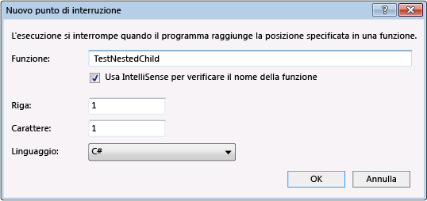

# <a name="navigate-code-with-the-visual-studio-debugger"></a>Spostarsi nel codice con il Debugger di Visual Studio
Acquisire familiarità con i comandi e tasti di scelta rapida per esplorare il codice nel debugger e in questo modo sarà più veloce e semplice individuare e risolvere i problemi nell'app. Durante lo spostamento di codice nel debugger, è possibile controllare lo stato dell'app o altre informazioni sul relativo flusso di esecuzione.  
  
## <a name="start-debugging"></a>Avvia debug  
 Spesso, si avvia una sessione di debug tramite **F5** (**Debug** > **Avvia debug**). Questo comando avvia l'app con il debugger collegato.  
  
 La freccia verde viene inoltre avviato il debugger (uguale a **F5**).  
  
   
  
 Alcuni metodi alternativi che è possibile avviare l'app con il debugger collegato includono **F11** ([passaggio nel codice](#BKMK_Step_into__over__or_out_of_the_code)), **F10** ([Esegui istruzione/routine di codice](#BKMK_Step_over_Step_out)), oppure utilizzando **Esegui fino al cursore**.  Vedere le altre sezioni in questo argomento per informazioni su operazioni di queste opzioni.  
  
 Quando esegue il debug, la riga gialla viene visualizzato il codice che verrà eseguita successivamente.  
  
   
  
 Durante il debug, è possibile passare tra i comandi come **F5**, **F11** e usare altre funzionalità descritte in questo argomento (ad esempio, i punti di interruzione) per ottenere rapidamente il codice che si desidera esaminare.  
  
 La maggior parte delle funzionalità del debugger, ad esempio visualizzare i valori delle variabili nella finestra variabili locali o la valutazione delle espressioni nella finestra Espressioni di controllo, sono disponibili solo mentre il debugger è in sospeso (detto anche *modalità di interruzione*). Quando il debugger viene sospesa, lo stato dell'app viene sospesa mentre funzioni, variabili e oggetti restano nella memoria. In modalità di interruzione, è possibile esaminare la posizione degli elementi e gli stati per cercare le violazioni o bug. Per alcuni tipi di progetto, è anche possibile apportare modifiche all'applicazione in modalità di interruzione. Per guardare un video che illustra queste funzionalità, vedere [Introduzione al Debugger](https://www.youtube.com/watch?v=FtGCi5j30YU&list=PLReL099Y5nRfw6VNvzMkv0sabT2crbSpK&index=6).
  
##  <a name="BKMK_Step_into__over__or_out_of_the_code"></a>Passaggio nel codice, riga per riga  
 Per arrestare in ogni riga del codice (ogni istruzione) durante il debug, usare il **F11** tasto di scelta rapida (o **Debug** > **Esegui istruzione** menu).  
  
> [!TIP]
>  Quando si esegue ogni riga di codice, è possibile passare il mouse sulle variabili per visualizzare i relativi valori, o utilizzare il [variabili locali](../debugger/autos-and-locals-windows.md) e [espressioni di controllo](../debugger/autos-and-locals-windows.md) windows da controllare i valori di modifica.  
  
 Ecco alcuni dettagli relativi al comportamento di **Esegui istruzione**:  
  
-   In una chiamata di funzione annidata, scegliendo **Esegui istruzione** verrà eseguita la funzione annidata più interna. Se si usa **Esegui istruzione** con una chiamata del tipo `Func1(Func2())`, il debugger eseguirà l'istruzione della funzione `Func2`.  
  
-   Il debugger esegue il codice un'istruzione alla volta anziché le righe fisiche. Ad esempio una clausola `if` può essere scritta in una riga:  
  
    ```CSharp  
    int x = 42;  
    string s = "Not answered";  
    if( int x == 42) s = "Answered!";  
    ```  
  
    ```VB  
    Dim x As Integer = 42  
    Dim s As String = "Not answered"  
    If x = 42 Then s = "Answered!"  
    ```  
  
     Quando si esegue l'istruzione in questa riga, il debugger esegue la condizione come un unico passaggio e la conseguenza come un altro (in questo esempio, la condizione è true).  
  
 Per tracciare visivamente lo stack di chiamate durante l'esecuzione di funzioni, vedere [mappare i metodi sullo stack di chiamate durante il debug](../debugger/map-methods-on-the-call-stack-while-debugging-in-visual-studio.md).  
  
##  <a name="BKMK_Step_over_Step_out"></a>Esaminare il codice, ignorando le funzioni  
 Quando si esegue codice nel debugger, spesso si otterranno che non è necessario vedere ciò che avviene in una particolare funzione (non è rilevante, o si conosce funziona, come il codice di libreria testata). Utilizzare questi comandi per ignorare il codice (le funzioni ancora eseguono, naturalmente, ma ignora il debugger su di essi).  
  
|Comando da tastiera|Comando di menu|Descrizione|  
|----------------------|------------------|-----------------|  
|**F10**|**Esegui istruzione/routine**|Se la riga corrente contiene una chiamata di funzione, **Esegui istruzione/routine** esegue il codice quindi sospende l'esecuzione alla prima riga di codice dopo la funzione chiamata restituisce.|  
|**MAIUSC + F11**|**Esci da istruzione/routine**|**Esci da istruzione /** continua l'esecuzione di codice e sospende l'esecuzione quando la funzione corrente restituisce (ignora il debugger tramite la funzione corrente).|  
  
> [!TIP]
>  Se si desidera individuare il punto di ingresso nell'app, iniziare con **F10** o **F11**. Questi comandi sono spesso utili se si sta controllando lo stato dell'app o tentativo di ottenere ulteriori informazioni su un flusso di esecuzione.  
  
##  <a name="BKMK_Break_into_code_by_using_breakpoints_or_Break_All"></a>Eseguire una funzione o un percorso specifico  
 Spesso il metodo preferito di debug del codice, questi metodi sono utili quando si conosce esattamente il codice che si desidera controllare, o almeno si conosce in cui si desidera avviare il debug.  
  
-   **Impostare punti di interruzione nel codice**  
  
     Per impostare un punto di interruzione semplice nel codice, aprire il file di origine nell'editor di Visual Studio. Impostare il cursore sulla riga di codice in cui si desidera sospendere l'esecuzione, quindi fare doppio clic nella finestra del codice per visualizzare il menu di scelta rapida e scegliere **punto di interruzione > Inserisci punto di interruzione** (o premere **F9**). Il debugger sospende il diritto di esecuzione prima che venga eseguita la riga.  
  
       
  
     I punti di interruzione in Visual Studio forniscono un'ampia gamma di funzionalità aggiuntive, ad esempio punti di interruzione e punti di analisi condizionali. Vedere [utilizzando i punti di interruzione](../debugger/using-breakpoints.md).  
  
-   **Eseguire fino alla posizione del cursore.**  
  
     Per eseguire fino alla posizione del cursore, posizionare il cursore su una riga di codice eseguibile in una finestra di origine. Nella finestra menu di scelta rapida dell'editor (pulsante destro del mouse nell'editor), scegliere **Esegui fino al cursore**. Ciò equivale a impostare un punto di interruzione temporanea.

-   **Eseguire fino a fare clic su** 

    Per eseguire in un punto nel codice durante la pausa nel debugger, seleziona il **esecuzione qui** icona freccia verde (l'icona visualizzata durante il passaggio del mouse su una riga di codice). In questo modo si elimina la necessità di impostare punti di interruzione temporanei.

     

    > [!NOTE]
    > **Eseguire fino a fare clic su** è una novità di [!include[vs_dev15](../misc/includes/vs_dev15_md.md)].
  
-   **Inserire un'interruzione nel codice manualmente**  
  
     Per inserire un'interruzione nella successiva riga di codice disponibile in un'applicazione in esecuzione, scegliere **Debug**, **Interrompi tutto** (tastiera: **Ctrl+Alt+Break**). 
  
     Se si interrompe l'esecuzione del codice senza file (con estensione pdb) di simboli o di origine corrispondenti, il debugger visualizza una pagina **File di origine non trovati** o **Simboli non trovati** che consente di trovare i file appropriati. Vedere [specifica simboli (PDB) e i file di origine](../debugger/specify-symbol-dot-pdb-and-source-files-in-the-visual-studio-debugger.md). Se non è possibile accedere ai file di supporto, è comunque possibile eseguire il debug delle istruzioni di assembly nella finestra Disassembly.  
  
-   **Eseguire fino a una funzione nello stack di chiamate**  
  
     Nel **Stack di chiamate** finestra (disponibile durante il debug), selezionare la funzione, mouse e scegliere **Esegui fino al cursore**. Per tracciare visivamente lo stack di chiamate, vedere [mappare i metodi sullo stack di chiamate durante il debug](../debugger/map-methods-on-the-call-stack-while-debugging-in-visual-studio.md).  
  
-   **Eseguire fino a una funzione specificata mediante il nome**  
  
     È possibile impostare il debugger per eseguire l'applicazione finché raggiunge una funzione specificata. È possibile specificare la funzione mediante il nome oppure sceglierla dallo stack di chiamate.  
  
     Per specificare una funzione mediante il nome, scegliere **Debug**, **Nuovo punto di interruzione**, **Interrompi alla funzione**, quindi immettere il nome della funzione e altre informazioni di identificazione.  
  
       
  
     Se la funzione è sottoposta a overload o è disponibile nello spazio dei nomi, è possibile scegliere le funzioni desiderate nella finestra di dialogo **Seleziona punti di interruzione** .  
  
       
  
##  <a name="BKMK_Set_the_next_statement_to_execute"></a>Sposta il puntatore per modificare il flusso di esecuzione  
 Mentre il debugger è in sospeso, è possibile spostare il puntatore all'istruzione per impostare la successiva istruzione del codice da eseguire. La posizione dell'istruzione successiva da eseguire è contrassegnata da una freccia gialla visualizzata sul margine di una finestra di origine o di una finestra Disassembly. Mediante lo spostamento della freccia, è possibile ignorare un segmento di codice oppure tornare a una riga eseguita precedentemente. È possibile usare questa opzione in alcune situazioni, ad esempio quando si desidera ignorare una sezione di codice che contiene un bug noto.  
  
 
  
 Per impostare l'istruzione successiva da eseguire, utilizzare una di queste procedure:  
  
-   In una finestra di origine trascinare la freccia gialla nella posizione in cui si desidera impostare l'istruzione successiva all'interno dello stesso file di origine.  
  
-   Nella finestra di origine, impostare il cursore sulla riga che si desidera eseguire successivamente, mouse e scegliere **Imposta istruzione successiva**.  
  
-   Nella finestra Disassembly impostare il cursore sull'istruzione dell'assembly che si desidera eseguire successivamente, fare doppio clic su un scegliere **Imposta istruzione successiva**.  
  
> [!CAUTION]
>  Quando si imposta l'istruzione successiva, il contatore del programma passa direttamente alla nuova posizione. Usare questo comando con cautela:  
>   
>  -   Le istruzioni comprese tra il vecchio e il nuovo punto di esecuzione non verranno eseguite.  
> -   Se si sposta all'indietro il punto di esecuzione, le istruzioni comprese tra questo e il vecchio punto di interruzione non verranno annullate.  
> -   Lo spostamento dell'istruzione successiva in corrispondenza di un'altra funzione o ambito provoca in genere un errore dello stack di chiamate e, conseguentemente, un errore o un'eccezione di runtime. Se si sposta l'istruzione successiva in corrispondenza di un altro ambito, verrà visualizzata una finestra di dialogo contenente un avviso e in cui si può scegliere di annullare l'operazione. In Visual Basic non è possibile spostare l'istruzione successiva in corrispondenza di un altro ambito o di un'altra funzione.  
> -   Se in C++ nativo sono abilitati i controlli runtime, l'impostazione dell'istruzione successiva può causare la generazione di un'eccezione quando l'esecuzione raggiunge la fine del metodo.  
> -   Quando l'opzione Modifica e continuazione è abilitata, **Imposta istruzione successiva** avrà esito negativo se sono state effettuate modifiche per cui Modifica e continuazione non è immediatamente in grado di eseguire nuovamente il mapping. Ad esempio questo può accadere se è stato modificato del codice all'interno di un blocco catch. In questo caso, si verrà visualizzato un messaggio di errore indicante che l'operazione non è supportata.  
  
> [!NOTE]
>  Nel codice gestito non è possibile spostare l'istruzione successiva in presenza delle seguenti condizioni:  
>   
>  -   L'istruzione successiva è inclusa in un metodo diverso da quello dell'istruzione corrente.  
> -   Il debug è stato avviato utilizzando il debug JIT.  
> -   È in corso la rimozione di uno stack di chiamate.  
> -   È stata generata un'eccezione System.StackOverflowException or System.Threading.ThreadAbortException.  
  
 Non è possibile impostare l'istruzione successiva mentre l'applicazione è in esecuzione. Per impostare l'istruzione successiva, è necessario che il debugger sia in modalità di interruzione.  
  
## <a name="BKMK_Restrict_stepping_to_Just_My_Code"></a>Eseguire codice non utente  
 Per impostazione predefinita, il debugger tenta mostrare solo il codice dell'app durante il debug, che è determinato da un debugger denominata *Just My Code*. (Vedere [Just My Code](../debugger/just-my-code.md) per verificare il funzionamento per diversi tipi di progetto e le lingue e come è possibile personalizzare il comportamento.) Tuttavia, a volte durante il debug, è consigliabile esaminare il codice di framework, codice di libreria di terze parti o chiamate al sistema operativo (chiamate di sistema).  
  
 È possibile disattivare Just My Code, passare a **strumenti** > **opzioni** > **debug** e deselezionare il **Abilita Just My Code** casella di controllo.  
  
 Se Just My Code è disabilitato, il debugger può eseguire codice non utente e codice non utente viene visualizzato nelle finestre del debugger.  
  
> [!NOTE]
>  Just My Code non è supportato per progetti per dispositivi.  
  
 **Eseguire le chiamate di sistema**  
  
 Se sono stati caricati simboli di debug per codice di sistema e Just My Code non è abilitato, è possibile eseguire una chiamata di sistema come qualsiasi altra chiamata.  
  
 Per accedere ai file di simboli Microsoft, vedere [utilizzare server dei simboli per trovare i file di simboli non presenti nel computer locale](../debugger/specify-symbol-dot-pdb-and-source-files-in-the-visual-studio-debugger.md#BKMK_Use_symbol_servers_to_find_symbol_files_not_on_your_local_machine) nel [specificare simboli (PDB) e file di origine](../debugger/specify-symbol-dot-pdb-and-source-files-in-the-visual-studio-debugger.md) argomento.  
  
 Per caricare i simboli per un componente di sistema specifico durante il debug:  
  
1.  Aprire la finestra moduli (tastiera: **Ctrl + Alt + U**).  
  
2.  Selezionare il modulo per cui si desidera caricare i simboli.  
  
     I moduli con i simboli caricati sono presenti nella colonna **Stato simboli** .  
  
3.  Scegliere **Carica simboli** dal menu di scelta rapida.  
  
##  <a name="BKMK_Step_into_properties_and_operators_in_managed_code"></a> Eseguire istruzioni di proprietà e operatori nel codice gestito  
 Il debugger esegue le istruzioni/routine di proprietà e operatori nel codice gestito per impostazione predefinita. Nella maggior parte dei casi, l'esperienza di debug risulta notevolmente migliorata. Per abilitare l'accesso a proprietà o operatori, scegliere **Debug** > **opzioni**. Nel **debug** > **generale** pagina, deseleziona il **Esegui istruzione/routine di proprietà e operatori (solo gestito)** casella di controllo