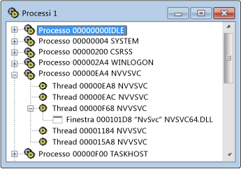

# Visualizzazione processi
La visualizzazione dei processi viene visualizzato un albero di tutti i processi attivi nel sistema. Vengono visualizzati il nome del modulo e l'ID processo. Se si desidera esaminare un particolare processo di sistema, che generalmente corrisponde a un programma in esecuzione, utilizzare la visualizzazione dei processi. I processi vengono identificati da nomi di modulo o vengono designati come "processi di sistema".  
  
 Microsoft Windows supporta più processi. Ogni processo può avere uno o più thread e ogni thread può avere uno o più finestre di primo livello. Ogni finestra di primo livello può disporre di una serie di windows. Un simbolo + indica che un livello è compresso. La visualizzazione compressa è costituita da una riga per ogni processo. Scegliere il simbolo + per espandere il livello.  
  
 Se si desidera esaminare un particolare processo di sistema, che generalmente corrisponde a un programma in esecuzione, utilizzare la visualizzazione dei processi. I processi vengono identificati da nomi di modulo o vengono designati come "processi di sistema". Per trovare un processo, comprimere la struttura ad albero e l'elenco di ricerca.  
  
## Procedure  
  
#### Per aprire la visualizzazione dei processi  
  
1.  Dal **Spy** menu, scegliere **processi**.  
  
   
Visualizzazione processi di Spy++  
  
 La seguente figura mostra la visualizzazione dei processi con thread e processi nodi espansi.  
  
### Contenuto della sezione  
 [Ricerca di un processo nella visualizzazione processi](../debugger/how-to-search-for-a-process-in-processes-view.md)  
 Viene illustrato come trovare un processo specifico nella visualizzazione processi.  
  
 [Visualizzazione delle proprietà di processo](../debugger/how-to-display-process-properties.md)  
 Viene illustrato come visualizzare ulteriori informazioni su un messaggio.  
  
### Sezioni correlate  
 [Visualizzazioni di Spy++](../debugger/spy-increment-views.md)  
 Vengono illustrate le visualizzazioni ad albero Spy + + di windows, i messaggi, thread e processi.  
  
 [Uso di Spy++](../debugger/using-spy-increment.md)  
 Vengono presentati lo strumento Spy + + e come può essere usato.  
  
 [Finestra di dialogo Ricerca processi](../debugger/process-search-dialog-box.md)  
 Utilizzato per trovare il nodo per un determinato processo nella visualizzazione processi.  
  
 [Finestra di dialogo Proprietà processo](../debugger/process-properties-dialog-box.md)  
 Visualizza le proprietà di un processo selezionato nella visualizzazione processi.  
  
 [riferimenti per Spy++](../debugger/spy-increment-reference.md)  
 Include le sezioni che descrivono ogni Spy + + menu e finestra di dialogo.