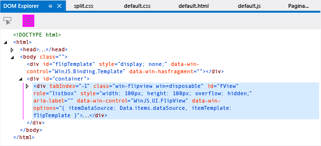
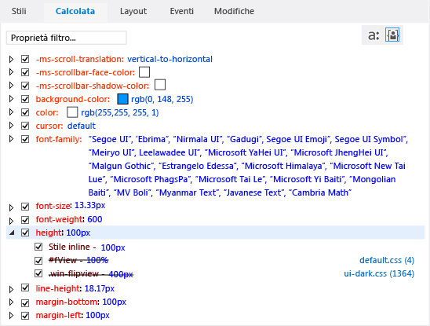
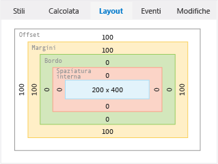

# <a name="debug-html-and-css-in-uwp-and-windows-81-apps"></a>Debug di HTML e CSS nelle app di Windows 8.1 e UWP
  
  
 Per le app JavaScript, Visual Studio offre un'esperienza di debug completa che include funzionalità note agli sviluppatori di Visual Studio e Internet Explorer. Queste funzionalità sono supportate per [!INCLUDE[win8_appname_long](../debugger/includes/win8_appname_long_md.md)], le app di Windows Phone e App create con Visual Studio Tools per Apache Cordova.  
  
 Usando il modello di debug interattivo fornito dagli strumenti di ispezione DOM, è possibile visualizzare e modificare il codice HTML e CSS sottoposto a rendering. È possibile eseguire tutte queste operazioni senza arrestare e riavviare il debugger.
  
 Per informazioni su altre funzionalità, ad esempio utilizzando la finestra JavaScript Console e l'impostazione di punti di interruzione, di debug JavaScript, vedere [Guida introduttiva: eseguire il Debug di JavaScript](../debugger/quickstart-debug-javascript-using-the-console.md) e [Debug delle App in Visual Studio](../debugger/debug-store-apps-in-visual-studio.md).  
  
##  <a name="InspectingDOM"></a> Controllo del DOM attivo  
 DOM Explorer presenta una visualizzazione della pagina sottoposta a rendering. È possibile usarlo per modificare i valori e vedere immediatamente i risultati. In questo modo è possibile testare le modifiche senza arrestare e riavviare il debugger. Il codice sorgente nel progetto non viene modificato quando si interagisce con la pagina usando questo metodo. Pertanto è possibile apportare le modifiche al codice sorgente quando si trovano le correzioni del codice desiderate.  
  
> [!TIP]
>  Per evitare di arrestare e riavviare il debugger quando si apportano modifiche al codice sorgente, è possibile aggiornare l'app usando il pulsante **Aggiorna applicazione Windows** sulla barra degli strumenti di debug (o premendo F4). Per altre informazioni, vedere [aggiornare un'applicazione (JavaScript)](../debugger/refresh-an-app-javascript.md).  
  
 È possibile usare DOM Explorer per:  
  
-   Passare al sottoalbero di elementi DOM e controllare il codice HTML, CSS e JavaScript sottoposto a rendering.  
  
-   Modificare dinamicamente gli attributi e gli stili CSS per gli elementi sottoposti a rendering e visualizzare immediatamente i risultati.  
  
-   Controllare l'applicazione degli stili CSS agli elementi della pagina e tenere traccia delle regole applicate.  
  
 Quando si esegue il debug delle app, è spesso necessario selezionare elementi in DOM Explorer. Quando si seleziona un elemento, i valori visualizzati nelle schede a destra di DOM Explorer vengono aggiornati automaticamente per riflettere l'elemento selezionato in DOM Explorer. Si tratta delle schede **Stili**, **Calcolata**e **Layout**. App UWP supportano anche il **eventi** e **modifiche** schede. Per altre informazioni sulla selezione di elementi, vedere [Selecting elements](#SelectingElements).  
  
> [!TIP]
>  Se la finestra DOM Explorer è chiusa, scegliere **Debug**>**Finestre** > **DOM Explorer** per riaprirla. La finestra viene visualizzata solo durante una sessione di debug di script.  
  
 Nella routine seguente viene illustrato il processo di debug interattivo di un'app usando DOM Explorer. Verrà creata un'app che usa un controllo `FlipView` , quindi verrà eseguito il debug. L'app contiene diversi errori.  
  
> [!WARNING]
>  L'app di esempio seguente è un'app UWP. Le stesse funzionalità sono supportate per Cordova, ma l'app sarebbe differente.  
  
#### <a name="to-debug-by-inspecting-the-live-dom"></a>Per eseguire il debug controllando il DOM attivo  
  
1.  Creare una nuova soluzione in Visual Studio scegliendo **File** > **Nuovo progetto**.  
  
2.  Scegliere **JavaScript** > **Store**, quindi scegliere **Applicazioni Windows** o **Applicazioni Windows Phone**e infine fare clic su **Applicazione vuota**.  
  
3.  Digitare un nome per il progetto, ad esempio `FlipViewApp`e scegliere **OK** per creare l'app.  
  
4.  Nell'elemento BODY del file default.html aggiungere il codice seguente:  
  
    ```html  
    <div id="flipTemplate" data-win-control="WinJS.Binding.Template"  
             style="display:none">  
        <div class="fixedItem" >  
              
        </div>  
    </div>  
    <div id="fView" style="width:100px;height:100px"  
        data-win-control="WinJS.UI.FlipView" data-win-options="{  
        itemDataSource: Data.items.dataSource, itemTemplate: flipTemplate }">  
    </div>  
    ```  
  
5.  Aprire default.css e aggiungere il codice CSS seguente:  
  
    ```css  
    #fView {  
        background-color:#0094ff;  
        height: 100%;  
        width: 100%;  
        margin: 25%;  
    }  
    ```  
  
6.  Sostituire il codice nel file default.js con questo codice:  
  
    ```javascript  
    (function () {  
        "use strict";  
  
        var app = WinJS.Application;  
        var activation = Windows.ApplicationModel.Activation;  
  
        var myData = [];  
        for (var x = 0; x < 4; x++) {  
            myData[x] = { flipImg: "/images/logo.png" }  
        };  
  
        var pages = new WinJS.Binding.List(myData, { proxy: true });  
  
        app.onactivated = function (args) {  
            if (args.detail.kind === activation.ActivationKind.launch) {  
                if (args.detail.previousExecutionState !==  
                activation.ApplicationExecutionState.terminated) {  
                    // TODO: . . .  
                } else {  
                    // TODO: . . .  
                }  
                args.setPromise(WinJS.UI.processAll());  
  
                updateImages();  
            }  
        };  
  
        function updateImages() {  
  
            pages.setAt(0, { flipImg: "http://go.microsoft.com/fwlink/?LinkID=223195" });  
            pages.setAt(1, { flipImg: "http://go.microsoft.com/fwlink/?LinkID=223196" });  
            pages.setAt(2, { flipImg: "http://go.microsoft.com/fwlink/?LinkID=223197" });  
        };  
  
        app.oncheckpoint = function (args) {  
        };  
  
        app.start();  
  
        var publicMembers = {  
            items: pages  
        };  
  
        WinJS.Namespace.define("Data", publicMembers);  
  
    })();  
    ```  
  
     L'illustrazione seguente mostra cosa accade se si esegue questa app nell'emulatore Windows Phone (è simile nel simulatore). Tuttavia, per ottenere questo stato dell'app occorre prima risolvere diversi bug.  
  
       
  
7.  Scegliere **Simulatore** o **Emulatore 8.1 WVGA 4 pollici 512 MB** dall'elenco a discesa accanto al pulsante **Avvia debug** sulla barra degli strumenti **Debug** :  
  
       
  
8.  Scegliere **Debug** > **Avvia debug**o premere F5 per eseguire l'app in modalità debug.  
  
     L'app viene eseguita nel simulatore o nell'emulatore Windows Phone, ma la schermata sarà per lo più vuota perché gli stili presentano alcuni bug. La prima immagine `FlipView` è contenuta in un piccolo quadrato in prossimità del centro dello schermo.  
  
9. Se si esegue l'app nel simulatore, scegliere il comando della barra degli strumenti **Cambia risoluzione** a destra del simulatore per configurare una risoluzione pari a 1280 x 800. In questo modo, i valori mostrati nei passaggi seguenti corrisponderanno a quelli visibili nel simulatore.  
  
10. Passare a Visual Studio e scegliere la scheda **DOM Explorer** .  
  
    > [!TIP]
    >  È possibile premere ALT+TAB o F12 per passare da Visual Studio all'app in esecuzione.  
  
11. Nella finestra DOM Explorer selezionare l'elemento DIV per la sezione che presenta un ID `"fView"`. Usare i tasti di direzione per visualizzare e selezionare l'elemento DIV corretto. (Il tasto freccia destra consente di visualizzare gli elementi figlio dell'elemento).  
  
       
  
    > [!TIP]
    >  È anche possibile selezionare l'elemento DIV nell'angolo inferiore sinistro della finestra della JavaScript Console digitando `select(fView)` nel >> input prompt dei comandi e quindi premere INVIO.  
  
     I valori visualizzati nelle schede sul lato destro della finestra di DOM Explorer vengono aggiornati automaticamente per riflettere l'elemento corrente in DOM Explorer.  
  
12. Scegliere la scheda **Calcolata** a destra.  
  
     Questa scheda mostra il valore calcolato o finale di ogni proprietà dell'elemento DOM selezionato.  
  
13. Aprire la regola CSS relativa all'altezza. Si noti che non esiste un stile inline è impostato su 100px, non è coerente con il valore dell'altezza del 100% impostato per il `#fView` selettore CSS. Il testo barrato per il selettore `#fView` indica che lo stile inline ha la precedenza su questo stile.  
  
     La figura seguente illustra la scheda **Calcolata** .  
  
       
  
14. Nella finestra principale di DOM Explorer fare doppio clic sullo stile inline per l'altezza e la larghezza dell'elemento DIV `fView` . Ora è possibile modificare i valori qui. In questo scenario si vuole rimuoverli completamente.  
  
15. Selezionare `width: 100px;height: 100px;`, premere CANC e quindi INVIO. Dopo aver premuto INVIO, i nuovi valori vengono immediatamente riflessi nel simulatore o nell'emulatore Windows Phone, anche se non è stata arrestata la sessione di debug.  
  
    > [!IMPORTANT]
    >  Così come è possibile aggiornare gli attributi nella finestra DOM Explorer, è anche possibile aggiornare i valori visualizzati nelle schede **Stili**, **Calcolata**e **Layout** . Per altre informazioni, vedere [gli stili di Debug CSS utilizzando DOM Explorer](../debugger/debug-css-styles-using-dom-explorer.md) e [Debug layout utilizzando DOM Explorer](../debugger/debug-layout-using-dom-explorer.md).  
  
16. Passare all'app selezionando il simulatore o l'emulatore Windows Phone oppure usando ALT+TAB.  
  
     Il controllo `FlipView` sembra più grande delle dimensioni dello schermo del simulatore o dell'emulatore Windows Phone. Non si tratta del risultato desiderato. Per controllare, passare di nuovo a Visual Studio.  
  
17. In DOM Explorer selezionare di nuovo la scheda **Calcolata** e aprire la regola dell'altezza. L'elemento fView mostra ancora un valore 100%, come previsto dal CSS, ma il valore calcolato è uguale all'altezza dello schermo del simulatore, ad esempio 800px o 667,67px, che non è auspicabile per questa app. Per esaminare il problema, è possibile rimuovere l'altezza e la larghezza per l'elemento DIV `fView` .  
  
18. Nella scheda **Stili** deselezionare le proprietà height e width per il selettore CSS `#fView` .  
  
     La scheda **Calcolata** mostra ora un'altezza di 400px. Le informazioni indicano che questo valore deriva dal selettore .win-flipview specificato in ui-dark.css, un file di piattaforma CSS.  
  
19. Tornare all'app.  
  
     Le cose sono migliorate. C'è ancora un problema da risolvere. I margini sembrano troppo grandi.  
  
20. Per analizzare il problema, passa a Visual Studio e scegli la **Layout** scheda per esaminare il modello di riquadro dell'elemento.  
  
     Nella scheda **Layout** vendono visualizzati i seguenti valori:  
  
    -   Per il simulatore, 320px (offset) e 320px (margine).  
  
    -   Per l'emulatore Windows Phone, 100px (offset) e 100px (margine).  
  
     La figura seguente mostra come appare la scheda **Layout** se si usa l'emulatore Windows Phone (100px per offset e margine).  
  
       
  
     Ciò non sembra corretto. Anche la scheda **Calcolata** mostra gli stessi valori per i margini.  
  
21. Scegliere la scheda **Stili** e trovare il selettore CSS `#fView` . Per la proprietà **margin** il valore è 25%.  
  
22. Selezionare il 25%, impostarlo su 25px e premere Invio.  
  
23. Nella scheda **Stili** scegliere la regola relativa all'altezza per il selettore .win-flipview, modificare 400px in 500px e premere INVIO.  
  
24. Tornare all'app. Ora la posizione degli elementi viene visualizzata correttamente. Per apportare correzioni all'origine e aggiornare l'app senza arrestare e riavviare il debugger, vedere la routine riportata di seguito.  
  
#### <a name="to-refresh-your-app-while-debugging"></a>Per aggiornare l'app durante il debug  
  
1.  Quando l'app è ancora in esecuzione, passare a Visual Studio.  
  
2.  Aprire il file default.html e modificare il codice sorgente cambiando l'altezza e la larghezza dell'elemento DIV `"fView"` in 100%.  
  
3.  Scegliere il pulsante **Aggiorna applicazione Windows** sulla barra degli strumenti Debug oppure premere F4. Il pulsante è simile al seguente: .  
  
     Le pagine dell'app vengono ricaricate e il simulatore o l'emulatore Windows Phone torna in primo piano.  
  
     Per ulteriori informazioni sulla funzionalità Aggiorna, vedi [aggiornare un'applicazione (JavaScript)](../debugger/refresh-an-app-javascript.md).  
  
##  <a name="SelectingElements"></a> Selecting elements  
 È possibile selezionare gli elementi DOM in tre modi durante il debug di un'app:  
  
-   Facendo clic sugli elementi direttamente nella finestra di DOM Explorer oppure usando i tasti di direzione.  
  
-   Usando il pulsante **Seleziona elemento** (CTRL+B).  
  
-   Usando il pulsante `select` , uno dei [JavaScript Console commands](../debugger/javascript-console-commands.md).  
  
 Quando si usa la finestra DOM Explorer per selezionare elementi e si posiziona il puntatore del mouse su un elemento, l'elemento corrispondente viene evidenziato nell'app in esecuzione. Fare clic sull'elemento in DOM Explorer per selezionarlo oppure usare i tasti freccia per evidenziare e selezionare elementi. La selezione di elementi in DOM Explorer può essere fatta anche tramite il pulsante **Seleziona elemento** . La figura seguente illustra il pulsante **Seleziona elemento** .  
  
   
  
 Quando si fa clic su **Seleziona elemento** o si preme CTRL+B, la modalità di selezione cambia per consentire di selezionare un elemento in DOM Explorer facendo clic su di esso nell'app in esecuzione. La modalità torna alla modalità di selezione normale dopo un singolo clic. Quando si fa clic su **Seleziona elemento**, l'app passa in primo piano e il cursore cambia per riflettere la nuova modalità di selezione. Quando si fa clic sull'elemento con contorni, DOM Explorer ritorna in primo piano con l'elemento specificato selezionato.  
  
 Prima di scegliere **Seleziona elemento**, è possibile specificare se evidenziare elementi nell'app in esecuzione attivando e disattivando il pulsante **Visualizza pagina Web in evidenza** . La figura seguente mostra questo pulsante. Le evidenziazioni vengono visualizzate per impostazione predefinita.  
  
   
  
 Quando si sceglie di evidenziare elementi, gli elementi su cui si posiziona il puntatore del mouse nel Simulatore vengono evidenziati. I colori per gli elementi evidenziati corrispondono al modello di riquadro visualizzato nella scheda **Layout** di DOM Explorer.  
  
> [!NOTE]
>  L'evidenziazione degli elementi al passaggio del mouse è supportata solo in parte nell'emulatore Windows Phone.  
  
 Per un esempio che illustra come selezionare elementi mediante il **elemento Select** pulsante, vedere [gli stili di Debug CSS utilizzando DOM Explorer](../debugger/debug-css-styles-using-dom-explorer.md).  
  
##  <a name="BrowserSupport"></a> Supporto di browser e piattaforme  
 Gli strumenti di Visual Studio per JavaScript, DOM Explorer e la finestra Console JavaScript sono supportati nelle piattaforme seguenti:  
  
-   [!INCLUDE[win8_appname_long](../debugger/includes/win8_appname_long_md.md)]e Windows Phone App scritte in JavaScript e HTML  
  
-   Internet Explorer 11 in esecuzione in [!INCLUDE[win81](../debugger/includes/win81_md.md)]  
  
-   Internet Explorer 10 in esecuzione in [!INCLUDE[win8](../debugger/includes/win8_md.md)]  
  
 [Qui](http://go.microsoft.com/fwlink/?LinkID=232448) è possibile scaricare [!INCLUDE[win8](../debugger/includes/win8_md.md)] e Visual Studio.  
  
## <a name="see-also"></a>Vedere anche  
 [Debug apps in Visual Studio](../debugger/debug-store-apps-in-visual-studio.md)   
 [Eseguire il debug degli stili CSS utilizzando DOM Explorer](../debugger/debug-css-styles-using-dom-explorer.md)   
 [Eseguire il debug di layout utilizzando DOM Explorer](../debugger/debug-layout-using-dom-explorer.md)   
 [Visualizzare listener di eventi DOM](../debugger/view-dom-event-listeners.md)   
 [Aggiornare un'applicazione (JavaScript)](../debugger/refresh-an-app-javascript.md)   
 [Eseguire il debug di un controllo WebView](../debugger/debug-a-webview-control.md)   
 [Tasti di scelta rapida](../debugger/keyboard-shortcuts-html-and-javascript.md)   
 [Comandi della JavaScript Console](../debugger/javascript-console-commands.md)   
 [Eseguire il debug di codice di esempio HTML, CSS e JavaScript](../debugger/debug-html-css-and-javascript-sample-code.md)   
 [Supporto tecnico e accessibilità](http://msdn.microsoft.com/library/tzbxw1af\(VS.120\).aspx)