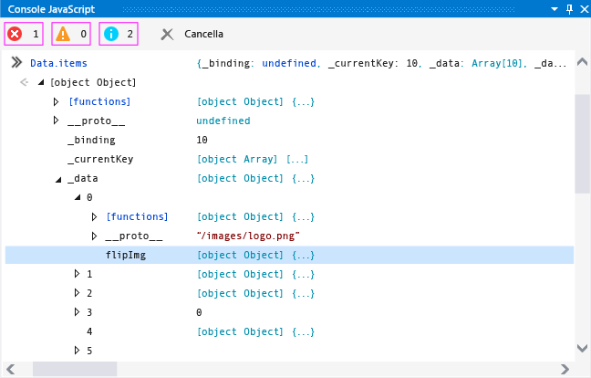
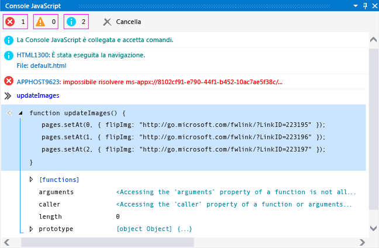

# Guida introduttiva: Eseguire il debug di JavaScript con la console
[!INCLUDE[vs2017banner](../code-quality/includes/vs2017banner.md)]

  
  
 È possibile usare la finestra Console JavaScript per interagire con le app di Windows Store compilate con JavaScript ed eseguirne il debug. Queste funzionalità sono supportate per app di [!INCLUDE[win8_appname_long](../debugger/includes/win8_appname_long_md.md)], app di Windows Phone Store e app create con Strumenti di Visual Studio per Apache Cordova. Per informazioni di riferimento sui comandi della console, vedi [Comandi della console JavaScript](../debugger/javascript-console-commands.md).  
  
 La finestra Console JavaScript ti permette di:  
  
-   Inviare oggetti, valori e messaggi dalla tua app alla finestra della console.  
  
-   Visualizzare e modificare i valori delle variabili locali e globali nell'app in esecuzione.  
  
-   Visualizzare visualizzatori degli oggetti.  
  
-   Eseguire codice JavaScript all'interno del contesto di script corrente.  
  
-   Visualizzare errori ed eccezioni JavaScript, oltre alle eccezioni relative a Document Object Model \(DOM\) e Windows Runtime.  
  
-   Eseguire altre attività, come cancellare lo schermo. Per un elenco completo di comandi, vedi [Comandi della console JavaScript](../debugger/javascript-console-commands.md).  
  
 Contenuto dell'argomento:  
  
-   [Debug mediante la finestra Console JavaScript](#InteractiveConsole)  
  
-   [Debug interattivo e modalità di interruzione](#InteractiveDebuggingBreakMode)  
  
-   [Modalità a riga singola e modalità multiriga nella finestra Console JavaScript](#SinglelineMultilineMode)  
  
-   [Passaggio a un contesto di esecuzione di script diverso](#Switching)  
  
> [!TIP]
>  Se la finestra Console JavaScript è chiusa, scegliere **Debug** \> **Finestre** \> **Console JavaScript** per riaprirla. La finestra viene visualizzata solo durante una sessione di debug di script.  
  
 Usando la finestra Console JavaScript puoi interagire con la tua app senza arrestare e riavviare il debugger. Per altre informazioni, vedi [Aggiornare un'applicazione \(JavaScript\)](../debugger/refresh-an-app-javascript.md). Per informazioni su altre funzionalità di debug JavaScript, come l'uso di DOM Explorer e l'impostazione di punti di interruzione, vedi [Guida introduttiva: Eseguire il debug di HTML e CSS](../debugger/quickstart-debug-html-and-css.md) e [Eseguire il debug di app in Visual Studio](../debugger/debug-store-apps-in-visual-studio.md).  
  
##  <a name="InteractiveConsole"></a> Debug mediante la finestra Console JavaScript  
 La procedura seguente consente di creare un'app `FlipView` e mostra come eseguire il debug interattivo di un errore di codifica JavaScript.  
  
> [!CAUTION]
>  L'app di esempio è in questo caso un'app di Windows Store. Tuttavia, le funzioni della console descritte in questo articolo si applicano anche alle app create con Visual Studio Tools per Apache Cordova.  
  
#### Per eseguire il debug di codice JavaScript nell'app FlipView  
  
1.  Creare una nuova soluzione in Visual Studio scegliendo **File** \> **Nuovo progetto**.  
  
2.  Scegliere **JavaScript** \> **Applicazioni Windows Store**, scegliere **Applicazioni Windows** o **Applicazioni Windows Phone** e quindi scegliere **Applicazione vuota**.  
  
3.  Digitare un nome per il progetto, ad esempio `FlipViewApp` e scegliere **OK** per creare l'app.  
  
4.  Nell'elemento BODY di default.html sostituire il codice HTML esistente con il seguente codice:  
  
    ```html  
    <div id="flipTemplate" data-win-control="WinJS.Binding.Template" style="display:none"> <div class="fixedItem" >  </div> </div> <div id="fView" data-win-control="WinJS.UI.FlipView" data-win-options="{ itemDataSource: Data.items.dataSource, itemTemplate: flipTemplate }"> </div>  
    ```  
  
5.  Aprire default.css e aggiungere il codice CSS per il selettore `#fView`:  
  
    ```css  
    #fView { background-color:#0094ff; height: 500px; margin: 25px; }  
    ```  
  
6.  Aprire default.js e sostituire il codice con il codice JavaScript seguente:  
  
    ```javascript  
    (function () { "use strict"; var app = WinJS.Application; var activation = Windows.ApplicationModel.Activation; var myData = []; for (var x = 0; x < 4; x++) { myData[x] = { flipImg: "/images/logo.png" } }; var pages = new WinJS.Binding.List(myData, { proxy: true }); app.onactivated = function (args) { if (args.detail.kind === activation.ActivationKind.launch) { if (args.detail.previousExecutionState !== activation.ApplicationExecutionState.terminated) { // TODO: . . . } else { // TODO: . . . } args.setPromise(WinJS.UI.processAll()); updateImages(); } }; function updateImages() { pages.push(0, { flipImg: "http://go.microsoft.com/fwlink/?LinkID=223195" }); pages.push(1, { flipImg: "http://go.microsoft.com/fwlink/?LinkID=223196" }); pages.push(2, { flipImg: "http://go.microsoft.com/fwlink/?LinkID=223197" }); }; app.oncheckpoint = function (args) { }; app.start(); var publicMembers = { items: pages }; WinJS.Namespace.define("Data", publicMembers); })();  
    ```  
  
7.  Se non hai ancora selezionato la destinazione di debug, scegli **Simulatore** o, per Windows Phone, **Emulator 8.1 WVGA 4 inch 512MB** nell'elenco a discesa accanto al pulsante **Dispositivo** sulla barra degli strumenti **Debug**:  
  
       
  
8.  Premi F5 per avviare il debugger.  
  
     L'app viene eseguita, ma mancano le immagini. Gli errori APPHOST della finestra Console JavaScript indicano che mancano le immagini.  
  
9. Con l'app `FlipView` in esecuzione nel simulatore o nell'emulatore Windows Phone, digitare `Data.items` nella richiesta di input della finestra della console \(accanto al simbolo"\>\>"\) e premere INVIO.  
  
     Nella finestra della console apparirà un visualizzatore per l'oggetto `items`. Questo indica che è stata creata un'istanza dell'oggetto `items`, che è disponibile nel contesto dello script corrente. Nella finestra della console è possibile fare clic sui nodi di un oggetto per visualizzare i valori delle proprietà \(o usare i tasti di direzione\). Come si può vedere nella figura, se si fa clic sull'oggetto `items._data`, i riferimenti relativi all'origine delle immagini non sono corretti, come previsto. Le immagini predefinite \(logo.png\) sono ancora presenti nell'oggetto e vi sono immagini mancanti frammiste alle immagini previste.  
  
       
  
     Noterai anche che nell'oggetto `items._data` sono presenti molti più elementi del previsto.  
  
10. Al prompt digitare `Data.items.push` e premere INVIO. Nella finestra della console viene visualizzato un visualizzatore per la funzione `push`, implementata in un file di progetto di [!INCLUDE[winjs_long](../debugger/includes/winjs_long_md.md)]. In questa app, la funzione `push` viene usata per aggiungere gli elementi corretti. Con una piccola ricerca tramite IntelliSense, si scopre che sarebbe necessario usare `setAt` per sostituire le immagini predefinite.  
  
11. Per risolvere il problema in modo interattivo senza interrompere la sessione di debug, aprire default.js e selezionare il codice seguente dalla funzione `updateImages`:  
  
    ```javascript  
    pages.push(0, { flipImg: "http://go.microsoft.com/fwlink/?LinkID=223195" }); pages.push(1, { flipImg: "http://go.microsoft.com/fwlink/?LinkID=223196" }); pages.push(2, { flipImg: "http://go.microsoft.com/fwlink/?LinkID=223197" });  
    ```  
  
     Copiare e incollare il codice nella richiesta di input della console JavaScript.  
  
    > [!TIP]
    >  Quando si incollano più righe di codice nella richiesta di input della finestra Console JavaScript, questa passa automaticamente alla modalità multiriga. È possibile premere CTRL\+ALT\+M per attivare e disattivare la modalità multiriga. Per eseguire uno script in modalità multiriga, premere CTRL\+INVIO oppure scegliere il simbolo della freccia nell'angolo inferiore destro della finestra. Per altre informazioni, vedi [Modalità a riga singola e modalità multiriga nella finestra Console JavaScript](#SinglelineMultilineMode).  
  
12. Correggi le chiamate di funzione `push` nella richiesta, sostituendo `pages.push` con `Data.items.setAt`. Il codice corretto dovrebbe essere analogo al seguente:  
  
    ```javascript  
    Data.items.setAt(0, { flipImg: "http://go.microsoft.com/fwlink/?LinkID=223195" }); Data.items.setAt(1, { flipImg: "http://go.microsoft.com/fwlink/?LinkID=223196" }); Data.items.setAt(2, { flipImg: "http://go.microsoft.com/fwlink/?LinkID=223197" });  
    ```  
  
    > [!TIP]
    >  Se si desidera usare l'oggetto `pages` anziché `Data.items`, è necessario impostare un punto di interruzione nel codice per mantenere l'oggetto `pages` nell'ambito.  
  
13. Scegliere il simbolo della freccia verde per eseguire lo script.  
  
14. Premere CTRL\+ALT\+M per passare dalla richiesta di input della console alla modalità a riga singola, quindi scegliere **Cancella input** \("X" rossa\) per eliminare il codice dalla richiesta di input.  
  
15. Digitare `Data.items.length = 3` al prompt, quindi premere INVIO. Verranno così rimossi gli elementi estranei dai dati.  
  
16. Controllare di nuovo il simulatore o l'emulatore Windows Phone. Si noterà che le immagini corrette sono contenute nelle pagine corrette di `FlipView`.  
  
17. In DOM Explorer, è possibile visualizzare l'elemento DIV aggiornato e spostarsi nel sottoalbero per individuare gli elementi IMG previsti.  
  
18. Arresta il debug scegliendo **Debug** \> **Arresta debug** o premendo MAIUSC\+F5 e poi correggi il codice sorgente.  
  
     Per la pagina default.html completa contenente il codice di esempio corretto, vedi [Debug del codice di esempio HTML, CSS e JavaScript](../debugger/debug-html-css-and-javascript-sample-code.md).  
  
##  <a name="InteractiveDebuggingBreakMode"></a> Debug interattivo e modalità di interruzione  
 Quando si usano gli strumenti di debug JavaScript, come la finestra Console JavaScript, è possibile usare i punti di interruzione ed eseguire un'istruzione nel codice. Quando un programma in esecuzione nel debugger rileva un punto di interruzione, il debugger sospende temporaneamente l'esecuzione del programma. Quando l'esecuzione viene sospesa, il programma passa dalla modalità di esecuzione alla modalità di interruzione. È possibile riprendere l'esecuzione in qualsiasi momento.  
  
 Quando un programma è in modalità di interruzione, è possibile usare la finestra Console JavaScript per eseguire script e comandi validi nel contesto di esecuzione di script corrente. In questa procedura, si utilizzerà la versione corretta dell'app `FlipView` creata in precedenza per illustrare l'utilizzo della modalità di interruzione.  
  
#### Per impostare un punto di interruzione ed eseguire il debug dell'app  
  
1.  Nel file default.html dell'app `FlipView` precedentemente creato, aprire il menu di scelta rapida per la funzione `updateImages()` e quindi scegliere **Punto di interruzione** \> **Inserisci punto di interruzione**.  
  
2.  Seleziona **Computer locale** o **Emulator 8.1 WVGA 4 inch 512MB** nell'elenco a discesa accanto al pulsante **Avvia debug** sulla barra degli strumenti **Debug**.  
  
3.  Scegliere **Debug** \> **Avvia debug** o premere F5.  
  
     Quando l'esecuzione raggiunge la funzione `updateImages()`, l'app passa alla modalità di interruzione e la riga corrente dell'esecuzione del programma viene evidenziata in giallo.  
  
       
  
     Puoi modificare i valori delle variabili in modo che abbiano immediatamente effetto sullo stato del programma senza terminare la sessione di debug corrente.  
  
4.  Digitare `updateImages` al prompt, quindi premere INVIO. Nella finestra della console apparirà un visualizzatore per la funzione.  
  
5.  Selezionare la funzione nella finestra della console per visualizzare l'implementazione della funzione.  
  
     La figura seguente mostra la finestra della console in questa fase.  
  
       
  
6.  Copia una riga della funzione dalla finestra di output alla richiesta di input e modifica il valore di indice in 3:  
  
    ```javascript  
    pages.setAt(3, { flipImg: "http://go.microsoft.com/fwlink/?LinkID=223197" });  
    ```  
  
7.  Premere INVIO per eseguire la riga di codice.  
  
     Se si desidera eseguire il codice riga per riga, premere F11 oppure premere F5 per continuare l'esecuzione del programma.  
  
8.  Premere F5 per continuare l'esecuzione del programma. Verrà visualizzata l'app `FlipView` e tutte le quattro pagine mostrano ora una delle immagini non predefinite.  
  
     Per tornare a Visual Studio, premere F12 o ALT\+TAB.  
  
##  <a name="SinglelineMultilineMode"></a> Modalità a riga singola e modalità multiriga nella finestra Console JavaScript  
 La richiesta di input per la finestra Console JavaScript supporta sia la modalità a riga singola che la modalità multiriga. La procedura di debug interattivo riportata in questo argomento rappresenta un esempio di utilizzo di entrambe le modalità. È possibile premere CTRL\+ALT\+M per alternare le modalità.  
  
 La modalità a riga singola fornisce la cronologia dell'input. È possibile spostarsi nella cronologia dell'input usando i tasti freccia SU e freccia GIÙ. La modalità a riga singola cancella la richiesta di input quando si eseguono gli script. Per eseguire uno script in modalità a riga singola, premere INVIO.  
  
 La modalità multiriga non cancella la richiesta di input quando si eseguono gli script. Quando si passa alla modalità a riga singola dalla modalità multiriga, è possibile cancellare la riga di input premendo **Cancella input** \("X" rossa\). Per eseguire uno script in modalità multiriga, premere CTRL\+INVIO oppure scegliere il simbolo della freccia nell'angolo inferiore destro della finestra.  
  
##  <a name="Switching"></a> Passaggio a un contesto di esecuzione di script diverso  
 La finestra Console JavaScript consente di interagire con un singolo contesto di esecuzione, che rappresenta una singola istanza dell'host della piattaforma web \(WWAHost.exe\), per volta. In alcuni scenari, l'app può avviare un'altra istanza dell'host, ad esempio quando si usa un `iframe`, un contratto di condivisione, un Web worker o un controllo `WebView`. Se è in esecuzione un'altra istanza dell'host, è possibile selezionare un contesto di esecuzione diverso durante l'esecuzione dell'app selezionando il contesto di esecuzione nell'elenco **Destinazione**.  
  
 La figura seguente mostra l'elenco Destinazione nella finestra Console JavaScript.  
  
   
  
 Puoi anche cambiare il contesto di esecuzione usando il comando `cd`, ma devi ricordare il nome dell'altro contesto di esecuzione e il riferimento che usi deve essere incluso nell'ambito. L'elenco **Destinazione** offre un accesso migliore ad altri contesti di esecuzione.  
  
##  <a name="BrowserSupport"></a> Supporto di browser e piattaforme  
 La finestra Console JavaScript è supportata nelle piattaforme seguenti:  
  
-   [!INCLUDE[win8_appname_long](../debugger/includes/win8_appname_long_md.md)] e app di Windows Phone Store scritte in JavaScript e HTML  
  
-   Internet Explorer 11 in esecuzione in [!INCLUDE[win81](../debugger/includes/win81_md.md)]  
  
-   Internet Explorer 10 in esecuzione in [!INCLUDE[win8](../debugger/includes/win8_md.md)]  
  
## Vedere anche  
 [Eseguire il debug di app in Visual Studio](../debugger/debug-store-apps-in-visual-studio.md)   
 [Comandi della console JavaScript](../debugger/javascript-console-commands.md)   
 [Aggiornare un'applicazione \(JavaScript\)](../debugger/refresh-an-app-javascript.md)   
 [Scelte rapide da tastiera](../debugger/keyboard-shortcuts-html-and-javascript.md)   
 [Debug del codice di esempio HTML, CSS e JavaScript](../debugger/debug-html-css-and-javascript-sample-code.md)   
 [Guida introduttiva: Eseguire il debug di HTML e CSS](../debugger/quickstart-debug-html-and-css.md)   
 [Debug di un controllo WebView](../debugger/debug-a-webview-control.md)   
 [Supporto tecnico e accessibilità](http://msdn.microsoft.com/library/tzbxw1af\(VS.120\).aspx)