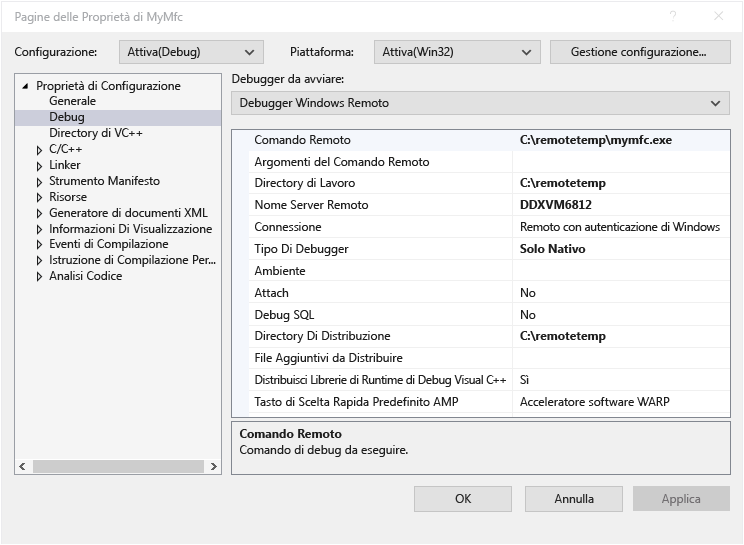

# Un progetto Visual C++ in Visual Studio di debug remoto
Per eseguire il debug di un'applicazione di Visual Studio in un altro computer, installare ed eseguire remote tools sul computer in cui si desidera distribuire l'app, configurare il progetto per connettersi al computer remoto da Visual Studio, quindi distribuire ed eseguire l'app.

Per informazioni sulle app di Windows universale (UWP) di debug remoto, vedere [eseguire il Debug di un pacchetto dell'App installato](debug-installed-app-package.md).

## Requisiti

Il debugger remoto è supportata in Windows 7 e versioni successive (non phone) e versioni di Windows Server a partire da Windows Server 2008 Service Pack 2. Per un elenco completo dei requisiti, vedere [requisiti](../debugger/remote-debugging.md#requirements_msvsmon).

> [!NOTE]
> Il debug tra due computer connessi tramite un proxy non è supportato. Il debug tramite una connessione di larghezza di banda ridotta, ad esempio di connessione remota a Internet, ad alta latenza o tramite Internet tra paesi non è consigliato e potrebbe non funzionare oppure essere inaccettabile.
  
## Scaricare e installare Remote Tools

[!INCLUDE [remote-debugger-download](../debugger/includes/remote-debugger-download.md)]
  
> [!TIP]
> In alcuni scenari, può essere più efficiente per eseguire il debugger remoto da una condivisione file. Per ulteriori informazioni, vedere [eseguire il debugger remoto da una condivisione file](../debugger/remote-debugging.md#fileshare_msvsmon).
  
## Impostare il debugger remoto

[!INCLUDE [remote-debugger-configuration](../debugger/includes/remote-debugger-configuration.md)]

> [!NOTE]
> Se è necessario aggiungere le autorizzazioni per altri utenti, modificare la modalità di autenticazione o il numero di porta per il debugger remoto, vedere [configurare il debugger remoto](../debugger/remote-debugging.md#configure_msvsmon).

## Debug remoto di un progetto Visual C++  
 Nella procedura seguente, il nome e percorso del progetto sono C:\remotetemp\MyMfc e il nome del computer remoto è **MJO DL**.  
  
1.  Creare un'applicazione MFC denominata **mymfc.**  
  
2.  Impostare un punto di interruzione in un punto qualsiasi nell'applicazione che sia facilmente raggiungibile, ad esempio in **MainFrm.cpp**, all'inizio di `CMainFrame::OnCreate`.  
  
3.  In Esplora soluzioni, fare clic sul progetto e scegliere **proprietà**. Aprire il **debug** scheda.  
  
4.  Impostare il **Debugger da avviare** a **Debugger Windows remoto**.  
  
       
  
5.  Apportare le seguenti modifiche alle proprietà:  
  
    |Impostazione|Valore|
    |-|-|  
    |Comando remoto|C:\remotetemp\mymfc.exe|  
    |Directory di lavoro|C:\remotetemp|  
    |Nome server remoto|MJO DL:*NumeroPorta*|  
    |Connessione|Remoto con autenticazione di Windows|  
    |Tipo di debugger|Solo nativo|  
    |Directory di distribuzione|C:\remotetemp|  
    |File aggiuntivi da distribuire|C:\data\mymfcdata.txt|  
  
     Se si distribuiscono file aggiuntivi (facoltativi), la cartella deve essere presente in entrambi i computer.  
  
6.  In Esplora soluzioni fare doppio clic la soluzione e scegliere **Configuration Manager**.  
  
7.  Per il **Debug** configurazione, selezionare il **Distribuisci** casella di controllo.  
  
       
  
8.  Avviare il debug (**Debug > Avvia debug**, o **F5**).  
  
9. Il file eseguibile viene distribuito automaticamente al computer remoto.  
  
10. Se richiesto, immettere le credenziali di rete per connettersi al computer remoto.  
  
     Le credenziali necessarie sono specifiche di configurazione della sicurezza della rete. In un computer di dominio, ad esempio, è possibile scegliere un certificato di sicurezza o immettere il nome di dominio e la password. In un computer non appartenenti al dominio, è possibile immettere il nome del computer e un nome di account utente valido, ad esempio  **MJO-DL\name@something.com** , con la password corretta.  
  
11. Nel computer di Visual Studio l'esecuzione viene arrestata in corrispondenza del punto di interruzione.  
  
    > [!TIP]
    >  In alternativa, è possibile distribuire i file come passaggio separato. Nel **Esplora soluzioni,** destro la **mymfc** nodo e quindi scegliere **Distribuisci**.  
  
 Se sono presenti file non di codice che devono essere usati dall'applicazione, è necessario includerli nel progetto di Visual Studio. Creare una cartella di progetto per i file aggiuntivi (nel **Esplora**, fare clic su **Aggiungi > nuova cartella**.) Quindi aggiungere i file nella cartella (nel **Esplora**, fare clic su **Aggiungi > elemento esistente**, quindi selezionare i file). Nel **proprietà** pagina per ogni file, impostare **copia nella Directory di Output di** a **Copia sempre**.
  
## Configurare il debug con simboli remoti 

[!INCLUDE [remote-debugger-symbols](../debugger/includes/remote-debugger-symbols.md)] 
  
## Vedere anche  
 [Debug in Visual Studio](../debugger/index.md)  
 [Debugger Feature Tour](../debugger/debugger-feature-tour.md)  (Tour delle funzionalità del debugger)  
 [Configurare Windows Firewall per debug remoto](../debugger/configure-the-windows-firewall-for-remote-debugging.md)   
 [Assegnazioni di porta del Debugger remoto](../debugger/remote-debugger-port-assignments.md)   
 [Debug remoto di ASP.NET in un computer remoto con IIS](../debugger/remote-debugging-aspnet-on-a-remote-iis-computer.md)  
 [Errori e risoluzione dei problemi relativi al debug remoto](../debugger/remote-debugging-errors-and-troubleshooting.md)