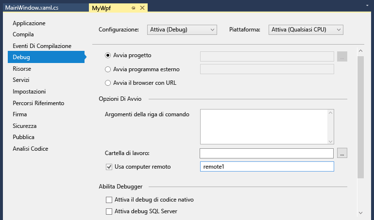

# Debug remoto
[!INCLUDE[vs2017banner](../code-quality/includes/vs2017banner.md)]

È possibile eseguire il debug di un'applicazione Visual Studio che è stata distribuita in un computer diverso.  A questo scopo si usa Visual Studio Remote Debugger.  
  
 Le informazioni qui riportate sono valide per applicazioni desktop di Windows e applicazioni ASP.NET.  Per informazioni sul debug remoto di app di Windows Store e di Azure, vedere [Eseguire il debug remoto in app di Windows Store e di Azure](#bkmk_winstoreAzure).  
  
## Scaricare e installare Remote Tools  
 È possibile scaricare Remote Tools per il debug dalla pagina [Remote Tools per Visual Studio 2015](https://www.microsoft.com/en-us/download/details.aspx?id=48155). Remote Tools è disponibile nelle versioni x64, x86 e ARM. Dopo avere scaricato il file eseguibile, seguire le istruzioni per installare l'applicazione nel computer remoto.  
  
 È possibile scaricare la versione Update 1 di Remote Tools dalla pagina [Remote Tools per Visual Studio 2015 Update 1](https://www.microsoft.com/en-us/download/details.aspx?id=49986&44F86079-8679-400C-BFF2-9CA5F2BCBDFC=1).  
  
> [!IMPORTANT]
>  È necessario installare la versione di Remote Tools corrispondente alla versione di Visual Studio installata. Non sono supportate le versioni non corrispondenti. Remote Tools e l'applicazione da sottoporre a debug devono anche avere la stessa architettura. In altre parole, per eseguire il debug di un'applicazione a 64 bit, è necessario installare la versione a 64 bit di Remote Tools.  
  
 Se nel computer remoto è presente Visual Studio 2015 Community, Professional o Enterprise, il debugger remoto \(**msvsmon.exe**\) è già installato ed è possibile avviarlo dalla relativa directory:  
  
 **\<Directory di installazione di Visual Studio\>\\Common7\\IDE\\Remote Debugger\\\(x64, x86, Appx\)\\msvsmon.exe**  
  
 La **Configurazione guidata del debugger remoto** \(**rdbgwiz.exe**\), tuttavia, viene installata solo quando si esegue il download e l'installazione di Remote Tools. Potrebbe essere necessario usare la configurazione guidata in un secondo momento, soprattutto se si vuole che il debugger remoto venga eseguito come servizio. Per altre informazioni, vedere [Configurare il debugger remoto come servizio](#bkmk_configureService) di seguito.  
  
## Sistemi operativi supportati  
 Nel computer remoto deve essere in esecuzione uno dei seguenti sistemi operativi:  
  
-   Windows 10  
  
-   Windows 8 o 8.1  
  
-   Windows 7 Service Pack 1  
  
-   Windows Server 2012 o Windows Server 2012 R2  
  
-   Windows Server 2008 Service Pack 2 o Windows Server 2008 R2 Service Pack 1  
  
## Configurazioni Hardware supportate  
  
-   Processore da 1,6 GHz o superiore  
  
-   1 GB di RAM \(1,5 GB se in esecuzione in una macchina virtuale\)  
  
-   1 GB di spazio disponibile su disco rigido  
  
-   Unità disco rigido a 5400 rpm  
  
-   Scheda video che supporta DirectX 9 con una risoluzione di 1024 x 768 o superiore  
  
## Configurazione di rete  
 Il computer remoto e quello che esegue Visual Studio devono essere connessi tramite una rete, un gruppo di lavoro o un gruppo home o collegati direttamente con un cavo Ethernet. Il debug tramite Internet non è supportato.  
  
## Configurare il debugger remoto  
 È necessario avere autorizzazioni amministrative per il computer remoto  
  
1.  Trovare l'applicazione del debugger remoto. È possibile cercare **Remote Debugger** nel menu **Start**.  
  
2.  Quando si avvia Remote Tools per la prima volta \(o prima di aver eseguito la configurazione\), viene visualizzata la finestra di dialogo **Configurazione debug remoto**.  
  
       
  
3.  Se l'API del servizio di Windows non è installata \(solo in Windows Server 2008 R2\), fare clic sul pulsante **Installa**.  
  
4.  Selezionare i tipi di reti su cui usare Remote Tools. Almeno un tipo di rete deve essere selezionato. Se i computer sono connessi tramite un dominio, è necessario scegliere il primo elemento. Se i computer sono connessi tramite un gruppo di lavoro o un gruppo home, è necessario scegliere il secondo o il terzo elemento a seconda delle esigenze.  
  
5.  Scegliere **Configura debug remoto** per configurare il firewall e avviare lo strumento.  
  
6.  Al termine della configurazione viene visualizzata la finestra del debugger remoto.  
  
       
  
 Per arrestare il debugger remoto è possibile scegliere **File \/ Esci** nella finestra. Il debugger remoto può essere riavviato dal menu **Start** o dalla riga di comando:  
  
 **\<Directory di installazione di Visual Studio\>\\Common7\\IDE\\Remote Debugger\\\<x86, x64, Appx\>\\msvsmon.exe**.  
  
## Configurare il debugger remoto  
 È possibile modificare alcuni aspetti della configurazione del debugger remoto dopo che è stata avviata per la prima volta.  
  
-   Per consentire ad altri utenti di connettersi al debugger remoto, scegliere **Strumenti \/ Autorizzazioni**. È necessario avere privilegi di amministratore per concedere o negare autorizzazioni.  
  
-   Per modificare la modalità di autenticazione o il numero di porta oppure per specificare un valore di timeout per Remote Tools, scegliere Strumenti \/ Opzioni.  
  
     Per un elenco dei numeri di porta usati per impostazione predefinita, vedere [Assegnazioni delle porte del debugger remoto](../debugger/remote-debugger-port-assignments.md).  
  
> [!WARNING]
>  È possibile scegliere di eseguire Remote Tools in modalità Nessuna autenticazione che, tuttavia, è fortemente sconsigliata perché priva di qualsiasi sicurezza di rete. Scegliere la modalità Nessuna autenticazione solo se si ha la certezza che la rete non è soggetta a rischi derivanti da traffico ostile o dannoso.  
  
##   Configurare il debugger remoto come servizio  
 Per il debug in ASP.NET e altri ambienti server, è necessario eseguire il debugger remoto come servizio.  
  
1.  Trovare la **Configurazione guidata del debugger remoto** \(rdbgwiz.exe\). Si tratta di un'applicazione separata dal debugger remoto. È disponibile solo quando si installa Remote Tools e non è inclusa nell'installazione di Visual Studio.  
  
2.  Avviare la configurazione guidata. Quando viene visualizzata la prima pagina, fare clic su **Avanti**.  
  
3.  Selezionare la casella di controllo **Esegui Visual Studio 2015 Remote Debugger come servizio**.  
  
4.  Aggiungere il nome dell'account utente e la password.  
  
     Potrebbe essere necessario aggiungere il diritto utente **Accedi come servizio** a questo account. A tale scopo, trovare **Criteri di sicurezza locali** \(secpol. msc\) nella pagina o nella finestra iniziale oppure digitare **secpol** al prompt dei comandi. Quando viene visualizzata la finestra, fare doppio clic su **Assegnazione diritti utente** e trovare **Accedi come servizio** nel riquadro di destra. Fare doppio clic. Aggiungere l'account utente alla finestra **Proprietà** e fare clic su **OK**. Scegliere **Avanti**.  
  
5.  Selezionare il tipo di rete con cui si vuole che Remote Tools comunichi. Almeno un tipo di rete deve essere selezionato. Se i computer sono connessi tramite un dominio, è necessario scegliere il primo elemento. Se i computer sono connessi tramite un gruppo di lavoro o un gruppo home, è necessario scegliere il secondo o il terzo elemento. Scegliere **Avanti**.  
  
6.  Se è possibile avviare il servizio, viene visualizzato il messaggio **Configurazione guidata di Visual Studio Remote Debugger completata**. Se non è possibile avviare il servizio, viene visualizzato il messaggio **Impossibile completare la Configurazione guidata di Visual Studio Remote Debugger**. La pagina offre anche alcuni suggerimenti da seguire per l'avvio del servizio.  
  
7.  Scegliere **Fine**.  
  
 A questo punto il debugger remoto è in esecuzione come servizio. Per verificarlo, passare a  **Pannello di controllo \/ Servizi** e cercare **Visual Studio 2015 Remote Debugger**.  
  
 È possibile arrestare e avviare il servizio del debugger remoto da **Pannello di controllo \/ Servizi**.  
  
## Eseguire il debugger remoto con account utente diversi  
 È possibile eseguire il debugger remoto con un account utente diverso da quello in uso nel computer di Visual Studio, ma è necessario aggiungere l'account utente diverso alle autorizzazioni del debugger remoto.  
  
-   È possibile avviare il debugger remoto dalla riga di comando usando il parametro **\/allow \<nomeutente\>**: **msvsmon \/allow \<nomeutente@computer\>**.  
  
-   È possibile aggiungere l'utente alle autorizzazioni del debugger remoto, nella finestra del debugger remoto \(**Strumenti \/ Autorizzazioni**\).  
  
## Eseguire il debug remoto di un progetto Visual C\+\+  
 Nella routine seguente, il nome e il percorso del progetto sono C:\\remotetemp\\MyMfc e il nome del computer remoto è **remote1**.  
  
1.  Creare un'applicazione MFC denominata **mymfc.**  
  
2.  Impostare un punto di interruzione in un punto dell'applicazione che sia facilmente raggiungibile, ad esempio in **MainFrm.cpp**, all'inizio di `CMainFrame::OnCreate`.  
  
3.  In Visual Studio scegliere **Proprietà** dal menu **Progetto**. Aprire la scheda **Debug**.  
  
4.  Impostare **Debugger da avviare** su **Debugger Windows remoto**.  
  
       
  
5.  Apportare le seguenti modifiche alle proprietà:  
  
    |||  
    |-|-|  
    |**Impostazione**|**Valore**|  
    |Comando remoto|C:\\remotetemp\\mymfc.exe|  
    |Directory di lavoro|C:\\remotetemp|  
    |Nome server remoto|remote1|  
    |Connessione|Remoto con autenticazione di Windows|  
    |Tipo di debugger|Solo nativo|  
    |Directory di distribuzione|C:\\remotetemp|  
    |File aggiuntivi da distribuire|C:\\data\\mymfcdata.txt|  
  
6.  Nella barra degli strumenti aprire il menu a discesa **Configurazione soluzione** e scegliere **Gestione configurazione**.  
  
7.  Per la configurazione **Debug**, selezionare la casella di controllo **Distribuisci**.  
  
       
  
8.  Avviare il debug \(**Debug \/ Avvia debug** o **F5**\).  
  
9. Il file eseguibile viene distribuito automaticamente al computer remoto.  
  
10. Nel computer di Visual Studio l'esecuzione viene arrestata in corrispondenza del punto di interruzione.  
  
    > [!TIP]
    >  In alternativa, è possibile distribuire i file come passaggio separato. In **Esplora soluzioni** fare clic con il pulsante destro del mouse sul nodo **mymfc**, quindi scegliere **Distribuisci**.  
  
 Se sono presenti file non di codice che devono essere usati dall'applicazione, è necessario includerli nel progetto di Visual Studio. Creare una cartella di progetto per i file aggiuntivi \(in **Esplora soluzioni** fare clic su **Aggiungi \/ Nuova cartella**\). Aggiungere i file alla cartella \(in **Esplora soluzioni** fare clic su **Aggiungi \/ Elemento esistente**, quindi selezionare i file\). Nella pagina **Proprietà** di ogni file impostare **Copia nella directory di output** su **Copia sempre**.  
  
## Eseguire il debug remoto di un progetto Visual C\# o Visual Basic  
 Il debugger non può distribuire applicazioni desktop Visual C\# o Visual Basic in un computer remoto, ma può comunque eseguirne il debug in modalità remota come illustrato di seguito. La routine seguente presuppone che si voglia eseguire il debug in un computer denominato **remote1**.  
  
1.  Creare un progetto WPF denominato **MyWpf**.  
  
2.  Impostare un punto di interruzione facilmente raggiungibile nel codice. Ad esempio, è possibile impostare un punto di interruzione in un gestore pulsanti.  
  
3.  Scegliere **Proprietà** dal menu **Progetto**.  
  
4.  Nella pagina **Proprietà** scegliere la scheda **Debug**.  
  
       
  
5.  Verificare che la casella di testo **Directory di lavoro** sia vuota.  
  
6.  Scegliere **Usa computer remoto** e digitare **remote1** nella casella di testo.  
  
7.  Assicurarsi che l'opzione **Attiva il debug di codice nativo** non sia selezionata.  
  
8.  Compilare il progetto.  
  
9. Creare una cartella nel computer remoto con lo stesso percorso della cartella **Debug** nel computer di Visual Studio: **\<percorso di origine\> \\MyWPF\\MyWPF\\bin\\Debug**.  
  
10. Copiare il file eseguibile appena compilato dal computer di Visual Studio alla nuova cartella nel computer remoto.  
  
    > [!CAUTION]
    >  Non apportare modifiche al codice o ricompilare prima di questo passaggio. Il file eseguibile copiato nel computer remoto deve corrispondere esattamente all'origine locale e ai simboli.  
  
11. Avviare il debug in Visual Studio \(**Debug \/ Avvia debug** o **F5**\).  
  
12. Controllare il punto di interruzione. Il punto di interruzione dovrebbe essere attivo. In caso contrario, non sono stati caricati i simboli per l'applicazione. Per informazioni sul caricamento di simboli e sulla risoluzione dei relativi problemi, vedere il post del blog relativo a [file dei simboli e impostazioni dei simboli di Visual Studio](http://blogs.msdn.com/b/visualstudioalm/archive/2015/01/05/understanding-symbol-files-and-visual-studio-s-symbol-settings.aspx).  
  
13. La finestra principale dell'applicazione WPF dovrebbe essere aperta nel computer remoto. Eseguire l'azione che permette di raggiungere il punto di interruzione.  
  
14. Nel computer di Visual Studio l'esecuzione viene arrestata in corrispondenza del punto di interruzione.  
  
 Se sono presenti file non di codice che devono essere usati dall'applicazione, è necessario includerli nel progetto di Visual Studio. Creare una cartella di progetto per i file aggiuntivi \(in **Esplora soluzioni** fare clic su **Aggiungi \/ Nuova cartella**\). Aggiungere i file alla cartella \(in **Esplora soluzioni** fare clic su **Aggiungi \/ Elemento esistente**, quindi selezionare i file\). Nella pagina **Proprietà** di ogni file impostare **Copia nella directory di output** su **Copia sempre**.  
  
## Eseguire il debug remoto di un'applicazione ASP.NET  
 La distribuzione di un'applicazione ASP.NET in un computer remoto che esegue IIS richiede diversi passaggi, a seconda del sistema operativo e della versione di IIS. Per computer remoti che eseguono Windows 8 o versioni successive o per sistemi operativi Windows Server 2012 con IIS 8 \(o versioni successive\) installato, vedere la pagina relativa alla [pubblicazione in IIS](https://docs.asp.net/en/latest/publishing/iis.html).  
  
 Per computer remoti che eseguono Windows 7 o per sistemi operativi Windows Server 2008 con IIS 7.5 installato, vedere [Debug remoto di ASP.NET in un computer remoto con IIS 7.5](../debugger/remote-debugging-aspnet-on-a-remote-iis-7-5-computer.md).  
  
## Configurare il debug con simboli remoti  
 Dovrebbe essere possibile eseguire il debug del codice con i simboli generati nel computer di Visual Studio. L'uso di simboli locali consente di migliorare notevolmente le prestazioni del debugger remoto. Se è necessario usare simboli remoti, indicare a Remote Debugging Monitor di eseguire la ricerca di simboli nel computer remoto.  
  
 A partire da Visual Studio 2013 Update 2 è possibile usare la seguente opzione della riga di comando di msvsmon per usare i simboli remoti per il codice gestito: `Msvsmon / /FallbackLoadRemoteManagedPdbs`  
  
 Per altre informazioni, vedere la Guida al debug remoto \(premere **F1** nella finestra del debugger remoto oppure fare clic su **? \/ Utilizzo**\). Altre informazioni sono disponibili nel post del blog relativo alle [modifiche nel caricamento remoto dei simboli .NET in Visual Studio 2012 e 2013](http://blogs.msdn.com/b/visualstudioalm/archive/2013/10/16/net-remote-symbol-loading-changes-in-visual-studio-2012-and-2013.aspx)  
  
##   Eseguire il debug remoto in app di Windows Store e di Azure  
 Per informazioni sul debug remoto di app di Windows Store, vedere l'argomento relativo al [debug e test di applicazioni Windows Store in un computer remoto da Visual Studio](http://msdn.microsoft.com/library/windows/apps/hh441469.aspx).  
  
 Per informazioni sul debug in Azure, vedere uno dei seguenti argomenti:  
  
-   [Debug di un servizio cloud o di una macchina virtuale in Visual Studio](http://msdn.microsoft.com/library/azure/ff683670.aspx)  
  
-   [Debug del back\-end .NET in Visual Studio](http://blogs.msdn.com/b/azuremobile/archive/2014/03/14/debugging-net-backend-in-visual-studio.aspx)  
  
-   Introduzione al debug remoto in Siti Web di Azure \([Parte 1](http://azure.microsoft.com/blog/2014/05/06/introduction-to-remote-debugging-on-azure-web-sites/), [Parte 2](http://azure.microsoft.com/blog/2014/05/07/introduction-to-remote-debugging-azure-web-sites-part-2-inside-remote-debugging/), [Parte 3](http://azure.microsoft.com/blog/2014/05/08/introduction-to-remote-debugging-on-azure-web-sites-part-3-multi-instance-environment-and-git/)\).  
  
## Vedere anche  
 [Debug in Visual Studio](../debugger/debugging-in-visual-studio.md)   
 [Configurare Windows Firewall per il debug remoto](../debugger/configure-the-windows-firewall-for-remote-debugging.md)   
 [Assegnazioni delle porte del debugger remoto](../debugger/remote-debugger-port-assignments.md)   
 [Debug remoto di ASP.NET in un computer remoto con IIS 7.5](../debugger/remote-debugging-aspnet-on-a-remote-iis-7-5-computer.md)   
 [Errori e risoluzione dei problemi relativi al debug remoto](../debugger/remote-debugging-errors-and-troubleshooting.md)