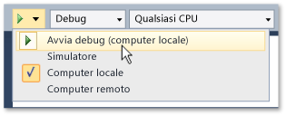

# Eseguire app dello Store da Visual Studio
[!INCLUDE[vs2017banner](../code-quality/includes/vs2017banner.md)]

Le app di Store possono essere eseguite su una vasta gamma di dispositivi e Visual Studio offre vari modi per eseguirle e interagire con tali app.  L'esperienza "F5" è stata migliorata per semplificare il debug, la profilatura e il test delle app durante lo sviluppo.  
  
   
  
## In questa sezione  
  
|||  
|-|-|  
|[Eseguire applicazioni Windows Store in un computer locale](../debugger/run-windows-store-apps-on-the-local-machine.md)|Esegui l'app di Windows Store sul dispositivo Visual Studio.|  
|[Eseguire applicazioni Windows Store nel simulatore](../debugger/run-windows-store-apps-in-the-simulator.md)|Esegui l'app di Windows Store in una finestra del desktop che simula la funzionalità di [!INCLUDE[win8_appname_long](../debugger/includes/win8_appname_long_md.md)] per quanto concerne il tocco e l'orientamento.|  
|[Eseguire app di Windows Store in un computer remoto](../debugger/run-windows-store-apps-on-a-remote-machine.md)|Distribuisci ed esegui l'app di Windows Store in un dispositivo connesso al computer con Visual Studio in una rete o direttamente tramite un cavo Ethernet.|  
|[Eseguire app di Windows Phone nell'emulatore](../debugger/run-windows-phone-apps-in-the-emulator.md)|Esegui l'app di Windows Store in una finestra del desktop che simula un Windows Phone.|  
|[Distribuire applicazioni Windows Store da Visual Studio](../debugger/deploy-windows-store-apps-from-visual-studio.md)|Distribuisci ed esegui l'app di Windows Store in un dispositivo per test ad hoc.|