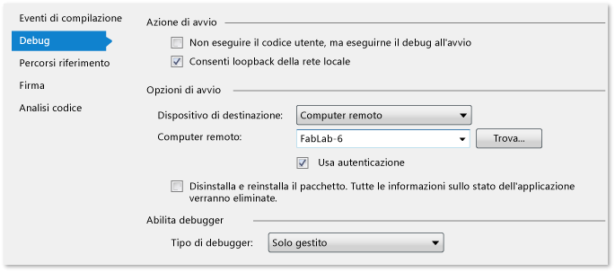

# Eseguire app di Windows Store in un computer remoto
[!INCLUDE[vs2017banner](../code-quality/includes/vs2017banner.md)]

  
  
 Tramite l'applicazione Visual Studio Remote Tools è possibile avviare, eseguire il debug, profilare e testare un'applicazione Windows Store in esecuzione su un dispositivo utilizzando un secondo computer che esegue Visual Studio. L'esecuzione su un dispositivo remoto può essere particolarmente efficiente quando il computer che esegue Visual Studio non supporta le funzionalità specifiche delle applicazioni Windows Store, come il tocco, la georilevazione e l'orientamento fisico. In questo argomento vengono descritte le procedure per configurare e avviare una sessione remota.  
  
##   Contenuto dell'argomento  
 Puoi acquisire informazioni su:  
  
 [Prerequisiti](#BKMK_Prerequisites)  
  
 [Sicurezza](#BKMK_Security)  
  
 [Come connettersi direttamente a un dispositivo remoto](#BKMK_DirectConnect)  
  
 [Installazione di Remote Tools](#BKMK_Installing_the_Remote_Tools)  
  
 [Avvio di Remote Debugging Monitor](#BKMK_Starting_the_Remote_Debugger_Monitor)  
  
 [Configurazione del debugger remoto](#BKMK_ConfigureRemoteDebugger)  
  
 [Configurazione del progetto di Visual Studio per il debug remoto](#BKMK_ConnectVS)  
  
-   [Scelta del dispositivo remoto per progetti C# e Visual Basic](#BKMK_Choosing_the_remote_device_for_C__and_Visual_Basic_projects)  
  
-   [Scelta del dispositivo remoto per progetti JavaScript e C++](#BKMK_Choosing_the_remote_device_for_JavaScript_and_C___projects)  
  
 [Esecuzione di una sessione di debug remoto](#BKMK_RunRemoteDebug)  
  
##   Prerequisiti  
 Per eseguire il debug su un dispositivo remoto:  
  
-   Il dispositivo remoto e il computer che esegue Visual Studio devono essere connessi in rete o collegati direttamente tramite un cavo Ethernet. Il debug tramite Internet non è supportato.  
  
-   Nel dispositivo remoto deve essere installata una licenza per sviluppatori.  
  
-   Il dispositivo remoto deve eseguire i componenti di debug remoto.  
  
-   È necessario essere un amministratore del dispositivo remoto per configurare il firewall durante l'installazione. È necessario disporre dell'accesso utente sul dispositivo remoto per connetterti al debugger remoto o eseguirlo.  
  
##   Sicurezza  
 Per impostazione predefinita, il debugger remoto utilizza l'autenticazione di Windows.  
  
> [!WARNING]
>  È inoltre possibile scegliere di eseguire il debugger remoto in modalità Nessuna autenticazione che, tuttavia, è fortemente sconsigliata perché priva di qualsiasi sicurezza di rete. Scegliere la modalità Nessuna autenticazione solo se si ha la certezza che la rete non è soggetta a rischi derivanti da traffico ostile o dannoso.  
  
##   Come connettersi direttamente a un dispositivo remoto  
 Per connettersi direttamente a un dispositivo remoto, collegare il computer che esegue Visual Studio al dispositivo tramite un cavo Ethernet standard. Se il dispositivo non dispone di una porta Ethernet, è possibile utilizzare un adattatore da USB a Ethernet per il collegamento al cavo.  
  
##   Installazione di Remote Tools  
  
> [!NOTE]
>  **Versioni e aggiornamenti**  
>   
>  **Remote Tools per Visual Studio 2015** non è supportato per le versioni precedenti di Visual Studio.  
>   
>  Si consiglia di installare la versione dell'aggiornamento di Remote Tools per Visual Studio 2015 che corrisponde alla versione dell'aggiornamento dell'installazione di Visual Studio.  
>   
>  Il debugger di Visual Studio è compatibile con qualsiasi combinazione di versioni di Visual Studio 2015 e Remote Tools per Visual Studio 2015. Tuttavia, le funzionalità più recenti di Visual Studio richiedono che Visual Studio e Remote Tools siano nella versione più aggiornata.  
>   
>  Altri strumenti diagnostici potrebbero richiedere le stesse versioni per Remote Tools e Visual Studio.  
  
 **Installazione dei componenti di debug remoti in un dispositivo remoto**  
  
 Per eseguire o salvare il programma di installazione di Remote Tools, scegli uno dei collegamenti presenti in questa tabella che corrisponde al sistema operativo del dispositivo remoto:  
  
### Visual Studio 2013  
  
|||||  
|-|-|-|-|  
|**Versione Update**|**X86**|**X64**|**ARM**|  
|**RTM**|[Download](http://go.microsoft.com/fwlink/?LinkId=320706)|[Download](http://go.microsoft.com/fwlink/?LinkId=320707)|[Download](http://go.microsoft.com/fwlink/?LinkId=320708)|  
|**Update 1**|[Download](http://go.microsoft.com/fwlink/?LinkID=386599)|[Download](http://go.microsoft.com/fwlink/?LinkID=386600)|[Download](http://go.microsoft.com/fwlink/?LinkID=386601)|  
|**Update 2**|[Download](http://go.microsoft.com/fwlink/?LinkId=393218)|[Download](http://go.microsoft.com/fwlink/?LinkId=393217)|[Download](http://go.microsoft.com/fwlink/?LinkId=393216)|  
|**Update 3**|[Download](http://go.microsoft.com/fwlink/?LinkId=403046)|[Download](http://go.microsoft.com/fwlink/?LinkId=403047)|[Download](http://go.microsoft.com/fwlink/?LinkId=403048)|  
|**Update 4**|[Download](http://go.microsoft.com/fwlink/?LinkId=512599)|[Download](http://go.microsoft.com/fwlink/?LinkId=512600)|[Download](http://go.microsoft.com/fwlink/?LinkId=512601)|  
  
### Visual Studio 2015  
  
|||||  
|-|-|-|-|  
|**Versione**|**X86**|**X64**|**ARM**|  
|**Anteprima**|[Download](http://download.microsoft.com/download/4/8/A/48A0EA60-6097-4BA5-B7D3-EAE49499E1FB/rtools_setup_x86.exe)|[Download](http://download.microsoft.com/download/4/8/A/48A0EA60-6097-4BA5-B7D3-EAE49499E1FB/rtools_setup_x64.exe)|[Download](http://download.microsoft.com/download/4/8/A/48A0EA60-6097-4BA5-B7D3-EAE49499E1FB/rtools_setup_arm.exe)|  
  
 È possibile scegliere di scaricare il programma di installazione oppure è possibile eseguirlo immediatamente. Quando si esegue il programma di installazione, accettare il contratto di licenza, quindi scegliere **Installa**.  
  
 Per impostazione predefinita, i componenti di debug remoto vengono installati nella cartella **C:\\Program Files\\Microsoft Visual Studio 14.0\\Common7\\IDE\\Remote Debugger**.  
  
##   Avvio di Remote Debugging Monitor  
  
> [!NOTE]
>  Poiché il debugger remoto configura il firewall per consentire le comunicazioni con un host di Visual Studio, è necessario essere amministratore del dispositivo remoto per avviare il debugger remoto per la prima volta.  
  
 Dopo l'installazione di Remote Tools scegliere **Debugger remoto** nella schermata **Start**. La prima volta che si avvia il debugger remoto viene visualizzato **Configurazione debug remoto**.  
  
 Nella finestra di dialogo **Configurazione debug remoto**:  
  
1.  Se l'API per servizi Web Windows non è installata, scegliere **Installa**.  
  
2.  Nel gruppo **Configura Windows Firewall** selezionare le reti a cui si intende consentire la connessione. Sono abilitate solo le reti a cui il dispositivo è attualmente connesso. È necessario scegliere almeno una rete.  
  
3.  Scegliere **Configura debug remoto** per impostare le opzioni del firewall e avviare il debugger remoto.  Aprire la finestra di dialogo **Visual Studio Remote Debugging Monitor** per concedere agli utenti le autorizzazioni per Remote Tools e per impostare altre opzioni avanzate.  
  
4.  Viene visualizzata la finestra di dialogo **Visual Studio Remote Debugging Monitor**. Da questa finestra di dialogo è possibile concedere agli utenti le autorizzazioni per Remote Tools e impostare altre opzioni avanzate.  
  
##   Configurazione del debugger remoto  
 Per modificare la configurazione del debugger remoto sono disponibili due strumenti.  
  
1.  Dal menu **Strumenti** di **Visual Studio Remote Debugging Monitor**:  
  
    1.  Scegliere **Opzioni** per modificare il numero di porta, la modalità di autenticazione o un intervallo di timeout del debugger remoto.  
  
    2.  Scegliere **Autorizzazioni** per aggiungere o rimuovere utenti che dispongono di autorizzazioni per il debug remoto.  
  
        > [!NOTE]
        >  Le autorizzazioni devono essere concesse a ogni account utente che esegue il debug in modalità remota.  
  
 Utilizzare la **Configurazione guidata del debugger remoto** per impostare le opzioni avanzate per il debugger remoto. Per aprire la procedura guidata, scegliere **Configurazione guidata del debugger remoto** nella schermata Start.  
  
1.  Nella pagina **Configurazione del servizio Visual Studio Remote Debugger** è possibile scegliere di eseguire il debugger remoto come servizio. Nella maggior parte dei casi, l'esecuzione come servizio non è richiesta.  
  
2.  Nella pagina **Configurazione di Windows Firewall per il debug** è possibile aggiungere o rimuovere il tipo di reti a cui dovrà connettersi il debugger remoto. Sono abilitate solo le reti a cui il dispositivo è attualmente connesso. È necessario scegliere almeno una rete.  
  
##   Configurazione del progetto di Visual Studio per il debug remoto  
 Specificare il dispositivo remoto a cui è possibile connettersi nelle proprietà del progetto. La procedura varia in base al linguaggio di programmazione. Puoi digitare il nome di rete del dispositivo remoto o selezionarlo nella finestra di dialogo Seleziona connessione debugger remoto.  
  
   
  
 Nella finestra di dialogo sono elencati solo i dispositivi che eseguono il debugger remoto presenti sulla subnet locale del computer con installato Visual Studio.  
  
> [!TIP]
>  In caso di problemi di connessione a un dispositivo remoto, provare a immettere l'indirizzo IP del dispositivo. Per determinare l'indirizzo IP di un dispositivo, aprire una finestra di comando e digitare **ipconfig**. L'indirizzo IP è indicato come **IPv4 Address**.  
  
###   Scelta del dispositivo remoto per progetti C\# e Visual Basic  
   
  
1.  In Esplora soluzioni seleziona il nome del progetto, quindi scegli **Proprietà** dal menu di scelta rapida.  
  
2.  Selezionare **Debug**.  
  
3.  Scegliere **Computer remoto** dall'elenco **Dispositivo di destinazione**.  
  
4.  Immettere il nome di rete del dispositivo remoto nella casella **Computer remoto** o selezionare **Trova** per scegliere il dispositivo nella finestra di dialogo **Seleziona connessione debugger remoto**.  
  
###   Scelta del dispositivo remoto per progetti JavaScript e C\+\+  
   
  
1.  In Esplora soluzioni seleziona il nome del progetto, quindi scegli **Proprietà** dal menu di scelta rapida.  
  
2.  Espandere il nodo **Proprietà di configurazione**, quindi selezionare **Debug**.  
  
3.  Scegliere **Debugger remoto** dall'elenco **Debugger da avviare**.  
  
4.  Immettere il nome di rete del dispositivo remoto nella casella **Nome computer** o selezionare la freccia in giù nella casella per scegliere il dispositivo nella finestra di dialogo **Seleziona connessione debugger remoto**.  
  
##   Esecuzione di una sessione di debug remoto  
 È possibile avviare, arrestare ed esplorare una sessione di debug remoto come una sessione locale. Prima di avviare il debug, assicurarsi che Remote Debugging Monitor sia in esecuzione sul dispositivo remoto.  
  
 Scegliere quindi **Avvia debug** dal menu **Debug** \(tastiera: F5\). Il progetto viene ricompilato, quindi distribuito e avviato sul dispositivo remoto. Il debugger sospende l'esecuzione in corrispondenza dei punti di interruzione. Nel codice sarà possibile quindi eseguire un'istruzione, eseguire un'istruzione\/routine e uscire da un'istruzione\/routine. Scegli **Termina debug** per terminare la sessione di debug e chiudere l'app remota. Per altre informazioni, vedi [Eseguire il debug di app in Visual Studio](../debugger/debug-store-apps-in-visual-studio.md).  
  
## Vedere anche  
 [Test delle applicazioni Store con Visual Studio](../test/testing-store-apps-with-visual-studio.md)   
 [Eseguire il debug di app in Visual Studio](../debugger/debug-store-apps-in-visual-studio.md)