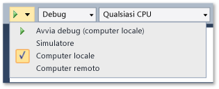
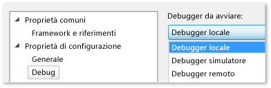

# Eseguire applicazioni Windows Store in un computer locale
[!INCLUDE[vs2017banner](../code-quality/includes/vs2017banner.md)]

  
  
 Per eseguire il debug, test o analisi delle prestazioni su un'app Windows Store, puoi eseguire l'app sullo stesso computer che ospita Visual Studio.  Se lo schermo del dispositivo è abilitato per il tocco, puoi verificare la funzionalità completa dell'app, altrimenti dovrai limitarti ai movimenti con il mouse e la tastiera.  
  
##   In questo argomento  
 Puoi acquisire informazioni su:  
  
 [Come eseguire l'app su un computer locale](#BKMK_How_to_run_on_a_local_machine)  
  
 [Come passare tra un'app Windows Store e Visual Studio su un solo monitor](#BKMK_How_to_switch_between_a_Windows_Store_app_and_Visual_Studio_on_a_single_monitor)  
  
##   Come eseguire l'app su un computer locale  
 Per eseguire l'app sul computer locale, seleziona **Computer locale** nell'elenco a discesa accanto al pulsante Avvia debug sulla barra degli strumenti **Standard** del debugger.  
  
   
  
 Se la barra degli strumenti **Standard** non è visualizzata, fai clic sul menu **Visualizza**, scegli **Barre degli strumenti** e poi fai clic su **Standard**.  
  
 La scelta adottata nell'elenco a discesa viene mantenuta nel file delle proprietà del progetto e diventa la destinazione di esecuzione predefinita.  
  
 Puoi anche impostare la destinazione di esecuzione direttamente nel file delle proprietà del progetto.  Fai clic con il pulsante destro del mouse sul nome del progetto in **Esplora soluzioni** e scegli **Proprietà**.  Effettua una delle seguenti operazioni:  
  
-   In progetti C\# e Visual Basic fai clic su **Debug** e seleziona **Computer locale** nell'elenco a discesa **Dispositivo di destinazione**.  
  
       
  
-   In progetti C\+\+ e JavaScript espandi il nodo **Proprietà di configurazione**, fai clic su **Debug** e seleziona **Debugger locale** nell'elenco **Debugger da avviare**.  
  
       
  
##   Come passare tra un'app Windows Store e Visual Studio su un solo monitor  
 **Per passare da un'istanza in esecuzione di un'app Windows Store a Visual Studio**  
  
 Quando esegui un'app Windows Store su un computer locale e usi un solo monitor, potresti voler tornare a Visual Studio lasciando in esecuzione l'app.  L'app potrebbe essere in uno stato che non può essere raggiunto da un punto di interruzione, ad esempio potrebbe essere in attesa di un evento o inclusa in un ciclo lungo o infinito.  Per tornare a Visual Studio, premi ALT\+TAB.